---
tags:
  - pharmacology
---
- # 绪论
  - 药物作用有直接与间接之分。有趣的举例：病人自身在应激状态（肾上腺素+ +）时，使用麻黄碱会抑制a。产生肾上腺素的翻转作用。但麻黄碱可以促进神经末梢释放NE，在某些场景下可以升血压。
  - 药物效应动力学和药物代谢动力学的定义
- # **一、药物效应动力学（Pharmacodynamics）**
  - **药物效应动力学（Pharmacodynamics）**
    - **药效学** 研究药物对机体的作用，包括药物的药理作用、作用机制、临床应用、不良反应
      > 区分：action 药理作用-药物与细胞起始的相互作用；effect-药理效应-作用结果。
      > 通过药物作用，可以推导药理效应。
  - **（一）药物的基本作用**
    -  <u>**1. 药物作用（Drug Action）**</u> 
      - 药物对机体的初始作用。体现为药物小分子与机体细胞大分子之间的初始反应。
        - ***局部作用 & 全身作用***
          > ***吸收入血前***  *在*  ***局部给药部位***  *发生 vs*  ***吸收入血后***  *分布于全身发生*
        - ***直接作用 & 间接作用***
          > 药物直接作用于分布的组织器官 vs 药物的直接作用引起的其他效果
      -  **药物** <mark style="background-color:#fef3c7;"> **作用** </mark> **的** <mark style="background-color:#fef3c7;"> **特异性** </mark> **（specificity）** ：与 **化学反应的专一性、药物的化学结构** 有关。
        > 注意区分“特异性”和“选择性”的概念。
        - **eg Atropine**  特异性阻断 M-胆碱受体
    -  <u>**2. 药理效应（Pharmacological Effect）**</u> 
      - 药物作用的结果；机体反应的表现。
        - *兴奋效果（excitation） & 抑制效果（inhibition）*
          > 使机体原有功能水平提高 vs 降低；前者被称为兴奋剂（stimulant），后者被称为抑制剂（depressant）
      -  **药理** <mark style="background-color:#fef3c7;"> **效应** </mark> **的** <mark style="background-color:#fef3c7;"> **选择性** </mark> **（selectivity）** ：在一定的剂量下，药物对不同组织器官作用的差异性； ***不同剂量***  *用药也会体现出不同的药效选择性，例如各组织器官分布相应受体不同～。*
        - **原因**
          - 药物在体内分布不均匀：药物对不同组织器官的亲和性不同；
            > link：表观分布容积 Vd
          - 组织细胞对药物的敏感性不同：不同的细胞构筑/生化差异
        -  **“药物作用的特异性强”不代表“药理效应的选择性强”：**  **Atropine**  特异性强，但由于受体分布广泛，选择性反而不强
        - **选择性强，作用谱窄，针对性好，副作用少。但不代表疗效好**
          > （eg scepsis severe，用广谱抗生素）
    -  <u>**3. 治疗效果（Therapeutic Effect）**</u> 
      - 定义：指药物作用的结果有利于改变患者的生理、生化功能或病理过程而使得患者的机体恢复正常的作用。
        > “治疗“：相对于“病理”的一个“恢复”概念
      - **（1）对因治疗（**  **etiological**  **treatment）：消除原发致病因子，彻底治愈疾病（抗生素杀灭致病菌）。**
      - **（2）对症治疗（symptomatic treatment）：改善症状 不能根除病因**
      - **（3）补充治疗（supplement therapy/**  **replacement therapy**  **）：** 通过给予外源性物质来纠正体内营养或代谢物质的缺乏，标本兼治
    - **4. 不良反应（**  **ADR**  **，Adverse Drug Reaction）**
      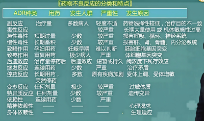
      - **定义：** 药物不利于机体的、与用药目的无关并为患者带来不适或痛苦的作用。
        - 是药物的固有效应。
        - 一般情况下可以预知但难以避免。
        - 少数严重的不良反应难以恢复，称为 **药源性疾病（Drug-increased Disease）。**
      - *分类*
        -  **Drug -related Adverse effect: Pharmacological effect is too strong A型不良反应（量变型异常）** 
          - Side reaction
          - Toxic reaction
          - Secondary reaction
          - After effect
          - Withdrawal reaction
        -  **Organism -related Adverse effect B型不良反应（质变型异常）** 
          - Allergic reaction
          - Idiosyncratic reaction
          - Dependence
      -  <u>**（1）副反应（Side Reaction）**</u> 
        - **定义：** 由于 **选择性低** ，药理效应涉及多个器官，当 **某一效应用作治疗目的时，其他效应** 就成为 **副作用**  (eg  **atropine** 治疗胃肠道痉挛时引起的 **口干、扩瞳；普萘洛尔** 降血压时引起支气管哮喘，其它洛尔则不会)。
        - **特点**
          - **①**  **治疗剂量** 下发生，治疗作用与副作用是相对的；
          - ②取决于药物的 **选择性。**  **选择性低的药物，副作用多。**
            > 对某个组织器官的针对性。
          - ③药物的 **固有作用；**
          - ④症状 **轻微**  **；**
          - ⑤可以通过临床实验 **预知** ；通过与 **其他药物配伍** 可以降低。
      -  <u>**（2）毒性反应（Toxic Reaction）**</u> 
        - **定义** ：药物<mark style="background-color:#fef3c7;"> **剂量过大、时间过长** </mark> **、** 体内 **蓄积过多** 时发生的危害性反应
          > 强心苷 心律失常
          - **分类**
            - 短期内过量用药→ **急性毒性反应。** 多损害循环、呼吸、神经系统
            - **长期用药下** 过量蓄积→ **慢性毒性反应。** 多损害代谢活跃的肝、肾、骨骼肌、内分泌系统。
            - 特殊毒性：致癌、致畸、致突变效应
              > eg  ( **thalidomide**  沙力度胺的致畸效应)
        - **特点**
          - **①超剂量用药** 时发生；
          - **②症状严重；**
          - ③可以 **预知，** 可以 **避免**
      -  <u>**（3）后遗效应（Residual Reaction）**</u> 
        - **定义：** <mark style="background-color:#fef3c7;"> **停药后，** </mark>血药浓度 **降至阈浓度以下** 时，仍然残存的药理效应
          > （eg  **barbiturate**  引起的后遗的乏力 困倦 “宿醉”）
      - **（4）继发反应（Secondary Reaction）（eg：** <mark style="background-color:#fef3c7;"> **Superinfection** </mark> **）**
        - 继发于药物治疗后的不良反应。是 **治疗剂量** 下 **治疗作用**  **本身** 的 **间接结果**
          > 治疗作用本身导致：区别于副反应。治疗剂量导致：区别于毒性反应。
        -  **Superinfection** ：长期服用 **广谱抗生素** ，敏感菌被杀灭，引起 **耐药菌** 或真菌大量繁殖造成的<mark style="background-color:#fef3c7;"> **二重感染** </mark>
          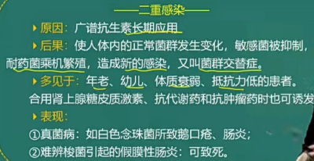
      -  <u>**（5）停药反应**</u>  <u>/</u>  <u>**反跳现象（Withdrawal Reaction/Rebound Reaction）**</u> 
        - **长期用药、突然停药** ，出现的 **原有疾病** 突然 **变重** 的现象。 *——发生了受体的上调/下调* 
          > 高血压药一定要长期服用。 **clonidine**  长期服用降血压时突然停药引起反跳性高血压。
          > 长期使用糖皮质激素、可乐定、普萘洛尔，突然停药
      -  <u>**（6）变态反应（Allergic Reaction）**</u> 
        - **定义：** 少数 **免疫反应异常** 患者，受某些药物刺激引起的抗原-抗体的免疫反应。
          - 半抗原与机体蛋白结合为抗原后，经过敏化作用发生免疫系统的异常反应
            > （eg  **penicillin**  代谢产物作为半抗原，与体内蛋白结合，可引起过敏性休克）
        - **特点**
          - ①与 **剂量无关；**
          - **②** 反应严重程度个体 **差异很大，常见于过敏体质患者；**
          - **③难以预知；**
            > 如果要测试：皮内注射而不是皮下
          - **④反应性质与药物原有效应无关，**  **用药理性拮抗剂治疗无效** （只能对症治疗；因为本质不是药物结合了受体导致，而是药物结合了抗体导致）。
            > 结构相似药物有交叉过敏。首次用药很少过敏。
      -  <u>**（7）特异质反应（Idiosyncratic Reaction）**</u> 
        - **定义：** 由于个体 <u>**基因差异**</u> 引起的针对药物产生的不良反应
          > (先天性缺乏葡萄糖-6-磷酸酶的患者易溶血，服用 抗疟疾药物/四季豆  **primaquine**  伯氨喹后发生急性溶血性贫血)
          > （内窥镜肌松药succinylcholine琥珀酰胆碱：很多人 **缺乏降解的酶，恶性高热** ）
        - **特点**
          - ①反应性质与常人不同，但 **与药物的药理作用基本一致——药理性**  **拮抗药治疗有效** 
          - ②严重程度 **与**  **剂量**  **成正比**
          -  **③不需要** 预先 **敏化** ， **不是免疫反应** 
            > 比如缺了某种酶
      - **（8）依赖性（Dependence）**
        - 长期应用—→造成强迫要求连续或定期使用该药
        - ① **戒断综合征（Withdrawal Syndrome）——** 生理依赖性，戒断综合征；
        - ② **成瘾性 （Addiction）——精神** 依赖性，觅药行为
      - **（9）耐受性（Tolerance）**
        - 重复用药 造成药效下降
          > （短期反复使用  **Ephedrine**  麻黄碱 发生快速耐受性）
        - ①快速耐受性（药效耐受性）：硝酸甘油（内皮细胞NO耗竭）、肝素（血液抗凝血酶耗竭，只能短期抗凝血，长期要用华法林）
        - ②慢性耐受性（代谢耐受性）
      - **（10）耐药性（Resistance）**
        -  **细菌、肿瘤细胞** 对抗生素产生的抗性
  - **（二）药物的量效关系（Dose-Effect Relationship）**
    - 药物的剂量（浓度）与效应的关系被称为药物的量效关系。在一定范围内，药效随药物的剂量（浓度）增加（减少）而增强（减弱）。
    - **1. 量效曲线（浓度-效应曲线）**
      - **纵坐标——** 药效强度；横坐标——药物剂量（血药浓度）。
        
        
      - **I. 量反应（Quantitative Dose Response/Graded Response）**
        
        - **(1)定义：药效的强弱** 随药量呈 **连续性** 的增减变化。可用具体数量或最大反应的百分率表示，eg 心率、血压。
          > **“等级反应”**
        - **(2)量反应的量-效曲线（形状&参数）**
          
          - **①形状：** 直方双曲线（ **原形** ） or  S 型曲线（ **对数形** ）
          - **②斜率（多取量效曲线中段）：** 高斜率往往提示药物的药效剧烈、治疗窗较窄
            > “较小的药物剂量改变引起较大的效应变化 ”
            - 曲线越陡，人们用药的剂量差别越小、越相似；曲线越平缓，人与人之间用药起效的剂量个体差别越大。
          -  <u>**③最大效应/效能（maximal effect/efficacy, Emax）**</u>  **：**  ~~*随着剂量或浓度的增加，效应也增加；*~~ 当效应增加到一定程度后，若继续增加药物浓度或剂量，效应不再继续增强，这一药理效应的极限称为 **最大效应或效能。**
            - **药物的效能主要取决于药物的**  **内在活性**  **：药物的特性、受配体亲和性**
          - **④半数最大效应浓度（EC50）：** 量反应中能引起 50%最大效应的浓度
            > 注意纵坐标投影也不在同一高度
          -  <u>**⑤效价强度（Potency Intensity）**</u> 
            - 能 **引起等效反应** （ *纵坐标投影同一高度，*  <u>一般</u> 为 50%效应量）的相对浓度或剂量。该剂量值越小，提示药物的效价强度越大。
            - 与药物的亲和性、药物与受体的结合有关。
            -  **药物的最大效应与效价强度无关** 
              - **hydrochlorothiazide**  的效价强度大于 **furosemide，** 而后者的最大效应强于前者
                
                > “药效有多强，和微量药物作用敏感度无关”
          - ⑥个体差异性（Individual Variability）：相同剂量下不同个体的差异
          - ⑦最小有效剂量/阈值剂量（minimal effective dose）：刚能引起效应的最小药物剂量或浓度
          - ⑧极量（最大有效量）、最小中毒量、最小致死量
      - **II. 质反应（Quantal Response/All-or-None Response）**
        
        - **（1）定义：** 药效不随药量的增减呈连续性的量的变化，而表现为 **反应性质** 的变化。eg 是否麻醉
          > “全或无反应”
        - **（2）质反应的量效关系曲线**
          - **①形状：** 频率分布直方图；对称 S 型曲线（累计频率）
          - **②斜率：** 人群差异性。斜率大表示人群差异性小
          -  <u>**③半数有效量（Median Effective Dose, ED50）：**</u> 能引起  **50%的实验动物（群体中半数个体）** 出现 **阳性** 反应时的药物 **剂量**
            - **区分：**  **④半数最大效应浓度（EC50）：** 量反应中能引起 50%最大效应的浓度
          -  <u>**④半数致死量（Median Lethal Dose, LD50）：**</u> 能引起  **50%的实验动物** 死亡的药物剂量。 **致死量越大，药物越安全** 
    - **2. 药物安全性评价指标**
      - **①半数中毒量（Median Toxic Dose, TD50） ：** 能引起 50%的实验动物中毒的药物剂量
      -  <u>**② 治疗指数（Therapeutic Index, TI）：**</u> 在 **动物试验** 中，<mark style="background-color:#fef3c7;"> **TI = LD50 / ED50（致死比有效）** </mark> ;在 **临床上，** <mark style="background-color:#fef3c7;"> **TI=TD50/ ED50（中毒比有效）** </mark>。TD50越大，ED50越小，治疗指数越高，表明安全性越高。
        > 不完全可靠：有效剂量与其致死剂量之间有重叠
        - 药物的 **治疗窗：** 通常位于中间的部位，即药物需要拥 **有较大的疗效与较弱的不良反应**
      - **③ 安全窗（安全系数，Margin of Safety） ：** <mark style="background-color:#fef3c7;"> **LD5—ED95** </mark>。引起 5%的实验动物死亡的效应量与引起 95%的实验动物出现阳性反应的效应量之差
      -  <u>**④ 可靠安全系数（Reliable Safety Coefficient）：**</u> 引起  **1%的** 实验动物死亡的效应量 **（LD1）** 与引起  **99%的** 实验动物出现阳性反应 **（ED99 ）** 的效应量之<mark style="background-color:#fef3c7;">比 </mark><mark style="background-color:#fef3c7;"> **LD1/ED99** </mark>  **>1，表明药物绝对安全。** 
    - 3. 药物的构效关系（Structure Activity Relationship） ：药物的化学结构与药理活性或毒性之间的关系
  - **（三）药物作用的机制**
    - **1. 基本作用机制：非特异性 & 特异性**
      - **（1）非特异性药物作用:** 主要与药物的理化性质有关，通过 **改变细胞周围的理化条件** 而发挥作用。
        - 改变 **渗透压** ( **甘露醇** 脱水， **硫酸镁** 导泻)
        - 改变 **pH** ( **抗酸药** 治疗溃疡病)
        - **络合** 作用( **二巯基丁二酸钠** 等络合剂解救重金属中毒)。
      - **（2）特异性** 药物作用: **结构特异性药物** 与机体生物大分子(如酶和受体)功能基团结合而发挥作用，大多数药物属于此类。
        - 特异性药物的选择性与效应的发挥依赖于 **药物与受体之间的接触。**
          - **①药物受体：** 作为内源性调节配体的受体的蛋白质。许多药物依赖生理性受体发挥作用，并常常具有选择性。
          - **②配体：** 与受体特异性结合的生物活性物质
          - ③受点（位点）：能与配体结合的活性基团。
            > 非竞争性阻断剂位点与药物不同。
          - **第二信使相关知识**
            - （1）第一信使
              - 多肽类激素、神经递质、细胞因子及药物等细胞外信使物质。
              - 大多数第一信使不能进入细胞内，而与靶细胞膜表面的特异受体结合，激活受体而引起细胞某些生物学特性的改变
            - （2）第二信使
              - 最早发现的第二信使是环磷酸腺苷(cAMP)，还有环磷酸鸟苷(cGMP)、二酰基甘油(DG)和三磷酸肌醇(IP;)及PGs、Ca2+和一氧化氮(NO )等。
              -  **NO:既有第一信使特征，也有第二信使特征。** 
            - （3）第三信使
              - 指负责细胞核内外信息传递的物质，包括生长因子、转化因子等。
    - **2. 受体的特性= 灵敏性+特异性+饱和性+可逆性+多样性**
      - **①灵敏性（sensitivity）** ：很低浓度的配体-受体结合就能产生显著的效应；
        - 配体 **结合能力越强，药理活性越强。** 
      - **②特异性（specificity）** ：特定受体与特定配体结合产生特定效应。
        - 引起某一类型受体兴奋反应的配体的 <u>化学结构非常相似（结构转一性）</u>
        - 不同光学异构体的反应可以完全不同 <u>（立体选择性）</u>
        - 同一类型的激动药与同一类型的受体结合时 <u>产生的效应类似</u>
      - **③饱和性（saturability）** ：受体数目一定。配体与受体结合的剂量 -反应曲线具有饱和性、 <u>受体饱和时达到药物最大效应</u> ；作用于同一受体的配体之间存在竞争现象。
      - **④可逆性（reversibility）** ：配体与受体结合可以解离， <u>解离后可得到原来的配体而非代谢物</u> ；
      - **⑤多样性（diversity）** ：同一受体可广泛分布到不同的细胞而产生不同效应 <u>（</u>  **受体区域分布性决定药物作用的选择性）。** 受体具有亚型分类；受体受生理、病理及药理因素调节，经常处于动态变化之中。
      - ⑥受体具有 **内源性配体。**
    - **3. 受体类型**
      - **（1）按受体所在位置不同**
        - ①细胞膜受体:胆碱受体、肾上腺素受体、多巴胺受体
        - ② **胞浆受体:肾上腺皮质激素、性激素** 
        - ③ **胞核受体:甲状腺激素** 
      - **（2）按受体蛋白结构和信号转导的机制不同**
        - ①含离子通道的受体：GABA受体
        - ②G蛋白偶联受体：M-受体、肾上腺素受体、多巴胺受体
        - ③酪氨酸激酶受体：胰岛素、生长因子、神经营养因子
        - ④调节基因表达的受体：甾体激素、甲状腺激素
    - **4. 受体的调节**
      - 定义：受体 <u>数目</u> 和 <u>亲和力</u> 的变化。脱敏 & 增敏
      - **（1）脱敏（Receptor Desensitization）——向下调节**
        - 见于： **长期使用**  **激动剂** ，使受体数目减少
        - 表现： **耐受性**
          > 对激动药的敏感性和反应性下降
        - 例：异丙肾上腺素治疗哮喘，疗效下降
      - **（2）增敏（Receptor Hypersensitization）——向上调节**
        - 见于： **长期使用**  **拮抗剂** ，使受体数目增加
        - 表现： **反跳现象**
        - 例如：普萘洛尔突然停药，敏感性增高
    -  <u>**5. 药物与受体的相互作用**</u> 
      
      -  <u>**（1）亲和力(affinity)**</u> ：药物与受体的结合能力。
      -  <u>**（2）内在活性(intrinsic activity)：**</u> 药物激动受体引起最大生物效应的能力
        - 激动剂  **α=1** ；部分激动剂  **0＜α<1** （有部分内在活性）； 拮抗剂  **α=0** （占着xx不xx）
      - **（3）药物与受体结合的效应/药物分类**
        > 所有概念都围绕“亲和力”与“内在活性展开
        -  <u>**① 激动药（Agonist）**</u> 
          - 有亲和力、内在活性。能够与受体结合，激动受体，产生效应。
            - **激动药的产生的**  **效应**  **可以是兴奋性的，也可以是抑制性的**
              > **激动药 epinephrine**  激动心脏 β 受体引起心脏正性变时、变力、变传导
              >  **激动药 acetylcholine**  激动心脏 M 受体引起心脏负性变时、变力、变传导
          - 分类
            - **完全激动药：** 同时具有较强的亲和力和内在活性 **（α=1）。**  如  **morphine**
            - **反向激动药：** 有较强的亲和性，但具有 **相反的活性**
            -  <u>**部分激动药：**</u> 仅具有较强的亲和力而 **内在活性不强**  **（0＜α<1）。** 如  **pentazocine**
              - **部分激动药在低剂量时具有激动作用，在高剂量时反而具有抑制作用。**
        -  <u>**② 拮抗药（Antagonist）**</u> 
          - 有较强亲和力（ **🔺配体位点or其它位点** ）、无内在活性。拮抗药本身不能产生负性作用，但因为可以占据受体，表现为拮抗激动药。
          - **分类**
            - **竞争  & 非竞争**
              - **i. 竞争性拮抗药** （competitive antagonist）可以与激动药竞争相同受体，并与受体 **可逆性结合** ，但并 **不降低内在活性也不改变最大效能** ；可以使量效 **曲线** 右移。
              - **ii.非竞争性拮抗药（** noncompetitive antagonist **）** 与受体结合非常牢固、 **不可逆** 、非竞争性；可以 **降低激动药的亲和力与内在活性** ，使得药物的 **最大效能降低** ；不仅使曲线右移，也使 **曲线** 下移。
            - **拮抗 & 少数拮抗**
              - **i. 大部分拮抗药：α=0**
              - **ii. 少数拮抗药α≠0，** 但是具有 **很小的内在活性，** 因此 **表现为主要的拮抗作用和少量的激动作用。** 因此需要注意， **1＞α＞0的药物既有可能是部分激动药，也有可能是少数拮抗药。** 其具体表现为，在 **剂量较低时呈现出对受体的激动作用，但是当大剂量使用或者与完全激动药联合使用时，则会表现出明显的拮抗作用。**
                - eg    **oxprenolol** 
          -  **③ 竞争性 VS 非竞争性拮抗剂** 
            
            - 激动剂 + 竞争性拮抗剂 —— 影响亲和力（ **效价下降** ），不影响内在活性（ **效能不变** ），量 -效曲线 **平行右移** ；激动剂增多，可以减轻抑制。
              > 与激动剂竞争同一结合位点
            - 激动剂 + 非竞争性拮抗剂 —— 影响亲和力（ **效价下降** ）、内在活性（ **效能变低** ），量 -效曲线 **不平行** 右移、下移。
              > 与位点以外的基团结合受体变构影响
      - **（4）构效关系 & 量效关系**
        - 构效关系:药物 **结构** 与药理活性之间的关系;
        - 量效关系: 药物 **剂量** 与药理活性之间的关系
      - **（5）基本公式及参数：KD、α、**  <u>**pD2和 pA2**</u> 
        
        
        - **① KD：**  **解离常数** ——引起 **最大效应的一半时（50%的受体被占领）** 的药物 **剂量** 。 **单位：mol。**  KD与药物的亲和力成反比。
          - 取药物 **KD的负对数-lgKD，则产生pD2（亲和力指数），其值与亲和力成正比**
        - **② α** ： **内在活性** ——决定药物与受体结合后产生效应大小的性质。
          - 当两种药物亲和力相等时，效应强度取决于内在活性的强弱；当内在活性相等时，效应强度取决于药物亲和力的大小。
        -  <u>**③ pD2和 pA2的意义**</u> 
          - **pD2：** 亲和力指数。药物的解离常数 KD的负对数(-lgKD) 。是受体激动药 **半最大效应浓度** 的 **负对数值** ， **与亲和力成正比。** 
          - **pA2：** 拮抗参数。表示受体拮抗药 **对激动药的** 拮抗作用强度。当激动药与拮抗药合用时， **使两倍于原浓度的激动药/仅仅引起原浓度激动药效应时/所使用的拮抗药摩尔浓度/的负对数值。   pA2=-log[I]=-logKI。 表示**  **竞争性**  **拮抗药的作用强度，**  **与药物拮抗作用成正比。** 
            > 姐们你这个定义再绕一点呢？笑晕
            -  **拮抗参数也可以判断激动药的性质。** 若两种激动药 **可以被同一拮抗** 药拮抗并 **且拮抗参数相近** ，说明这两种激动药 **作用于同一种受体。**
    - **6. 药物与受体作用机制学说**
      - **（1）占领学说** ： **①** 受体只有与药物 **结合才能被激活** 并产生效应；②效应的 **强度与** 被占领的受体 **数目成正比** ；③当受体 **全部被占据时** ，药物能发挥出 **最大效应。**
        - **不足：** 不能解释某些药物在引起最大效应时靶器官尚有 95﹪-99﹪的受体未被占领。
        - **修正：药物与受体亲和并且发挥作用的能力依赖于** ： **亲和力/受体结合难易程度(affinity）+内在活性/引起药理效应的活力(intrinsic activity)** 
          - 备用受体学说
            - 药物引起最大效应时 ,不一定占领全部受体
            - 药物既具有 **亲和力** 又具有 **内在活性，** 才能引起生物效应
            - 药物引起最大效应时未被占领的受体叫储备受体
      - （2）速率学说：药物发挥作用最重要的因素是药物分子与受体结合—分离的速率，即药物分子与受体碰撞的频率
        - **要点**
          - 药理效应的大小不与占领受体数量成正比，而与药物单位时间内与受体的结合速率常数(k1)和解离速率常数(k2)有关。
          - 激动剂的 k2 值大，解离快；部分激动剂和拮抗剂的 k2 值小，解离慢。
        - **不足：** 不能解释药物与受体多种类型的相互作用。
      - （3）二态模型学说（变构学说）
        - 受体有两种状态，即失活态(Ri)和活化态 (Ra)，二者可互变。
        - 激动剂主要与 Ra结合，拮抗剂主要与 Ri结合，部分激动剂与 Ra及 Ri均有一定的结合。与 Ra结合可产生效应，与 R i结合不产生效应。
- # 二、 **药物代谢动力学（Pharmacokinetics）**
  - 药物代谢动力学是研究药物在体内变化规律的学科
  - **（一）转运方式**   **——脂溶扩散的规律与意义、pKa(pH 的影响)。** 
    - **1. 滤过** ：直径小于膜孔的水溶性极性或非极性药物借助膜两侧的流体静水压或渗透压而进行的跨膜转运，又称水溶扩散
    - **2. 简单扩散** ：脂溶性药物溶于脂质膜的跨膜转运  **是药物最常见的转运形式**
      - **(1)简单扩散的决定因素**
        - **药物的**  **油水分配系数（脂溶性）** 
        - **膜两侧药物**  **浓度差** 
      - **(2)主要影响因素：溶解性、解离性**
        - **药物的溶解性：药物在水和脂质中的溶解度（药物的油水分配系数）**
          - 脂溶性强的药物易于转运 水溶性强的药物难以转运  **油水分配系数大的药物易于转运** 
        - **药物的解离性**
          - **大多数药物属于弱酸性或弱碱性药物。** 水溶液中非离子型药物解离为离子型药物，解离程度取决于 **溶液的**  **酸碱性。** 解离的药物水溶性更强、难以跨膜，未解离的药物脂溶性更强、易于跨膜
            - 解离程度取决于—— **药物的解离常数（Ka）** 和 **溶液的酸碱度（pH）**
              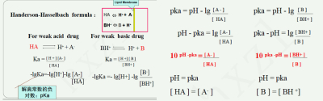
            - **药物的解离度（pKa）：** 药物解离常数的负对数值 即 **药物解离程度为 50%时所在溶液的 pH**  药物的解离度是药物的固有属性 与药物本身的酸碱性无关（弱酸性pKa可以大于7.0，弱碱性药物pKa可以小于7.0）
            -  **“酸酸碱碱易吸收”** 
              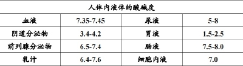
              > 酸性药物解离度一般<7，在酸性环境中解离更少、容易吸收
              > 碱性药物解离度一般>7，在碱性环境中解离的更少、容易吸收
            -  **减轻弱酸性药物** <mark style="background-color:#fef3c7;"> **苯巴比妥** </mark> **的中枢毒性—碱化细胞外液—小苏打** 
            - 离子障：解离型药物被阻挡在细胞外，非解离型脂溶性可透过细胞膜
    - **3. 载体转运**
      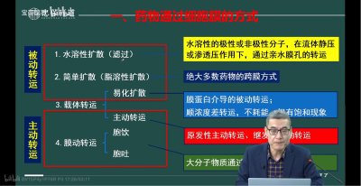
      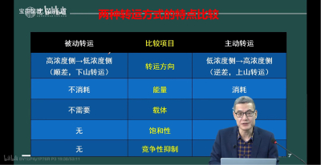
      - **主动转运**
      - 易化扩散
      - 膜动转运（cytosis）胞吞 胞饮
  - **（二）体内过程（Intracorporal Process）**
    -  <u>**定义**</u> 
      -  **注意四步体内过程并非按顺序发生，可能是同时发生。** 
    - **吸收**
      - **药物的**  <u>**吸收**</u>  **：药物从给药部位**  **进入血液循环**  **的过程**
        - 药物吸收的速度和效率取决于转运的路径
          - 一般来说： ~~**静脉注射/静脉滴注**~~  **＞吸入＞**  **舌下**  **＞直肠＞肌内注射＞皮下注射＞口服** （最方便经济） **＞透皮**
            > 静脉注射/血管内给药不存在“吸收”过程。
      - 各吸收途径特点
        - **消化道吸收**
          - 包括 **口腔吸收（经口腔黏膜吸收）、 胃吸收（弱酸性药物易吸收） 、小肠吸收（口服药物的主要吸收部位）、 直肠吸收（**  **减轻药物首过消除**  **）**
          -  **消化道吸收才存在首过消除现象** 
          - **消化道吸收的影响因素：**
            - 药物本身因素： **药物的脂溶性 、药物的离子化程度 、药物的分子量**
            - 药物的剂型： **片剂**  **/**  **胶囊**  **/**  **分散片**  **/**  **液体剂型**  **/**  **气雾剂粒径**
            - 内环境的 pH
            - 药物与消化道的接触时间和接触面积
            - 消化道的蠕动 、排空 、内容物 （四环素与肠道内Ca2+络合）、血流量
      -  <u>**首过消除（First-Pass Elimation）**</u>  **及其**  <u>**影响因素**</u> 
        - 某些药物在 **首次** 通过 **肠黏膜**  **和**  **肝脏** 时 **部分被**  **代谢灭活** 而使得进入体循环的药量减少的现象
        - 如  **Nitroglycerin**  首过消除可达 90% 因此口服效果差而改用 **舌下含服** 等方式
          > **硝酸甘油**
    - **分布**
      - **药物吸收（进入血液循环）后，随血液循环分配到各组织中的过程称为分布**
        > 大部分被动转运；分布是药物自血浆消除的方式之一
        - **再分布（Redistribution）：** 药物先向 **血流量** 较大的器官组织分布 然后向血流量相对小的组织器官 **转移** 的过程。
          - 如麻醉药  **thiopental**  先向血流量较大的脑组织分布后迅速产生麻醉效应 然后又向脂肪组织转移后效应迅速消失
            > **硫喷妥钠**
      -  <u>**药物与血浆蛋白结合的意义**</u> 
        - **白蛋白** 主要结合弱酸性药物； **α1 酸性糖蛋白** 主要结合弱碱性药物； **脂蛋白** 结合脂溶性强的药物
          > 白酸结合（白醋）；酸碱结合；脂-脂结合
        - 可逆；动态平衡
        - 结合药： **不具有效能、不能穿过膜、作为潜在的药物储备库、（不参与分布？），易发生更强的药物互作**
        - 结合时 **相对不具有选择性——**  ***联合用药竞争排挤的结构基础*** 
          - **高结合型的药物之间可能会竞争相同的血浆蛋白使得未结合药物的浓度、毒性增加。如 Warfarin**  与  **Butazodine**  同时服用会导致竞争使得华法林血药浓度增高易发生 **出血；**
            > **华法林 保泰松**
          - 新生儿使用  **sulfonamide**  会与 **胆红素** 竞争血浆蛋白，引起 **新生儿黄疸** ；
            > **磺胺药**
        - 当人体血浆蛋白含量变低时，药物的血药浓度↑ 更容易中毒
      - **影响药物分布的因素**
        - 1.药物-血浆蛋白结合 （见上文）
        - **2.特殊屏障**
          - 机体中部分组织对药物的通透性具有特殊的屏障作用，主要是 **胎盘屏障、血眼屏障、血脑屏障（仅有脂溶性强、分子量小的药物可以穿过屏障进入中枢神经系统）**
          - 发生炎症时，屏障作用可能会下降，例如  **penicillin**  无法通过血脑屏障 但在发生脑膜炎时，大剂量的青霉素有效
        - 3.其他因素：血流量；毛细血管的通透性；所处环境的酸碱度；组织亲和性：药物在高亲和性的组织中分布更广，具有选择性、平衡性； **脂溶性**
    - **代谢**
      - （1）定义：药物作为外源性物质在体内经酶或其他作用发生 **化学结构改变** 称为代谢/ **生物转化（biotransformation）。** 
      - （2）部位：大多为 **肝脏** ；胃肠道，肺，皮肤，肾脏等部位也可
      - **（3）意义：** 药理活性或毒性改变——降低/升高
        - **①灭活（inactivation）：** 大多数药物经转化后失去活性
        - **②激活：** 少数药物经过生物转化后出现药理活性，称为 **前药（pro-drug）**
          > 可的松，依那普利
          - 因此，生物转化不能称之为“解毒过程”。
          - **eg Codeine**  经过肝脏去甲基后变成吗啡而生效
        - **③药物排出的重要方式：** 可以产生极性，增强水溶性，减弱活性， 更易排出。
          - 某些药物经转化后生成的代谢产物仍具有药理活性或毒性：
            - **Propranolol** 的代谢产物 4-OH Propranalol 仍具有活性但更弱
              > 心得安
            - **Phenacetin**  的代谢产物  **Acetaminophen**  活性比原来更强
              > 非那西汀 ——变“对乙酰氨基酚”
            - **Isoniazid**  的代谢产物  **Acetylisoniazid**  具有较强的毒性
              > 异烟肼(抗结核药)
      -  **（4）代谢的类型** ：2 个时相，4 种类型
        - **I 相：氧化、还原、水解**
          - 在药物分子中引入或者脱去功能基团而生成极性增高的代谢产物
        - **II 相：结合反应**
          - 极性基团+内源性物质（葡萄糖醛酸、甘氨酸、磷酸）→结合产物：极性大，溶解性高，经尿排出
        - 多数药物代谢：先经Ⅰ相再经Ⅱ相
          - 特例：异烟肼代谢，先经过Ⅱ相反应再经过Ⅰ相反应生成肝脏毒性代谢产物乙酰肼和乙酸
      -  <u>**（5）肝药酶特点、肝药酶的诱导剂和肝药酶抑制剂**</u> 
        - **药物代谢酶：能够催化药物代谢的酶。**
        - 专一性酶:乙酰胆碱酯酶，专一水解乙酰胆碱
        - 非专一性酶:肝药酶(肝细胞微粒体酶系)
          - 主要: **细胞色素 P450单加氧酶系(CYP450)**
          - 存在:肝细胞微粒体和线粒体，亚铁血红素-硫醇盐蛋白超家族
          - 作用:参与 **内源性物质** 、外源性物质(药物、环境物质）的代谢
          - 其中，CYP3A: 代谢50%以上的药物
        - **药物代谢酶特点：**
          - 对底物选择性较差
          - 变异性、个体差异大
          - 易受多种因素影响出现增强或减弱，结果体现为“诱导”与“抑制”。
            - 药酶诱导剂 enzyme inducer
              - 使药酶的活性升高，加快 **自身代谢** 和其他药物代谢 **的药物** 叫做酶诱导剂， **致耐受性** 。
              - <mark style="background-color:#fef3c7;"> **苯巴比妥** </mark> **类药物** 的<mark style="background-color:#fef3c7;"> **诱导作用** </mark>强，可以加速抗凝血药物双香豆素的代谢
            - 酶抑制剂 enzyme inhibitor
              - 使药物代谢酶活性降低，减慢 **自身代谢** 和其他药物代谢的药物， **致蓄积中毒** 。
              - 例如：<mark style="background-color:#fef3c7;"> **氯霉素** </mark>通过减弱肝药酶的活性可以抑制甲苯磺丁脲和苯妥英钠的代谢
            - 临床联合用药时，注意有诱导效应的药物不能突然停止用药，不然可能导致另一种被诱导加快代谢的药物蓄积中毒
            -  **考试记住画红线的几个** 
              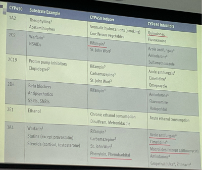
              -  **肝药酶诱导剂：** Rifampin 利福平（结核病人吃避孕药仍易孕）、phenytoin 苯妥英、phenobarbital 苯巴比妥
              -  **肝药酶抑制剂：** quinolone 喹诺酮、azole antifungal 唑类抗真菌药、cimetidine 西咪替丁（甲腈咪胍，抗消化性溃疡药)、macrolides（except azithromycin）大环内酯类（阿奇霉素除外）
          - 具有一定的容量限制
            - 饱和现象： **Paracetamol**  通过葡萄糖醛酸或细胞色素 P450 酶代谢，产生的中间有毒产物与谷胱甘肽结合转化为无毒物质。 <u>若过量服用，中间的有毒产物没有足够的谷胱甘肽结合，发生中毒</u>
              > **扑热息痛**
    - **排泄**
      - 药物以原型或代谢产物的形式经机体的排泄器官或分泌器官排出体外的过程。
        - <u>药物消除</u> ：代谢 + 排泄，使体内药量减少。
        -  **药效终止：代谢、排泄、再分布。** 
      - **器官：肾脏（最重要），胆道，** 肠道，唾液 ，乳汁（乳汁的 pH 略低于血浆 弱碱性药物易从乳汁排泄） ，汗液，泪液，肺（挥发性药物）
      -  <u>**肾排泄的特点**</u> 
        - 肾小球滤过： **游离** 型药物及其产物
        - 肾小管分泌：主动转运 ——逆浓度梯度、需要载体，存在竞争、饱和现象
          - i. **青霉素G** 与 **丙磺舒** 合用，丙磺舒竞争肾小管分泌青霉素的载体，使 **PG在体内留存时间更长** 。
          - ii. **噻嗪类利尿药** 与 **尿酸** 竞争排出受体，会有引起 **痛风的不良反应** 
        - 肾小管重吸收
          - 碱化尿液有利于排出酸性药物，酸化尿液有利于排出碱性药物。
      - 消化道排泄：切断胆汁的肠肝循环可以大大缩短某些药物的半衰期，使得药物的作用时间增长。
        -  **胆汁排泄** 
        -  <u>**肝肠循环（Hepato-Enteral Circulation）：**</u> 有的药物在肝细胞内与葡萄糖醛酸结合后分泌到胆汁中，随后排泄到小肠中被水解，游离药物再吸收进入体循环的过程  **。**  因肠肝循环，使得血药浓度维持时间延长。
          -  **有肠肝循环的一些药物，血药浓度具有双峰** 
      - **影响因素**
        - **体液流量：** 血流量增加时 排泄的药物量增加
        - **体液 pH：** pH 升高时 弱酸性药物解离增加、排泄增加，弱碱性药物解离减少、排泄减少
      - 小结——药物效应终止的途径 **：代谢、排泄、再分布**
  - **（三）速率过程（Rate Process）**
    - **时量曲线：组成和意义**
      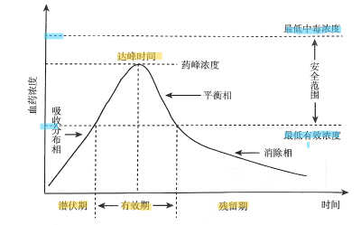
      - **药物浓度-时间曲线（concentration-time curve,C-t）：** 给药后药物浓度随时间迁移而变化。以药物浓度（对数浓度）为纵坐标、时间为横坐标绘制曲线图得到的曲线
        - 先纵向看
          - 吸收相：吸收>消除，血药浓度逐渐上升
            > **静脉注射** 时量曲线没有吸收相。
          - 峰浓度：吸收=消除
          - 消除相：吸收<消除，血药浓度逐渐下降
          - 最低有效浓度、最低中毒浓度、安全范围（最低有效浓度——最低中毒浓度之间）
          - 平衡相
        - 再横向看
          - 潜伏期、有效期、残留期：按是否大于最低有效浓度划分
          - **半衰期：** 血浆中药物浓度下降（至峰浓度的）一半所需要的时间。
      -  <u>**曲线下面积（Area Under the Curve AUC）**</u> 
        - 药物浓度-时间曲线和横坐标围的区域，表示一段时间内 **进入**  **血液循环**  **的** 总药量（药物在血浆中的相对累积量），是衡量药物吸收的相对数量的指标。
          - 计算生物利用度
          - 比较不同给药途径对药物吸收的影响
            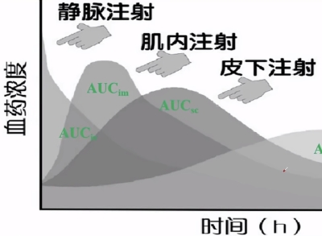
            - 不考虑首过消除（口服多给点量）：AUC相等
            - 峰浓度、起效时间：v m c o
            - 维持时间：o c m v
    - 药物消除动力学——聚焦C-t曲线消除相
      - 关注消除相的 **“下降斜率”** 
        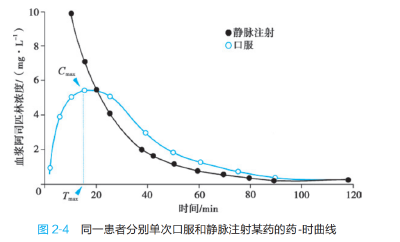
        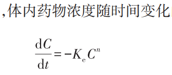
      -  **主要按n来划分类型** ：n=1 时为一级消除动力学；n=0 时为零级消除动力学。
      - C 为微分时间段的初始体内药物浓度；t为时间；负号表示降低。
      - Ke ：消除速率常数
    - **消除速率类型**
      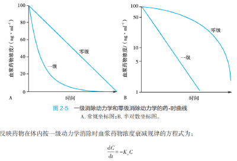
      -  <u>**一级速率消除（恒比消除）**</u> 
        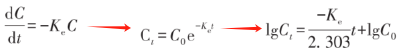
        - 药物消除的 **速度** （单位时间内消除的药量）与血浆药物 **浓度** 成正比， *每一次的消除量和当时的药物浓度是恒比的。*
          > “我每次就拿一半”
        - 大部分药物在体内按一级速率消除。
        -  **Ke**  ：消除速率常数，反映体内 **各种途径消除药物的总和。** 
          - 基本恒定， **依赖于药物本身的理化性质** 和消除器官的功能状态。
            > 基本上药定了Ke也就定了
          - 数值大小反映药物在体内消除的速率
        - 注意与“半衰期”概念相互理解：把“单位时间”中的“单位”看作药量消除一半时的时间，代入一级速率消除概念
        - 时量曲线在 **半对数** 坐标纸上为直线， **截距：lgC0。**
        - **特点**
          - 实时消除速率与实时药物浓度成正比
            > **“每次纳税与工资成正比”**
          - C-t图指数衰减曲线，lgC-t图直线
          - 一级速率半衰期恒定，与剂量无关，等于  **ln2/Ke** （消除速率常数）
            > 积分后取对数，t=0时得到C0，再代入C=1/2C0，解得t1/2
          - 一次给药的药时曲线下面积(AUC)与剂量成正比。
          - 一次给药时,药物消除的百分率取决于半衰期，经4-6个t1/2药物基本消除。
          - 定时定量多次给药时平均稳态血药浓度与剂量成正比。
      -  <u>**零级反应动力学（恒量消除）**</u> 
        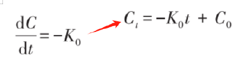
        - 单位时间药物浓度按 **恒定的量** 消除。
        - 原因：药物浓度 *（相比于机体对它的固有消除能力来说）* 太高，机体消除能力达饱和。
        - **特点**
          - 消除速率与初始浓度无关
            > **“每个人无论工资纳税相同”**
          - 时量曲线是直线，y截距：C0
          - 零级速率变化药物的半衰期随浓度变化而改变，等于  **0.5C0/K** 
      - 混合消除动力学（米—曼方程）
        - 取决于机体消除药物能力和体内药量的 **相对大小** 关系
          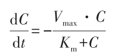
          > 公式形态：鸡在河上飞
        - **药物浓度高：** C>> **Km** ，体内药量>> **机体代谢能力** ，忽略Km—→方式： **零级消除动力学**
        - **药物浓度低** ：Km>>C，机体消除能力>>药量，忽略分母C—→方式： **一级消除动力学**
        - <mark style="background-color:#fef3c7;"> **苯妥英钠、水杨酸、乙醇** </mark>
          > 酒喝太多：先零级，恒量消除；再一级，恒比消除。
      - 半衰期（Elimination half-life）
        -  <u>**半衰期（Elimination half-life）**</u> 
          > 概念和意义
          - **（从给药开始计时），血浆中药物浓度**  **下降（至峰浓度的）**  **一半所需要的时间。**
          - **一级速率半衰期**
            - 与血药浓度无关，恒等于 **0.693/Ke** 
            - 意义
              - ①药物分类：短效、中效、长效
              - ②估计 **连续给药后达稳态所需时间（5个t1/2）** 稳态血药浓度（steady-state concentration Css）/坪值（plateau）；
              - ③估计停药后药物从体内消除所需时间（5个t1/2）。
                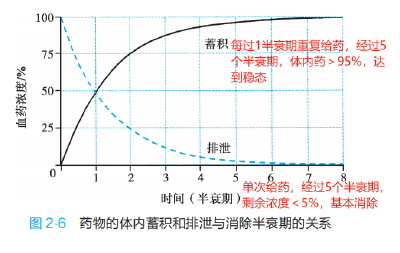
          - **零级速率变化药物的半衰期**
            - 等于 0.5 **C0/** K。
            - 不存在一级速率半衰期的几个意义
          - 影响因素：肝肾功能、清除率、遗传因素（酶的活性）、 疾病、药物间不良反应
      - 稳态血药浓度（steady-state concentration Css）/坪值（plateau）
        -  <u>**稳态血药浓度（steady-state concentration Css）/坪值（plateau）**</u> 
          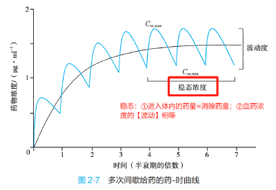
          - 连续多次恒量（单位1，100%）给药，当 **给药速度与消除速度平衡时，达到的稳定浓度 Css** 。
          - 达到 **稳定状态** （Css）的 **时间** ： **仅取决于半衰期** 
            - 与给药量、间隔、给药途径均无关系
          - 给药量、间隔、给药途径可以影响 **稳态浓度** ，但是不能影响 **达到时间**
            - **相当于改变了等比数列求和公式中的C，但我们需要的Css是一个不含C的百分比。绝对浓度数值上去了，但反映状态稳定性和波动性的百分比不受影响。**
              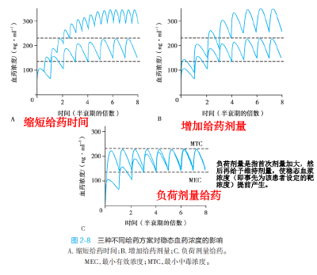
          - link：药物剂量设计优化
            - 靶浓度、维持量、负荷量
            - 靶浓度（理想的Css：有效无毒）、维持量（给药量、给药间隔时间怎么安排，才可以使进入速度=消除速度）、负荷量（先马上产生效果，达到Css浓度，再连续给药，慢慢达到稳态）
            - 口服首剂加倍，静注1.44倍
    - **药动学模型**
      -  <u>**房室模型（Compartment Model）**</u> 
        - 根据药物在体内转运速率的一致性可分为一室模型、二室模型、多室模型
          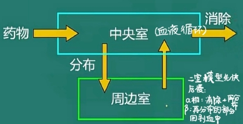
        - **一室模型（one compartment model）：** 药物吸收入体后，迅速分布、很快在血液与各组织脏器之间达到动态平衡，即药物在全身各组织部位的 **转运速率相同或相似** ，此时把整个机体视为一个房室。
          - 不是所有身体各组织在任何时刻的药物浓度都一样，而是 **各组织药物水平能随血浆药物浓度的变化平行地发生变化** 。
        - **二室模型（two compartment model）：** 药物吸收进入体内后，很快进入机体的某些部位，但在另一些部位，需要一段时间才能完成分布。从速率论的观点将机体划分为药物分布均匀程度不同的两个独立系统。
          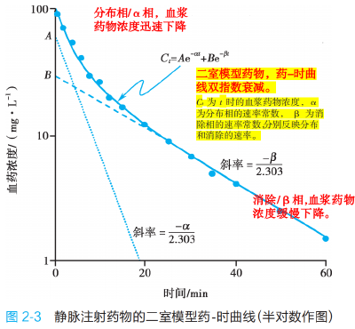
          - 中央室（central compartment）：血流丰富、药物分布能瞬时达到与血液平衡的部分。
            - 血管分布丰富、血液流速快、血流量大的组织器官：如血液、心脏、肝、脾、肺、肾等；
          - 周边室（peripheral compartment）：血液供应较少，药物分布达到与血液平衡时间较长的部分。
            - 如骨骼、脂肪、肌肉等
        - **多室模型（multiple compartment model）** ：若在上述二室模型的基础上还有一部分组织、器官或细胞内药物的分布更慢，则可以从周边室中划分出第三房室，由此形成三室模型。针对在体内 **分布速率有多种水平** 的药物。
    - **药代动力学参数**
      - **吸收指标**
        - **达峰浓度（Cmax）、达峰时间（Tmax）**
          - 血管外给药后药物在血浆中的最高浓度值/峰值出现的时间，表示药物吸收程度/速度
          - **血管外给药途径、药物制剂** 均可 **影响药物吸收的程度和速度**
          - 临床上可应用缓释剂、控释剂、速释剂、透皮吸收贴剂控制药物释放，达到平稳的血药浓度和治疗效果
        -  <u>**曲线下面积（Area Under the Curve AUC）**</u> 
          - 药物浓度-时间曲线和横坐标围的区域，表示一段时间内 **进入血液循环**  **的** 总药量（药物在血浆中的相对累积量），是衡量 **药物吸收的**  **相对数量** 的指标。
          - 不同公司相同剂量的相同药物 AUC 可能有较大差异——相对生物利用度，评价药物质量
          - 相同药物相同周期、不同剂量，AUC 也不同
        -  <u>**生物利用度（Bioavailibility BA/F）**</u>  <u>**（“吸收入血度”）**</u> 
          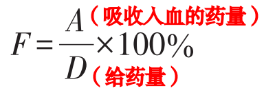
          - **药物经**  **血管外给药**  **后能被吸收进入**  **体循环（血液循环）**  **的份量与速度。** 通常用 **绝对生物利用度** 表示，即 **吸收入血的药物量与给药量** 的比值，或 **血管外、内给药的曲线下面积的比** 。
          - 衡量 **药物吸收入血的**  **速率和效果** 
          - 从药量/药量→面积/面积
            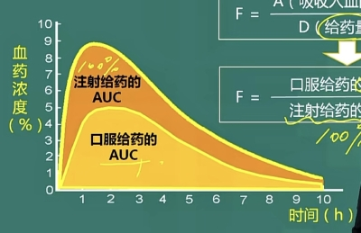
          - 绝对生物利用度F：评价药物吸收程度、速度（曲线陡缓）
            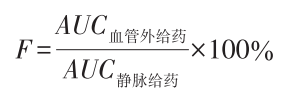
          - 相对生物利用度F’：药物是否合格，评价质量
            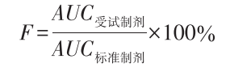
        - **生物等效性（**  **Bioequivalence BE/F’**  **）**
          - **比较同一种药物的相同或者不同剂型，在相同试验条件下，活性成分吸收程度和速度是否相近。** 通常用 **相对生物利用度**  **表示。**
          - 评价药品制剂之间、生产厂商之间、批号之间的 **吸收药物量是否相近。**
      - **分布指标**
        -  <u>**表观分布容积（Apparent Volume of Distribution Vd）**</u> 
          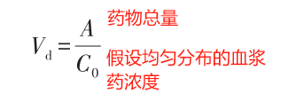
          > 等于静注【给药量】D（mg）与C0零时血药最高【初始浓度】）mg/L的比
          - **定义：假设** 当药物在体内 **按血药浓度**  **均匀分布** 时，需 **占有的体液容积** 。单位：L 或 L/kg。
          - 是由药物本身决定的常数，反映药物的跨膜转运能力。
          - **Vd的意义**
            - **①** 可以进行血药浓度与药量的换算；
              - <mark style="background-color:#fef3c7;">调节临床用药剂量：</mark><mark style="background-color:#fef3c7;"> **D=Vd x C** </mark>
              - 已知药量D1，Vd，推测血浆浓度；已知
            - ②反映 **药物在体内的分布情况**
              > 例：一个体重70kg的人，42L体液，其中药物依次接触到的是：血浆4L，组织液10L，细胞内液 42L；
              - **Vd 3-5L**  说明主要分布在血浆
                > 例：甘露醇 Vd=0.06L/kg. 乘以体重，得到体内共需要占据体液=0.06 x 70kg=4.2L,在血浆中利尿。
              - **Vd 10-20L**  说明主要分布于细胞外液中
                > 例：链霉素 Vd=0.25L/kg. 乘以体重，得到体内共需要占据体液17.5L,在血浆和组织间液抗菌，对胞内细菌无效。
              - **Vd 40L**  说明主要分布于全身体液中
                > 例：异烟肼 Vd=0.067L/kg. 乘以体重，得到体内共需要占据体液46.9L,在全身分布广泛，可以杀死胞内菌，抗结核杆菌首选药。
                > 例：利福平 Vd=0.97L/kg. 乘以体重，得到体内共需要占据体液67.9L,在脂肪+体液中。
              - **Vd 100L**  全身+某一特定器官/组织中富集
                > 例：氯喹 Vd=115L/kg. 肝肺脾
              - **V**  **d**  **越大** 越难以排出
            - **③** 可以判断药物排泄速度。
              - Vd越大——药物体内分布越广——排泄越慢。
      - **消除指标**
        - **消除速率常数（Ke）**
          - **单位时间内消除药物的分数，即一定血药浓度下药物消除速度与药物浓度的比。**
          - **反映药物在体内各种途径消除的总速率。** 基本恒定，只依赖于药物本身的理化性质与消除器官的功能
          - **药物消除速率常数=0.5 时，不代表半衰期为 1h。 半衰期为 ln2/Ke 因为计算半衰期时要考虑药物浓度随着清除而不断下降**
        -  <u>**半衰期（Elimination half-life）**</u> 
          > 概念和意义
          - **血浆中药物浓度**  **下降（至峰浓度的）**  **一半所需要的时间（从给药开始计时）。**
          - **一级速率半衰期**
            - 与血、药浓度无关，恒等于 0.693/Ke
            - 意义：①同类药物分类：短效、中效、长效；②估计 **连续给药后达稳态所需时间（5个t1/2）** 稳态血药浓度（steady-state concentration Css）/坪值（plateau）；③估计停药后药物从体内消除所需时间（5个t1/2）。
              
          - **零级速率变化药物的半衰期**
            - 等于 0.5 **C0/** K。
            - 不存在一级速率半衰期的几个意义
          - 影响因素：肝肾功能、清除率、遗传因素（酶的活性）、 疾病、药物间不良反应
        -  <u>**清除率（CL）**</u> 
          - 单位时间内 **多少毫升** 血浆中的药物被清除。是肝清除率、肾清除率和其他消除途径清除率的 **总和** 。
            - 意义：反映肝肾功能。
            - 肾脏清除率可以反映肾脏排泄药物的方式。若肾脏清除率>125mL/min 说明存在额外的分泌；若<125mL/min 说明存在重吸收
          - 一种药物清除率往往固定
          - 一级反应清除率=消除速率常数·表观分布容积
    - **连续或多次给药时血药浓度的规律**
      -  <u>**稳态血药浓度（steady-state concentration Css）/坪值（plateau）**</u> 
        
        - 连续多次恒量给药，当 **给药速度与消除速度平衡时，达到的稳定浓度 Css** 。
          - 达到Css的 **时间** ：仅取决于 **半衰期**
            - 与给药量、间隔、给药途径均无关系
          - <u>血药浓度的</u>  <u>**波动幅度**</u>  <u>取决于</u>  <u>**给药间隔**</u>  <u>。</u>
            > 间隔长，波动大；间隔小，波动小
          - **坪值** 高低取决于 **给药剂量** 。
        - 给药量、间隔、给药途径可以影响 **稳态浓度** ，但是 **不能** 影响 **达到时间**
          
      - **负荷剂量（loading dose）:首次剂量加大，然后再给予维持剂量，提前达到稳态血浆浓度（即事先为该患者设定的靶浓度）（但不能提前“稳定”，即不能提前达到稳态）。**
        > 按半衰期为间隔时间给药时，首次剂量加倍，可在用药后立刻达到稳态浓度（静脉注射时为 1.44 倍 口服时为 2 倍），但此时不是稳态
        - <mark style="background-color:#fef3c7;"> **C desired * Vd = loading dose** </mark>
        - *药物剂量设计和优化*
          - 靶浓度：指有效而不产生毒性反应的治疗浓度范围(理想的Css范围)。确定靶浓度→计算给药剂量→制定给药方案维持量
          - 维持量：进入体内的药物速度=体内药物消除速度。此时，给药速度=给药量/给药间隔时间
          - 负荷量：口服给药的负荷量:首剂加倍、每隔1个半衰期给药一次；静脉滴注的负荷量:首剂1.44倍
      - 首剂加倍：第一次用药量是常规剂量的2倍（200%），可使血药浓度迅速达到坪值。
- # **三、影响药物效应的因素及合理用药原则（自学）**
  - **（一）机体因素**
    - **1. 生理因素**
      - **（1）年龄**
        - **①** 新生儿和老年人体内药物代谢与肾排泄功能较低，大部分药物可能会蓄积；老人用药剂量多为成人的3/4。
        - ②白蛋白含量少，药物游离多。有较强和更持久的作用；
        - ③婴儿对影响水盐和酸碱平衡的药物敏感。
        - ④生长发育期常用中枢抑制药影响智力。
      - **（2）性别**
        - ①女性月经期和妊娠期，禁用剧泻药和抗凝血药。
        - ②在妊娠 **头三个月** 内，禁用抗代谢药、激素等能使胎儿致畸的药物。
        - ③临产前禁用吗啡等可抑制胎儿呼吸的镇痛药。
        - ④哺乳期用药也应注意，有些药物可进入乳汁影响婴儿。
      - **（3）体重**
    - **2.精神因素——安慰剂效应**
    - **3.病理因素**
      - **（1）肝功能不全：**  **代谢变慢——毒变强，活变弱** 
        > 某些不经肝脏转化的药物在肝功能不良时可不受影响。
        - ① **甲苯磺丁脲、氯霉素** 等，作用 **加强** ，持续时间延长;
        - ② **可的松、泼尼松** 等需在肝经生物转化激活的药物，则作用 **减弱** ；
        - ③不经肝脏转化的药物使用不受影响，如在肝功能不全时可用 **氢化可的松或泼尼松龙** 。
      - **（2）肾功能不全**  **(排泄 x —→蓄积)** 
        - ①氨基糖苷类:卡那霉素、庆大霉素等;
        - ②头孢唑啉(第一代头孢菌素类)。
      - **（3）营养不良：药物效应增加**
        - ①药物与血浆蛋白结合率降低，游离型药物居多。
        - ②肝微粒体酶活性低、数量少，药物代谢减慢;
        - ③因脂肪组织较少，可影响药物的储存。
      - （4）胃肠疾病：胃排空时间延长或缩短，可使在小肠吸收的药物作用延长或缩短。
      - （5）心脏疾病：心力衰竭时药物在胃肠道的吸收减少，分布容积减小，消除速率减慢。
      - （6）酸碱平衡失调、电解质紊乱
    - **4. 遗传因素**
      - **①量的差别:** 高敏性和耐受性;
      - **②质的差异:** 如变态反应、特异质反应等。
      - 少年型恶性贫血：胃内缺乏内因子，维生素 B12在肠内不能吸收;
      - 先天性缺乏葡萄糖-6-磷酸脱氢酶：对治疗量的乙酰水杨酸、奎宁、伯氨喹、磺胺类药等可引起溶血;
      - 异烟肼乙酰化分为快代谢型和慢代谢型。慢代谢型者肝中乙酰化酶活性低，服药后异烟肼血药浓度较高，t1/2延长，显效较快。
    - **5.种属差异**
      - **(1)种属差异:** 人与动物间的差异。
      - **(2)种族差异:** 对药物代谢酶的活性和作用靶点的敏感性有显著影响。
    - **6.长期用药，** 机体对药物反应的变化： <u>**耐受性、**</u> 习惯性、 <u>**成瘾性(addiction)、依赖性(dependence)、耐药性。**</u> 
      - **耐受性：** 连续用药后出现的药物反应性下降。
      - **依赖性：** 长期用药后患者对药物产生精神性和生理性依赖、需要连续用药现象。
      - ② **成瘾性 （Addiction）——精神** 依赖性，觅药行为
      - （10）耐药性（Resistance）
  - **（二）药物因素**
    - **1. 药物理化性质：** 药物的溶解性
    - **2. 剂型**
      - eg  **硝苯地平** 控血压，缓释、控释使其不过度波动。
      - (1) **口服** 给药的 **吸收速率** 为: 水溶液>散剂>片剂;
      - (2) **缓释** 制剂：可使药物按 **一级速率缓慢释放** ，吸收时间较长，药效维持时间也延长;
      - (3) **控释** 制剂：药物按 **零级速率缓慢释放** ，使血药浓度稳定在有效浓度水平，产生持久药效。
    - **3. 剂量**
      - (1)剂量增加，作用增强;
      - (2) **剂量不同，作用不同** ，如: **地西泮** ，小镇静、中催眠、大抗惊厥。
      - (3)影响 **选择性：**  **多巴胺** 小、中剂量—→ **多巴受体** ，扩张肾血管，增加尿量， **防止肾衰** 。大剂量—→ **α受体** ，肾血管收缩， **引起肾衰。**
    - **4. 给药方法**
      - **(1)给药途径** 影响药效出现 **（生效）时间** 快慢：静脉注射 **>吸入** >肌内注射>皮下注射 **>口服** >皮肤给药;
        > 吸入卡在前两个注射之间
      - **(2)给药途径** 影响 **作用性质:** 如: **硫酸镁** 。外敷--消炎去肿	  口服--泻下作用    注射给药---抗惊厥、扩血管（妊高症）
      - (3)给药时间
        - ①一般饭前服药吸收较好，发挥作用较快、刺激胃;饭后服药吸收较差，显效也较慢，刺激小。
        - ②有刺激性的药物，宜饭后服用;
        - ③催眠药宜在临睡前服用、胰岛素应在餐前注射;
        - ④按生物节律用药:如 **肾上腺皮质激素一日量早晨一次服用** ，可 **减轻对腺垂体抑制的副作用。**
    - **5. 药物相互作用**
      - **（1）配伍禁忌：**  **体外** 配伍中发生药物的物理或化学反应，使药效减弱或毒性增加。
        - ① **β内酰胺类** 抗生素可使 **氨基糖苷** 类失去抗菌活性;
        - ② **青霉素** 在 **葡萄糖（x）** 溶液中不稳定，易致过敏。
        - ③ **头孢曲松** 不能与 **含钙注射液** 配伍;
        - ④ **红霉素** 不能用 **生理盐水（x）** 溶解
      - **（2）药动学相互作用**
        - ①抗酸药影响酸性药物在胃内吸收： **酸酸碱碱促吸收，酸碱碱酸促排泄** 。
        - ② **与血浆蛋白结合率高的药物合用，作用增强，毒性增大。** 
          - 游离型发挥药理作用、跨膜转运、可代谢排泄；结合型药物无活性，作为暂时的贮库，不能离开血液。
          -  **阿依水，抢蛋白**  （ **阿司匹林、依他尼酸、水合氯醛** ）
          -  **格列类、华法林**  **，被抢劫、被游离，易过量、易中毒，低血糖、低凝血。**
            > 格列类降糖，华法林抗凝血
      - **（3）药效学相互作用**
        - **协同作用：** ①相加作用（合用=单用作用之和）②增强作用（1+1＞2）；③增敏作用（药1使组织/受体对药2敏感性++）
        - **拮抗作用：** ①相减②抵消。// **①生理性拮抗：阿托品抢救有机磷中毒（抢夺受体）；②化学性拮抗：鱼精蛋白解救肝素过量（两药互相反应）。**
          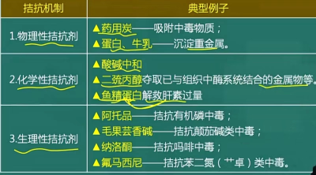
  - **其他因素：时间、生活习惯、环境**
  - **（三）合理用药基本原则：①** 明确诊断；②严格掌握适应证与禁忌证；③根据药物的特性选择剂型和给药途径；④确定剂量与疗程；⑤科学的药物配伍。
- 习题
  - 1. 在下列哪些情况下，药物从肾脏的排泄减慢?
    - <mark style="background-color:#fef3c7;">A.青霉素G合用丙磺舒</mark>
    - B.阿司匹林合用碳酸氢钠
      > 酸碱
    - <mark style="background-color:#fef3c7;">C.苯巴比妥合用氯化铵</mark>
      > 酸酸
    - D.苯巴比妥合用碳酸氢钠
    - E.苯巴比妥合用苯妥英钠
      > 肝药酶诱导剂
- 本章“举例型”易考药
  - 一些选择题易考药
    -  **减轻弱酸性药物** <mark style="background-color:#fef3c7;"> **苯巴比妥** </mark> **的中枢毒性—碱化细胞外液—小苏打** 
    - 如  **Nitroglycerin**  首过消除可达 90% 因此口服效果差而改用 **舌下含服** 等方式
      > **硝酸甘油**
    - 如麻醉药  **thiopental**  先向血流量较大的脑组织分布后迅速产生麻醉效应 然后又向脂肪组织转移后效应迅速消失
      > **硫喷妥钠**
    - **高结合型的药物之间可能会竞争相同的血浆蛋白使得未结合药物的浓度、毒性增加。如 Warfarin**  与  **Butazodine**  同时服用会导致竞争使得易发生 **出血；**
      > **华法林 保泰松**
    - 新生儿使用  **sulfonamide**  会与胆红素竞争血浆蛋白，引起新生儿黄疸；
      > **磺胺药**
    - **②激活：** 少数药物经过生物转化后出现药理活性，称为 **前药（pro-drug）**
      > 可的松，依那普利
      - 因此，生物转化不能称之为“解毒过程”。
      - **eg Codeine**  经过肝脏去甲基后变成吗啡而生效
    - **Propranolol** 的代谢产物 4-OH Propranalol 仍具有活性但更弱
      > 心得安
    - **Phenacetin**  的代谢产物  **Acetaminophen**  活性比原来更强
      > 非那西汀 ——变“对乙酰氨基酚”
    - **Isoniazid**  的代谢产物  **Acetylisoniazid**  具有较强的毒性
      > 异烟肼(抗结核药)
    - <mark style="background-color:#fef3c7;"> **苯巴比妥** </mark> **类药物** 的<mark style="background-color:#fef3c7;"> **诱导作用** </mark>强，可以加速抗凝血药物双香豆素的代谢
    - 例如：<mark style="background-color:#fef3c7;"> **氯霉素** </mark>通过减弱肝药酶的活性可以抑制甲苯磺丁脲和苯妥英钠的代谢
    -  **肝药酶诱导剂：** Rifampin 利福平（结核病人吃避孕药仍易孕）、phenytoin 苯妥英、phenobarbital 苯巴比妥
    -  **肝药酶抑制剂：** quinolone 喹诺酮、azole antifungal 唑类抗真菌药、cimetidine 西咪替丁（甲腈咪胍，抗消化性溃疡药)、macrolides（except azithromycin）大环内酯类（阿奇霉素除外）
    - 饱和现象： **Paracetamol**  通过葡萄糖醛酸或细胞色素 P450 酶代谢，产生的中间有毒产物与谷胱甘肽结合转化为无毒物质。 <u>若过量服用，中间的有毒产物没有足够的谷胱甘肽结合，发生中毒</u>
      > **扑热息痛**
    - i. **青霉素G** 与 **丙磺舒** 合用，丙磺舒竞争肾小管分泌青霉素的载体，使 **PG在体内留存时间更长** 。
    - ii. **噻嗪类利尿药** 与 **尿酸** 竞争排出受体，会有引起 **痛风的不良反应** 
  - 混合消除动力学：苯妥英钠、水杨酸、乙醇
