---
tags:
  - pharmacology
---
- # **组胺（1）**
  > 记忆的时候，我应该试着从它的药理作用去推导它的临床应用和不良反应。
  > @万古霉素  红人综合征
  - # 一．组胺
    - ## <u>**1. 组胺受体的类型及其效应**</u>
      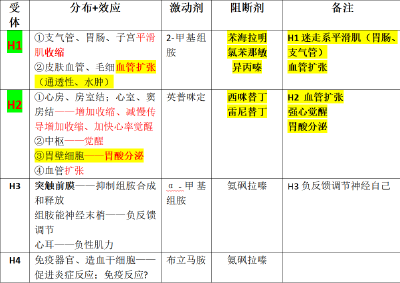
      
    - ## 2. 组胺作用
      - ### 在组织损伤、炎症、神经刺激、某些药物、抗原-抗体反应的条件下，以活性形式（游离型）释放
      - ### 心血管系统
        > **“矛盾对抗”**
        - 1. 心肌 **正性肌力** ：H2受体
        - 2. **血管扩张**  **，** 回心血量↓（ **大剂量时，强而持久的**  **降压、水肿**  **，甚至发生休克** ） ：H1、H2受体
        - 3.血小板： **对抗平衡~to聚or not to聚** 
          - H1受体：激活PLA2，介导花生四烯酸的释放，引起血小板的聚集；
          - H2受体：增加血小板中cAMP水平，对抗血小板的聚集
      - ### 平滑肌收缩，呼吸困难、腹痛：H1受体
      - ### 胃酸分泌： **H2受体** 
      - ### 中枢觉醒失眠：H1受体
      - 神经末梢： **红斑-红晕-丘疹 三联反应** ，即毛细血管扩张（红斑）、毛细血管通透性↑（丘疹）、轴索反射（红晕）
    - ### 3. 组胺合成释放
      - 与肝素、蛋白质结合（结合型，无活性），存在于肥大细胞、嗜碱性粒细胞中
        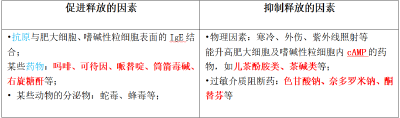
  - # <u>二．抗组胺药</u>
    - ## <u>H1 受体阻断药</u>
      > **苯海拉明（Diphenhydramine）、异丙嗪（Promethezine）、氯苯吡胺（Chlorpheniramine，扑尔敏）** 、西替利嗪、阿司咪唑、氯雷他定
      - 第一代： **苯海拉明、异丙嗪、氯苯吡胺（氯苯那敏 / 扑尔敏）、曲吡那敏（扑敏宁）** ；有 **明显**  **镇静、抗胆碱**  **作用**
      - 第二代： **西替利嗪、阿司咪唑、** 阿伐斯汀、左卡巴斯汀、咪唑斯汀；大多 **长效，无嗜睡** 作用，对喷嚏、清涕、鼻痒效果好， **对鼻塞效果差** 
      - ## <u>1. 药理作用</u>
        - ### **①阻断H1-R**
          - **完全对抗** 平滑肌的收缩（如支气管、胃肠道平滑肌）；
          - **强大抑制** 组胺直接引起的局部毛细血管扩张、水肿；
          - 但 **仅部分抵抗** 血压降低（ ***因H2-R也参与心血管活动的调节，故需同时应用H1、H2受体阻断药才能完全抵抗降压作用*** ）
        - ### ② **中枢抑制**
          - 镇静、嗜睡等，以 **苯海拉明、异丙嗪作用最强（第一代）** 
          - 阻断中枢H1受体，阻断中枢内源性组胺介导的觉醒反应
        - ### **③ 其他：抗胆碱 止吐防晕**
          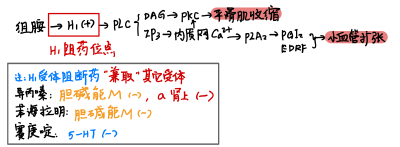
          -  **苯海拉明、异丙嗪**  **兼具阿托品样抗胆碱作用** ， **止吐、防晕** 效果较强
      - ## <u>2. 临床应用</u>
        - ###  **（1）皮肤黏膜变态反应性疾病** 
          - 皮肤Ⅰ型变态反应： **荨麻疹、过敏性鼻炎** 等，疗效较好
          - 昆虫咬伤所致皮肤瘙痒、水肿、药疹、血管神经性水肿，也有一定疗效
        - ###  **（2）对支气管哮喘、过敏性休克等** <mark style="background-color:#fef3c7;"> **严重** </mark> **血管神经性水肿无效**  ——<mark style="background-color:#fef3c7;">应选用</mark><mark style="background-color:#fef3c7;"> **肾上腺素** </mark>
        - ### **（3）防晕动病、止吐：**  **苯海拉明、异丙嗪** 
        - ### **（4）失眠：**  **苯海拉明、异丙嗪** 。尤其是一些皮肤黏膜变态反应引起的失眠
      - ## <u>3. 不良反应</u>
        - ### （1）中枢抑制现象：尤其第一代（镇静、嗜睡）
          > 服药期间应避免驾车、高空作业
        - ### （2）抗胆碱作用
          - 口干、便秘
          -  **青光眼、尿潴留患者禁用** 
        - ### （3）其他反应
          - 粒细胞减少、溶血性贫血
          -  **阿斯咪唑、特非那定** 可导致尖端扭转性心律失常
      - ### <u>两代H1阻断药对比</u>
        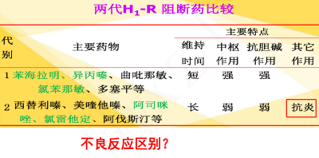
    - ## <u>H2受体阻断药</u>
      > <u>**西米替丁（Cimetidine）、雷尼替丁**</u>  **(Ranitidine)——抗胃酸分泌**
      - ## <u>**西米替丁（Cimetidine）**</u>
        - 1. 药理作用：竞争性拮抗 **胃壁细胞H2-R** ， **抑制胃酸分泌**
        - 2. 临床应用
          - - 消化性溃疡
          - - 胃酸分泌过多疾病（反流性食管炎etc）
        - 3. 不良反应
          - 一般反应：便秘、腹泻、腹胀（胃肠），头痛、头晕、皮疹、瘙痒等
          - 长期服用西咪替丁：抗雄激素；老人幻觉、癫痫；肝功能损害；
          -  **西咪替丁——肝药酶抑制剂** ：影响香豆素类、苯巴比妥、地西泮、苯妥英钠、茶碱、普萘洛尔的代谢
      - <u>雷尼替丁</u> (Ranitidine)等的作用特点
        - ### <mark style="background-color:#fef3c7;"> **强弱比较：西咪替丁＜雷尼替丁、尼扎替丁＜法莫替丁** </mark>
          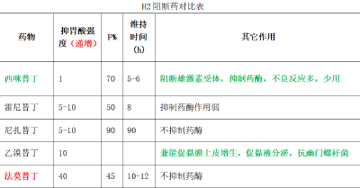
  - # 三、其他影响自体活性物质的药物：白三烯受体拮抗药：扎鲁斯特（zafirlukast）、孟鲁斯特（montelukase）
  - # 过敏性鼻炎治疗专题
    - **糖皮质激素**
      - • 鼻用（局部）糖皮质激素：最有效的药物，中重度持续性变应性鼻炎的首选药物，如丙酸倍氯米松或布地奈德鼻喷剂。曲安奈德、曲安西龙、糠酸莫米松、糠酸氟替卡松、丙酸氟替卡松、氟尼缩松等。
      - • 口服糖皮质激素：二线治疗，其他治疗方法无效时可短期口服
    - **抗组胺药**
      - 口服抗组胺药： **首选第二代** ，为一线治疗药物。氯雷他定、西替利嗪、咪唑斯汀
      - 鼻用抗组胺药：一线治疗药物，疗程不少于2周，比口服起效快，可用于“按需治疗”
    - **白三烯受体阻断剂：** 孟鲁斯特，一线治疗药物，也可与氯雷他定或鼻用糖皮质激素联用
    - **肥大细胞膜稳定剂：** 二线治疗药物，色甘酸钠、 尼多酸钠、四唑色酮、奈多罗米钠、吡嘧司特和曲尼司特
    - **鼻用减充血剂：** 二线用药，伪麻黄碱、去氧肾上腺素、羟甲唑啉。使鼻黏膜血管收缩缓解鼻塞
    - **鼻腔盐水冲洗：** 辅助治疗
    - 特异性免疫治疗（SIT）：注射特异性的变异原来减轻 AR 患者对过敏原的敏感性。 SIT 能够使嗜酸性粒细胞聚集减少，使鼻黏膜的嗜酸性粒细胞钝化和鼻黏膜对组胺的反应降低， 还能降低嗜碱性粒细胞释放组胺，使过敏症状缓解。
- # **呼吸系统（2）**
  - # **一．**  <u>**平喘药**</u>
    - ## 哮喘的 **疾病本质：气道炎症** Inflammation
      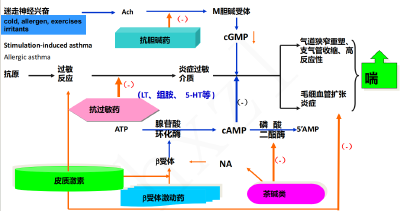
      - 慢性、变态反应性、炎症疾病——气道重塑、狭窄、炎性浸润
        - 外因性（吸入性）: 特异性抗原， **Ⅰ型变态反应** 。
        - 内因性：非特异性刺激（冷空气、烟尘、异味等）。
      - **治疗思路：抗过敏；消炎；解痉挛**
    - ## **β（2）肾上腺素受体激动药**               {解痉挛；（消炎）}
      > **非选择性β激动** （肾上腺素（adrenaline）、异丙肾上腺素（isoprenaline）、麻黄碱（ephedrine））； **选择性β2激动** （沙丁胺醇（salbutamol）/喘乐宁、舒喘灵（宁））
      - ### 1、药理作用——激动β **2** 
        - - 激动支气管平滑肌细胞的β **2-** R——气道平滑肌松弛；
        - - 激动肥大细胞表面的β **2** -R受体——抑制肥大细胞释放炎症介质、过敏介质。
        - 机制：β2+—→激活Gs—→AC—→cAMP—→PKA—→[Ca2+]↓—→支气管平滑肌松弛
      - ### 2、临床应用
        - **肾上腺素（adrenaline）** ——皮下注射，哮喘急性发作；
        - **异丙肾上腺素（isoprenaline）** ——吸入，哮喘急性发作；长期应用，严重心律失常
        - **麻黄碱（ephedrine）** ——口服， **轻症、预防** 发作；缓慢、温和、持久
        -  **※**  **沙**  **丁胺**  **醇**  **（**  **sal**  **butam**  **ol**  **）** <mark style="background-color:#fef3c7;"> **——缓解哮喘急性发作症状的首选药** </mark>
          > 喘乐宁、舒喘灵（宁）。also： **特布他林** 、克伦特罗、氯丙那林
          - **-**  <mark style="background-color:#fef3c7;"> **高选择性β2** </mark> **：** 对支气管平滑肌β2-R的作用远大于对心脏β1-R的作用；
          - - 扩张支气管的作用与异丙肾上腺素相近，但作用更持久；
          - - 气雾吸入→迅速缓解；口服→控制频发性或慢性哮喘
      - ### 3、不良反应
        - 心脏反应 **（β**  **1）** ：心率加快、心律失常、室颤，缺氧时更为敏感。
        - 肌肉震颤 **（骨骼肌慢收缩纤维的β**  **2**  **）**
        - 代谢紊乱
    - ## **茶碱类 Theophylline**              {解痉挛；（消炎）}
      - ### 1、药理作用
        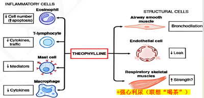
        - **1.**  **舒张支气管平滑肌**
          -  **①抑制磷酸二酯酶（PDE）** 
            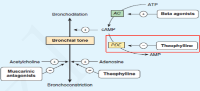
          -  **②阻断腺苷受体** 
          -  **③增加内源性儿茶酚胺释放，** 间接舒张支气管。
        - **2.抗炎**
        - **3.强心利尿**
        - **4.增加呼吸肌（膈肌）收缩力**
      - ### 2、临床应用
        - 用药注意： **氨茶碱**  **稀释后缓慢静注** 
        - **①支气管哮喘**
          > 急性静注，慢性口服
        - **②COPD**
          > COPD伴有喘息/伴有右心功能不全的心源性哮喘
        -  **③心源性哮喘** 
          > 氨茶碱 **强心、利尿、扩血管（肺动脉** ）
        - **④中枢型睡眠呼吸暂停综合征**
          > 茶碱 **兴奋中枢**
      - ### 3、不良反应
        - 治疗窗较窄
        - 胃肠道不良反应；
          > link：所有的消化系统药都有胃肠道不良反应
        - 中枢兴奋；（失眠、震颤、激动）
        - 心血管系统症状；
        - 急性中毒：常见于静注过快或剂量较大，出现心动过速、心律失常、血压骤降、谵妄、惊厥、昏迷等（低浓度缓慢注射）
    - ## **抗胆碱药（M阻断）**  Muscarinic Antagonists          {解痉挛}
      > **Ipratropium bromide 异丙托溴胺、异丙托品；Oxitropium 氧托溴胺、氧托品；Isopropyl**  <u>**scopolamine**</u>  **异丙东莨菪碱；Tiotropium 噻托溴胺、泰乌托品 (长效）；可必特气雾剂：异丙托品 + 沙丁胺醇**
      - M受体分布
        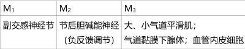
      - ### 与β2受体激动剂比较：
        - ① 抗胆碱药 **主要作用于大气道，使大气道的口径松弛** ，对小气道口径影响小；β受体激动剂对大小气道均有影响。
        - ② 起效慢，但维持时间长、剂量小、副作用少，不易耐药。
        - ③  **β2受体激动药的替代药** ：与β2受体激动剂联合使用，协同、互补
        - **④对心血管系统的作用不明显，对痰液分泌和痰液粘稠度无明显影响；对支气管平滑肌选择性较高**
      - ### 药物特点：
        -  **老年、伴有**  **迷走神经功能亢进**  **的哮喘、喘息性支气管炎** 患者尤为适用
        - 副作用：口干、咽部刺激、恶心和干咳。
        - 对阿托品类药物过敏者避免使用； **青光眼、前列腺肥大** 患者慎用
    - ## **糖皮质激素 GC**      {消炎}
      > **倍氯米松（beclomethasone）**
      - 基本作用机制：强大的 **抗炎** 作用与 **免疫抑制** 作用
      - 吸入剂型糖皮质激素已成为<mark style="background-color:#fef3c7;"> **治疗哮喘的一线药物** </mark>，主要不良反应是局部不良反应
      - ### **❖ 倍氯米松（beclomethasone）**
      - ### 1、药理作用
        -  **①抗炎 抗免疫** ：抑制多种参与哮喘发病的~细胞；抑制~因子和介质；
        -  **②抗炎之缩血管：** 增强支气管及血管平滑肌对儿茶酚胺的敏感性；
          - link GC抗炎早期——炎症早期： **增加血管紧张性；减轻充血、通透性、渗出和水肿；抑制白细胞浸润与吞噬反应；减少炎症因子释放** →减轻红、肿、热、痛
        -  **③抑制气道高反应性；** 
        -  **④ 促进上皮损伤修复、纤毛生长** 
      - ### 2、临床应用
        - 目前治疗哮喘最有效的抗炎药物（哮喘一线用药）；
        - 支气管扩张药不能有效控制的慢性哮喘患者；
        - 重度COPD；
        - ⭐气雾吸入、局部作用
          - **局部用，控制性药物（** 吸入激素：哮喘预防与持续状态治疗，维持药效）；
          - **全身用，抢救药物** （哮喘严重急性发作治疗）
            - link GC章节
              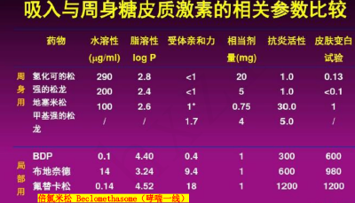
      - ### 3、不良反应：局部为主
        - **咽喉疼痛、口腔食道真菌生长、声音嘶哑**
        -  **※吸入后立即漱口** 
    - ## **色甘酸钠**  {抗过敏}
      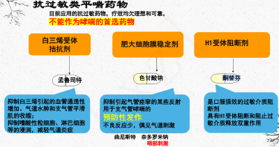
      > **炎症细胞膜稳定药；色甘酸钠（Disodium Cromoglycate）**
      - ### 药理作用
        - 没有直接扩张支气管的作用
        - 抑制肥大细胞释放炎症介质
        - 抑制支气管对非特异性刺激的高反应性
      - ### 临床应用： **预防** 外源性哮喘的发作
      - **不良反应**
        - 少数患者吸入药物后有咽喉和器官刺激症状 出现胸部紧迫感； **可能反而诱发哮喘**
    - ## **白三烯调节剂 CysLTs**  {抗过敏，消炎}
      > **半胱氨酰(Cys）白三烯（LT）受体 1 拮抗剂（CysLT1 受体阻断剂）** ：ileuton（齐留通AA861），扎 **鲁斯特（zafirlukast）、孟鲁斯特（montelukast）、普仑司特（pranlukast）**
      - CysLTs与炎症：引起支气管黏液分泌、支气管平滑肌收缩、血管通透性↑、嗜酸性粒细胞浸润
      - CysLTs对应药： **5-脂氧酶抑制剂**  &  **CysLT-1受体拮抗药**
        - 5-脂氧酶抑制剂可减少CysLTs合成，而CysLT-1受体拮抗药阻断CysLTs的上述作用
        - 5-脂氧酶抑制剂：zileuton（齐留通AA861）
        - 白三烯受体拮抗药：扎鲁斯特（zafirlukast）、孟鲁斯特（montelukase）
      - ### 扎鲁斯特（zarfirlukast）
        - 口服
        - ### 药理作用
          -  **选择性CysLT-1受体拮抗药** 
          - 抑制气管炎症及抗原诱导的迟发性支气管痉挛
        - ### 临床应用
          - 不用于急性发作
          - 轻中度慢性哮喘的 **预防** 及治疗；
          - 阿司匹林过敏性哮喘和运动性哮喘的治疗
          - 减少哮喘病人糖皮质激素及β2-R激动药的用量
        - ### 不良反应
          - 全身血管炎（Chung-Strauss 综合征）
          - 妊娠期 哺乳期妇女慎用
    - ### **重点小结（PPT）**
      - 支气管扩张药
        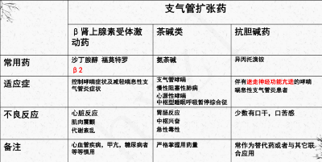
      - 抗炎平喘药
        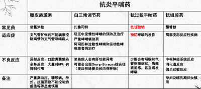
  - # 二．COPD药
    > **罗氟司特（Roflumilast）——PDE4抑制剂**
    - COPD：气流受限不完全可逆、进行性发展，与肺部对香烟烟雾等有害气体或有害颗粒的 **异常炎症反应**  **\**  **感染** 等有关
    - ## <u>**罗氟司特（Roflumilast）**</u>
      - ###  **本质：磷酸二酯酶4抑制剂，抗炎作用** 
        - 磷酸二酯酶4（PDE4）是炎症和免疫细胞中一种主要的 **cAMP代谢酶** ，因此PDE4抑制剂具有广泛的抗炎作用
      - ### **药理作用**
        -  **抑制PDE4，抗炎** 
        - 抑制炎症细胞的聚集与活化——炎症细胞主有PDE4
        - 扩张气道平滑肌，缓解气道重塑
      - ### **临床应用：COPD**
  - # 三．镇咳药
    - ##  **无痰干咳——用镇咳药** ；细菌性感染，+抗菌药物； **咳嗽+咳痰困难，用祛痰药** ，慎用镇咳药。
    - ## 分类 & 作用环节
      - 中枢性镇咳药（抑制延髓咳嗽中枢）
      - 外周性镇咳药（抑制咳嗽反射弧中除中枢外的环节）
    - ## <u>可待因、</u> 右美沙芬、喷托维林、苯丙哌林、苯佐那酯的作用与临床应用特点。
      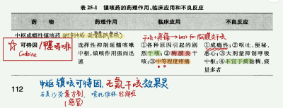
      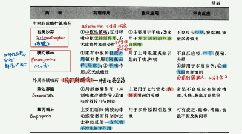
      -  **作用注意** 
        - 可待因成瘾性；
        - 哪些中枢、哪些外周（实质局麻）；
        - 喷托维林、苯丙哌林 有解痉作用
      -  **临床应用注意** 
        - 干咳
        - 镇痛-可待因
        - 复方制剂感冒-右美沙芬
        - 胸膜炎-可待因、苯丙哌林
      - *补充：咳嗽症状的处理*
        - **OTC**
          -  **感冒：右美沙芬复方制剂** 
          - 刺激性干咳或阵咳——苯丙哌林或喷托维林
          - 剧咳首选苯丙哌林，次选右美沙芬；轻咳：喷托维林
          - 咳嗽发作时间
            - 白日咳嗽：苯丙哌林（感受器）
            - 夜间咳嗽：右美沙芬（延髓、迷走）
        - **处方药**
          - 剧烈无痰咳嗽：可待因，12岁以下禁用
          - 剧咳伴随大量痰液，有阻塞呼吸道风险：司坦类粘液调节剂(羧甲司坦)或祛痰剂(氨溴索)
          - 应用镇咳药时，应注意及时采用控制感染、对抗过敏原等治疗措施(针对病因)
  - # 四．祛痰药 expectorants
    - ## 作用方式和分类——痰液变稀、易于咳出。
      - ### 痰液稀释药——增加痰液中水分含量
        - <u>**恶心性祛痰药：**</u> 氯化铵
          - 刺激胃黏膜，通过 **迷走神经反射** 促进支气管腺体分泌↑
        - <u>**刺激性祛痰药**</u>
      - ### 黏痰溶解药——调节黏液成分
        - <u>**黏痰溶解药：**</u> 乙酰半胱氨酸（痰易净）
          - 打断黏痰<mark style="background-color:#fef3c7;"> **蛋白** </mark>的二硫键；降解脓性痰液中的DNA
        - <u>**黏液调节药：**</u> 溴己新
          - 作用于黏 **多糖** ：裂解、抑制合成；祛痰（支气管分泌↑）、促进痰液排出
    - ## <u>氯化铵、</u> 乙酰半胱氨酸、溴己新的作用特点与应用。
      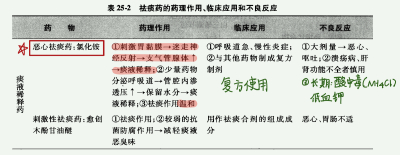
      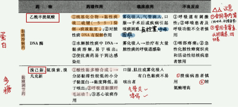
      - 记key feature：氯化铵~酸性刺激；Cys~打断二硫键；溴己新硬背粘多糖
- # **消化系统（2）**
  > 记求不到
  - # <u>**一．抗消化性溃疡药**</u>
    - ## 分类及药理机制：抗酸药+抑酸药；胃粘膜屏障保护药；抗幽门螺杆菌药
      - 抗酸药（弱碱性药）
      - 抑制胃酸分泌药——H₂受体阻断药；质子泵抑制药 (PPI) ；抗胆碱（M受体阻断）药；胃泌素受体阻断药
    - ## 1．抗酸药（弱碱性药）
      - ### （1）特点：①口服、中和、胃蛋白酶↓；②短时，合用；③部分具有胶体特性；④并非首选
        - 口服；直接在胃内中和胃酸；升高胃 pH—→降低胃蛋白酶活性：pH=4 时胃蛋白酶失活；减轻胃蛋白对胃黏膜的侵袭作用
        - 作用时间短，大多合用（复方制剂），增强疗效，减少不良反应。
          - 胃舒平（氢氧化铝、三硅酸镁、颠茄流浸膏）
          - 三硅酸镁复方制剂（氢氧化铝、三硅酸镁、海藻酸）
        - **氢氧化铝、三硅酸镁** 可以覆盖于胃黏膜形成 **胶状保护层，** 防止胃酸再侵袭
        - 抗酸药仅仅直接中和胃酸，并不能调节胃酸的分泌，甚至可造成反跳性胃酸分泌增加，因此 **非首选药物** 
      - ### **（2）各药对比**
        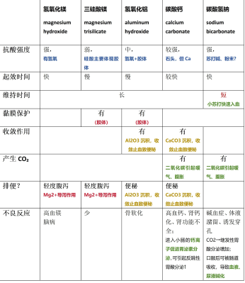
    - ## <u>**2. H2 受体阻断药**</u> （~替丁 tidine）
      > **西咪替丁(Cimetidine)，雷尼替丁(Ranitidine)，法莫替丁(famotidine)**
      - ### 生理基础
        -  **肠嗜铬样细胞** 释放 **组胺—** →激动壁细胞基底侧膜上的 **H2-R** →H+-K+-ATPase活性↑，泌酸↑
      - ### 药理作用、临床应用、不良反应
        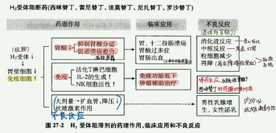
      - ###  **注意** 
        - <mark style="background-color:#fef3c7;"> **胃、十二指肠溃疡（首选药物）** </mark>
        - 药理作用记得有个免疫（+）
        - 不良反应较少，容易忘记：血液系统（粒细胞减少、再生障碍性贫血）；抗雄激素作用；停药反应
    - ## <u>**3．壁细胞 H+泵抑制药（Proton Pump Inhibitor, PPI）**</u> （~拉唑 prazole）
      > **omeprazole (**  *Prilosec*   **奥美拉唑, 洛赛克)，rabeprazole (**  *Aciphex*  **雷贝拉唑 )，lansoprazole (**  *Prevacid*  **兰索拉唑 )，Pantoprazole**  ( *Protonix*   **潘多拉唑** )， **esomeprazole (**  *Nexium*  **埃索美拉唑）**
      - ### 作用特点
        - H+-K+-ATPase是 **胃酸分泌的最后环节** ，故对各种因素引起的胃酸分泌均有抑制作用；
        - 作用强大而持久；
        - <mark style="background-color:#fef3c7;"> **兼具抗消化性溃疡的三方面功能：** </mark>除了抑制胃酸，还使胃蛋白酶产生减少，对胃黏膜有保护作用；还可抑制幽门螺杆菌。
      - ## <u>**抗溃疡作用、机制、临床应用**</u>
        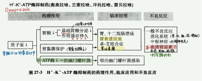
      - ###  **注意** 
        - <mark style="background-color:#fef3c7;"> **根治幽门螺旋杆菌感染** </mark>
        - 用于消化性溃疡，对 **NSAIDs、乙醇、应激** 所致的胃黏膜损伤有预防保护作用
        - 不良反应易忘： **血清胃泌素 ↑** 
          > 动物实验提示上消化道肿瘤发生率增加。
        - PPI vs H2RA
          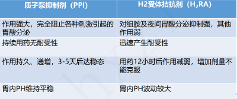
    - ## **4．** M受体阻断药：哌仑西平  **5．** 胃泌素受体阻断药：丙谷胺
      > **哌仑西平（Pirenzepine） & 丙谷胺（Proglumide）**
      - ### 作用特点
        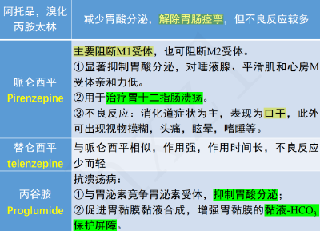
        - **哌仑西平**
          - <mark style="background-color:#fef3c7;"> **选择性 M1 受体阻断药** </mark> **，** 弱M2阻断
          - 显著抑制胃酸分泌，缓解症状，治疗胃、十二指肠溃疡；
          - 不良反应以消化道症状为主，口干。还可能：视物模糊、头痛、眩晕、嗜睡等
        - *其它M阻断药：阿托品、溴化丙胺*
          - - 阻断胃壁细胞上的M受体，抑制胃酸分泌；
          - - 阻断胃黏膜嗜铬细胞上的M受体，减少组胺的释放；
          - - 阻断胃窦G细胞上的M受体，减少胃泌素的释放，间接减少胃酸的分泌。
          - 此外，M受体阻断药还有 **解痉作用** 
        - **丙谷胺**
          - 抑制胃酸分泌——竞争胃泌素受体
          - 增强胃黏膜屏障——促进胃黏膜粘液合成
    - ## 6．粘膜保护药：前列腺素衍生物、硫糖铝、 <u>**枸橼酸铋钾的作用及应用。**</u>
      > **前列腺素类（Prosglands）：米索前列醇（misoprostol）、恩前列素（enprostil）；硫糖铝（Sucralfate）；枸橼酸铋钾（Bismuth potassium citrite）**
      - ### 生理基础
        > **①共有；②~④后两种（硫糖铝、枸橼酸铋钾）**
        - **① 类似前列腺素 or 促进前列腺素分泌：** 前列腺素 PGE1、PGE2 可以 **降低AC和cAMP** ，抑制胃酸、胃蛋白酶分泌，促进粘液、碳酸氢根分泌。 **预防NSAIDS引起的溃疡** 
        - ②具有黏附/沉淀的物化性质：形成保护屏障
        - ③具有吸附的物化性质：结合胃蛋白酶，使其↓
        - ④ 抗幽门螺旋杆菌
      - ### **应用**
        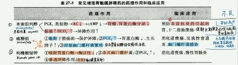
    - ## 7．抗幽门螺旋杆菌药
      - ### 根除幽门螺旋杆菌： **四联疗法（PPI、铋、抗生素 组合）** 
        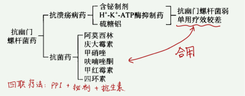
        - **含铋**
          - 经典：PPI+铋剂+ **四环素+甲硝唑**
          - 其它：PPI+铋剂+另外两种抗生素
        - **不含铋**
          - 经典：PPI **+克拉霉素+阿莫西林+甲硝唑**
          - 其它：PPI+另外三种抗生素
  - # 二．消化功能调节药
    - ## *促动力药（大纲无，ppt有）——针对GERD*
      > **甲氧氯普胺（metoclopramide）、多潘立酮（domperidone）、西沙比利（Cisapride）**
      - ### **GERD：** 胃内容物反流导致， **不是酸相关** 疾病，而是 **动力相关疾病** 
      - ### **作用原理**
        - ①胆碱酯酶抑制：迷走神经促胃肠运动
        - ②多巴胺受体抑制：中枢止吐，胃肠促动
        - ③ENS肌间神经丛 5-HT受体激动：5-HT4受体促胃肠运动
        - 原理示意图
      - ### **三大常见促动力药**
        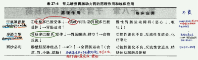
        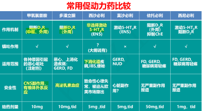
    - ## 助消化药
      > **Pepsin 胃蛋白酶，Pancreatin 胰酶，Lactasin 乳酶生，干酵母 yeast，卡尼汀，Chinese medicine**
      - ### **消化液成分 、促进消化液分泌药、维生素B（食欲）**
        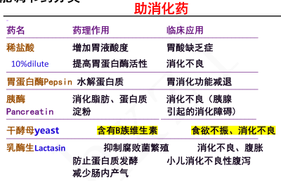
      - ### *消化不良治疗思路（PPT）*
        - **药物治疗**
          - –  **器质性消化系统慢性病引起的消化不良**
            - 改善生活习惯，治疗原发疾病
          - –  **OTC**
            - 食欲减退：VitB1、VitB6或干酵母片；
            - 消化酶不足：胰酶片、多酶片；
            - 偶然性消化不良或进食蛋白食物过多者：乳酶生、胃蛋白酶合剂；
            - 消胀气药：二甲硅油制剂；
            - 中度功能性消化不良或餐后上腹痛、嗳气、恶心、呕吐者：多潘立酮(吗丁啉)?……
        - –  **处方药**
          - •  **精神因素** 引起的消化不良： *地西泮*  *,等*
          - •  **功能性** 消化不良伴反酸： *莫沙比利、依托比利* 等（促胃动力药物）
          - • 胆汁分泌不足者： *复方阿嗪米特肠溶片*
          - • 慢性胃炎、胃 **溃疡** 、十二指肠溃疡： *抑酸药与胃粘膜保护剂，根除HP治疗*  *等*
    - ## 止吐药（ **Antiemetic）**
      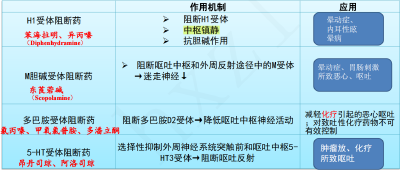
      - ###  **记忆思路——呕吐反射** 
        - ### 中枢：呕吐中枢、延髓催吐化学感受区（CTZ）——多巴胺受体、H1受体
        - ### 外周：ENS（胃肠运动）、迷走——多巴胺受体、5-HT受体、M受体
        - ### 应用场景：晕动症；放化疗
      - ## 1．5-HT3受体阻断药： **昂丹司琼（ondansetron）**
        > **放化疗呕吐**
        - 机制:选择性阻断中枢及迷走神经的 5-HT3 受体，阻断呕吐反射
        - ### 应用
          - 对 **晕动症无效** ，用于 **肿瘤放化疗引起的呕吐** 
            - **对强致吐性化疗药物** （顺铂 环磷酰胺 多柔比星）的呕吐抑制 **作用强**
        - 不良:长期使用， **静坐不能、急性肌张力障碍**
      - ## 2．多巴胺受体阻断剂：甲氧氯普安、 <u>**多潘立酮**</u> 、 ~~*西沙必利*~~ 、氯丙嗪
        > **放化疗呕吐（但不能有效控制）**
        - 三大常见促动力药
    - ## 泻药
      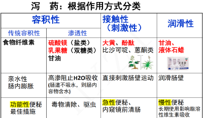
      > **①容积性** ：扩张肠内容物容积、改变渗透压，进而刺激胃肠蠕动； **②接触性：** 直接急性刺激肠动； **③润滑性：** 慢性润滑。
      - ###  **巧记** 
        - ### 盐离子&糖类~渗透性、不好吸收；
        - ### 化学、中药~刺激性；
        - ### 甘油、石蜡（物理）~润滑
      - **硫酸镁：** 硫酸根和镁离子在肠道难以被吸收，使肠内容物渗透压↑，抑制水分的吸收，增加肠腔容积、扩张肠道、刺激肠道蠕动。
        - 用于外科术前/结肠镜检查前排空内容物；辅助排出一些肠道寄生虫或肠内毒物
      - **乳果糖：** 口服不吸收；到结肠被细菌分解成乳酸，刺激结肠局部渗出；还可以抑制对氨的吸收，降低血氨；
      - **甘油：** 轻度刺激性导泻；润滑
      - **酚酞：** 刺激肠壁，抑制水分重吸收；
      - **液体石蜡：** 润滑肠壁、软化大便。
      - 便秘治疗：①泻药；②促动力药；③微生态制剂
    - ## 止泻药
      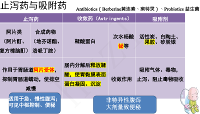
      - ### **吸附剂** （气体、毒物）
      - ### **收敛剂** （在肠黏膜表面成膜）
      - ### **抗动力剂** （阿片制剂 / 地芬诺酯/洛哌丁胺）
        - **常用：Diphenoxylate(地芬诺酯), loperamide (洛哌丁胺)**
          - -两者都是哌替啶衍生物
          - - **激活突触前阿片受体，抑制乙酰胆碱释放** 
        - **阿片类：** 易成瘾，少用。用于较严重的非细菌感染性腹泻，激动μ阿片受体，减少胃肠推进性蠕动，发挥止泻作用；
        - **抗胆碱药** ：不良反应多
    - ## 利胆药
      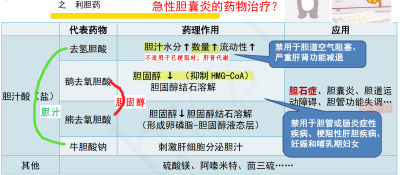
      > **“两头促胆汁，中间抑固醇”。** 此外还有茴三硫、硫酸镁。
- # **肾上腺皮质激素（3）**
  > **可的松（Cortisone）、氢化可的松(Hydrocortisone)、地塞米松（Dexametinasone）、倍他米松（Betamethasone）、泼尼松（prednisone）、泼尼松龙（prednisonelone）**
  - # 一、肾上腺皮质激素：分类；构效关系；体内过程（熟悉）
    - 肾上腺皮质从外向内： **球状带（** 盐皮质激素 **）—束状带** （糖皮质激素）— **网状带** （性激素）
      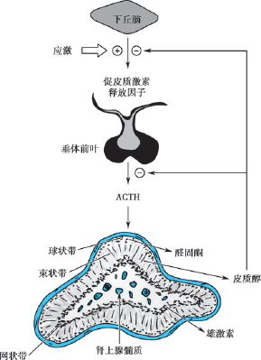
    -  **自然GC** ： **可的松（cortisone）、氢化可的松（hydrocortisone）**
    - **构效关系（甾核）**
      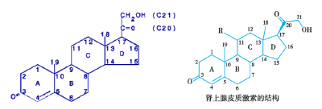
      - 基本结构： **甾核（21碳 4环）**
      - <u>天然与合成激素的结构差异与功能增强</u>
        - <u>天然激素</u> ：如氢化可的松，第1、2位碳原子之间为单键。
        - <u>人工合成激素</u> ：C1–2、C4–5不饱和双键。
          - <u>不饱和双键</u> 减少加氢还原灭活反应，使激素在体内作用更强，药效更显著。
      - <u>糖皮质激素的特征基团</u>
        - <u>D环C17上的</u>  <u>α-羟基</u>  <u>：</u> 糖代谢、抗炎作用。
        - <u>C环C11的</u>  <u>氧或羟基</u>  <u>：</u> 抗炎作用强、水盐代谢弱。
      - <u>盐皮质激素的特征基团</u>
        -  <u>C17无α-羟基</u> 是盐皮质激素的关键结构差异。
        - <u>C11位置的氧变化：</u>
          - 去氧皮质酮：C11无氧。
          - 醛固酮：C11有氧且与18位碳结合。
        - 这些结构使盐皮质激素具有强烈的 <u>水盐代谢作用</u> ，但对糖代谢影响较小。
    - 盐皮质 vs 糖皮质
      - 结构差别：主要的差异在 C-11 位和C- 17 位
        - 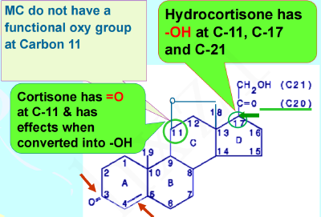
      - 盐皮质激素：对 **水盐代谢** 较强，对糖代谢很弱
      - 糖皮质激素： **对糖代谢和**  **抗炎** 较强，对水盐代谢作用较弱
    - 常用糖皮质激素类药化学结构特点
      - 可的松（Cortisone）。氢化可的松(Hydrocortisone)、强的松/泼尼松(Prednisone)、强的松龙/泼尼松龙（Prednisolone）、地塞米松（Dexametinasone）、倍他米松（Betamethasone）
      - **双键的引入：** 1-2 位 C 之间改成不饱和双键—— **泼尼松、泼尼松龙** （氢化泼尼松） ，抗炎和糖代谢作用增强 4-5 倍
        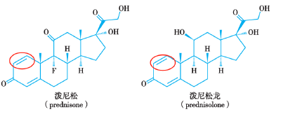
      - **氟的引入：** 提高抗炎和水钠潴留能力 **（氟轻松）**
        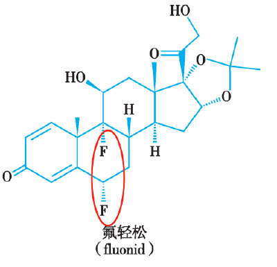
      - **甲基的引入：** 抗炎作用增强 体内分解延缓（ **甲泼尼龙 倍他米松 地塞米松** ）
      - **羟基的引入：** 抗炎作用加强而水钠潴留无变化 **（曲安西龙）**
    - ## <u>体内过程</u>
      - ### **吸收**  **良好** 
        - 口服、注射、皮肤、眼结膜均可。 可的松和氢化可的松吸收快且完全，1~2h内达峰，一次用药持续8~12h；
      - ### **分布：考虑**  **CBG——皮质激素运载蛋白** 
        - 10%游离（有生物活性）；90%与血浆蛋白结合（其中80%与 **皮质激素运载蛋白CBG** 结合。10%白蛋白。）；
          - **CBG：肝合成** ——肝肾病患者减少GC用量；
          - **雌激素、甲亢 增加 CBG ：** 怀孕、用雌激素、甲亢时，CBG↑，游离糖皮质激素减少。
          - **甲减、低蛋白血症、肝肾疾病减少CBG：** 游离糖皮质激素增多
      - ### **代谢** ：肝脏。 **考虑**  **（氢化）可的松、泼尼松（龙）、肝药酶诱导剂** 
        - **可的松、泼尼松** 需要在肝内转化为 **氢化** 可的松、泼尼松 **龙，才有活性** 
        - 肝肾功能不全时 **不用** 可的松、泼尼松
        - 合用 **肝药酶诱导剂（苯巴比妥、苯妥英钠、利福平）** 时， **增加用量**
        - 甲亢时酶活性↑且CBG↑，肝灭活皮质激素加速， **增加用量**
      - ### 排泄
        - 90%以上在48小时内出现于尿中，尿中代谢产物17-羟皮质素、17-羟酮皮质素可反映肾上腺-垂体功能
        -  **根据作用时间长短，CG可分为：短效（＜12h）；中效（12~36h）；长效（＞36h）。注意地塞米松最强！！！** 
          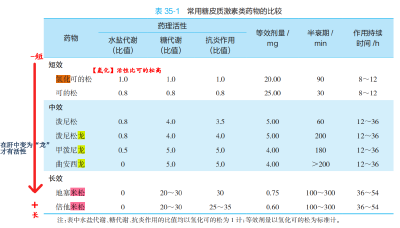
  - # <u>**二、糖皮质激素作用：五代谢，三抗，三系统，骨退热**</u>
    > **神奇的GC。代谢上体现为应激，三抗上体现为“舒适”，兴奋中枢但退热，促进分解消化骨质疏松。**
    - ## <u>**五代谢**</u>  <u>*（& 允许作用）*</u> 
      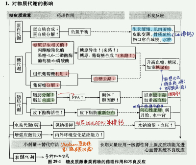
      - ###  **增强应激能力** 
      - ### **1.糖代谢——升高血糖**
        - 机制：促进糖原异生酶，减少组织葡萄糖利用，减少葡萄糖分解——血糖合成↑ 去路↓
        - 不良：诱发、加重 **糖尿病** 
      - ### **2.蛋白质代谢——分解蛋白**
        - 合成↓，分解↑，负氮平衡
        - 不良：长期用药引起肌肉消瘦、骨质疏松、皮肤变薄、伤口愈合延缓、成长缓慢、淋巴组织萎缩等
      - ### **3.脂肪代谢——分解（FFA↑）、重分布（向心肥）**
        -  **皮下脂酶活性** 增加，皮下脂肪分解
        - 游离 **FFA↑** —→ 酮体、血浆胆固醇↑—→加重酸中毒、高血脂
        - 脂肪 **重新分布** （胰岛素分泌++，促进脂肪堆积→四肢不敏感，面、背部敏感）——向心性肥胖（面圆、背厚、躯干部发胖而四肢消瘦）
      - ### **4.水盐代谢（弱）——低钾 水钠潴留 碱中毒**
        - 保钠排钾：弱的盐皮质激素作用
        - 水钠潴留，血压↑
        - **利尿作用：**  拮抗ADH 减少水重吸收
        - **促进尿钙排泄：** 抑制肾小管对钙的重吸收，长期用药骨质脱钙。
      - ### **5.核酸代谢——影响三大物质代谢的基础**
        - 诱导合成多种RNA，总体合成代谢抑制、分解代谢增强
      - ###  **6.**  **※**  **允许作用** 
        - 对某些组织细胞无直接作用，但可 **给其他激素发挥作用创造有利条件** 
        - **增强**  **儿茶酚胺的缩血管**  **作用、**  **胰高血糖素**  **的升血糖作用**
    - ## <u>**三抗（及作用原理）**</u>
      > **抗炎、抗免**  *（过敏）*  **、抗休克**  *（内毒）*
      - ### **1.抗炎作用**
        
        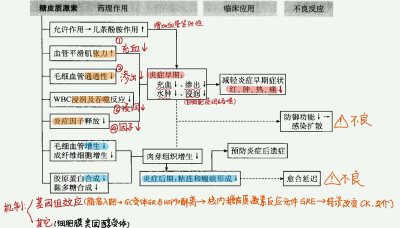
        - 特点：强大、非特异性、炎症各个阶段、降低防御
          - 炎症早期： **增加血管紧张性；减轻充血、通透性、渗出和水肿；抑制白细胞浸润与吞噬反应；减少炎症因子释放** →减轻红、肿、热、痛
          - 炎症后期：抑制毛细血管和成纤维细胞的增生， **防止粘连和瘢痕**
          - 注意：抗炎同时降低了机体的防御功能—→防御功能↓、组织修复↓——感染扩散 阻碍创面愈合
        -  **※机制：**  **基因组效应（基本机制）** 、非基因组机制
          - 作为脂溶性分子进入细胞，结合胞浆内的 **GC受体（GR），** 与热休克蛋白HSP90分离，GCs-GR复合体进入细胞核；
          - GCs-GR与靶基因 **启动子序列** 的 **糖皮质激素反应元件（GRE）** 结合；
          - **转录增加或减少——改变炎性介质和细胞因子水平——抗炎**
            - *对炎症抑制蛋白及某些靶酶的影响：脂皮素-1↑；抑制PLA2（PG、白三烯↓）；抑制iNOS、COX-2的表达；*
            - *对细胞因子及黏附因子的影响：促炎因子↓（TNF-α↓、IL-1↓、IL-6↓）；ICAM↓；*
            - *诱导炎症细胞凋亡*
            - *抑制成纤维细胞DNA的合成*
          - 其它——非基因快速效应（与细胞膜类固醇受体结合）
            - *稳定溶酶体膜和肥大细胞膜；*
            - *增强血管对儿茶酚胺的敏感性*
      - ### **2.免疫抑制与抗过敏作用**
        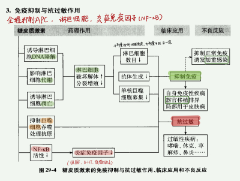
        - 免疫抑制
          - 小剂量时抑制细胞免疫
          - 抑制体液免疫：大剂量时干扰 B 细胞转变为浆细胞
          - 抑制免疫反应全过程：抑制巨噬细胞抗原呈递、淋巴细胞增殖（促进淋巴细胞凋亡、抑制淋巴细胞 DNA 复制）、抗体产生
        - 抗过敏：GCs抑制过敏介质的产生（减少组胺、5-HT、缓激肽）；能抑制器官移植排异反应。
      - ### **3.抗毒、抗休克作用**
        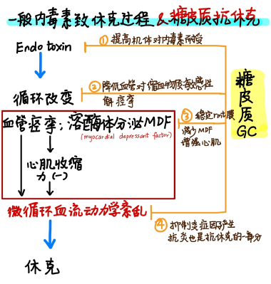
        - **① 提高机体对细菌内毒素的耐受力**
          - 减少内源性致热源的释放、抑制下丘脑体温调节中枢的反应性
          - 不能中和内毒素；
          - 不能保护机体免受外毒素的损害。
        - **②**  稳定溶酶体膜，减少 **心肌抑制因子（MDF）形成，** 加强心肌收缩力
        - **③**  扩张痉挛收缩的血管，降低对缩血管物质的敏感性
        - **④**  抗炎：抑制某些炎症因子的产生，改善微循环血流动力学障碍
    - ## <u>**其它：血液、中枢、消化、骨骼、退热**</u>
      - ### **1.血液与造血系统**
        - “ **三升一降”**  **——** 红细胞和血红蛋白↑、血小板↑、中性粒细胞↑（功能↓），淋巴细胞↓
          - **增加：红细胞 白细胞 血小板** 多核细胞 **血红蛋白**  纤维蛋白原
          -  **减少：淋巴细胞**  单核细胞 嗜酸性&嗜碱性粒细胞
          -  **中性粒细胞双重作用：** 刺激骨髓的中性粒细胞释放入血 但 **降低中性粒细胞的功能**
      - ### **2.中枢神经系统——兴奋**
        - 精神失常、癫痫、儿童惊厥
      - ### **3.消化系统——酸酶 ↑ 黏液↓**
        - 胃酸、胃蛋白酶↑
        - 胃黏液分泌↓，诱发溃疡
      - ### **4.骨骼——**  **骨质疏松** <mark style="background-color:#fef3c7;"> **（停药指征）** </mark>
        - 长期大剂量使用
        - 抑制成骨细胞活力，减少骨中胶原的合成，促进胶原和骨基质的分解，使骨质形成发生障碍
      - ### **5.退热作用**
        - 用于严重的中毒性感染，有 **迅速而良好的退热作用**
  - # <u>三、临床应用</u>
    > **替代疗法、严重感染或炎症、自身免疫性疾病及过敏性疾病、抗休克治疗、血液病、局部应用**
    - ###  **{代谢}——替代疗法**  **、晚期肿瘤：** <mark style="background-color:#fef3c7;">原发性肾上腺皮质功能减退症（Addison’s disease）</mark>； **恶性肿瘤** 晚期控制
    - ###  **{抗炎}**  **——严重感染、炎症、纤维增生**
      - 用于中毒性感染或同时伴有休克。 <mark style="background-color:#fef3c7;"> **病毒性感染不宜用激素！** </mark> **（** 降低机体防御能力 加速扩散 但可用于严重的乙脑 腮腺炎 喉炎 麻疹 **）**
      - 小剂量用于结核病的急性期，减少愈合过程中纤维增生和粘连
      - 眼科：防止角膜浑浊和瘢痕黏连的产生
    - ###  **{抗免疫 抗过敏}—**  **—自免，器官移植，过敏**
      - **自身免疫性疾病：** <mark style="background-color:#fef3c7;"> **多发性皮肌炎（polymosititis）** </mark><mark style="background-color:#fef3c7;">首选用药；</mark>在风湿性及类风湿性关节炎中与 NSAID 联用； **按照皮质激素分泌的节律性给药** 
      - **器官移植排斥反应：** 可以抑制免疫性排斥反应
      - **过敏性疾病：** 用于严重的过敏性疾病<mark style="background-color:#fef3c7;">（</mark><mark style="background-color:#fef3c7;"> **倍氯米松用于过敏性哮喘** </mark><mark style="background-color:#fef3c7;">）</mark>
    - ###  **{抗休克}**  **——脓毒性休克、辅助治疗其它休克**
      > 静脉早期大剂量注射治疗
    - ###  **{血液病}** 
      > 急性淋巴细胞白血病 **（注意！对急性非淋巴细胞白血病效果不好）** 粒细胞减少 再生障碍性贫血  **血小板减少性紫癜**
    - ###  **局部应用** 
      > 皮肤：湿疹 接触性皮炎（eczema） 银屑病（psoriasis）
      > 眼：结膜炎，虹膜炎
  - # <u>四、不良反应、</u>  <u>**禁忌症**</u> 
    > 禁忌症是重点；注意一般和抗菌抗感染药物合用。用后炎症、感染易扩散。
    - ## **1、停药反应**
      > 记住有哪些就可以了，不用点开看细节
      - ### **（1）药源性肾上腺皮质功能不全**
        - 长期应用GCs，反馈性抑制下丘脑-垂体-肾上腺皮质轴→ **ACTH分泌↓** →肾上腺皮质功能↓
        - 恢复时间长： ~~*停用激素后垂体分泌 ACTH 功能需要 3-5 月恢复；肾上腺素皮质对 ACTH 起反应需要更久*~~
        - 处理：缓慢减量，隔日给药，停药数月后遇应急情况，要给予足量的GC
      - ### （2） **反跳现象** ——突然停药或减量过快时原有疾病复发或恶化
        - 处理：先缓解症状（加大剂量再治疗），再缓慢减量
      - ### （3） 糖皮质激素抵抗——大剂量疗效差
    - ## **2、长期大量应用**
      > 我没展开的就不用点开看了
      - ### （1）{代谢}   **类肾上腺皮质功能亢进综合征** <mark style="background-color:#fef3c7;"> **（库欣 Cushing syndrome** </mark><mark style="background-color:#fef3c7;">）</mark>
        - 表现：糖、蛋白质、脂肪、水盐代谢紊乱，类似肾上腺皮质功能亢进综合征
        - 治疗：一般不作特殊治疗，必要时加用抗高血压药、抗糖尿病药，采用低盐、低糖、高蛋白饮食，补钾
      - ### （2）{代谢}    **糖尿病；骨质疏松、肌肉萎缩、伤口愈合延迟**
      - ### **（3）**  {抗炎、抗免疫}     **诱发和加重感染**
        - 抑制免疫功能→体内潜在感染灶扩散，静止病灶复染。 **结核病人必须合用抗结核药** 
        - 无有效药物控制的感染需慎用
      - ### **（4）** {三系统}   **消化、心血管、中枢系统并发症**
        - 诱发、加重溃疡病  **※溃疡患者禁用** 
        -  **水钠潴留（高血压）** 、血脂升高（动脉粥样硬化）
        - 失眠、幻觉甚至精神失常、癫痫
      - ### <mark style="background-color:#fef3c7;"> **（5）糖皮质激素型青光眼（GIG）** </mark>
      - ### （6）妊娠禁用
        - 增加胎盘功能不全、新生儿体重减少或死胎发生率
    - ## **3、 禁忌证**
      - **肾上腺皮质功能亢进** 禁用
      - 严重糖尿病、高血压
      - **孕妇** 禁用
      - 抗菌药物不能控制的感染 **：水痘、带状疱疹、真菌感染** 禁用
      - **严重精神病 癫痫** 禁用
      - **活动性消化溃疡，新近胃肠吻合术；角膜溃疡** 禁用
      - **骨折、创伤恢复期** 禁用；儿童、绝经期妇女使用后易导致 **骨质疏松、自发性骨折**
      - 药物互作：糖皮质激素加快 **水杨酸盐的消除**  降低 **口服抗凝血药作用**
  - # <u>疗程和用法（了解）</u>
    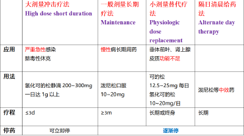
    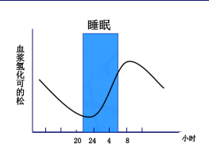
  - ## 复习思考题
    - ➢  **Glucocorticois的生理作用与其临床应用时的不良反应有何关联？这些不良反应可否避免？**
    - ➢  **在glucocorticoid众多的药理作用中，哪些是临床应用中最重要的？为什么？**
    - ➢  **目前对glucocorticoid的抗炎作用机制的认识有哪些？这些作用机制对其临床应用有何影响？**
  - ## PPT题目
    - 1. 儿科:变应性鼻炎（即过敏性鼻炎）—— **泼尼松片？×！抗组胺√** 
    - 2. 儿科:急性化脓性扁桃体炎——地塞米松磷酸钠注射液5mg，静推，st
      -  **化脓性×。** 无指征使用糖皮质激素。 **不建议仅以退热为目的使用糖皮质激素。**
    - 3. 男，71岁，下肢浮肿，胸闷、气急，诊断为慢性心功能不全
      - 地高辛片 √，金三角新四联强心
      - 氢氯噻嗪片  √，水肿
      -  **泼尼松片**   **×！加剧缺钾，水钠潴留** 
    - 4.Of the following mechanisms of anti-inflammatory and immunosuppressive effects of glucocorticoids, which one is uniformly observed?
      - a. Increased influx of leukocytes to the site of inflammation
      - b. Reduced formation of lipocortins
      - <mark style="background-color:#fef3c7;">c. Reduced capillary permeability and edema at the inflammatory site</mark>
      - d. Increased prostaglandin formation
      - e. Enhanced formation of interleukins (IL-1,IL-2)
    - 5. Glucocorticoids are powerful anti-inflammatory agents. Which of the following is not an anti- inflammatory mechanism of action of glucocorticoids?
      - a. lncreased the production of lipocortin, which inhibits the enzyme phospholipase A2
      - b. Reduction in the release of cytokines, such as IL-1 and IL-6
      - <mark style="background-color:#fef3c7;">c. Decreased number of circulating neutrophils</mark>
      - d. Impairment of prostaglandin and leukotriene synthesis
    - 6.Of the following, which is always not associated with the abuse of anabolic steroids by athletes?
      - a. Retention of fluid
      - b. Feminization in males
      - c. Decreased spermatogenesis
      - d. Depression
      - <mark style="background-color:#fef3c7;">e. Anorexia</mark>—— **增强代谢** 
    - 7. A 27-year-old female is diagnosed with hypercortisolism. To determine whether cortisol production is independent of the pituitary gland, you decide to suppress ACTH production by giving a  **high-potency glucocorticoid** . Which glucocorticoid is the best for this indication?
      - a. Triamcinolone
      - b. Prednisone
      - c. Hydrocortisone
      - <mark style="background-color:#fef3c7;">d. Dexamethasone</mark> **（最强）** 
      - e. Methylprednisolone
    - 8. 下面哪项不是糖皮质激素抗炎作用的机制
      - A.影响花生四烯酸代谢的连锁反应
      - B.抑制一氧化氮合酶和环氧化酶-2的表达
      - C.抑制炎性细胞因子的表达
      -  **D.增加肝、肌糖原含量** 
      - E.非基因快速效应
    - 9. 可用糖皮质激素治疗的是:
      - A.严重哮喘伴有高血压
      - B.水痘病毒感染
      - C.精神病人服用苯巴比妥引起的过敏性皮炎
      -  **D.急性淋巴细胞性白血病** 
      - E.带状疱疹
    - 10.下面哪项不是糖皮质激素的药理作用
      - A.抗炎作用
      - B.免疫抑制
      - C.抗过敏
      -  **D.降血脂** 
      - E.抗休克
    - 11. 下面哪项不是糖皮质激素抗休克作用的机制
      - A.抑制某些炎症因子的产生
      - B.稳定溶酶体膜，减少心肌抑制因子的形成
      - C.降低血管对某些缩血管活性物质的敏感性
      - D.提高机体对细菌内毒素的耐受力
      -  **E.降低心脏收缩力，缓解心肌缺血状态** 
    - 12.经<mark style="background-color:#fef3c7;">体内转化后才具有药理活性</mark>的糖皮质激素是:
      -  **A.泼尼松** 
      - B.氢化可的松
      - C.地塞米松
      - D.倍他米松
      - E.氟轻松
    - 13. 长期用糖皮质激素，突然停药产生反跳现象的原因:
      - A.ACTH 分泌增多
      - B.甲状腺功能亢进
      - C.肾上腺功能亢进
      -  **D.患者对激素产生了依赖性或病情尚未完全控制** 
      - E.患者对激素产生了成瘾性
- # **胰岛素及口服降血糖药（2  自学）**
  - 降血糖药概述
    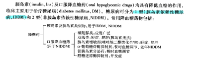
    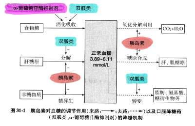
  - <u>胰岛素</u> 及其类似物的作用原理、临床应用和应用注意。
    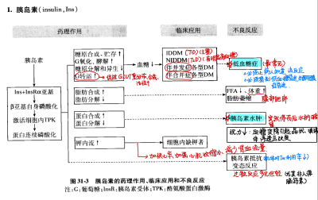
    - **人胰岛素类似物**
      - **速效胰岛素类似物**
        - 可以迅速起效，快速恢复；与人类似；药物吸收稳定
        -  **门冬**  **胰岛素（insulin aspart）、**  **赖脯**  **胰岛素（insulin lispro）**
      - **超长效胰岛素类似物**
        - 作用时间更长，与速效胰岛素类似物联用可更好模拟生理过程
        -  **甘精**  **胰岛素（insulin glargine）、**  **地特**  **胰岛素（insulin detemir）**
  - 口服降糖药：仅用于控制  **II 型** 糖尿病的 **早期**
    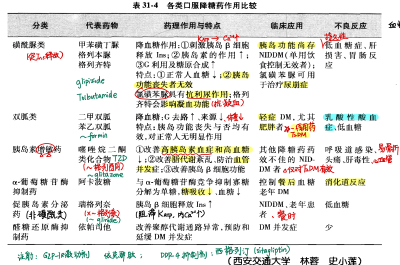
    - <u>分类、机制及特点</u>
      - <u>**双胍类（Biguanides）**</u>
        > 二甲双胍（met **formin** ） 苯乙双胍（phen **formin）**
        - **二甲双胍（metformin） 苯乙双胍（phenformin）**
        - <mark style="background-color:#fef3c7;"> **T2DM 患者控制血糖的一线用药与基础用药** </mark>
          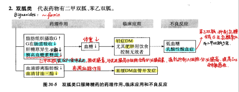
        - 体内过程稳定，口服，不与血浆蛋白结合，不代谢，原形尿中排出
      - **磺酰脲类（Sulfonylureas）** ：格列吡嗪等
        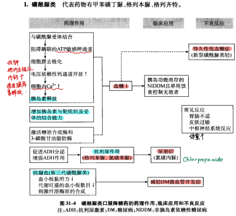
        > Tolbutamide甲苯磺丁脲，Chlorpropamide氯磺丙脲，Glyburide (glibenclamide, 格列本脲, 优降糖)，Glipizide (格列吡嗪)，Glimepiride (格列美脲)，Gliclazide (格列齐特, 达美康)
        - **Tolbutamide甲苯磺丁脲，Chlorpropamide氯磺丙脲，Glyburide (glibenclamide, 格列本脲, 优降糖)，Glipizide (格列吡嗪)，Glimepiride (格列美脲)，Gliclazide (格列齐特, 达美康)**
        - T2DM 患者的主要用药之一
        - **药理机制**
          - 刺激胰岛 B 细胞 **释放胰岛素** 
          - 增加胰岛素与受体的结合能力；增加胰岛细胞对葡萄糖敏感性
          - Ins效应：促进葡萄糖利用、糖原和脂肪合成
          -  **抗利尿作用** ：促进ADH分泌并加强ADH作用
          - 第三代磺酰脲类可 **抗凝血** ：减轻糖尿病微血管并发症
        - **特点**
          - **仅对正常人、胰岛功能尚存的糖尿病患者有降血糖作用**
          - 对 T1DM、严重T2DM无效
          - 可引起 **持久性** 低血糖
          - 抗利尿作用：尿崩症 **（氯磺丙脲）** 
      - **格列奈类（Glinide）——非磺酰胺类**  **促胰岛素分泌**  **剂，**  **餐时**  **血糖调节剂**
        > Repaglinide 瑞格列奈 & Nateglinide 那格列奈
        - Repaglinide 瑞格列奈 & Nateglinide 那格列奈
        - **作用快、** 可以模仿胰岛素的生理性分泌
        - 控制餐后高血糖的 **餐时血糖调节剂** 
        -  **高血浆蛋白结合率** 
        - 可用于饮食与体育锻炼难以控制的 T2DM 患者；对夜间或空腹血糖水平的影响最小
        - 不良反应轻，低血糖
      - **噻唑烷酮类（Thiazolideinediones, TZD）** ：吡格列酮
        > **Rosiglitazone罗格列酮。Pioglitazone吡格列酮。Ciglitazone环格列酮，Englitazone恩格列酮**
        -  **胰岛素增敏剂** 
        - **作用机制**
          - 增强靶组织对胰岛素的敏感性，减轻胰岛素抵抗
          - **改善脂质代谢紊乱**
          - 减轻 **血管并发症（内皮；血小板；炎症）**
        - **临床应用：** 胰岛素抵抗 T2DM
          - 仅在胰岛素存在时有效， **对T1DM无效** 
        - **不良反应**
          -  **易骨折** 
          - 体重增加
          - 水肿
          - 潜在心血管事件发生 **(罗格列酮)；肝毒性（曲格列酮）**
      - **zGLP-1 受体激动剂**
        > **胰高血糖素样肽-1（GLP-1）受体激动剂，** 依克那肽（exenatide）
        - **依克那肽（exenatide）**
        - GLP-1 是肠 **促胰素** ，可以促进胰岛 B 细胞合成分泌胰岛素，刺激胰岛 B 细胞增殖分化 ，增加胰岛素的敏感性；并 **强烈抑制胰岛 A 细胞分泌胰高血糖素。**
        - 依克那肽可以长效激动 GLP-1 受体，在 **不引起低血糖和增加体重** 的基础上治疗T2DM
        - 注射用药
      - **DDP-4**  **抑制剂**
        > **二肽基肽酶（DPP-4）抑制剂：西格列汀** （sitagliptin）
        - **西他列汀** （sitagliptin）
        - DPP-4是降解 GLP-1 的酶
        - 西他列汀耐受性良好 发生低血糖风险低 并可使体重减轻
        - 西他列汀的作用依赖于内源性 GLP-1 的分泌， **不适于 GLP-1 分泌障碍患者** 
      - α-葡萄糖苷酶抑制剂：阿卡波糖（acarbose）
        > 阿卡波糖（acarbose）
        - 竞争性抑制抑制  **α-葡萄糖苷酶，** 抑制寡糖分解为单糖， **减少小肠吸收。仅用于辅助治疗** 
          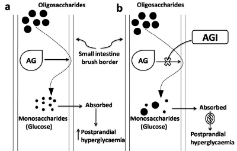
      - 胰淀粉样多肽类似物：醋酸普兰林肽
        - 延缓葡萄糖的吸收，抑制胰高血糖素的分泌。降低糖尿病患者体内血糖波动频率与波动幅度
        - 可用于 T1DM&T2DM，胰岛素治疗的辅助治疗  **不能替代胰岛素**
        - **不可用于胰岛素治疗依从性差、自我检测血糖依从性差的患者**
      - SGLT-2抑制剂：恩格列净
