---
tags:
  - pharmacology
---
- # **抗菌药物概论（2 学时）**
  - # 一．抗病原微生物药及化学治疗的定义。
    - 定义： **化学治疗** 是指对病原微生物、寄生虫所致的感染性疾病与恶性肿瘤的药物治疗
    - 机体、病原体和抗菌药物三者间的相互关系
      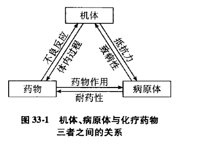
    -  <u>**常用术语：抗菌谱，抗菌活性 MIC**</u> ， 抑菌药，杀菌药， <u>**化疗指数(chemotherapy index，CI)，PAE，首次接触效应(FEE)**</u> 
      - 1.  **抗菌谱** （antibacterial spectrum）:抗菌药物的抗菌范围，包括广谱和窄谱两种，是临床选药的基础
        - 广谱——对多种病原微生物有效 如 **四环素、氯霉素、第三&四代氟喹诺酮类** 等
        - 窄谱——仅对单一菌种或种属有效 如 **异烟肼** 
      - 2.  **抗菌活性** ：抗菌药抑制或杀灭病原体的能力，评价抗菌活性的指标：常用MIC和MBC
        - **最低抑菌浓度** （minimum inhibitory concentration, **MIC** ）体外培养18~24h后能抑制培养基内病原菌生长繁殖的最低药物浓度；
        - **最低杀菌浓度** （minimum bactericidal concentration, **MBC** ）能够杀灭培养基内细菌或使细菌数减少99.9%的最低药物浓度。
      - 3. 抑菌药——仅能抑制微生物生长而无杀灭作用的药物；杀菌药——既能抑制微生物生长又有杀灭作用的药物。
      - 4.  **化疗指数** （chemotherapy index,CI）：评价化学治疗药物安全性与应用价值的指标——LD50/ED50 或 LD5/ED95。CI↑，表明该药物的毒性越小（但不一定越安全！），临床应用价值越高
        > link：治疗指数TI
        - 注意：CI越大不一定越安全，只是越不容易中毒致死。青霉素类药物CI指数大，几乎对身体无毒性，但可能发生过敏性休克
      - 5. **抗生素后效应（post antibiotic effect,PAE）：** 细菌与抗生素短暂接触，当抗生素浓度下降低于MIC或消失后，细菌生长仍受到持续抑制的效应。eg <mark style="background-color:#fef3c7;"> **阿奇霉素PAE非常好，可以间歇给药。** </mark>
        > 不能只说“不再给药”，要说“低于MIC或消失后”
      - 6.  **首次接触效应（first expose effect，FEE）：** 抗菌药物在初次接触细菌时有强大的抗菌效应，再度接触时不再出现该强大效应，或者与细菌接触后抗菌效应不再明显增强，需要间隔相当时间以后，才会再起作用。（如<mark style="background-color:#fef3c7;"> **氨基苷类由于FEE，需要间隔给药** </mark>）
      - **时间依赖性抗生素：** 药物浓度超过一定范围后，浓度对杀菌效果影响不大。 **β内酰胺连续按时给药** 
      - **浓度依赖性抗生素：** 杀菌效果随浓度的增加而增加， **PAE 长、FEE明显** ，剂量大效果明显。 **氨基苷类给三天歇三天** 
        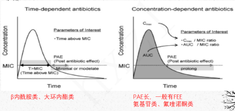
        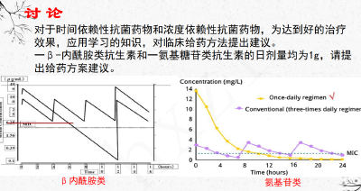
  - # 二． <u>抗菌药物的作用机制（背！）</u>
    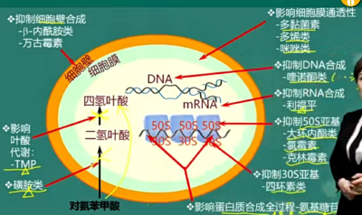
    > 从外往内记：细胞壁、细胞膜、胞内蛋白质、核酸、 <u>**叶酸**</u> 。1.抑制细菌细胞壁合成；2.影响细菌细胞浆膜的通透性；3.影响胞浆内生命物质（蛋白质）的合成；4.抑制细菌核酸合成；5. 影响叶酸代谢
    - **1. 抑制细菌细胞壁的合成：青霉素&头孢菌素、万古霉素&杆菌肽**
      - 均作用于 **繁殖期** 
      - 青霉素和头孢菌素——抑制PBPs，抑制交联过程
      - 万古霉素和杆菌肽——抑制粘肽合成
    - **2. 改变细胞膜的通透性：多黏菌素 & 两性霉素**
      - 多黏菌素——与膜磷脂结合；
      - 两性霉素——与固醇类物质结合（麦角固醇打孔）。
      - 副作用/不良反应强，因为人体也有
    - **3. 抑制蛋白质合成：氨基苷（链、庆大、妥布、阿米卡星）、大环内酯（红霉素）、林可霉素、氯霉素、四环素**
      - 氨基苷类——影响蛋白质合成的 **全过程** ；
      - 大环内酯类、林可霉素类、氯霉素类—— **50S** ，抑制转肽； **（“红绿林中50载”）** 
      - 四环素—— **30S** ，抑制进位（ **30而立四环素** ）
    - **4. 影响核酸代谢：喹诺酮（xx沙星）、利福平**
      - 喹诺酮类——抑制 **DNA** 合成；
      - 利福平——抑制 **RNA** 合成。（DNA依赖性RNA pol）
    - **5. 影响**  **叶酸代谢：磺胺、甲氧苄啶 TMP** 
      - 复方新诺明：SMZ + TMP，双重阻断四氢叶酸合成
      - 哺乳动物可以直接用叶酸，细菌原核生物需要用到四氢叶酸
  - # 三． <u>细菌耐药性的概念，产生耐药性的机制</u> 。
    - **1. 耐药性** （bacterial resistance）：细菌产生对抗生素不敏感的现象，产生原因是细菌在自身生存过程中的一种特殊表现形式。
      > 区别：人的“耐受性”
      - **固有耐药性（Intrinsic Resistance）：** 由细菌染色体基因决定，代代相传不改变。（如：G- 对青霉素 G 天然耐药）
      - **获得性耐药性（Acquired Resistance）：** 细菌与抗生素反复接触，由质粒介导，亦可由染色体介导，通过改变自身代谢途径使其不被抗生素杀灭的特性。可逆，可因不再接触抗生素而消失（如：金黄色葡萄球菌产生 β 内酰胺酶而对 β 内酰胺类抗生素耐药）
      - ***多重耐药性（Multiple-drug Resistance）：***  *细菌对多种抗生素耐药*
        - **MRSA**  **（** Methicillin Resistant Staphylococcus **）** ：耐甲氧西林金黄色葡萄球菌
        - **ESBL** （Extended Spectrum β-lactamases）：产超广谱 β-内酰胺酶细菌
        - **PRSP** （Penicillin-Resistant Streptococcus Pneumoniae）：青霉素耐药肺炎球菌
    - **2. 耐药性机制**
      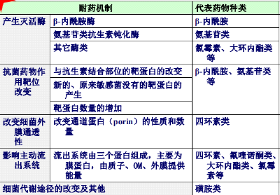
      - **改变细胞外膜通透性**
        - 改变通道蛋白（porin）的性质和数量。 **铜绿假单胞菌** 对抗生素的天然耐药
      - **影响主动外排系统**
        - 大肠埃希菌对 **四环素、大环内酯类、氯霉素、氟喹诺酮** 的多重耐药
      - **产生灭活酶：**  **主要是β和氨基苷。** 
        -  **氯霉素乙酰转移酶；林可霉素类（核苷转移酶）；大环内酯类（酯酶）；氨基糖苷类** 抗生素钝化酶； **β-内酰胺酶** ；
      - **抗菌药物作用靶位改变**
        - 与抗生素结合的靶蛋白改变 、出现新的靶蛋白、靶蛋白数量增加
        -  **耐压淋病奈瑟菌、MRSA** 的青 **霉素结合蛋白** 改变 影响青霉素的结合
      - **※ 改变代谢途径** <mark style="background-color:#fef3c7;"> **磺胺** </mark>
        - 金黄色葡萄球菌产生大量PABA，逆转 **磺胺类** 药物的 <u>竞争性</u> 拮抗作用
          > 磺胺：干扰结核杆菌的 **二氢蝶酸合酶**  **，抑制叶酸代谢、分枝杆菌素合成** 
    -  **二重感染（Superinfection）/ 菌群失调症** 
      
  - # 四．抗菌药的合理使用
    - **不能用抗菌药的场景：**  **①病毒感染不用；②原因未明的发热；③绝大部分不局部应用→诱发过敏反应和细菌耐药** 
    - **尽早明确诊断** ， **根据抗菌药** 的活性、耐药性、药动， **根据患者** 生理病理免疫状态选药——根据感染菌种类、药敏试验、感染部位、患者全身情况、抗菌谱、药代动力学、不良反应
      > eg G- 选氨曲南
    - **严格掌握预防应用的适应症：** 手术 外伤 风湿 疫区接触
    - **特殊人群用药**
      - （1）肾功能不全：避免肾毒性药、避免合用N个肾毒性药（氨基糖苷，多粘菌素，万古霉素，氟胞嘧啶，青霉素，一二代头孢，喹诺酮，四环素）
        - 肾不好肝好，双通道（选择肝脏代谢、肝胆系统排泄的药）：大环内酯，氯霉素，利福霉素，多西环素，异烟肼
      - （2）肝功能不全：由肝清除但无毒，可用、减量；肝毒性，禁用；肝肾双途径，减量
        - 原型经肾排泄正常用：青霉素、头孢唑林&他啶、万古霉素、氨基糖苷、多粘菌素、乙胺丁醇
        - 减量：红霉素、氟胞嘧啶、哌拉西林、美洛西林、头孢噻肟&哌酮&曲松、克林霉素、林可霉素、氟罗沙星
        - 禁用：磺胺，四环素，氯霉素，红霉素酯化剂，利福平，异烟肼，两性霉素B，酮康唑，咪康唑
      - （3） **新生儿：** 禁用可能发生严重不良的 **磺胺、氯霉素、喹诺酮、氨基苷。**  **哺乳暂停，吃药不吃奶。**
      - （4）小儿：①氨基苷、万古霉素，耳、肾毒性；②四环素，牙齿黄染四环素牙；③喹诺酮：骨骼发育不良（“煞星”）
      - （5）妊娠：致畸性、明显毒性。一青一红不能用。
    - **合理联合用药**
      - 繁殖期杀菌剂（ **β-内酰胺** ）+ 静止期杀菌剂（ **氨基糖苷** ） **协同**
      - 快速抑菌剂（ **大环内酯类 四环类 氯霉素** ）+静止期杀菌剂（ **氨基糖苷** ） **协同**
      - 快速 + 慢效协同
      -  **繁殖期杀菌剂（**  **β-内酰胺**  **）+ 快速抑菌剂（**  **大环内酯类 四环类 氯霉素**  **）拮抗** 
    - **注意**  **给药顺序：先用四环素，后用青霉素，产生拮抗效应。反之则无** 
    - **轮换使用抗生素、**  **降级使用（de-escalation）**  **同类药物、序贯使用不同药物**
  - ## 习题
    - **1、名词解释：化疗指数；抗菌谱；最低杀菌浓度（MIC）；最低抑菌浓度(MBC)；抗生素后效应（PAE）**
    - **2、简述抗菌药的抗菌作用机制**
    - **3、简述细菌的耐药机制**
    - **4、如何正确地联合应用抗菌药？**
- # β- 内酰胺类抗生素（3 学时）
  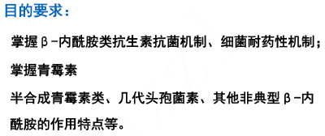
  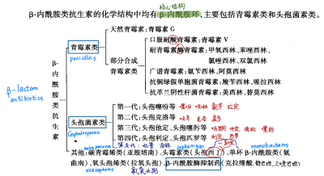
  > **青霉素类（Penicillins） 头孢菌素类（Cephalosporins）**
  >  **非典型 β-内酰胺类：** 碳青霉烯类（Carbapenems） 头霉素类（Cephamycin） 氧头孢烯类（Oxacephems） 单环 β-内酰胺类（Monobactam ）
  - # 一. <u>β-内酰胺类抗生素</u>
    - ## <u>1. 抗菌机制</u>
      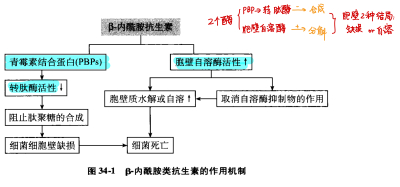
      - 作用于细菌菌体内的 **青霉素结合蛋白（penicillin-binding proteins,PBPs）** 
        - 抑制转肽酶活性→阻止肽聚糖合成→细胞壁缺损→细菌死亡；
        - 增加胞壁自溶酶活性（自溶酶活性↑，取消自溶酶抑制物的作用）→自溶或胞壁水解→细菌死亡。
      -  **繁殖期**   **窄谱**   **杀**  **菌剂**
      - 对G+细菌更敏感，对哺乳细胞几乎无毒
      - 对各种亚型的 PBPs 的结合能力不同，表现出抗菌活性的差异
    - ## <u>2. 影响抗菌作用的因素</u>
    - ## <u>3. 耐药机制</u>
      -  **（1）生成β-内酰胺酶** 
        - 青霉素耐药—— **青霉素酶** ； **头孢类耐药——ECBLs；碳青霉烯耐药——金属酶** 
        - 其中， **金葡菌** 易产生耐药性（ **除了MRSA之外的金葡菌都是靠产生酶来耐药的** ）
      - **（2）牵制机制（Trapping Mechanism）：** 通过 **酶的结合** 阻止抗生素到达靶点
        - β-内酰胺酶与某些耐酶的β-内酰胺类抗生素结合，使药物停留在胞膜外，不能到达靶位发挥作用。与MRSA 无关，耐酶青霉素无法治MRSA感染
      - **（3）药物不能在作用部位达到有效浓度：** 进入减少，外排增加
        - 主动外排系统增强
        - 通道蛋白数量和结构的改变
      - **（4）靶位（PBP）改变：药物对 PBPs 的亲和力降低**
        - 耐甲氧西林金黄色葡萄球菌（MRSA）、耐青霉素肺炎链球菌、耐第三代头孢菌素的菌株
      - （5） 缺乏自溶酶：金黄色葡萄球菌
  - # 二.青霉素类(penicillins)
    - β-内酰胺类抗生素 特殊药
      - 本章特殊药：青霉素G与<mark style="background-color:#fef3c7;"> **丙磺舒** </mark>合用时→ **竞争性抑制青霉素在肾小管的分泌→延长作用时间** 
      - 本章“首选”与“最”：<mark style="background-color:#fef3c7;"> **哌拉西林 Piperacillin** </mark> 对铜绿假单胞菌的抗菌作用<mark style="background-color:#fef3c7;"> **最强** </mark> **，但不耐酶——合用**  **克拉维酸** 
    - ## **1**  <u>**.青霉素 G(penicilline-G)**</u>
      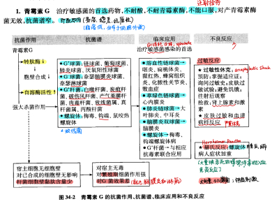
      - ### <u>（1）理化特性、体内过程</u>
        - **即配即用：**  易溶于水 水溶性稳定性差；抗原性（降解产物易过敏，link过敏性休克原理）
        -  **不耐酸、不耐酶、** 不能口服，易被消化酶破坏
        - - 吸收：不宜口服， **注射** 给药；
        - - 分布：主要分布于细胞外液。炎症时可进入脑脊液 **（aka 脑膜炎可用青霉素）** 、房水。
        - - 排泄：90%由 **肾小管** 分泌排出，PAE短
          - 当与<mark style="background-color:#fef3c7;"> **丙磺舒** </mark>合用时→ **竞争性抑制青霉素在肾小管的分泌→延长作用时间** 
          - 为延长青霉素G作用时间——采用水溶性弱的 **普鲁卡因青霉素（procainebenzyl penicillin）** 和 **长效苄星青霉素（benzathine benzylpenicillin）**  只用于轻症和预防
      - ### <u>（2）抗菌作用</u>
        - **抗菌力：**  **杀菌** ，繁殖期
        - **抗菌谱——** <mark style="background-color:#fef3c7;"> **记“G+球 G+杆 G-球 G-杆 + 其它”，后面的药就依次打叉** </mark>
          - **G+球菌** ——链球菌、葡萄球菌、肺炎球菌；（金葡易耐药）
          - G+杆菌——白喉杆菌、炭疽杆菌、破伤风梭菌、产气荚膜梭菌、肉毒杆菌、乳酸杆菌等；
          - G-球菌——脑膜炎球菌、淋球菌
          -  **对G-杆菌很弱/无效（~窄谱）——打不了铜绿假单胞菌** 
          - 其他病原体—— **螺旋体** 、放线菌
      - ### <u>（3）临床用途：敏感菌（革兰阳性球菌、杆菌 ；革兰阴性球菌 ；螺旋体）感染的</u> <mark style="background-color:#fef3c7;"> <u>**首选药**</u> </mark>
        - **链球菌感染（Streptococcal Infection）**
          - 溶血性链球菌：猩红热    咽炎  扁桃体炎    败血症  蜂窝组织炎      丹毒
          -  **草绿色** 链球菌：心内膜炎（青霉素+链霉素）
          - 肺炎链球菌：大叶性肺炎
        - **脑膜炎奈瑟菌**
          - 大剂量用药 使用三代头孢
        - **螺旋体感染（**  **Spirochete Infection**  **）**
          - 钩端螺旋体病    梅毒   回归热
          - 注意赫氏反应
        - **G+杆菌感染：破伤风   白喉   炭疽**      需同时合用相应的 **抗毒素血清** ！
      - ### <u>（4）不良反应——过敏性休克及防治</u>
        -  **过敏反应** 
          - 严重者引起 **过敏性休克（Anaphylactic Shock）** ——循环衰竭、呼吸衰竭、中枢抑制
            - 原因：青霉素溶液不稳定，降解产物易引起过敏（现配现用），形成高分子聚合物。立即发生。
              - 含不稳定的β-内酰胺环，可发生降解反应（生成青霉噻唑蛋白、青霉烯酸等降解产物）和聚合反应（青霉素G生成6-APA等高分子聚合物）。这些具有致敏性的反应产物，与体内蛋白质结合形成抗原。
            - **抢救：** 停药，皮下或肌内注射 **肾上腺素** ，必要时加入糖皮质激素、抗组胺药
            - **预防：**  **现用现配**  **；** 使用前详问使用病史；必须皮试；避免在饥饿时注射，使用后留观；现配现用
        -  **赫氏反应（Herxheimer Reaction）** 
          - 青霉素 **治疗螺旋体** 时出现症状加重、寒战发热。这是由于青霉素杀死大量螺旋体， **螺旋体毒物释放入体内** 引起的免疫反应
        - 局部刺激（注射部位疼痛）
        -  **脑毒性**  **：大剂量青霉素**  **钾盐**  **，小儿癫痫 惊厥**  青霉素脑病。老年人高血钾心脏骤停。
    - ## 2、半合成青霉素类（Semisynthetic Penicillin）
      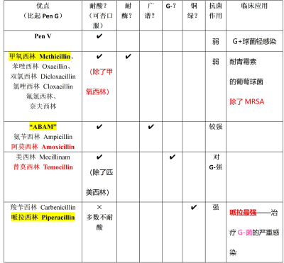
      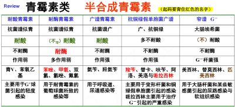
      - **耐**  **酸**  **青霉素 / 口服（青霉素 V penicillin V）：** 对酸稳定、可以口服。抗菌活性略差，用于轻症感染
      - **耐**  **酶**  **青霉素（**  **甲氧**  **西林 Methicillin、**  **苯唑**  **西林 Oxacillin、  双氯西林 Dicloxacillin   氯唑西林 Cloxacillin 氟氯西林、奈夫西林）：“家养 笨坐 氯毛 奈夫（耐酶）犬”：** 用于耐青霉素酶细菌感染，对其他作用反而弱；但 **无法抗MRSA（耐甲氧西林金黄色葡萄球菌）** 
        -  *link：可能跟头孢放在一起考，问肾衰患者得耐酶感染，不选头孢一代，应选苯唑西林* 
      - **广谱青霉素（**  **氨苄**  **西林 Ampicillin**   <u>**阿莫**</u>  <u>**西林 Amoxicillin**</u>  **）：** 耐酸不耐酶； **对铜绿假单胞菌（G-杆）仍不敏感** ；谱广效弱
        - 阿莫西林：口服吸收更好，适用于呼吸道、胃肠道、尿道感染
        - 氨苄西林：口服效果一般，但对 **肠球菌** 效果更好
        -  *link：可能跟头孢放在一起考，问对铜绿有效，则选头孢三代* 
      - **抗G-杆菌青霉素（美西林 Mecillinam**  **替莫**  **西林 Temocillin）**
      - <u>**抗铜绿假单胞菌青霉素**</u>  **（**  **羧苄**  **西林 Carbenicillin**   **哌拉西林 Piperacillin**  **）：** 与铜绿假单胞菌生存必需的 PBPs 结合，且穿透力强
        - 哌拉西林对铜绿假单胞菌的抗菌作用<mark style="background-color:#fef3c7;"> **最强，** </mark> **但不耐酶——合用**  **克拉维酸** 
        - 哌拉西林治疗G-菌引起的严重感染
  - # <u>三、头孢菌素类(Cephalosporins)</u>
    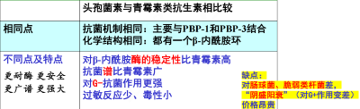
    - **对铜绿：1** 、2代头孢无效，3、4代有效
    - **过BBB：** 2代开始可以
    - **头孢4代：** 阴盛阳衰、长广强稳、无肾毒性、抗绿脓！
    -  **五代头孢速记 cepha/cef/ceft** 
      - 一代：“噻吩和拉定的儿子叫噻啶，他暗中性情大变去做零”—— **头孢噻吩、头孢拉定，头孢噻啶，头孢氨苄，头孢唑林**
      - 二代：“梦到幸福的生活在洛克王国”—— **头孢孟多，头孢呋辛，头孢克洛**
      - 三代：“我噻，他定会派同克我(崆峒)，我要去送(人头)了”—— **头孢噻肟(wo)，头孢他定，头孢哌酮，头孢克肟，头孢曲松**
      - 四代：“一匹骡子比我贵”—— **头孢匹罗，头孢比肟**
      - 五代：“洛林酯开皮普车抽陀螺”—— **头孢洛林酯，头孢吡普，头孢托罗**
    - <u>各代头孢菌素的临床应用及不良反应——</u>  <u>**先记左边第一列，哪些维度比较；再记各行特点/趋势描述**</u> 
      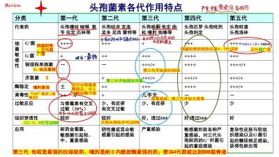
      - **一代：头孢噻吩（Cephalothin） 头孢唑林（Cephazolin） 头孢氨苄（Cephalexin） 头孢拉定（Cephradine） 头孢匹林（Cephapirin）**
      - 二代： **头孢呋辛（cefuroxime） 头孢克洛（cefaclor） 头孢孟多（cefamandole） 头孢尼西（cefonicid） 头孢雷特（ceforanide）**
      - 三代： **头孢哌酮（cefoperazone） 头孢他定（ceftazidime） 头孢噻肟（cefotaxime） 头孢唑肟（ceftizoxime） 头孢曲松（ceftriaxone） 头孢克肟（cefixime） 头孢地嗪（cefodizime）**
      - 四代： **头孢匹罗（cefpirome） 头孢吡肟（cefepime）**
      - 五代： **头孢吡普（ceftobiprole） 头孢洛林（Ceftaroline）**
    - **头孢不良反应**
      - （1） **过敏** ：发生率远低于青霉素，初代可能与青霉素G交叉过敏
      - （2） **肾毒** ：主要是第一代， **不能与氨基糖苷类合用** 
      - （3） **二重感染** ：主要是第3代，广谱。较轻的感染在可用其他抗菌药治疗时不宜使用三代头孢菌素。
      - （4） **双硫仑反应** ：含有甲硫四氮唑侧链的头孢菌素抑制乙醛脱氢酶的活性。建议用药后间隔 7-15d 饮酒
        - 解救：（1） **抗氧化剂 vitC** ，对抗乙醇所致氧化还原反应；（2）类似抗过敏：地塞米松，缩血管药；（3）纳洛酮
      - （5） **血液系统：** 头孢孟多和头孢哌酮可杀死人体正常菌群，导致<mark style="background-color:#fef3c7;"> **低凝血酶原血症** </mark> **、出血**  **。**  ——口服 **维生素 K** 
  - # 四、非典型 β-内酰胺类抗生素
    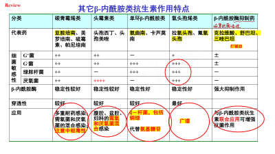
    - <u>**碳青霉烯类（Carba**</u>  <u>**penem**</u>  <u>**s） ——“**</u>  <u>**培南**</u>  <u>**” penem**</u>
      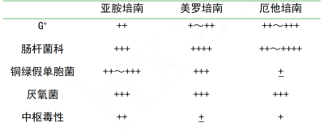
      - 碳青霉烯类包括<mark style="background-color:#fef3c7;"> **亚胺培南（imipenem）** </mark> **美罗培南（meropenem） 帕尼培南（panipenem） 硫霉素（thienamycin）**
        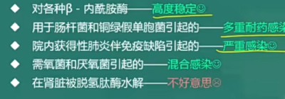
      -  **抗菌谱最广** 的抗生素之一；对 G+ G-  **铜绿假单胞菌**  多重耐药菌均有效
      - 问作用机制：同青霉素
      - 活性强， **耐酶** ，对 β-内酰胺酶高度稳定
      - 注意亚胺培南的 **中枢毒性** 。 **亚胺培南不适用于**  **中枢神经系统感染** 
      - 泰宁——亚胺培南+ **西司他丁 （cilastatin）** （ **肾脱氢肽酶** 抑制药，延长亚胺培南作用时间。否则亚胺培南易被体内脱氢肽酶水解）
      - 可引起意识障碍、肝损伤、肾毒性
    - <u>**β-内酰胺酶抑制剂——**</u>  **克拉维酸（clavulanic acid） 舒巴坦（sulbactam） 三唑巴坦（tazobactam）**
      - •  **本身没有抗菌活性** 或只有很弱；
      - 抑制β-内酰胺酶， **增强别人** β-内酰胺的抗菌作用；对不产酶的细菌 **无** 增强效果；
      -  **三种药物对不同细菌的β-内酰胺酶有选择性** 
        - - 克拉维酸——金葡菌、肠杆菌、嗜血杆菌属、淋球菌效果较好；
        - - 舒巴坦——抗菌作用更强
        - - 他唑巴坦——强于克拉维酸和舒巴坦，对 **铜绿假单胞菌** 、金葡菌产生的β-内酰胺酶有一定抑制作用
    - **头霉素类（Cephamycins） ——** 头孢西丁（cefoxitin） 头孢美唑（cefmetazole）
      - **抗**  **厌氧菌**  **作用强于三代头孢菌素**  临床用于需氧和厌氧菌的混合感染
    - 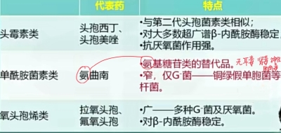
      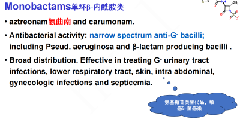
- # **氨基苷类抗生素 +多粘菌素、多肽类（均对**  **G-**  **作用强）**
  - ## 氨基糖和氨基环醇以苷键相连接形成的 **碱性** 抗生素，在 **碱性环境中作用更强**
  - ## 包括
    - **链霉素类：**  **链霉素（streptomycin）**   **卡那霉素（Kanamycin）**   **妥布霉素（Tobramycin）**   **大观霉素（Spectinomycin） 新霉素（neomycin）**
    - **庆大霉素类：**  **庆大霉素（gentamicin）**   **阿司米星（astromicin）**
    - **半合成类药物：**  **阿米卡星（amikacin）**   **奈替米星（netilmicin）** 
  - # 一． <u>氨基苷类抗生素的共性</u>
    - ## <u>**1. 抗菌力&抗菌特点：**</u>  <u>**静止期（Quiescent）杀菌**</u>  <u>**，**</u>  <u>**蛋白质合成全程抑制剂**</u> 
      - 药代动力学 / 体内过程
        - **浓度** 依赖性， **PAE很长**  ， **首次接触后效应（FEE）明显** 
        - 在 <u>**碱性环境**</u>  **中作用更强**
        -  **水溶性很强（分布于细胞外液，不过BBB），脂溶性差（口服难以吸收，可肠道消毒）** 
      - 谱 效
        - 高效、广谱 **（除了链霉素）**  ，但毒性更高
        - 仅对需氧菌有效，且抗菌活性显著强于其他药物， **对厌氧菌无效** ；
      - 毒
        -  **内耳淋巴液、肾皮质中药物浓度高** ，耳毒性、肾毒性， **原形排泄不伤肝** 
        - 原形经肾脏滤出，而青霉素是肾脏主动分泌排出（link 丙磺舒）
    - ## <u>**2. 抗菌谱：**</u>  <u>**广谱，尤其G-杆；只作用于需氧菌**</u> 
      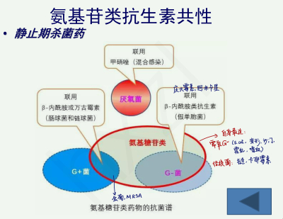
      - 1.尤适用于 **需氧G—** 的严重感染：铜绿假单胞菌、不动杆菌、大肠埃希菌、肠杆菌、变形杆菌、沙门氏菌、霍乱弧菌
      - 2.卡那、丁胺卡那、 **链霉素** 对 **结核分歧杆菌** 有效
      - 3.对 **G+球菌** ：葡萄球菌强，（even MRSA），链球菌效果不佳
      - 4. 对 **G-球菌作用差：** 肠球菌,  **厌氧菌无效** 
      - 5. 大部分对 **铜绿假单胞菌** 有效（ **链霉素、** 卡那霉素、大观霉素 **无效）** 
      - 6.  **联合治疗：** 常与  **β-内酰胺类** 治疗肠球菌、链球菌等 G+ 、铜绿假单胞菌等 G- ；与 **甲硝唑** 联合治疗 **厌氧菌** 
    - ## <u>**3. 作用机制**</u>
      - **全过程**  **抑制蛋白质合成**  **： 30S 小亚基**
        - 起始阶段：抑制 70S 复合体的形成
        - 延长：mRNA误读
        - 终止：阻止70S解离，肽链不能脱落
      - **裂解细菌**  **细胞膜**  **：**  **对宿主也有一定毒性** 
        - 竞争性置换脂多糖分子上的阳离子，结合膜上带负电磷酸基团
        - 增加膜的通透性，重要物质外漏——快速杀灭革兰氏阴性菌
      - **刺激菌体产生致死量的**  **羟自由基** 
        - *氨基糖苷类抗生素可在 β-内酰胺酶之后使用（同时使用会相互反应）*
      - <mark style="background-color:#fef3c7;"> **为什么对厌氧菌无效，为什么碱性条件下杀菌作用更强？** </mark>
        - **氨基糖苷类进入细菌是在**  **需氧条件**  **下的主动转运过程 ，** 可被 **金属阳离子** 、 **低 pH** 、厌氧环境阻断
          - 对厌氧菌无效（能量不足）；碱性环境高活性；
          - 与β-内酰胺酶和万古霉素配合（这些打破细胞壁，氨基糖苷随后进入），但 **※不宜在同一注射器内给药** （ **酸碱中和** 可破坏氨基糖苷）
    - ## <u>**4. 耐药机制**</u>
      - **产生**  **钝化酶（modifying enzyme）** 
        - 产生灭活酶：<mark style="background-color:#fef3c7;"> **“绿林大安倍（β）”，背！** </mark>
        - 包括乙酰化酶（AC） 腺苷化酶（AD） 磷酸化酶（P）
      -  **改变细胞膜通透性（主动外排 / 减少摄取）** 
        - 绿脓杆菌对链霉素耐药
      -  **靶位修饰**  **：**  **30S亚基**  **结构改变**
        - 结核杆菌对链霉素耐药
    - ## <u>**5. 药代动力学/体内过程**</u>
      - 吸收： **口服不吸收**  **，除了算作** 肠道感染时的局部作用。一般肌内注射 （毒性，不主张静脉注射）
      - 分布：细胞外液。集聚 **于**  **肾皮质、耳蜗、前庭**  **，** 产生肾毒性和耳毒性； **可透过胎盘屏障，但不能透过血脑屏障。** 
      - 代谢&排泄：在体内 **不被肝代谢** ，以原形从 **肾脏** 排泄
    - ## <u>**6.临床应用**</u>
      -  **需氧G-**  **菌的全身感染（脓毒症）**
      - **联合用药（主要联用β内酰胺）**
        - 联合攻G-杆：庆大霉素+头孢三代
        - 联合攻G+球：庆大霉素+青霉素/头孢一代
        - 联合攻需氧+厌氧：甲硝唑
      - **结核分歧杆菌和非典型分歧杆菌感染**  **：结核~~链霉素 （**  ***卡那、丁胺卡那***  **）；**  **非典型~~阿米卡星** 
    - ## <u>**7.不良反应——**</u> <mark style="background-color:#fef3c7;"> <u>**耳毒肾毒肌肉阻，过敏仅次青霉素**</u> </mark> <u>**(对第八对脑神经、肾、肌肉神经接头的影响及过敏反应)**</u>
      - ### **① 耳毒性（Ototoxicity）：** 包括 **耳蜗毒性** 和 **前庭毒性**  ，引起 **不可逆**  **性耳聋、** 眩晕、恶心、呕吐、眼球震颤
        - 机制：在 **内耳外淋巴液蓄积** ，损害内耳Corti器内、外毛细胞的能量产生及利用，引起细胞膜的 **Na+-K+-ATPase功能障碍** ，造成毛细胞损伤
        - 前庭毒性：眩晕呕吐。新霉素＞卡那霉素＞链霉素＞庆大霉素＞妥布霉素
          > 新、卡那永远排前二，然后是链霉素、阿米卡星
        - 耳蜗毒性：耳鸣耳聋。新霉素＞卡那霉素＞阿米卡星＞庆大霉素＞妥布霉素＞链霉素
        - <mark style="background-color:#fef3c7;"> **避免合用耳毒性药物** </mark>
          -  **一代头孢、万古霉素、多黏菌素** 
            > 记：一代头孢耳肾毒，万古、多粘菌素和它在同章
          -  **呋塞米等高效利尿药；甘露醇等脱水药** 
          -  **镇吐药 ；H1 受体阻断剂**  **（可能掩盖其耳毒性）** 
          - 红霉素/大环内酯也有部分
      - ### **② 肾毒性（Nephrotoxicity）：** <mark style="background-color:#fef3c7;">药源性肾衰竭</mark>最常见因素。在肾皮质聚集，破坏肾皮质近曲小管引起肾小管肿胀， <u>对肾小球影响不大。</u>
        - 严重程度：新霉素＞卡那霉素＞庆大霉素＞妥布霉素＞阿米卡星＞链霉素
          > 新、卡那永远排前二，然后是庆大霉素
        - <mark style="background-color:#fef3c7;"> **避免合用肾毒性药物** </mark>
          -  **一代头孢、万古霉素、多黏菌素（25%）、两性霉素B** 
      - ### **③ 神经肌肉麻痹（Neuromuscular Blockade）：重症肌无力、心肌抑制、血压下降、呼吸衰竭**
        - 与突触前膜 Ca2+结合位点结合，阻滞Ca2+引起的乙酰胆碱释放
        -  **抢救** ：葡萄糖酸 **钙** 、 **新斯的明** 
      - ### **④ 过敏反应（Allergic Reactions）：** 皮疹、血管神经性水肿、偶见过敏性休克（ **链霉素**  **，** 仅次于青霉素，需 **皮试）**
        - **抢救** ： **肾上腺素** 、葡萄糖酸钙
  - # 二．各氨基苷类抗生素的特点
    - ##  <u>**1. 链霉素（Streptomycin）**</u> 
      - ### **药代动力学**
        - 共性的东西，水溶性强，硫酸盐，口服不吸收，不易透过血脑屏障（只在患脑膜炎时可进入脑脊液）；内耳淋巴液蓄积
      - ### **抗菌活性：**  **窄** 谱，主要针对 **G-需氧杆菌**  **，**  **结核分枝杆菌** 。 *对铜绿、G-球菌、厌氧几乎没用*
      - ### **临床应用（鼠 兔 布鲁，主要结核）**
        - 联用 **四环素（Tetracycline），** <mark style="background-color:#fef3c7;"> **首选于** </mark>： <u>**鼠疫（plague）、 兔热病（tularemia）、布鲁氏病 （Brucella）**</u> 
        -  **结核   二线**  **用药  与其他抗结核药联用**
        - 联用 **青霉素（penicillin）**  **：**  **感染性心内膜炎** （可首选链or庆大）
      - ### **不良反应**
        -  **变态反应：** 过敏性休克、口周麻木
        -  **耳毒性：** 前庭反应出现早、可逆，耳蜗反应出现晚、不可逆
        - 肾毒性比其它少
    - ##  <u>**2. 庆大霉素（Gentamicin）**</u> 
      - ### **药代动力学：** 硫酸盐，口服不吸收；与链霉素类似； **可在肾脏大量积聚** 
      - ### **抗菌活性：**  **广** 谱抗生素： **G+** 、 **G-** 、 **铜绿** 、 **葡萄球菌（包括金葡）** 
      - ### **临床应用：** 治疗<mark style="background-color:#fef3c7;"> **各种G-感染** </mark>的主要抗菌药，也是<mark style="background-color:#fef3c7;"> **氨基糖苷类抗生素的首选药** </mark>
        - 肺炎、脑膜炎、骨髓炎、心内膜炎、败血症等
        -  **青庆合用** ：联用 **青霉素（penicillin）** 和 **头孢菌素（cephalosporin）**  **：** 感染性心内膜炎；葡萄球菌；肠球菌；铜绿。
          - 联用时避免混合使用，因为青霉素酸性，氨基糖苷溶液碱性
        - 局部应用皮肤黏膜表面、肠道感染、肠道手术准备，对铜绿、MRSA均有效
      - ### **不良反应**
        - 肾毒性排氨基苷类的第三
        - 耳毒性 以前庭损害为主；
        - 偶见过敏反应、神经肌接头阻滞作用、二重感染等
    - ##  <u>**3.阿米卡星（amikacin，丁胺卡那霉素）**</u>  **：** <mark style="background-color:#fef3c7;"> **抗菌谱最广、专治耐药、对钝化酶稳定** </mark>， 用于<mark style="background-color:#fef3c7;"> **耐药** </mark>的 **G— & 铜绿假单胞菌** 感染。耳毒性很大。
    - ## 4.其它氨基苷类抗生素
      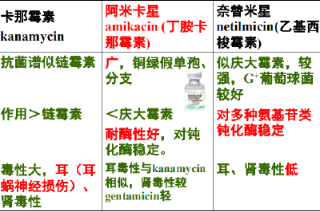
      - 卡那霉素：抗菌谱似 <u>链霉素</u> ，作用>链霉素。毒性大， **耳(耳蜗神经损伤)、** 肾毒性
      - **妥布霉素（tobramycin）：广谱，** 与庆大霉素类似。对<mark style="background-color:#fef3c7;"> **铜绿假单胞菌** </mark>抗菌活性强于庆大霉素，毒性小于庆大霉素。
      - **奈替米星（netilmicin）：广谱，** 与庆大霉素类似。<mark style="background-color:#fef3c7;"> **毒性最低** </mark>的氨基糖苷类，有一定的稳定性，对G- & MRSA & 铜绿假单胞菌耐药有效
      - 西索米星 sisomicin：与庆大霉素类似，抗绿脓杆菌作用较强，但毒性也大
      - **新霉素（neomycin）：** <mark style="background-color:#fef3c7;"> **毒性最大** </mark>，只用于局部外用（胃肠手术）
      - 大观霉素（Spectinomycin）：<mark style="background-color:#fef3c7;"> **窄谱** </mark>，适用于<mark style="background-color:#fef3c7;"> **淋球菌** </mark>和革兰氏阴性杆菌
      - 选择题
        -  **兔热病、鼠疫首选：链霉素** 
        - 过敏性休克：链霉素
        - 抗结核：链霉素、阿米卡星，没有庆大霉素
        -  **一般G-杆菌感染**  **首选**  **：庆大霉素** 
        -  **一般氨基糖苷类**  **耐药**  **株的感染首选：阿米卡星** 
        -  **目前抗菌谱最广的氨基糖苷类：阿米卡星** 
        -  **目前毒性较小的氨基糖苷类：奈替米星** 
        -  **毒性最大的氨基糖苷类：新 霉 素** 
        -  **对淋球菌敏感的氨基糖苷类：大观霉素** 
    - ## **氨基糖苷类**  **不适用于社区获得性肺炎**  **或**  **单用，**  **主要**  **与其它抗生素联合治疗**  **医院获得性肺炎**
      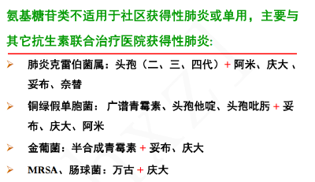
      - 肺炎克雷伯菌属：头孢(二、三、四代) **+** 阿米、庆大、妥布、奈替
      - 铜绿假单胞菌：广谱青霉素、头孢他啶、头孢吡肟 **+** 妥布、庆大、阿米
      - 金葡菌：半合成青霉素 **+** 妥布、庆大
      - MRSA、肠球菌：万古 **+** 庆大
    - ## **氨基苷类抗生素注意事项**
      - 1. 该类药物过敏者禁用；
      - 2. 该类药物 **均有耳、肾毒性和神经肌肉阻滞作用；** 
      - 3.  **社区获得性** 上、下呼吸道感染不宜选用； **不宜联用** 
      - 4. 新生儿、婴幼儿、老年患者应尽量避免使用，若有明确指征，应进行血药浓度监测；
      - 5. 妊娠期应避免使用；哺乳期应避免使用或停止哺乳；
      -  **6. 不与其他耳、肾毒性药物同用** 
        -  **肾毒性** 
          -  **一代头孢类药物、万古霉素、多黏菌素、两性霉素** 
        -  **耳毒性** 
          -  **一代头孢类药物、万古霉素、多黏菌素** 
          -  **呋塞米等高效利尿药；甘露醇等脱水药** 
          -  **镇吐药 ；H1 受体阻断剂**  **（可能掩盖其耳毒性）** 
          - 红霉素/大环内酯也有部分
      - 7. 庆大霉素耐药株近年增多。
  - ## 多黏菌素（Polymyxins） 
  - # 小结+习题
    - 思考题
      - 1. 简述氨基糖苷类抗生素的主要不良反应及防治措施
      - 2. 试述氨基糖苷类抗生素与β-内酰胺类合用使抗菌作用增强的药理基础
      - 3. 试述氨基苷类抗生素肾毒性和耳毒性与其体内过程的关系
        - 氨基糖苷类抗生素的耳毒性和肾毒性与其在内耳淋巴液和肾皮质药物蓄积有关。
      - 4. 试述氨基苷类抗生素的共同特点
    - 随堂习题: **丹毒-革兰阳性（G+球）；甲氧、苯唑-耐酶；交叉过敏-避免使用** 
      - 1. 25岁肺部感染,处方:头孢哌酮钠舒巴坦钠3+ 复方甘草口服液：复方甘草口服液与头孢哌酮舒巴坦钠有药物相互作用。 **复方甘草口服液含有乙醇，**  **与头孢哌酮钠舒巴坦钠合用会引起双硫仑样反应。**
      - 2. In the treatment of <mark style="background-color:#fef3c7;">bacterial meningitis in children</mark>, the drug of choice is
        - a. Penicillin G
        - b.Penicillin V
        - c.Erythromycin 红霉素
        - d. Procaine penicillin
        - <mark style="background-color:#fef3c7;">e.Ceftriaxone 头孢曲松</mark>
      - 3. Clavulanic acid is important because it
        - a.  Easily penetrates Gram-negative microorganisms
        - b.ls specific for Gram-positive microorganisms
        - c. ls a potent inhibitor of cell-wall transpeptidase
        - <mark style="background-color:#fef3c7;">d. Inactivates bacterial β-lactamases</mark>
        - e. Has a spectrum of activity similar to that of penicillin G
      - 4.  In the treatment of infections caused by P, aeruginosa, the antimicrobial agent that has provedto be effective is
        - a. Penicillin G
        - <mark style="background-color:#fef3c7;">b. Piperacillin</mark>
        - c. Nafcilin a
        - d.Erythromycin
        - e. Tetracycline
      - 5. 男性，70岁，有脚癣史，近日突发高烧、恶寒、头痛、口渴、烦躁等，右下肢皮肤出现片状鲜红斑，手指按压后红色很快恢复，边缘清楚并稍有隆起。诊断为下肢急性丹毒，治疗应首选
        - <mark style="background-color:#fef3c7;">A.青霉素G</mark>
        - B.苯唑西林
        - C.氨苄西林
        - D.阿莫西林
        - E.羧苄西林
      - 6.男性，87岁，在重症监护室诊断为呼吸机相关肺炎、痰培养为铜绿假单胞菌，应选择较为敏感的抗生素为
        - A.头孢唑林
        - <mark style="background-color:#fef3c7;">B.头孢他啶</mark>
        - C.阿莫西林
        - D.头孢孟多
        - E.氨苄西林
      - 7.女性，50岁，患耐青霉素G的金葡菌性心内膜炎，青霉素试敏阴性，既往有慢性肾盂肾炎，治疗该患者应选用
        - A.青霉素G
        - B.头孢氨苄
        - <mark style="background-color:#fef3c7;">C.苯唑西林</mark>
        - D.庆大霉素
        - E.头孢唑林
      - 8. A 30-year-old type l diabetic with renal complications develops acute pyelonephritis. P.aeruginosa is found in urine cultures and biood cultures.Combined therapy is instituted with an aminoglycoside and which of the following?
        - a. Clavulanic acid
        - b. Vancomycin
        - C.A second-generation cephalosporin
        - <mark style="background-color:#fef3c7;">d. Azithromycin</mark>
        - e. Piperacillin
      - 9. A 35-year-old male is diagnosed with primary syphilis, Which of the following agents isthe prefer choice for treating this patient?
        - a. A first-generation cephalosporin
        - b.Oxacillin
        - c. lmipenen
        - d. Benzathine penicillin G
        - <mark style="background-color:#fef3c7;">e. Vancomycin</mark>
      - 10. A 60-year-old male with a temperature of 104°F and a productivecough is diagnosed as having staphylococcal pneumonia. After severaldays on nafcillin, he develops truncal urticaria and pruritis. Which of the following agents is best avoided in this patient?
        - <mark style="background-color:#fef3c7;">a. Cefazolin</mark>
        - b.Clarithromycin
        - c. Sparfloxacin
        - d. Clindamycin
        - e. Tetracycline
      - 11. A 20-year-old male has a urethral discharge. Culture of the discharge showsNeisseria gonorrhoeae. Which of the following agents is the best choice fortreating this patient?
        - <mark style="background-color:#fef3c7;">a.Ceftriaxone</mark>
        - b. Benzathine penicillin G
        - c. Cefazolin
        - d.Amikacin
        - e.Sulfamethoxazole-trimethoprim
    - 小 结
      - 1.氨基糖苷类抗生素的共性
      - 2.氨基糖苷类抗菌谱
      - 3.氨基糖苷类抗菌机理：抑制蛋白质的合成
      - 4.氨基糖苷类主要不良反应： 耳、肾毒性、肌毒、过敏等
      -  **5.肌毒性的抢救措施：新斯的明 + 钙剂** 
      -  **6.过敏性休克的抢救措施：肾上腺素 +葡萄糖酸钙** 
      - 7.兔热病、鼠疫首选：链霉素
      - 8.一般G-杆菌感染首选：庆大霉素
      - 9.一般氨基糖苷类耐药株的感染首选：阿米卡星
      - 10.目前抗菌谱最广的氨基糖苷类：阿米卡星
      - 11.目前毒性较小的氨基糖苷类：奈替米星
      - 12.毒性最大的氨基糖苷类：新 霉 素
      - 13.对淋球菌敏感的氨基糖苷类：大观霉素
- # 大环内酯类  **（Macrolides）** 、林可霉素类（lincomycins）、多肽类抗生素：万古霉素、 多粘菌素、杆菌肽
  - # 概论
    - ## **共同特点**
      - 具有大环内酯环结构
      -  **静止期、抑菌（quiescent bacteriostatic）** 
      - **高浓度杀菌**
      - 在 **碱性**  **环境中** 活性强
      - 机制：红绿林中50载（因此红绿林不可联用，相互拮抗）
    - ## **分代 & 分类（要记）**
      - 第一代大环内酯类抗生素—— **β过敏/耐药者** ： **红霉素（Ery**  **thromycin**  **） 麦迪霉素（Midecamycin） 乙酰螺旋霉素（Acetylspiramycin）**
      - 第二代大环内酯类抗生素—— **抗菌活性、PAE↑ 不良反应↓** ： **克拉、阿奇、罗红（Clari**  **thromycin**  **） （Azi**  **thromycin**  **） （Roxithromycin） 氟红霉素（Miocamycin）**
      - 第三代大环内酯类抗生素—— **超级耐药** 菌： **泰利**  **霉素（Telithromycin）**   **。地红霉素（Dirithromycin）** 喹红霉素（Cethromycin） 酮基大环内酯（Ketolides）
      - *按结构分类*
        - 14 元环：天然：红霉素；人工半合成：克拉霉素      罗红霉素
        - 1 **5**  元环：半合成：阿 **奇** 霉素（唯一，“奇”-奇数）
        - 16 元环：天然：交沙霉素。人工：罗他霉素    乙酰螺旋霉素
    - ## **1. 抗菌能力——** <mark style="background-color:#fef3c7;"> **四个/军团/弯/弓/（射）一** </mark> **百** <mark style="background-color:#fef3c7;"> **个/太阳** </mark>
      - **天然（红霉素）** ：与青霉素相似而略广，但青霉素是繁殖期杀菌剂，大环内酯是静止期抑菌剂： **G+ ，厌氧菌** ， **部分 G-**
        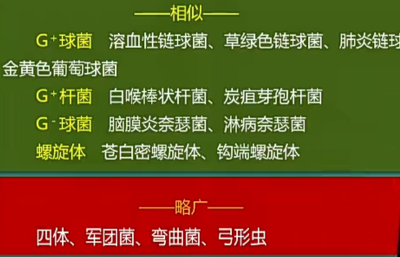
        > 四个军团弯曲如弓
        - **弯曲杆菌** 引起的肠胃炎； **军团菌（Lp）** 引起的肺炎； **百日咳杆菌** 引起的百日咳
        -  **支**  **原体、**  **衣**  **原体、**  **弓**  **形虫、立克次体、螺旋体**
        - <mark style="background-color:#fef3c7;"> **四个/军团/弯/弓/（射）一** </mark> **百** <mark style="background-color:#fef3c7;"> **个/太阳** </mark> *（G+ & 厌氧）*
          > Legionella pneumophila (Lp) 军团菌,  Campylobacter 弯曲杆菌, Bordetella pertussis百日咳杆菌，mycoplasma 支原体 chlamydia 衣原体，mycoplasma 支原体, chlamydia 衣原体，Toxoplasma gondii弓形虫， Rickettsia 立克次体
        - <mark style="background-color:#fef3c7;"> **“白衣空（空肠弯曲菌）军百支曲”（加了一个白喉）** </mark>
          - 耐青霉素或青霉素过敏者的金葡菌感染
      - 半合成（阿奇、克拉、罗红）：广谱
    - ## **2.作用机制** ——抑制蛋白质的合成（50S、延长阶段）
      - **抑制蛋白质的合成**  **（50S、延长）** 
        - 大环内酯类抗生素作用于  **50S 核糖体亚基，** 抑制 **转肽酶** 并 **干扰mRNA移位**
        - 阻止肽链 **延长** ，使其提前脱落
        - 对哺乳动物核糖体无影响
    - ## **3. 耐药：** 大环内酯易产生耐药性和 **交叉耐药性，主要是外排** 
      - **靶位点修饰（Target Modification）：** 核糖体50S结合位点发生构象改变
      - **产生灭活酶：** 质粒介导，打开内酯环
      - **主动外排系统增强/细胞膜通透性降低：**  **链球菌的外排系统是其主要耐药机制** 
    - ## **4.药代动力学/体内过程**
      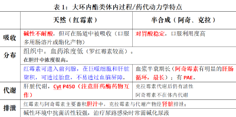
      - 吸收：红霉素可被胃酸灭活，但可在肠道内吸收。克拉霉素和阿奇霉素在胃酸稳定。
      - 分布：除了脑脊液。 **胆汁蓄积** 。天然macrolides **血药浓度低，所以不适合败血症。** 
      - 代谢：肝脏，细胞色素P450
      - 排泄：主要通过 **胆道。** 
    - ## **5. 临床应用**
      - <mark style="background-color:#fef3c7;"> **替代青霉素使用** </mark> **（链球菌感染；** 耐青霉素的金黄色葡萄球菌感染；对青霉素过敏者）
      - - 衣原体、支原体感染，<mark style="background-color:#fef3c7;">※</mark><mark style="background-color:#fef3c7;"> **非典型病原体的首选** </mark><mark style="background-color:#fef3c7;">；</mark> 社区性肺炎的一线用药
      - - 治疗军团菌病、白喉、百日咳；(<mark style="background-color:#fef3c7;">白衣军团百支曲</mark>/军团弯弓支援一百 ~~个太阳~~ ）
      - <mark style="background-color:#fef3c7;"> **- HP（幽门螺旋杆菌）感染：三联疗法** </mark>
      - - 皮肤软组织感染等
      - *大环内酯的新药理作用*
        - 非特异抗炎作用
          - 1.肺部和呼吸道炎症。直接抗菌；对哮喘，泛细支气管炎治疗作用
        - 抗支气管哮喘作用
        - 抗肿瘤作用
          - 2.抗肿瘤作用。凋亡与免疫，肿瘤与免疫间相互作用
          - 3.逆转肿瘤细胞多药耐药。红霉素逆转急非淋白血病对高三尖杉酯碱、阿糖胞苷等体内耐药，预防化疗期间感染发生
        - 促进胃肠动力作用
        - 免疫调节（抑制多糖蛋白复合物合成酶）
        - 抗寄生虫  抗真菌  抗病毒
    - ## **6. 不良反应**
      > 红伤心肠肝
      -  **胃肠道反应：** 主要联系它的碱性刺激——半合成药物胃肠道反应轻微。
      - **肝毒性：**  **※胆汁淤积、肝功能不良者禁用红霉素**  **（从胆汁排泄）** ；
      - **耳毒性：** 大剂量使用时出现（＞12mg/L)听力下降
      - **※Superinfections 二重感染**
      - **过敏性：** 少见
      -  **心脏毒性，LQTS——长 QT 间期综合征：** 静注过快/与茶碱合用时发生率更高
    - ## <mark style="background-color:#fef3c7;"> **7. 药物相互作用：青红合用不对路，绿林红争结合点，四红合用增肝毒** </mark>
      - 青霉素是繁殖期杀菌药，红霉素抑制细菌繁殖，红霉素用了之后青霉素无法发挥作用，所以 **青红合用不对路** 
      - 拮抗 **克林霉素、林可霉素、氯霉素** （作用位点相似）
      - 抑制 **茶碱、卡马西平、华法林的代谢** （血药浓度异常升高；延长凝血时间）
      - 促进 **环孢霉素** 吸收，引起腹痛、高血压及肝功能障碍
      - 增加 **地高辛** 肝肠循环，体内存留时间延长
  - # 一． <u>红霉素(erythromycin)、阿奇霉素、克拉霉素等</u>
    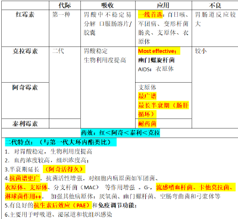
    - **红霉素（Erythromycin）**
      -  **概论说的主要就是它** 
      - 胃酸中不稳定易分解 口服肠溶片/胶囊
      - 红霉素<mark style="background-color:#fef3c7;">是</mark><mark style="background-color:#fef3c7;"> **百** </mark><mark style="background-color:#fef3c7;">日咳 </mark><mark style="background-color:#fef3c7;"> **军团** </mark><mark style="background-color:#fef3c7;">病 </mark><mark style="background-color:#fef3c7;"> **变形** </mark><mark style="background-color:#fef3c7;">杆菌肠炎 </mark><mark style="background-color:#fef3c7;"> **支原体 衣原体** </mark><mark style="background-color:#fef3c7;">的首选用药</mark>
      - 胃肠道反应较大
      - 一代大环内酯系列
        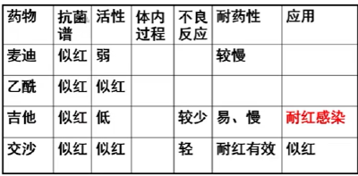
    - **二代大环内酯：克拉霉素（Clarithromycin）、阿奇霉素（Azithromycin）**
      - 更容易被吸收，生物利用度更高
      - 抗菌活性更高：更长的 PAE 和更明显的免疫调节作用
      - 不良反应：胃肠道反应比红霉素低
      -  **罗红**  **霉素（Roxithromycin）：** 生物利用度高  **血药浓度更高** 
      - **克拉霉素（Clarithromycin）：抗菌活性** <mark style="background-color:#fef3c7;"> **最强，** </mark>  **对胃酸最稳定（用于治疗幽门螺旋杆菌）**  ；对军团菌、 **衣** 原体效果最好。肺、扁桃体中蓄积；生物利用度略低。 **联用时：先使用阿莫西林，后使用克拉霉素** 
        - <mark style="background-color:#fef3c7;">治疗HP引起消化性溃疡：克拉克星，克拉霉素、克林霉素、沙星</mark>
      - **阿奇霉素（Azithromycin）：** <mark style="background-color:#fef3c7;"> **最广谱** </mark>的大环内酯类抗生素 半衰期最长 对 **支**  **原体肺炎** 是大环内酯最强；明显的PAE，肠肝循环，吃三天停三天
      - **泰利霉素（Telithromycin）：** <mark style="background-color:#fef3c7;"> **适用于耐药菌。** </mark>吸收度好，比阿奇霉素效果更好
  - # 二． <u>林可霉素类——</u>  <u>“抗厌氧、骨分布”</u> 
    > **林可霉素（lincomycin）** 和 **克林霉素（clindamycin）;与大环内酯类抗生素相互拮抗、交叉耐药。克林顿总统是骨干，一身正气，厌氧。身边很多小人（伪人），伪膜性肠炎。**
    - ## **1.抗菌能力：克林霉素克**  **厌氧** 
      - **抗菌谱：**  **G+ all；**  **但是对G-需氧菌无效** 
      - **抗菌机制：** 与大环内酯类类似，竞争50S结合位点，所以红绿林不可合用
    - ## **2.耐药性：** 位点修饰、主动外排、 **钝化酶（主要)** ；对肠球菌耐药；与大环内酯类抗生素交叉耐药
    - ## **3.药代动力学：** <mark style="background-color:#fef3c7;"> **骨分布** </mark>
      - 吸收：林可霉素吸收坏，克林霉素吸收好
        > 记：克林顿是正牌总统易进入白宫，林克顿是冒牌。
      - **分布：**  **在** <mark style="background-color:#fef3c7;"> **骨组织** </mark> **内** 很好
      - 排泄：胆汁和尿液
    - ## **4.临床应用：** <mark style="background-color:#fef3c7;"> **骨、腔感染** </mark>
      > 记：克林顿总统是骨干
      -  **金葡菌** <mark style="background-color:#fef3c7;">所致的急、慢性</mark><mark style="background-color:#fef3c7;"> **骨关节感染** </mark><mark style="background-color:#fef3c7;">——</mark><mark style="background-color:#fef3c7;"> **首选药** </mark><mark style="background-color:#fef3c7;">；</mark>
      - 部分厌氧菌感染，口腔、盆腔、腹腔（合用氨基苷类效果好，G-）
      -  **外用需氧G+菌** 引起的感染（红霉素软膏，克林霉素软膏）
    - ## *5.不良反应：*  *假膜性肠炎* 
      - 口服给药易发生<mark style="background-color:#fef3c7;"> **假膜性肠炎** </mark> **（AAPC, Antibiotic-Associated Pseudomembranous Colitis）** 
        - 难辨梭状芽孢杆菌大量繁殖，产生外毒素，需用 **万古霉素+甲硝唑治疗** 
          > 打小人（伪人）是遗名万古的任务，甲硝“假消”消除假膜
      -  **胃肠道反应常见** ，口服多见
        > 静脉缓慢滴注、不可静脉推注
      -  **二重感染** 
      - **肝、肾损害；** 神经肌肉阻滞作用：黄疸、血尿等；避免与其他阻滞剂合用
      - 过敏反应
  - # 三．多肽类抗生素：万古霉素、 多粘菌素、杆菌肽——抗菌特点&不良反应
    > 万古霉素（vancomycin）、去甲万古霉素（norvancomycin）、替考拉宁（teicoplanin）——使用最多
    - ## **万古霉素(Vancomycin）** 、去甲万古霉素、替考拉宁（teicoplanin）——使用最多
      - ### **抗菌能力：杀真菌剂；**  **窄谱 G+；** <mark style="background-color:#fef3c7;"> **繁殖期快速杀菌（细胞壁合成）** </mark>
        - 抗菌谱： **窄谱** ，对 **G+菌** ，尤其是对 **MRSA和MRSE、对**  **甲氧西林耐药**  **的菌** 有强大抗菌作用
        - 去甲万古霉素<mark style="background-color:#fef3c7;">抗</mark><mark style="background-color:#fef3c7;"> **脆弱拟杆菌** </mark><mark style="background-color:#fef3c7;">作用最强</mark>
      - ### **抗菌机制：** 与 **细胞壁** 合成前体肽聚糖五肽末端结合， **阻断高分子肽聚糖合成** ，从而 **抑制细胞壁形成** —— 因此 **对G-无效** 
      - ### **耐药性：难以产生**
        -  **肠球菌** ：产生修饰细胞壁前体肽聚糖的酶；
        -  **金葡菌** ：多种机制
          - 细胞壁增厚
          - 细胞壁成分改变
          - 青霉素结合蛋白（PBPs）变化
          - 耐药质粒传递
      - ### **药代动力学** ： **口服不能吸收** （但替考拉宁 **治疗肠炎时口服** ）
        -  **万古霉素** 不能肌内注射,会刺激局部肌肉组织坏死， **只能静脉注射** 
        - 替考拉宁可以i.m.
        - 炎症反应时可以通过血脑屏障
        - 肾小球滤过消除
      - ### **临床使用：一般不用，仅用于严重**  **耐药 G+** 感染
        -  **多重**  （MRSA MRSE）
        - **严重链球菌感染（对青霉素过敏）**
        - 常规的G+，一般用 **“青庆”** （青霉素联合氨基苷类），治疗失败的肠球菌、链球菌心内膜炎再上万古霉素
        - 治疗假膜性肠炎： **替考拉宁**  **最好**  **（此时需要口服）** 
      - ### **不良反应——**  **红人** 
        - 多
        - **高**  **耳毒性、肾毒性** 
        - **变态反应：**  **红人综合征（Red Man Syndrome, RMS）** 
          - 极度的皮肤潮红、红斑、荨麻疹、心动过速、低血压等特征性症状
          -  **万古霉素促进组胺释放** 
          - 解救：使用 **抗组胺药** 和 **糖皮质激素** 
        -  **单给** 
          - *静注液中不宜加氯霉素、甾体激素、甲氧苯青霉素等，以免产生沉淀*
          - *禁止与碱性溶液配伍 禁止与重金属接触 禁止与具有肾毒性、耳毒性的药物合用*
    - ## **多黏菌素（Polymyxins）**
      - 临床上多用 **多黏菌素B、 多黏菌素 E**
      - **抗菌活性：**  **窄谱** 、慢效， **部分G—杆菌、** <mark style="background-color:#fef3c7;"> **铜绿假单胞菌** </mark>
      - **抗菌机制：**  **破坏、裂解细胞**  **膜→** 物质外漏
      - **临床应用：** <mark style="background-color:#fef3c7;"> **耐药株很少，** </mark>用于耐药铜绿假单胞菌、革兰氏阴性杆菌感染， **局部应用** 
      - **不良反应：毒性很大，肾神。**  **肾毒性（25%）** 、 神经毒性、变态反应
    - ## **杆菌肽**
      - **抗菌能力：**  **慢效杀菌**  **药物；** 对 **G+菌** 有强大抗菌作用（对耐β-内酰胺酶的细菌也有作用），对G-球菌、螺旋体、放线菌有一定作用，对G-杆菌无作用
      - **作用机制：** 选择性 **抑制细菌细胞壁合成** 过程中的 **脱磷酸化** ，阻碍 **细胞壁合成** ，同时 **破坏细胞膜** ，使内容物外漏，细菌死亡
      - **体内过程：** 口服不吸收，只能局部给药
      - **不良反应** ：有 **严重的肾毒性** ， **仅用于**  **局部抗感染** 
  - ## <mark style="background-color:#fef3c7;"> **思考题** </mark>
    - 1.请阐述macrolides的抗菌谱及作用机制？
    - 2 第二代大环内酯类pk/pd有何特点？
    - 3.阿奇霉素克林霉素的抗菌作用和临床应用有何特点？
    - 4 Vancomycin类与β lactamantibiotics在作用机制和抗菌谱上有何不同？
    - 5. 简述多黏菌素的抗菌作用机制
  - ## **小结**
    - **1.红霉素在胆汁中浓度高，主要**  **经胆汁排泄** 
    - **2.红霉素抗菌谱的特点：**  **与青霉素相似而略广**  **，“广”在对某些**  **G-杆菌**  **、军团菌、支原体、衣原体、立克次体、厌氧菌**  **有效**
    - **3.红霉素的抗菌机理：抑制蛋白质的合成（50s）**
    - **4.红霉素首选用于军团菌、弯曲杆菌、支原体、衣原体感染、白喉带菌者**
    - **5.红霉素主要不良反应：胃肠道反应**
    - **6. 其他第一代大环内酯类与红霉素比较主要特点是不良反应较轻**
    - **7. 第二代大环内酯类的特点有哪些？**
      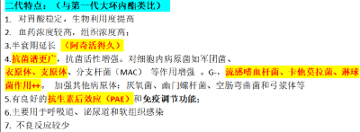
    - <mark style="background-color:#fef3c7;"> **8.** </mark> <mark style="background-color:#fef3c7;"> **林可霉素类主要作用于** </mark> <mark style="background-color:#fef3c7;"> **G+菌，对 G-杆菌无效** </mark>
    - **9. 林可霉素类的抗菌机理：与红霉素相同**
    - **10. 林可霉素类主要特点：**  **骨组织**  **浓度高**
    - **11.林可霉素类首选用于：金葡菌性急/慢性骨髓炎**
    - **12. 林可霉素类主要不良反应：胃肠道反应**
    - **13. 万古霉素类对 G**  **+**  **菌作用强大，对 G**  **-**  **菌无效**
    - **14. 万古霉素类的抗菌机理：抑制**  **细胞壁粘肽**  **的合成**
    - **15.**  **万古霉素类禁与氨基苷类、高效利尿药合用** 
    - **16.**   **多粘菌素类仅对 G-杆菌**  **作用强大，尤其**  **绿脓杆菌**  **，为**  **窄谱**  **杀菌剂**
    - **17. 多粘菌素类的抗菌机理：增加**  **胞浆膜的通透性** 
    - **18.**  **多粘菌素**  **类的主要不良反应：**  **肾毒性** 
- # 四环素（~cycline）   氯霉素（ chloramphenicol）（1 学时）
  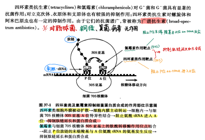
  - “广谱抗生素”：G+、G-、立克次、支、衣原体；四环素对螺旋体和阿米巴也有抑制作用
  - # 一. 四环素(Tetracycline)
    > **多西环素（Doxycycline）/ 强力霉素** 、米诺环素（Minocycline）、替加环素（Tigecycline）
    - ## **四环素类（**  **Tetracyclines**  **）**
      - 分类
        - 天然： **土霉素（**  **oxy**  **tetracycline）**  **四环素（tetracycline）**  **地美环素**
        - 部分合成： **多西环素（Doxycycline）**  **美他环素（Methacycline） 米诺环素（Minocycline）**
      - <u>**抗菌能力**</u>  **：**  **广谱，快速，抑菌** 剂；高浓度杀菌。<mark style="background-color:#fef3c7;">谱广效弱，所以大boss（铜绿、伤寒、结核）抗不了</mark>
        - 二菌（细菌+放线菌）四体一虫灵（阿米巴），基本无效伤绿结。
        - 霍乱，布氏，Hp ✔
        - 对 **肠球菌、铜绿假单胞菌** 、伤寒、结核没有作用
      - <u>**作用机制**</u>
        - **抑制蛋白质的合成：**  **30S** 
          > 氨基苷类抗生素是全程
          - 结合30S 小亚基， 阻止 tRNA 转移到核糖体A 位
          - 阻止 **延长** 
        - **破坏细胞膜，物质外漏**
        - 抑制DNA复制
      - **耐药性：** 易产生；渐进性；天然药之间交叉耐药
        - **外排**
          - 细胞外膜孔蛋白减少
          - 将四环素泵出胞外 降低血药浓度
        -  **核糖体保护蛋白** 
          - 改变核糖体构型，阻止四环素与核糖体结合
        - **四环素钝化酶**
      - <u>**体内过程/药代动力学**</u>
        -  **口服吸收** 不完全，吸收率差别很大
          -  **影响其吸收的因素** 
            - - 多价阳离子（Ca2+、Mg2+等）——形成络合物；若需服用铁剂，两药的服药间隔需＞3h。
              > 分布：组织和体液中。 **四环素**  **可以结合 Ca2+ 沉积于骨骼和牙齿之中**  —— **对牙齿和骨骼影响：四环素牙** 
            - -抗酸药、抗贫血药及食物、奶制品——空腹服用
            - - 胃酸酸度：酸度高，吸收好。
            - -合用H2-R阻断药、NaHCO3等可减少四环素吸收
            - 吸收量有限：当服药量＞0.5g时，多的吸收不了（有饱和性）；
            - 多西环素优秀：吸收好，脑脊液浓度高。
        - 分布：组织和体液中。 **四环素**  **可以结合 Ca2+ 沉积于骨骼和牙齿之中**  —— **对牙齿和骨骼影响：四环素牙** 
          - 天然四环素不易通过血脑屏障，但半合成四环素在脑脊液浓度很高
          - 多西环素的胆汁、尿液浓度高（见下文“排泄”）
        - 排泄：胆汁和肾脏。 **肝肠循环 ——特别注意** <mark style="background-color:#fef3c7;"> **多西环素** </mark> **久** 
          -  **多西环素** 、米诺环素肝肠循环明显。半衰期长
            > 联系：大环内酯类 阿奇霉素
            -  **从多西环素的排泄途径推知临床应用** 
              - **原形经肾小球滤过，尿液药浓较高——**  **尿路感染** 
              - **存在肝肠循环，胆汁药物浓度较高——**  **胆道感染** 
      - <u>**临床应用**</u>
        - 使用本类药物时，首选 **多西环素** 
        - （1）<mark style="background-color:#fef3c7;"> **立克次体感染：** </mark>斑疹伤寒、羌虫病  <mark style="background-color:#fef3c7;"> **首选** </mark>
        - （2）<mark style="background-color:#fef3c7;"> **衣原体感染** </mark>：鹦鹉，沙眼、肺炎（克拉霉素也有效）   <mark style="background-color:#fef3c7;"> **首选** </mark>
        - （3）<mark style="background-color:#fef3c7;"> **支原体：** </mark>非典型性肺炎（阿奇霉素也有效）、尿道炎   <mark style="background-color:#fef3c7;"> **首选** </mark>
        - （4）螺旋体：<mark style="background-color:#fef3c7;"> **回归热  首选** </mark>（青霉素也有效。注：梅毒螺旋体首选青霉素。）
        - <mark style="background-color:#fef3c7;"> **首选—某些细菌感染：** </mark><mark style="background-color:#fef3c7;">霍乱、布鲁氏菌病</mark>；
        - 鼠疫、幽门螺杆菌引起的消化性溃疡
      - <u>**不良反应——**</u>  <u>**注意二重感染和对骨骼牙齿的影响**</u> 
        - **胃肠道反应：** 最常见
        - **二重感染（Superinfection）/ 菌群失调症**
          - 应用 **广谱药** 物时（ <u>四环素类、氯霉素类、氟喹诺酮类、庆大霉素等</u> ），敏感菌被抑制， <u>不敏感菌趁机大量繁殖，引起的新的感染</u> 。婴儿、老年人、体弱者、合用糖皮质激素或抗肿瘤药等 **抵抗力较弱** 的患者容易发生。
          - 较常见
          - - 真菌感染 白色念珠菌感染所致的鹅口疮等 +抗真菌感染；
          - - 对四环素耐药的难辨梭状芽孢杆菌感染所致的假膜性肠炎（剧烈腹泻、发热、肠壁坏死、体液渗出甚至休克死亡）——立即停药+万古霉素/甲硝唑
        - **对牙齿和骨骼影响：四环素牙**
          - 四环素牙——牙齿黄染，牙釉质发育不全
          - 婴幼儿骨骼生长抑制—— **孕妇、幼儿禁用**
        - **光敏反应：**  服用四环素类抗生素的患者易晒伤，多见于 **地美环素、多西环素** 
          > 两个光敏：四环素、氟喹诺酮
        - **前庭反应：** 头昏眼花
        - 肝毒性、 肾毒性
    - ##  <u>**多西环素（Doxycycline）/ 强力霉素**</u> 
      -  **快速、高效、长效** ，<mark style="background-color:#fef3c7;">最常用的四环素，</mark>高浓度时才可杀菌
      - 吸收：不受食物影响
      - 分布：脑脊液中浓度高
      - 代谢、排泄：在肝中代谢， **存在肝肠循环** ；经胆汁、尿液排出，故肾衰时仍可使用；
      - 对四环素或青霉素耐药的细菌仍敏感
      - 副反应较小：主要是胃肠道反应、光敏反应
    - ##  **米诺环素（Minocycline）** 
      - <mark style="background-color:#fef3c7;">效果最强的四环素</mark>  **长效、最强** 
      - 广、组织穿透力强（用于痤疮；可过BBB）
      - 不良反应较多，易出现 **前庭损害** ——首剂发生快速，女性高于男性
    - ## **替加环素（Tigecycline）**
      - 最广谱，多种多重耐药菌，但 **仅对铜绿假单胞菌无效**
      - 口服难以吸收 需要静脉给药
  - # 二、氯霉素(Chloramphenicol)
    -  **广谱、抑菌，** 高浓度杀菌
    - **体内过程：**  **脂溶性高，易穿过各种屏障**  **，** 可进脑脊液、眼、胎儿，典型的 **肝药酶抑制剂** 
    - **抗菌谱**
      - 对真菌 结核分枝杆菌 病毒 原虫 **无效** 
      - G-： **尤其对**   **伤寒、副伤寒、流感、肺炎**  **链球菌、**  **脑膜炎**  **球菌、嗜血杆菌 有效**
      - G+：不如青霉素、四环素
      - 对厌氧菌、各种体有效
        > 厌氧菌、支原体、衣原体、立克次体、螺旋体
    - **作用机制：** 核糖体50S 亚基，可逆结合，抑制肽酰转移酶的转肽反应，阻止肽链延伸，使蛋白质合成受阻（对真核细胞也有较弱作用）
      - 作用位点与大环内酯类和林可霉素类相似，同时应用可产生拮抗作用
    - **耐药性：** 产生很缓慢，主要靠氯霉素乙酰转移酶使药物失活
    - **临床应用：** 毒性很大，不作为一线药物
      - 伤寒、副伤寒（ **首选氟喹诺酮或三代头孢** ）
      - 流感、嗜血杆菌感染引起的脑膜炎
      - 局部滴眼液
    - <u>**※ 不良反应：**</u>  <u>**尤其注意血液系统毒性严重**</u> 
      - 胃肠道反应、肝肾损害
      - 二重感染（Superinfection）/ 菌群失调症
      - **骨髓抑制  血液系统毒性**
        - **剂量相关——可逆性骨髓抑制&**  **血细胞减少** ：剂量、疗程依赖
        - **剂量无关——不可逆性骨髓毒性&**  **再生障碍性贫血** ：可致死，与剂量无关
        - *防治措施：严格掌握适应症，详细询问有无与药物相关的血液毒性既往史；定期检查血象，发现异常立即停药；每日剂量不宜超过1g，疗程一般为5~7d（治伤寒、副伤寒可酌情延长）*
      -  **灰婴综合征**  **：** 早产儿、新生儿缺乏氯霉素脱毒能力（本质：缺乏6-磷酸葡萄糖脱氢酶），引起氯霉素蓄积
        - 表现为呕吐低温呼吸困难、循环衰竭、发绀和休克、进行性血压下降
        - 缺乏6-磷酸葡萄糖脱氢酶、肝功不好的人都不宜使用
      - 精神病禁用：引起精神病患者严重失眠、幻视、狂躁、抑郁
      - 药物互作
        - 肝药酶抑制剂：增加苯妥英钠、甲苯磺丁脲、氯磺丙脲、双香豆素的血药浓度
        - 同位点（50S）相互拮抗：与林可霉素类、大环内酯类有拮抗作用；
        - 同作用时期相互拮抗（繁殖期杀菌剂 & 快速抑菌剂）：与青霉素类合用时产生拮抗
  - ## 习题
    - 1. 请阐述四环素的抗菌谱及作用机制？
    - 2. 四环素的不良反应？
    - 3. 氯霉素的不良反应？
- # **人工合成抗菌药（2 学时）**
  - # 一、 <u>喹诺酮类 Quinolones</u>
    > **沙星。广谱 、静止期、抑菌剂**
    - 每一代药物在 **4-喹酮** 母核基础上改结构
    - 第2代：吡哌酸  **pipemidic acid**  对多数<mark style="background-color:#fef3c7;"> **G-** </mark>有效，仅用于治疗 **泌尿道、肠道** 感染；
    - 第3代  **氟喹诺酮类Fluoroquinolones** ： <u>**诺氟沙星norfloxacin 、环丙沙星ciprofloxacin、氧氟沙星ofloxacin**</u> 、氟罗沙星 fleroxacin、左氧氟沙星 levofloxacin、依诺沙星、司氟沙星sparfloxacin 等
    - 第4代 加替gatifloxacin、莫西 moxifloxacin 等+  **“沙星” ,** 
    - ## **药物共性**
      - ### 基本结构： **4-喹酮** 母核
      - ###  **广谱 、**  **静止期、**  **抑菌** 剂
      - ### <u>**抗菌谱：广**</u>
        - 第2代 （吡哌酸）：mainly肠杆菌科，泌尿道和肠道感染；
        - 第3代 氟喹诺酮类（fluoroquinolones） <u>**最为常用。**</u> 对 **G-菌** 作用增强，对 **金葡菌、肺炎球菌、溶血性链球菌、肠球菌** 等 **G+** 球菌及 **结核杆菌** 有效；
          - 诺氟沙星（Norfloxacin）、氧氟沙星（Ofloxacin）、 环丙沙星（Ciprofloxacin） 、左氧氟沙星（Levofloxacin）
          - 新喹诺酮类药物（司帕沙星）对结核杆菌有强大的抑制作用，对耐药结核菌有效
        - <mark style="background-color:#fef3c7;"> **环丙沙星对铜绿假单胞菌作用最强** </mark>
        - 第4代 对衣原体、支原体、军团菌，特别是 **厌氧菌** 等病原体有效。
      - ### <u>**抗菌力：抑菌，不杀菌**</u>
      - ### <u>**机制**</u>
        - 抑制  **DNA 拓扑异构酶**   **II (G-)**   **IV(G+),**  其中II又名  **DNA回旋酶** ，影响 **DNA 复制**
          > 复制过程中解旋所必须；每次考试都会考到这个靶点。记住是拓扑异构酶“阳四”“阴二”
        - *诱导细菌启动DNA的SOS修复，出现DNA错误复制；*
        - *- 抑制细菌RNA及蛋白质的合成；*
        - *- 明显的PAE效应。*
      - ### *耐药性*
        - **细菌靶位改变：** 细菌  **DNA 回旋酶** 突变 影响喹诺酮的结合
        - **菌体内药物浓度降低：** 细胞膜对药物的通透性下降
        - 喹诺酮类抗生素之间存在 **交叉耐药性** 
      - ### *体内过程*
        - 吸收容易被金属阳离子影响——注意 **环丙沙星** 与 **抗酸药 antacid** 合用，作用降低
        - 氧氟沙星、环丙沙星可透过血脑屏障
          > 中枢毒性；阻断GABA-R；慎与NSAIDS、茶碱合用
      - ### **喹诺酮类临床应用**
        > 泌尿、胃肠、呼吸、骨关节软组织
        -  **——全身感染** 
          > 抗菌谱广、抗菌活性强、口服吸收良好、与其他类别的抗菌药之间较少交叉耐药
        - **1. 泌尿生殖道感染（最典型）**
          - 泌尿生殖道感染 **首选：** 环丙沙星、氧氟沙星、β-内酰胺类，eg 单纯性淋球菌尿道炎或宫颈炎
          - 肠球菌 <mark style="background-color:#fef3c7;"> **铜绿假单胞菌** </mark>引起<mark style="background-color:#fef3c7;"> **尿道感染，首选环丙沙星** </mark>
        - **2. 肠道感染（食物中毒）、伤寒**
          - <mark style="background-color:#fef3c7;"> **志贺菌の细菌性痢疾、沙门菌の胃肠炎的首选用药（食物中毒）** </mark>
          - <mark style="background-color:#fef3c7;"> **沙门菌伤寒、副伤寒** </mark><mark style="background-color:#fef3c7;">——</mark><mark style="background-color:#fef3c7;"> **首选** </mark>氟喹诺酮类、 **联用**  **头孢曲松(3代)** 
        - **3. 呼吸道感染**
        - **4. 骨、关节、软组织感染**
          - 慢性骨髓炎、革兰氏阴性菌感染引起的骨关节炎—— *可以达到骨关节腔* 
            > link：林可霉素、
        - Others （kkjk）
          -  **化脓性脑膜炎** 的根除治疗
          - 高度耐青霉素肺炎链球菌首选左氧氟沙星/莫西沙星+万古霉素
          - 支原体/衣原体/军团菌肺感染可用氟喹诺酮类替代大环内酯类
      - ### **喹诺酮类不良反应**
        - 总体不良反应率低
        - **胃肠道反应**
        -  **中枢神经反应**  **：** 联用茶碱、 **解热镇痛药** 易发生（阻止 GABA 与受体结合，过度兴奋、紊乱；氟原子，脂溶性↑，BBB）
          - **※精神病、癫痫病史者禁用** ；环丙、诺氟等与茶碱合用，可使茶碱血药浓度升高，合用茶碱、NSAIDs者易出现神经毒性；
        -  **光敏性：** 强于 **四环素，** 易引起光敏性皮炎
          > 注意戴墨镜打伞
        -  **骨损伤**  **：与 Mg2+结合沉积于软骨，引起软骨缺陷。**  **不能用于儿童**  **、孕妇**
          > 且年龄越小越不能用沙星！
        - **心血管毒性**
          - 避免与延长QT间期的药物合用：胺碘酮、奎尼丁、普鲁卡因胺、索他洛尔
      - ### **禁忌症**
        - 儿童、孕妇、哺乳妇女
        - 精神病、癫痫、惊厥病史者
        - 慎与茶碱、咖啡因、NSAIDs、华法林合用：①抑制其肝脏代谢；②中枢神经反应
        - 避免与含金属离子的药物或食物同服（环丙沙星 & 抗酸药 直接络合）
        - 避免与延长QT间期的药物合用：胺碘酮、奎尼丁、普鲁卡因胺、索他洛尔
        - 用药后避免日照（光敏性）
    - ## 典药特点
      - ### <u>诺氟沙星、</u> 氟哌酸：尿路和肠道感染
      - ### <u>环丙沙星：</u>  **铜绿假单胞菌** 、G-好；厌氧菌无效。
      - ### <u>氧氟沙星</u>
        - 抗菌活性高。对G－，G＋菌，包括铜绿单胞菌作用较强；对肺炎支原体、 **衣原体** 、厌氧菌、奈瑟菌属和 **结核杆菌** 也有一定作用
        - 可透过BBB
      - 氟罗沙星、依诺沙星、司氟沙星、奈诺沙星
    - ##  **典型三大可用于肺炎衣原体的药：沙星、克拉霉素（大环内酯类）、四环素类（多西环素）** 
  - # 二、磺胺类 Sulfonamides、抗菌谱、抗菌力、 <u>作用机制</u> 、耐药性、体内过程、不良反应。
    > <u>**广谱、慢效**</u>  **（** 需要很高浓度才能杀菌 **）、抑菌剂; 竞争性抑制二氢蝶酸合成酶**
    - ### 结构：类似 **PABA**  （对氨基苯甲酸）——体内 **二氢叶酸合成前体** 
    - ### <mark style="background-color:#fef3c7;"> **重要特点** </mark>： <u>**慢**</u>  <u>**效**</u>  **（** 需要很高浓度才能杀菌 **）、**  **广谱**  **、**  **抑**  **菌剂**
    - ### 分类
      > 只需要掌握这两个： **SD** 、 **复方新诺明（SMZ+TMP）** ，其余掌握共性，知道名字
      - 全身： **磺胺嘧啶 SD** （可透过BBB）、 **磺胺甲𫫇唑 SMZ**  *，SIZ，SDM*
      - 局部：柳氮磺吡啶 SASP （肠道）；磺胺醋酸钠 SA 、磺胺嘧啶银SD-Ag（外用）
      -  **复方新诺明 cotrimoxazole：SMZ + TMP** 磺胺甲𫫇唑+甲氧吡啶
    - ### **抗菌谱**
      -  **广谱但**  **螺 立 支**  **“三体无效”，尤其注意立克次体不减反增** ： **反而刺激立克次体生长**
    - ### **磺胺类抗菌药的机制——**  **干扰细菌四氢叶酸的合成** 
      - 靶点： **二氢蝶酸合成酶** 
        - 催化对氨基苯甲酸 PABA 生成二氢叶酸。磺胺类药物与 PABA 类似、可与PABA 竞争，阻止细菌二氢叶酸合成，影响嘌呤、嘧啶代谢，抑制生长繁殖
          > 对哺乳动物影响小： **动物可将食物中的叶酸还原为四氢叶酸，而细菌必须依赖二氢蝶酸合成酶**
    - ### **磺胺的耐药性——高，不可逆**
      - 随机突变或质粒转移
      - 细菌对磺胺的通透性降低
      - 改变靶点，磺胺与二氢叶酸合成酶的结合能力下降
      - **细菌产生更多的 PABA：** 抵消磺胺对二氢蝶酸合成酶的拮抗作用
    - ### **体内/药代**
      - 可以透过BBB *（*  *可以抗流脑）* ，但不能进入细胞内液
      - 肝脏代谢, 产物乙酰化磺胺 **对肾脏有毒性**
        > 一般乙酰化产物对肾脏都有毒性。
        > 药物代谢中的乙酰化反应：极性降低，水溶性变差，从而导致药理效应降低。结晶尿
    - ### **磺胺的三大临床应用：全身（流脑）、胃肠、局部（眼科 皮肤）**
      - **全身性感染**
      - **流脑：** 可以透过血脑屏障。<mark style="background-color:#fef3c7;"> **首选SD 磺胺嘧啶治疗脑膜炎奈瑟菌引起的流行性脑膜炎** </mark>（ **磺胺嘧啶 Sulfadiazine, SD**  **，掌握这个知识点！** ）
      - **胃肠道感染：** 柳氮磺吡啶（Sulfasalazine） SASP
        > 在肠道分解成 **磺胺吡啶** 和 **5-氨基水杨酸盐** ；前者有抗菌作用，后者具有抗炎和免疫抑制作用，还用于强直性脊柱炎
      - <mark style="background-color:#fef3c7;"> **呼吸道感染、伤寒、菌痢** </mark>：（ **磺胺甲恶唑 Sulfamethoxazole**  与 TMP 合用，组成 **复方新诺明 SMZ + TMP** ）
      - 烧伤（铜绿、金葡、破伤风）：甲磺米隆（磺胺米隆）（Mafenide, SML）、SD-Ag
      - 眼科：磺胺醋酰（Sulfacetamide, SA）
    - ### **磺胺的不良反应**
      - **肾脏损伤：**  **结晶尿（Renal Crystalluria），磺胺类典型不良，多次考“如何解毒”。尤其是**   **磺胺嘧啶 SD**
        > 代谢产物为乙酰类的物质都是肾毒性
        - 使用磺胺类药物时注意 **碱化尿液、大量喝水** 
      - **过敏反应：** 磺胺类药物以衍生物交叉过敏
      - **血细胞生成障碍：**   **G-6-P 缺乏，**  **溶血性贫血** 、再障。定期补充叶酸
      - **胆红素脑病（Kernicterus）：** 竞争血浆蛋白，引起新生儿黄疸，血浆胆红素↑
      - **肝损伤**
  - # 三．其它合成抗菌药
    - ## <u>1、</u>  <u>**甲氧吡啶（Trimeth/o/prim, TMP）**</u>  <u>：增强磺胺抗菌作用；机制</u>
      > 选择题必考，磺胺嘧啶 & 甲氧吡啶
      -  **二氢叶酸还原酶抑制剂，** 抗菌谱与磺胺类似，常与 SMZ 合用， **双向阻断使抑菌作用转变为杀菌作用** 
        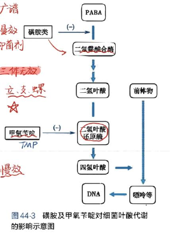
        > 抑菌→杀菌，耐药性↓，不良反应↓
      -  **※复方新诺明** （SD：TMP=5：1）
        > 掌握！大题也可能考
        - **为什么可以合用？**
          - 先阐述图44-3
            - 细菌叶酸代谢需要PABA经二氢蝶酸合成酶（磺胺抑制）生成二氢叶酸，再经二氢叶酸还原酶（TMP抑制）生成四氢叶酸。
          - - 两者药代学参数相近，血药浓度可同时达峰；
          - - 合用对细菌叶酸合成起 **双重阻断** 作用，抗菌活性↑，抑菌→杀菌；
          - - 抗菌 **谱扩大** ， **耐药** 菌减少；
          - - 合用时药量↓，不良反应发生率↓
      - **临床应用：急性泌尿道感染（** 常常与 SMZ 合用（复方新诺明））
      - **不良反应：** 长期应用引起 **巨幼红细胞性贫血，** 应停药、补充甲酰四氢叶酸
    - ## <u>2、</u>  <u>**甲硝唑（Metro**</u>  <u>**nidazole**</u>  <u>**, 灭滴灵）**</u>  <u>的临床应用</u>
      - **作用机制：** 分子中的硝基在细胞内无氧环境下被 <u>厌氧菌</u> 还原成氨基，破坏细菌DNA
      -  **※用时需戒酒 双硫仑反应** 
      - **临床应用：** “四抗”
        - <mark style="background-color:#fef3c7;"> **抗厌氧菌（破伤风）、抗阿米巴（包囊无效）、抗滴虫的首选药物** </mark>
        - 抗蓝氏贾第鞭毛虫
        - 难辨梭状芽孢杆菌引起的 **伪膜性肠炎（link：四环素耐药菌引起的二重感染）** 
    - 3、呋喃坦啶 (furadantin，aka 呋喃妥因 )、呋喃唑酮(痢特灵，furazolidone)的作用特点
      - 广谱（铜绿 单胞菌不敏感），强(5- μg／mL)，尤其pH低时。耐药性低
      - 不良反应：胃肠道反应、 **周围神经炎**
      - 作用机理：干扰糖代谢？
      - 呋喃妥因(furadantin)：口服吸收，尿中浓度高；——主用于泌尿道感染，代谢物为棕色。
      - 呋喃唑酮(furazolidone，痢特灵)：口服吸收少，用于胃肠道感染，包括痢疾，霍乱，胃溃疡的治疗，尿液黄染
        > 口服吸收少才能多到达胃肠道分解
    - <mark style="background-color:#fef3c7;"> **典型三大可用于肺炎衣原体的药：沙星、克拉霉素（大环内酯类）、四环素类（多西环素）** </mark>
    -  **衣原体问诊线索：家中养鸟多个** 
  - ## 习题
    - **1. 简述氟喹诺酮类药物的药理学共同特点**
    - **2. 磺胺类药物有哪些常见的不良反应？如何预防？**
    - **3. 简述复方新诺明的组成，机制及临床意义。**
    - **4. 在磺胺类药物中，用于治疗流脑、伤寒、烧伤创面绿脓杆菌感染、沙眼的是哪些药？**
    - **5. 简述甲硝唑的药理作用**
- # **抗结核病药（**  **1.5**  **学时）**
  > 主要要求掌握异烟肼、利福平
  - # 结核分枝杆菌：①胞内寄生菌（异烟肼脂溶性高、穿透力强、抵达病灶和胞内）；②外层由分枝菌酸包裹，普通药物难以发挥作用；③易产生耐药性（耐药选贝达喹啉）
    -  **一线抗结核：**  **异烟肼（Isoniazid, INH） ，利福平（Rifampin）， 链霉素（Streptomycin） ，乙胺丁醇（Ethambutol） ，吡嗪酰胺（Pyrazinamide, PZA）**
    - **二线抗结核：** 对氨基水杨酸（PAS） 、乙硫异烟胺（ethionamide）、氟喹诺酮类
    - 新药：贝达喹啉 bedaquiline
  - # <u>**异烟肼（Isoniazid）**</u>
    > <u>**高选择性，专职抗痨**</u>   快慢代谢    结核首选  繁殖期杀（抑制 <u>**分枝菌酸**</u> 、 <u>**DNA**</u> ）； **类似Vit B6** ，周围神经炎（GABA脱羧酶++）
    - 异烟肼是针对异烟肼敏感<mark style="background-color:#fef3c7;">结核分枝杆菌感染</mark>的 **预防** 和治疗<mark style="background-color:#fef3c7;"> **首选用药** </mark>
    - **体内/药代**
      > 以后没特别说就是 肝代谢肾排泄
      -  **穿透性强，脂溶性高** 
      - 口服吸收完全而迅速 ，广泛分布于全身，可渗入胞内、 **干酪样及纤维化结核病灶** 中
      -  **肝脏代谢** ，人群基因差异决定快慢（注意：分为  **慢代谢、快代谢** ）
    - **药理作用：** <mark style="background-color:#fef3c7;"> **抗菌谱；抗菌活性(强弱？杀抑?)；繁殖期or静止期；机制；耐药性（联合用药）** </mark>
      > 杀菌特点：高度选择性；细胞内外均可；强大；性质：繁殖期，杀菌 bacteriocide
      - **抗菌谱：**  **仅结核杆菌** （高度选择性杀菌作用）
      - **抗菌活性：** 强大，对 **胞内外** 均有杀菌作用
      -  **繁殖期**  **杀** 菌剂（联系机制记忆，“抑制合成”，繁殖期作用强，静止期作用弱）
      - **机制**
        > 细胞壁、代谢、DNA 三方面干扰占完了，最具特色的是细胞壁，针对分枝菌酸决定了其高度选择性抗菌。
        - 1. 抑制 **分枝菌酸** 合成酶（结核杆菌特异性）— **→** 细胞壁 **×** 
        - 2. 抑制 **DNA** 合成；
        - 3.  **干扰代谢** 。
      - **耐药性：** 单用易耐药， **联合用药** 可延缓（对其他抗结核药物无交叉耐药）
        > 早期轻症、预防、巩固可以单用，规范化治疗 <u>**必须**</u> 与其他药合用
    - **临床应用：** 各种结核首选药，注意联合用药
    - **不良反应**
      - 基于化学结构 **与维生素B6相似** 、经 **肝代谢** 、 **抑制肝药酶** 三大特点
      - **（1）周围神经炎（** 四肢麻木、震颤、步态不稳） **、中枢神经症状** （眩晕、失眠、兴奋、精神错乱）
        - 机制：化学结构与Vit B6相似， **竞争性抑制Vit B6参与的GABA合成** ；
        - 预防： **及时补充Vit B6** 
      - **（2）肝损害**
        - 乙酰化代谢物所致，老年、酗酒、 **快代谢型** 多见
        - 用药期间可出现转氨酶升高、黄疸、多发性肝小叶坏死
        - **※异烟肼为**  **肝药酶抑制剂（**  **伏笔：异烟肼有药酶抑制作用 利福平有药酶诱导作用**  **）** 
          > 记：异与抑同音；利与诱同意
      - （3）过敏、胃肠道反应
  - # <u>**利福平（Rifampin）**</u> ；利福喷丁 （rifapentine）、利福定（rifabutin）
    > **广谱，兼职抗痨，联合使用** （结核 麻风 金葡 沙眼衣原体）       繁殖、静止期全杀（抑制DNA依赖性的RNA pol，即mRNA合成）
    - 体内过程
      - 吸收易受食物影响，推荐空腹服用（伏笔：胃肠道不良反应），可透过血脑屏障
      - 代谢产物为红色（抗结核药服用者，红色粪便），使用时现配现用
      - 经 **胆汁** 排泄（治疗重症胆道感染）
    - **药理作用 ——** <mark style="background-color:#fef3c7;"> **抗菌谱；抗菌活性(强弱？杀抑?)；繁殖期or静止期；** </mark><mark style="background-color:#fef3c7;"> ~~*机制；耐药性*~~ </mark>
    - **抗菌谱：广谱全杀，** 繁殖期 静止期 胞内胞外均有效
      - ✓ 分枝杆菌：结核分枝杆菌、 <u>麻风</u>  <u>分枝杆菌</u> ；（用于麻风病（合用氨苯砜））
      - ✓ G+球菌 （活性＜青霉素G，＞红霉素、头孢），尤其是对于耐药金葡菌；
      - ✓  **G-** 菌，高浓度时对某些病毒、沙眼衣原体也有抑制作用
    - **抗菌活性强大**
    - 机制：）；
    - **作用机制：** 抑制 **DNA依赖性**  **RNA pol** ，阻碍细菌mRNA的合成（对人、动物的无影响）
    - **利福平的临床应用**
      - 结核病（与其他药联合）；
      - 麻风病（合用氨苯砜）
      - 耐药金葡菌
      - - 局部，主要是眼睛（沙眼、急性结膜炎等）
      - - 重症胆道感染；（胆汁排泄）
    - **利福平的不良反应**
      - 胃肠道反应为主（link：食物影响吸收，推荐空腹服用）
      - 肝毒性：与异烟肼合用肝毒性增加；
        - ※ **利福平为**  **肝药酶诱导剂**  **（注意：异烟肼和利福平一上一下，异烟肼抑制肝药酶，利福平诱导肝药酶，但都在肝脏代谢）** 
      - 致畸性： **※妊娠早期禁用** 
      - 大剂量间隔使用时，可引起   “流感综合征”
    - 利福喷丁 （rifapentine）、利福定、利福布汀（rifabutin）
      - 与利福平一起，三者之间交叉耐药；其中，利福布汀是不完全交叉耐药
      - 利福喷丁 （rifapentine）：更长效、高效
      - 利福定（rifabutin）：活性更大，进入细胞内浓度更高。不完全交叉耐药，用于之前利福平有效的复治结核。
  - # **链霉素（Streptomycin SM）**
    > 氨基苷类抗生素。胞外， **适合渗出病灶，易耐药；肾毒性大**
    - <u>对结核作用 & 适应症</u> （还是从化疗药药理作用的几个方面来答）
      -  **主要在胞外** ，穿透力弱，对胞内作用小——不能根除、 **不易进入纤维化干酪病灶，适合** <mark style="background-color:#fef3c7;"> **渗出病灶** </mark>
      - 抗结核作用＜INH、RFP
      - 仍是一线抗结核药，联合用于急性期、严重结核感染（结核性脑膜炎、粟粒性结核、重要器官结核）
    - <u>耐药性：单用很容易耐药</u>
    - 不良：肾毒性、耳毒性
  - # <u>**乙胺丁醇（**</u>  <u>**E**</u>  <u>**th/am/but/ol）**</u>
    > 球后可逆性 **视神经炎**
    - 特点
      -  **高度选择性** ：乙胺丁醇对所有结核分枝杆菌均具有抗菌活性，对其他细菌无效
      -  **易耐药但耐药慢** ：耐药产生较慢，对耐异烟肼和链霉素者仍有效；没有交叉耐药性
      - 机制：结合Mg2+， **干扰RNA合成** ，胞内外杀菌；
        > 记：“醇美”
    - 不良反应：发生率低，最严重的是 **球后可逆性视神经炎（Reversible Retrobulbar Neuritis）** 
      > 视野缩小、视力下降、盲点，发生率与剂量有关
    - 应用：联合用药治疗各型结核。毒性少，容易被患者接受。
      > 记：“醇”，每个人接受度高。
  - # **吡嗪酰胺 pyrazinamide**
    > 酸性好用，毒性大，联合用药
    - 在酸性环境中抗菌作用增强，中性环境中无作用
    - 单用易耐药，与异烟肼和利福平有协同作用；
    - - 可能影响分枝菌酸的合成；
      > 注意：“zin”烟酰，与 **异烟肼** 相似
    - - 常用于其他抗结核药失败的复治病人；
    - - 毒性较大，尤其是肝损害。
  - # <u>二线抗结核药：对氨基水杨酸（PAS）</u> 、乙硫异烟胺（ethionamide）
    > PAS类似PABA（联想到磺胺），抑制叶酸代谢、分枝杆菌素合成；乙硫异烟胺类似异烟肼，主要抑制分枝菌酸的合成
    - 对氨基水杨酸（Para-aminosalicylic acid PAS）
      - 干扰结核杆菌的 **二氢蝶酸合酶**  **，抑制叶酸代谢、分枝杆菌素合成** 
      - 作用弱，但耐药产生慢；
      - 联合应用治疗各型结核，对 **渗出病灶好** 
  - # 氟喹诺酮类：<mark style="background-color:#fef3c7;"> **耐多药结核病** </mark>的 **首选** 
  - # 新药：贝达喹啉 bedaquiline（ *好* ）
    > 抑制ATP合成
    -  **全新作用靶位：** 抑制结核分枝杆菌ATP合成酶质子泵， **影响ATP** 合成。
    - 对耐药菌、休眠菌也有很好的作用
    - 安全性高
  - # <u>抗结核病药的应用原则：早期、联合、适量、</u>  <u>长期（全程规范）</u>  <u>、规律用药。</u>
    - ※教材有趣点：糖尿病合并结核（实质：药物互作的考虑；特色不良反应）
      - ① **肝毒性** ：避免口服降糖药和抗结核药合用，多重肝损伤，首选注射类胰岛素
      - ②糖尿病视网膜病变：避免  **乙胺丁醇** 
      - ③周围神经病变：避免 **异烟肼** 
      - ④肾病：避免氨基苷类 **链霉素** 
  - # 对比表
    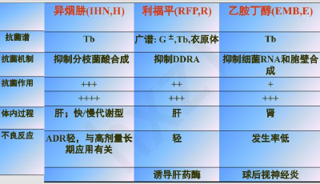
- # **抗恶性肿瘤药（**  **2.5**  **学时）**
  - 一．抗恶性肿瘤药的作用机制与分类
    - ~~根据化学结构和来源分类~~
      - **烷化剂：** 包括 **环磷酰胺（Cyclophosphamide）**  **卡莫司汀（Carmustine） 马法兰（Busulfan）**
      - **抗代谢药：** 包括 **甲氨喋呤**  **（Methotrexate,**  **MTX**  **）**   **氟尿嘧啶**  **（Fluorouracil, 5-FU） 巯嘌呤（Mercaptopurine, 6-MP）**   **阿糖胞苷**  **（Cytarabine, Ara-C）**
      - **抗肿瘤抗生素：** 包括 **放线菌素 D**  **（Dactinomycin D） 多柔比**  **星**  **（Doxorubicin） 博来霉素（Bicomycin） 柔红霉素（Daunorubicin,DNR） 丝裂霉素（Mitomycin, MMC）**
        > ~cin，~mycin
      - **抗肿瘤植物药：** 包括 **长春（新）碱**  **（VLB，VCR）**  **紫杉醇**  **（Paclitaxel） 喜树碱（Camptothecine）**
      - **其他类：** 包括 **顺铂**  **（Cisplatin） 卡铂（Carboplatin） 维甲酸（Retinoc Acid）**
      - 激素类： **糖皮质激素** 、雌激素、雄激素等
    -  <u>**※ 根据药物作用周期分类**</u> 
      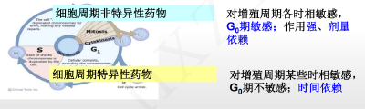
      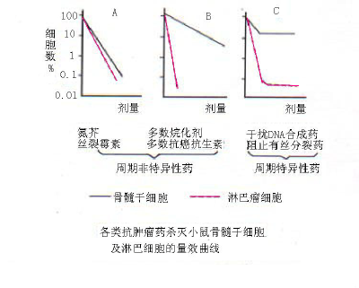
      > *间期分为G0静止期、G1期(蛋白质、RNA合成)、S(DNA合成期)、G2(蛋白质、RNA合成)、M期 （分裂）*
      -  **（记：细胞周期非特异性药物 只有** <mark style="background-color:#fef3c7;"> **烷化剂、抗肿瘤抗生素、顺铂、激素** </mark> **，其余均为细胞周期特异性药物）** 
      - • 细胞周期 <u>**非特异性**</u> 药物
        - 直接破坏DNA或影响复制、转录功能的药物。
        - 对增殖周期各时期的细胞敏感， **G0** 期敏感
        - 作用强，杀伤作用呈剂量依赖性。
        - 剂量反应曲线是一条直线
        - 举例：烷化剂、抗肿瘤抗生素、顺铂和激素
          - 烷化剂：氮芥；环磷酰胺；白消安；博来霉素；丝裂霉素
          - 影响转录过程：放线菌素 D；多柔比星；柔红霉素
          - 顺铂和激素
      - • 细胞周期 <u>**特异性**</u> 药物
        - 仅对增殖周期某些时相敏感，对G0期不敏感；
        - 作用往往较弱，杀伤作用呈时间依赖性。
        - 剂量反应曲线是一条渐近线；
        - 举例：抗代谢药、干扰蛋白质合成（主要是M期纺锤丝）药
          - 作用于S期： **干扰核酸生物合成（抗代谢药）：甲氨喋呤 阿糖胞苷**
          - 作用于M期： **干扰蛋白质合成药：长春新碱**  主要作用于 M 期； **紫杉醇：** 主要作用于 M 期和 G2 期
    - 根据作用机制分类（图中4点+影响全程的“ **影响激素平衡药物** ”）
      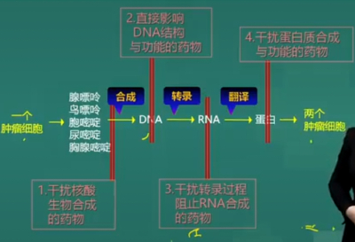
      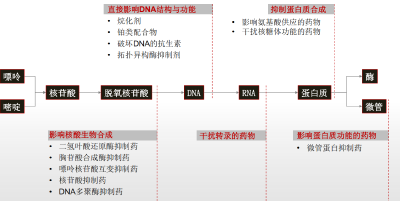
    - **肿瘤细胞的共同特点：细胞**  **增殖**  **有关的基因被开启或激活，细胞**  **分化**  **有关的基因被关闭或抑制。**
    - 抗肿瘤药的 <u>毒性反应</u>
      - • 共有反应
        -  **骨髓抑制：除外激素类,博来霉素, 门冬酰胺酶；** 
        - 消化道反应：恶心、呕吐
        - 脱发。
      - • 特有反应
        -  **心脏毒性** ： **柔** 红霉素、 **多柔** 比星、三尖杉酯碱；
          > 恩怨 <u>**柔**</u> 情 <u>**多**</u> 伤心
        -  **呼吸** 系统毒性： **博来** 霉素、白消安、CTX（环磷酰胺）
          > 平阳博来吵架了，肺气炸了
        -  **肝脏** 毒性：MTX 甲氨蝶呤、羟基脲、CTX 环磷酰胺、鬼臼毒素；
        -  **膀胱** 毒性：<mark style="background-color:#fef3c7;"> **环磷酰胺致出血性膀胱炎** </mark>
        -  **肾毒性：** CTX、顺铂；
          > 为了买个铂金戒指，卖肾
        -  **神经** 毒性：顺铂、长春新碱、紫杉醇、门冬酰胺酶；
          > 顺铂的两大毒性反应：“肾”“神”
        -  **过敏** 反应：博来霉素、门冬酰胺酶、紫杉醇。
          > 因为都是生物制剂
    - <u>抗肿瘤药物联合用药原则。</u>
      - 1. 细胞增殖动力学机制
        - （1）招募作用: 周期特异和非特异性药物交替使用，先杀灭一部分肿瘤，引诱更多肿瘤细胞进入G0期再歼灭
        - （2）同步化抑制: 使用周期特异性药物，肿瘤细胞阻滞于某一时期、同步进入下一时期，再用下一时期抑制药
      - 2.生化机制(作用于不同环节的药物互补):  eg  核酸合成(Doxorubicin)+ 细胞毒(cyclophosphamide)→DNA修复↓
      - 3. 降低毒性: 合用激素,长春新碱,博来霉素→骨髓抑制↓
      - 4. 抗癌谱： **消化道腺癌** → **5-FU** ;             **鳞癌** → **MTX** :         **骨肉瘤** → **Doxo** 
      - 5. 合理剂量：考虑患者耐受性
  - 二．常用抗肿瘤药
    - (一) 细胞毒类抗肿瘤药
      - 1．干扰 <u>核酸生物合成的药物 / （抗代谢药）：主要用于</u>  <u>**S 期**</u>  <u>。</u>
        > <u>5-氟尿嘧啶（5-FU）、6-巯基嘌呤（6-MP）、甲氨蝶呤（MTX）</u> 、阿糖胞苷、羟基脲
        - 胸苷酸合成酶抑制药——氟 **尿** 嘧啶（５－FU）        可用于消化道癌、乳腺癌、卵巢癌等；
        - 嘌呤核苷酸互变抑制药——巯嘌呤（６－MP）      用于儿童急性淋巴细胞白血病（维持治疗）；免疫抑制剂（用于自身免疫病）
        - 二氢叶酸还原酶抑制剂——甲氨蝶呤（MTX）      可用于儿童急性白血病；
        - 核苷酸还原酶抑制剂——羟基脲                                   可用于慢性粒细胞白血病；
        - DNA多聚酶抑制剂——阿糖胞苷                     用于成人急性粒细胞／单核细胞白血病
      - <u>2．破坏 DNA 结构和功能：</u>  <u>**细胞周期非特异性**</u>  <u>药物</u>
        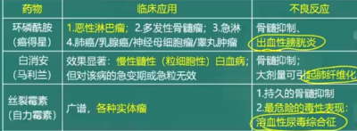
        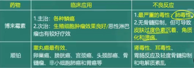
        > 氮芥、 <u>环磷酰胺（cyclophosphamide）、</u> 白消安、塞替哌、博莱霉素（bleomycin）、丝裂霉素（把红细胞“撕裂”～溶血性尿毒症）、 <u>顺氯氨铂（cisplatin, DDP）（“结合DNA”）</u>
        - **烷化剂（DNA交联剂）** ：氮芥、 <u>**环磷酰胺（cyclophosphamide）**</u>  <u>、</u> 白消安
          - 机制：与DNA或蛋白质分子中亲核基团（氨基、羧基、羟基、磷酸基）起烷化反应→交联或脱嘌呤→DNA链断裂
          - <u>**环磷酰胺（cyclophosphamide）**</u>
            - 肝药酶代谢物为磷酰胺氮芥，对恶性淋巴瘤疗效显著；
            - 诱发 **出血性膀胱炎** 
          - 白消安 busulfan、马利兰myleran
            - 慢性粒细胞、原发性血小板、真性红细胞增多
            - 久用后肺纤维化（马利兰肺）、闭经、睾丸萎缩
        - **破坏DNA的抗生素** ：博莱霉素（bleomycin）、丝裂霉素
          - 博莱霉素（bleomycin）
            - DNA结合-DNA链断裂一复制受阻
            - G2和M期；鳞状上皮癌，淋巴瘤，睾丸癌，卵巢癌
            -  **不良反应：间质性肺炎->纤维化。** 
          - 丝裂霉素（mytomycin）
            - 生物还原烷化作用（与DNA双链交叉联结，抑制其复制；使DNA断裂）；周期非特异性；
            -  **广谱** ； **毒性大.** 
        - **破坏DNA的铂类** （金属与DNA共价结合）
          - <u>**顺氯氨铂（cisplatin, DDP）/顺铂**</u>
            -  **Pt2+与碱基（G、A、C）交叉联结** ；
            - 周期非特异性， **广谱** ；口服无效，静注
            -  **肾和耳毒性** 。
          - 卡铂（carboplatin）
        - 抑制拓扑异构酶：鬼臼毒素衍生物
      - 3． <u>影响转录过程、阻止 RNA 合成：</u>  <u>**细胞周期非特异性**</u>  <u>药物（都是</u>  <u>**抗癌抗生素**</u>  <u>）</u>
        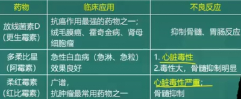
        > 只有博来、丝裂这两个抗癌抗生素是破坏DNA的，其它都是影响转录的
        - 共性： **抗癌抗生素** 、 **周期非特异性** 。 **嵌入DNA碱基对，干扰转录** ，阻止RNA合成；
        - 放线菌素D （dactinomycin）：G1期，拓扑酶II ⬇️
          - 肾母细胞瘤、绒癌、恶性葡萄胎。“放射召回”．
        - <u>多柔比星</u> （doxorubicin，adriamycin， 阿霉素，ADM）
          -  **S和M期** 
          - 急淋、急粒、恶性淋巴瘤、实体瘤；
          -  **心脏毒性** 
        - 柔红莓素 （daunorubicin）同上
      - <u>4．干扰蛋白质合成：主要作用于</u>   <u>**M 期**</u>  <u>。</u>
        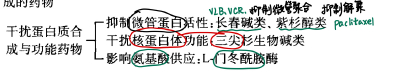
        - 微管蛋白活性抑制药——长春碱（vinblatine，VLB）、长春新碱（vincristine，VCR）、紫杉醇（paclitaxel）
          - <u>**长春碱（vinblatine，VLB）、长春新碱（vincristine，VCR）**</u>
            - 抑制微管聚合、纺锤丝形成，有丝分裂停止（M期）；急性白血病，恶性淋巴瘤，绒癌；
            - 不良反应：外周神经炎.
          - 紫杉醇（paclitaxel）
            - 促进微管聚合，抑制解聚——纺锤体失去正常功能，有丝分裂停止。转移性卵巢癌、乳腺癌。
            - 骨髓抑制、周围神经病变、过敏反应、心脏毒性等。
        - 干扰核蛋白体功能——三尖杉酯碱（harringtonine）：
          - 抑制蛋白质合成起始阶段，有丝分裂↓
          - 急粒，急单（急非淋），淋巴肉瘤，肺癌；
          - 心肌损害。
        - 影响氨基酸供应——L-门冬酰胺酶（asparaginase）
          - 急淋；
          - 过敏反应、精神症状。
    - (二) 非细胞毒类抗肿瘤药
      - 内分泌治疗药物：激素类：肾上腺皮质激素，雌激素、雄性激素、他莫昔芬。
        -  **糖皮质激素** ：急淋、恶性淋巴瘤、慢淋；
        - 雌激素：前列腺癌、绝经期乳腺癌；
        - 雄激素：晚期乳腺癌；
        - 选择性雌激素受体阻断药—— **他莫昔芬** —乳腺癌
      - 小分子化合物：伊马替尼、吉非替尼、索拉非尼等
      - 其他：维 A 酸、亚砷酸、重组人血管内皮抑制素等
    - (三)肿瘤免疫治疗：伊匹单抗、尼伏单抗、阿替珠单抗等 重组人白介素-2 新药研究等
      - 分子靶向抗肿瘤药： **利妥昔单抗（** 单克隆抗体）、 **曲妥珠单抗（** 抗体耦联药） **、阿替利珠单抗（** <mark style="background-color:#fef3c7;"> **第一个PD-L1抑制剂** </mark> **）** 等
  - 习题
    - **1**  **．简述抗肿瘤药的分类方法。**
      - ※ 根据药物作用周期分类——细胞周期特异性、非特异性，其中非特异性只有 **烷化剂、抗肿瘤抗生素、顺铂、激素** 
      - 根据作用机制分类（图中4点+影响全程的“ **影响激素平衡药物** ”）
    - **2**  **．周期特异性和非特异性药物。**
    - **3**  **．简述抗肿瘤药的主要不良反应。**
      - 抗肿瘤药的 <u>毒性反应</u> 
    - **4.**  **简述环磷酰胺的临床应用**
      - 烷化剂，直接破坏DNA结构和功能
      -  **广谱，恶性淋巴瘤、多发骨髓瘤** 、急性淋巴细胞白血病、肺癌、乳腺癌、卵巢癌、神经母细胞瘤、率丸肿瘤等
      - <mark style="background-color:#fef3c7;">引起骨髓抑制</mark>
      - 代谢物引起<mark style="background-color:#fef3c7;">化学性膀胱炎</mark>
    - **5.**  **简述氟尿嘧啶的临床应用**
      - 干扰核酸生物合成（S期）
      -  **消化系统肿瘤、乳腺癌** 疗效较好，宫颈癌、卵巢癌、头颈部肿瘤等有效
- # 抗真菌药（1 学时）
  - 真菌感染可分为
    - • 浅部真菌感染——各种癣菌引起，主要侵犯皮肤、毛发、指甲、趾甲；
      > 局部抗真菌药
    - • 深部真菌感染——白色念珠菌、新型隐球菌，一般见于免疫缺陷患者
      > 全身抗真菌药
  - 抗真菌药物：具有抑制或杀死真菌生长或繁殖的药物，根据化学结构的不同，可分为
    - **抗生素类（antibiotic）：** 两性霉素B
    - **唑类（azole）：** 酮康唑
    - **丙烯胺类（allylamine）：** 特比奈芬
    - **嘧啶类（pyrimidine）：** 氟胞嘧啶
    - **棘白菌素类（echinocandins）**
  - 机制分类
    - 破坏真菌细胞膜麦角固醇，打孔——易有毒，人体也有固醇
    - 抑制麦角固醇合成
    - 在体内转化为5-FU，抑制真菌DNA合成
  - 抗生素类——两性霉素B、灰黄霉素、制霉菌素
    - <u>**两性霉素B （Amphotericin B）——**</u>  <u>具有很大毒性；麦角固醇打孔</u> 
      - 作用： **广谱** ，对 **深部真菌** 有强效抑制作用
      - 机制：与真菌胞膜 <u>**麦角固醇**</u> 结合，形成孔道，改变膜的通透性，营养物质外漏；细胞膜氧化损伤
        - 注意：对细菌、立克次体无用（不含固醇类物质），对人毒性大而严重（人有固醇）
      - 应用：<mark style="background-color:#fef3c7;"> **深部真菌感染首选药** </mark>；
        > （真菌性肺炎、脑膜炎、尿路感染、心内膜炎等）
      - **给药方法：静脉注射，要求静滴时间＞6h（毒性大）；** 肠道感染则口服；鞘内注射——治疗脑膜炎；局部应用——皮肤科、妇科等。对隐球菌感染，与5-氟胞嘧啶合用以提升疗效。
      - **不良反应**  **多** 
        - **急性毒性反应：** 最常见，由于本药引起单核细胞 IL-1 释放
        - **肾毒性：** 与剂量相关，不可合用氨基苷类抗生素
        - **低钾血症**   **血液系统毒性**   **心血管系统反应**
        - 合用解热镇痛药、抗组胺药、地塞米松减轻不适感
    - **灰黄霉素（Griseofulvin）——**  **浅表但口服；微管蛋白** 
      -  **口服** 易吸收， **外用无效** （不能穿透角质层）；主要分布于皮肤、脂肪、毛发中
      - 可抑制浅表皮肤癣菌，对深部真菌无效；
      - 机制：干扰敏感真菌的 **微管蛋白聚合成微管** ，抑制其有丝分裂；
      - 应用：<mark style="background-color:#fef3c7;"> **浅表真菌感染（尤其是头癣）** </mark>
      - 不良反应：多，消化系统反应多，有致畸、致癌作用
    - **制霉菌素（Nystatin）：** 毒性更大。阴道滴虫、口服治疗胃肠道真菌、局部用药
  - 氟胞嘧啶——抑制DNA，BBB脑膜炎
    - 机制：在菌体内转变为5-氟胞嘧啶，抑制 **真菌** DNA（胸腺嘧啶核苷）的合成而不抑制哺乳动物的，故 **不良反应少** 
    - 可以穿过血脑屏障
    - **应用：**  **与两性霉素B合用，首选治疗隐球菌所致脑膜炎。** 
      > **两性霉素细胞膜打孔，氟胞嘧啶进入细胞抑制DNA合成。**
    - 抗菌谱较两性霉素B窄而弱，单用易耐药；适用于白色念珠菌 隐球菌 霉菌等
  - <u>**咪唑类**</u> 和三唑类 **（酮**  **康唑**  **、伊曲康唑**   ***不尿路***  **、氟康唑**   ***HIV***  **）**
    - 咪唑类： **酮康唑（Ketoconazole）、** 克霉唑（clotrimazole） 咪康唑（miconazole） 益康唑（econazole）
    - 三唑类：第一代： **氟康唑（fluconazole） 伊曲康唑（itraconazole）；** 第二代：伏立康唑（voriconazole） 泊沙康唑（posaconazole）
    - 唑类抗真菌药是一种 **广谱** 抗真菌药， **毒性明显小于两性霉素** 
    - 机制：抑制真菌胞膜上的细胞色素P450-14-α-去甲基酶→14-α-甲基固醇蓄积，抑制真菌胞膜 <u>**麦角固醇**</u>  **合成**
    - **酮康唑（**  **Ketoconazole**  **）**
      - 抑制 CYP3A4 酶，严重影响相关药物代谢。严重肝毒性；抑制睾酮和肾上腺皮质激素合成
      - 已被 **氟康唑、伊曲康唑** 代替
      - 常见不良反应包括胃肠道反应、肝毒性、 **肾上腺皮质抑制** 
    - **伊曲康唑（**  **Itraconazole**  **）**
      - 抗真菌作用更强、谱更广
      - <mark style="background-color:#fef3c7;">治疗</mark><mark style="background-color:#fef3c7;"> **罕见真菌** </mark><mark style="background-color:#fef3c7;">：组织胞浆菌、芽生菌感染的</mark><mark style="background-color:#fef3c7;"> **首选用药** </mark>
      - **用于治疗口腔、食管、阴道的念珠菌感染，但**  **不适合治疗尿路感染** 
      - 不良反应比酮康唑少：包括胃肠道反应、一过性肝功能异常、皮疹
    - **氟康唑（**  **Fluconazole**  **）**
      - 抗真菌谱广 与伊曲康唑类似
      - <mark style="background-color:#fef3c7;"> **治疗** </mark> **艾滋病** <mark style="background-color:#fef3c7;"> **患者隐球菌性脑膜炎的首选药** </mark> 口服和静脉均有效
      - 与氟胞嘧啶合用增强疗效
    - **咪康唑、克霉唑** ：毒性大，但强度高，<mark style="background-color:#fef3c7;"> **仅限局部浅表应用** </mark>
  - 丙烯胺类： **特比奈芬（terbinafine）、奈普芬（Terbinafine）**
    > 主要用于 <u>**浅部，**</u> 体外抗菌活性高
    - 选择性抑制真菌膜的角鲨烯环氧化酶，抑制麦角固醇合成
    - 外用或口服治疗<mark style="background-color:#fef3c7;"> **甲癣** </mark>和其他一些<mark style="background-color:#fef3c7;"> **浅表** </mark>部真菌感染；
    - 深部需与唑类药物或两性霉素B合用，才可获良好效果
  - *棘白菌素类抗真菌药*  **：** 卡泊芬净 米卡芬净 阿尼芬净，静脉注射抑制细胞壁
    - **非竞争性抑制葡聚糖合成酶，** 抑制真菌 **细胞壁** 合成
    - 用于侵袭性念珠菌病等
  - 抗真菌药：灰黄霉素抗浅表真菌的作用与应用；制霉菌素、，其他抗真菌作用与应用、不良反应；新药。
  - 习题
    - **1．抗深部真菌感染药——两性霉素B、氟胞嘧啶、酮康唑、氟康唑、伊曲康唑——的抗菌作用及临床应用。**
    - **2．抗浅表真菌感染药——特比萘芬、咪康唑、克霉唑——抗菌作用及临床应用。**
    -  **3. 抗真菌药物的分类及主要作用机制？** 
      - **（1）作用于真菌细胞膜：丙烯胺（特比奈芬）、唑、多烯类**
        - 抑制麦角固醇合成，或直接破坏打孔麦角固醇（两性霉素B、制霉菌素）
          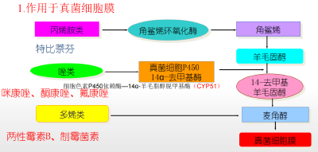
      - **（2）作用于真菌细胞核：氟胞嘧啶**
        - 转化为5-FU抑制真菌T和DNA合成
          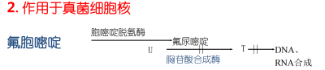
      - **（3）作用于有丝分裂（微管蛋白）：灰黄霉素**
        - 抑制微管蛋白合成围观
          
- # **抗病毒药**  **（**  **1**  **学时）**
  - 分类：抗流感、抗疱疹病毒、抗艾滋病、抗肝炎、广谱
  - **抗病毒药物的作用机制**
    - 病毒的增殖过程：吸附→脱壳 →复制 →装配→ 释放
    - 竞争细胞表面的受体，阻止病毒吸附
    - 阻碍病毒穿入细胞与脱壳
    - 阻碍病毒生物合成
    - 增强宿主抗病毒能力—— **aka 广谱抗病毒药** 
  - **抗流感病毒药**
    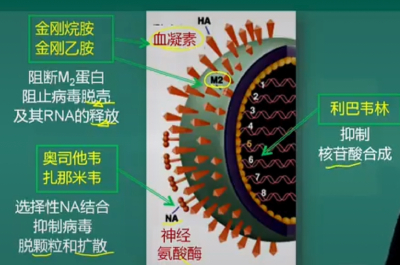
    - 包膜：磷脂双分子层，镶嵌有 **血凝素 HA**  和 **神经氨酸酶 NA；** M1  **M2** 构成病毒的外壳骨架。
    - HA 促使病毒吸附；NA 促进释放；M2 蛋白促进脱壳。
    - <u>**金刚烷胺（Amantadine）**</u>  **、** 金刚乙胺（rimantadine）
      > **M2蛋白、血凝素，只能攻击复制早期病毒；高选择甲流；中枢神经毒性。**
      - <mark style="background-color:#fef3c7;">高选择性抑制</mark><mark style="background-color:#fef3c7;"> **甲型流感病毒** </mark>
      - 金刚烷胺通过阻断  **M2 蛋白**  **、** 阻止病毒脱壳以及 RNA 释放 ；影响血凝素，干扰病毒组装。
      - 因此，中断病毒早期复制， **已经出现流感症状的人用它无效** 
      - 不良反应： **中枢神经系统** 、胃肠道反应、致畸性
    - <u>**奥司他韦（Oseltamivir，aka 达菲）**</u>  **、扎那米韦（Zanamivir）**
      > 看见“神经氨酸酶 NA”，选奥司他韦（押韵！）
      - **奥司他韦是**  **前体药物**  ，代谢活性产物可以强效选择性抑制甲型和乙型流感病毒的 **神经氨酸酶（NA），** 抑制病毒脱颗粒和 **扩散** 
      - <mark style="background-color:#fef3c7;"> **预防和治疗病毒性流感** </mark>
      - 常见的不良反应为恶心和呕吐；奥司他韦还会引发精神不良事件。
    - **扎那米韦：** 与奥司他韦相似 不在体内代谢 肝肾毒性小
  - **广谱抗病毒药物——利巴韦林（Ribarvirin）、干扰素**
    > 利巴韦林：DNA&RNA均有效；抑制核酸（G）合成，毒性大。干扰素不直接杀，aka免疫调节剂，致畸，孕妇和 <u>**男方**</u> 都禁禁禁用！
    - **利巴韦林**
      - 人工合成的鸟苷类似物，对多种  **DNA 和 RNA 病毒都有效（包括可以抑制病毒mRNA合成！）** 
      - **抗病毒谱广**
      - 对宿主毒性大（抑制宿主细胞核酸合成）； **孕妇禁用** 
      - 竞争性抑制病毒核酸合成相关酶，使病毒鸟嘌呤合成减少
      - 主要不良反应是腹泻；长期使用引起骨髓抑制
    - **干扰素**
      - 机制：诱导 **机体** 免疫细胞合成 **抗病毒蛋白，无直接杀灭病毒作用** 
      - 广谱抗病毒活性；疗程至少一年
      -  **妊娠、备孕男子禁用** 
      - 其它禁忌症
  - **抗疱疹病毒，首选** <mark style="background-color:#fef3c7;"> **洛韦~clovir** </mark>
    - 人类疱疹病毒是具有包膜的  **DNA**  **病毒**
    - <u>**阿昔洛韦（Acyclovir, ACV）**</u>  <u>（无环鸟苷）——“偷梁换柱”</u>
      > 抗DNA病毒（抗非逆转录病毒）； **单纯疱疹病毒感染（HSV）** 的首选；合用干扰素治疗乙肝
      - 鸟嘌呤核苷类似物， **抗DNA病毒** 药物
      - <mark style="background-color:#fef3c7;"> **单纯疱疹病毒感染（HSV）** </mark>的首选药；可与 **干扰素联合治疗乙肝** 
      - 不良反应很少，口服后恶心、局部应用有刺激性
    - **更昔洛韦（Ganciclovir）**
      > 巨细胞病毒 CMV；不良反应严重，骨髓抑制
      - 对<mark style="background-color:#fef3c7;"> **巨细胞病毒 CMV** </mark> 作用优于阿昔洛韦（100倍）
      - 对水痘-带状疱疹和HSV作用类似阿昔洛韦
      - 不良反应严重， **骨髓抑制、诱发癌症**
    - <u>代昔洛韦</u>
    - <u>**碘苷（疱疹净）**</u>
      > 抑制T合成酶， **对RNA病毒无效**
      - 竞争性抑制胸苷酸合成酶，使DNA合成受阻，故能抑制DNA病毒（如HSV和牛痘病毒）而 **对RNA病毒无效** 
      - 全身应用 **毒性大** ，临床 **仅限于局部用药** ,治疗眼部或皮肤疱疹病毒感染。
  - **抗艾滋病病毒药物**
    > 齐多夫定（记：“多子多福”）
    - <mark style="background-color:#fef3c7;">首选用药：</mark><mark style="background-color:#fef3c7;"> **逆转录酶抑制剂    齐多夫定，不能合用司他夫定** </mark>
    - 分类（考纲有）——选择性抗 HIV 药物包括：入胞抑制药、逆转录酶抑制药（核苷类 非核苷类）、整合酶抑制药、蛋白酶抑制药
      - 核苷反转录酶抑制剂 NRTIs：齐多夫定
      - 非核苷反转录酶抑制剂 NNRTIs：奈韦拉平
      - 蛋白酶抑制剂 PI：茚地那韦
      - 整合酶抑制剂：拉替拉韦
      - 入胞抑制剂：马拉维若
      - 融合酶抑制剂：恩夫韦肽
    - <u>**齐多夫定（Zidovudine）——**</u> <mark style="background-color:#fef3c7;"> <u>**HIV首选**</u> </mark>
      > 核苷反转录酶抑制剂 NRTIs
      - 经磷酸化 **竞争性抑制 RNA 逆转录酶活性** 
      -  **不能与**  **司他夫定**  **合用（互相拮抗）** 
      - 可减轻或缓解AIDS相关症状，为增强疗效、防止或延缓耐药性产生，临床上须与其他抗HIV药合用
      - 不良反应：骨髓抑制、贫血、胃肠道不适、头痛；肝功能不全者服用后更易发生毒性反应
    - **拉米夫定（**  **Lamivudine, 3TC**  **）**
      - 可以抑制 **乙肝病毒**  **、HIV 逆转录酶活性**
      - 用于艾滋病和乙肝的治疗
  - **抗乙型肝炎病毒药：干扰素、**  <u>恩替卡韦、阿德福韦酯</u>
    - **（1）以干扰素为代表的免疫调节剂；**
    - **（2）另一类是核苷类似物（拉米夫定、替比夫定、恩替卡韦）和核苷酸类似物前体药（阿德福韦酯、富马酸替诺福韦酯）**
  - 抗 HCV 药： <u>NS5BRNA 聚合酶抑制剂索非布韦</u>
  - ## 习题
    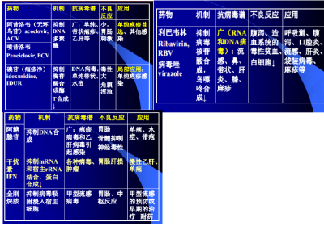
    - **1.**  **简述抗病毒药物的分类及主要作用机制**
    - **3.**  **简述齐多夫定的作用机制及不良反应**
