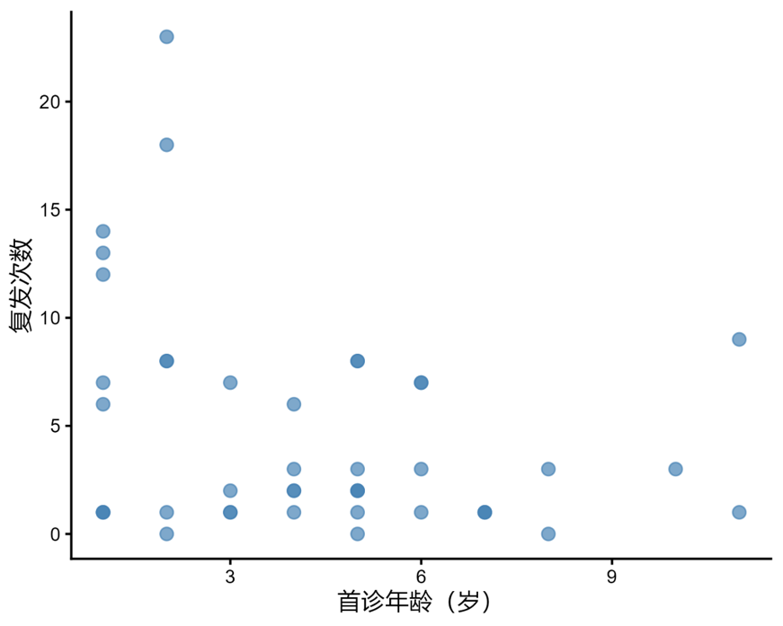
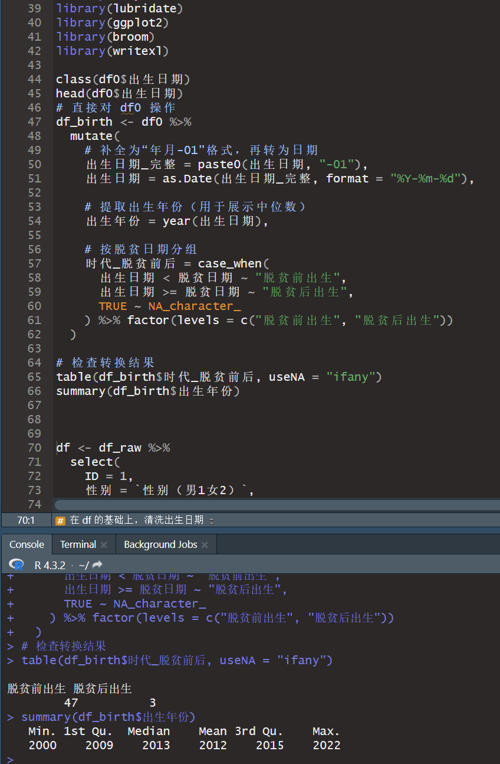
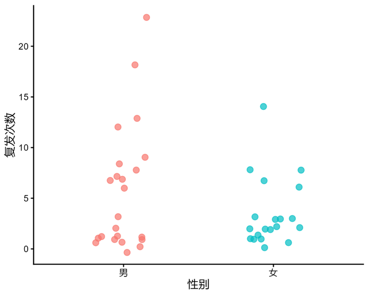
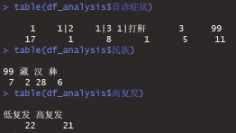
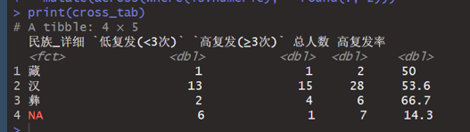
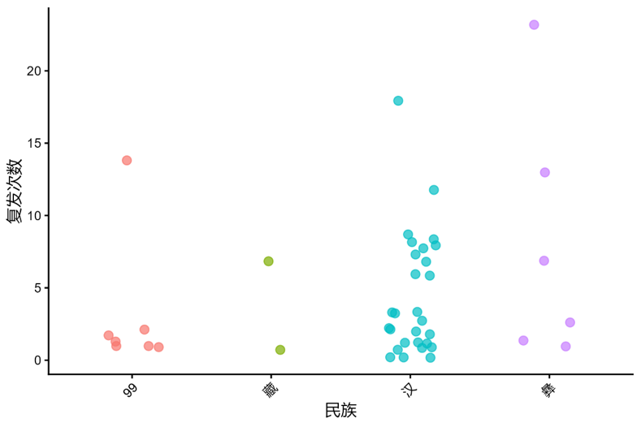
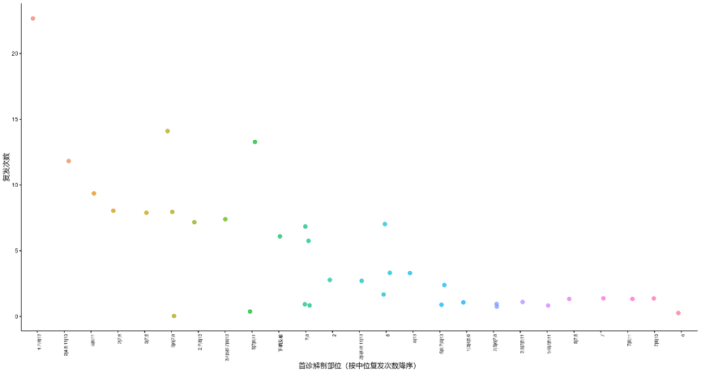
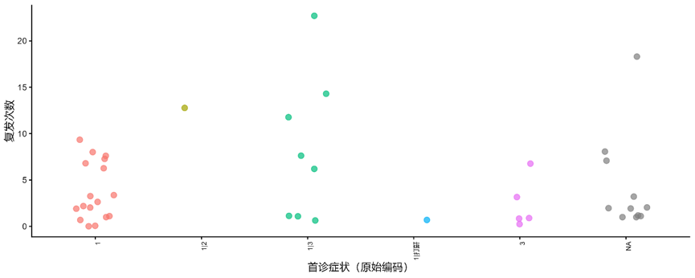

---
tags:
  - Proj
---
#### 26-8-16: 儿童型复发性呼吸道乳头状瘤（JORRP）研究结果逻辑梳理

一、科学问题：在JORRP中，初诊临床和解剖特征是否能够提示后续复发负担，并进一步识别具有高复发轨迹和严重气道结局风险的患儿？

二、可纳入变量：

1. 首诊年龄：可作为连续变量或分类变量尝试
[Open: Pasted image 20260831083201.png](attachments/9064eb9d54ec2ebd6403214b3b7b862d_MD5.jpg)

2. 出生日期：我觉得可以试一下按照不同出生年份分类，如2000年前和2000年后（可换年份为大事件前后，如全国脱贫那年2021年2月25日），试图去探寻是否有差异，如有差异可以解释为生活质量的上升之类的
[401Open: Pasted image 20260831083213.png](attachments/1efcf709094f64a4d122993ea7e62063_MD5.jpg)
 
3. 性别
[Open: Pasted image 20260831083230.png](attachments/54f0bf8a3e6f76799406f12bb285cfa8_MD5.jpg)

4. 民族：若有差异可加入分析，可选择不同分类方式尝试，如：汉族和其它；汉族、藏族和其它等等
[Open: Pasted image 20260831083249.png](attachments/f51cfe604857d239da1251220bf79815_MD5.jpg)
  [Open: Pasted image 20260831083256.png](attachments/b6b7f80708aa1a99774c6d1cf7aff7e1_MD5.jpg)

[Open: Pasted image 20260831083312.png](attachments/1706c871589f44ec8cbe6a3e92baffa3_MD5.jpg)

5. 首诊解剖部位：具体部位
[Open: Pasted image 20260831083326.png](attachments/7bae289718a0c782612a9d6c79e6b6d1_MD5.jpg)

6. 首诊解剖部位：单发/多发

【注：前两个变量有定义重复，做回归分析时应慎重，可选择其中一个，但不影响基线展示】

7. 首诊症状：可以直接按具体症状，若后续要分析JORRP气管切开，
- [ ] 也可以分为是否气道受损表现，将呼吸困难、喘鸣等列为气道受损型表现
[Open: Pasted image 20260831083340.png](attachments/c49b94629c03fdf4311d6256f6dbcec7_MD5.jpg)

9. 是否气管切开

10. 是否复发

10.     复发次数

11.     复发部位

三、结果逻辑：

1. 这批JORRP患儿初诊时是什么样的？是否已经存在人口统计学、症状和解剖范围等上的异质性？

·   描述队列基本情况和初诊疾病负担

·   图表：

（1）Table. 总体基线特征

（2）Fig. 重要变量的分布图（可选），如初诊解剖部位分布等

2. 哪些初诊因素与是否复发、复发次数或高复发负担相关，根据这些因素是否可进一步识别高负担患儿？

·   分析复发负担，并寻找与复发负担相关的初诊因素，单因素+多因素回归，根据结局变量的定义选择logistic或cox

·   图表：

（1）Table. 复发负担情况展示，可包含：是否复发；复发次数；是否多次复发；高复发负担（可选，根据不同标准，如Doyle标准：侵袭性=1—总共接受10次或以上手术，其中1年内接受3次或以上手术，和/或疾病扩散至声门下区远端；非侵袭性=0相反）；复发部位数量；是否下气道复发等；
[The Laryngoscope - May 1994 - Doyle - Recurrent respiratory papillomatosis  Juvenile versus adult forms](The%20Laryngoscope%20-%20May%201994%20-%20Doyle%20-%20Recurrent%20respiratory%20papillomatosis%20%20Juvenile%20versus%20adult%20forms.pdf)

> [!PDF|yellow] [The Laryngoscope - May 1994 - Doyle - Recurrent respiratory papillomatosis  Juvenile versus adult forms, p.1](The%20Laryngoscope%20-%20May%201994%20-%20Doyle%20-%20Recurrent%20respiratory%20papillomatosis%20%20Juvenile%20versus%20adult%20forms.pdf#page=1&selection=115,0,131,42&color=yellow)
> > Although <mark style="background-color: #705A16; color: white">subglottic involvement</mark> universally occurred in our group with aggressive disease, approximately 40% developed subglottic disease very early as compared with 20% of patients with less aggressive disease.

（2）Table. 回归分析，把复发次数当作连续变量或分类变量（如以5次/10次为界限分类），分析与复发这个结局相关的初诊因素；

（3）Fig. 展示关键因素的分布图

3. 第二部分发现的复发相关因素，是否可以进一步识别高负担患儿？这些高负担患儿是否表现为更复杂的复发部位、更明显的解剖部位扩展，以及更高的气管切开风险等？

·   后续可从两方面入手

（1）若有外部可用数据，可进一步建立高负担患儿预测模型，内部+外部验证

（2）也可根据第二步结果，进一步拓展分析，如：首诊解剖部位和复发负担相关，可进一步解析解剖部位相关数据，展示后续复发的解剖部位扩展情况；等等

·   图表