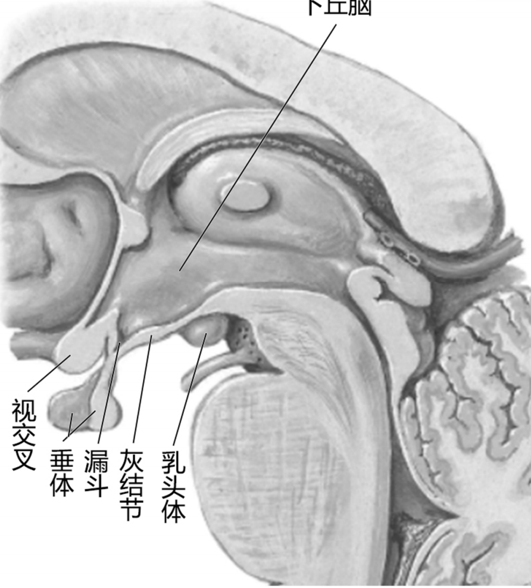
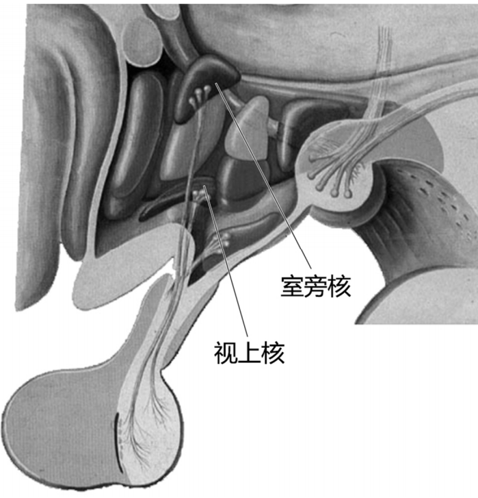

---
tags:
  - Neurology
  - anatomy
---
居下丘脑沟的下方，形成第三脑室的底壁和侧壁的下部。
从脑底面可见最前方的视交叉，其后方有灰结节，灰结节向下移行为漏斗，漏斗下端连接垂体。
灰结节后方有一对圆形隆起称乳头体。
[Open: Pasted image 20260916101616.png](attachments/53f8e02256b762ad9992f78bbf425efa_MD5.jpg)

下丘脑内有许多界限部明确的核团，其中比较清楚的有：
（1）视上核：位于视交叉外端的背外侧。
（2）室旁核：位于第三脑室上部的两侧。
视上核和室旁核共同分泌[[抗利尿激素]]和[[催产素]]，沿着视上垂体束和室旁垂体束输送到垂体后叶。
[Open: Pasted image 20260916101857.png](attachments/d1ccd66408784c22cb05c5f52f830948_MD5.jpg)

---
下丘脑是调节内脏活动和内分泌活动的皮质下较高级中枢，并有调节体温、摄食和水盐代谢等的中枢。此外，下丘脑还参与情绪反应活动。