---
tags:
  - pharmacology
---
# 概论
## ※中枢神经递质及其受体
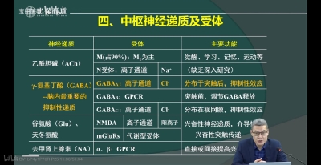
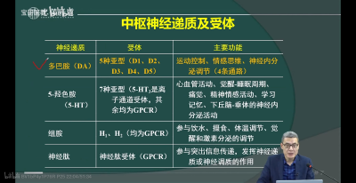
- 神经肽类主要注意和痛觉的关系，比如[吗啡](吗啡.md)。
- [[组胺]]：注意外周效应。
-  重点梳理哪些药物和GABA有关系，哪些药物和多巴胺有关系。 
- 注意，虽然大部分药物作用在受体上，但是也有部分药物作用在递质和相关的酶上。比如作用于乙酰胆碱酯酶、对中枢有选择性的药物，在阿尔兹海默病中使用。
- 中枢重要递质受体（PPT）
  —— 复习前先看一遍；把整个章节背过一次后，再  对着药物梳理 
  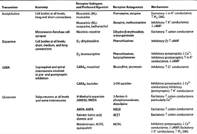
  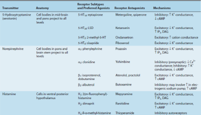
  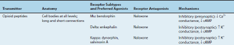
  - ![[Ach]]
  - 
  - ![[GABA]]
  - ![[Glu]]
  - ![[5-HT]]
  - ![[NE]]
  - 
  - 阿片受体
  
#### 中枢药物作用方式
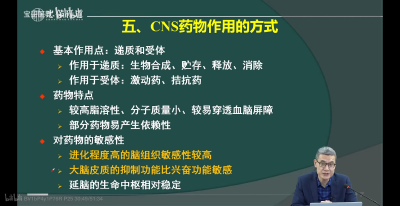
- 注意中枢的药物必须要能够通过血脑屏障，所以对药物的结构有很高的要求。你要弥补多巴胺的作用，不能直接用[多巴胺](多巴胺.md)，因为多巴胺有两个羟基，水溶性太强，通不过BBB；只能用多巴胺前体物质，左旋多巴（L-Dopa）
- 注意两个逻辑前提，第一，在<mark style="background-color: #1A4F10; color: white">大脑中抑制功能比兴奋功能对药物更加敏感</mark>，第二，[[普鲁卡因]]作用是阻滞神经元细胞膜上的钠离子通道。所以 普鲁卡因低剂量体现为兴奋作用。 
- 进化上越新的脑对药物越敏感，所以当一个药物的副作用已经涉及到延髓的时候，说明它在皮层已经造成了很广泛的影响。

# [[镇静催眠]]药

# [[抗精神失常]]药
> 多背亿遍药名。

# [[镇痛药]]
- # 解热镇痛抗炎药  （  3  学时）
- 药物分类
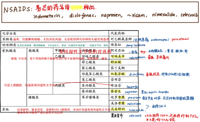
- <u>一．解热、镇痛、消炎、抗风湿作用，这些作用和抑制体内前列腺素生物合成的关系。</u>
- 概念：一类具有解热、镇痛，大多数还有较强抗炎、抗风湿作用的药物，又称为非甾体类抗炎药（non-steroidal anti-inflammatory drugs, NSAIDs）
- NSAIDS共同的药理机制：抑制  环氧化酶，  从而抑制前列腺素的生物合成
-  ※原理（这张图必须掌握） 
  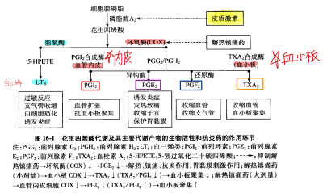
  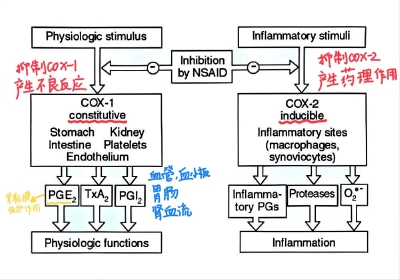
> PGI2与TXA2：相互拮抗
> 抗炎：针对PGE2、LTs作用
  - 在炎症反应中，膜磷脂在PLA2催化下释放出花生四烯酸；
  - 花生四烯酸经环氧化酶作用生成前列腺素和血栓素；
  - 花生四烯酸经脂氧化酶作用生成白三烯等物质
  - 注意PGI2与TXA2的相互拮抗，TXA2/PGI2 比值 决定了凝血功能情况。其中<mark style="background-color:#fef3c7;"> 血小板比血管内皮对COX抑制剂更敏感 </mark>。这里有剂量平衡问题。小剂量抑制血小板中TXA2，抗凝血；大剂量抑制血管内皮PGI2，致血栓。
  - 注意脂氧酶（LTs生成）与环氧酶（PG、TXA2）通路的相互平衡。抑制后者，可能前者增强失衡， 阿斯匹林哮喘 原理。
- 药理作用
  - 1. 解热 antipyretic effect：下丘脑对体温调节中枢发放的上调/致热信号介质——PGE2
	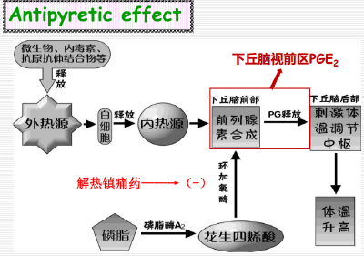
	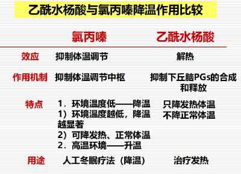
> 只有解热这一个作用是作用于中枢的。
  - 2. 镇痛 Analgesic effect：PG使神经对致痛物质 增敏 
	- 对中度慢性钝痛（炎性疼痛）有效，而对急性锐痛和剧痛无效
	- 无成瘾性、为非处方药、不抑制呼吸、作用部位在<mark style="background-color:#fef3c7;"> 外周为主，中枢也有！ </mark>
	- 如图所示，PG具有一定的致痛作用，还能 增强感觉神经末梢对其他致痛物质的敏感性 ，而NSAIDS通过抑制 局部 PG的合成，从而发挥镇痛的作用。
	  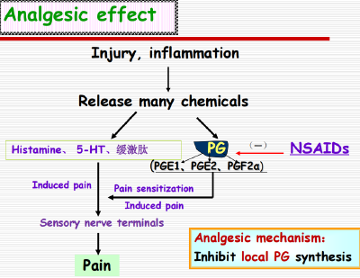
	- 解热镇痛药与镇痛药作用的比较
	  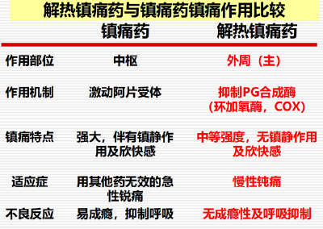
> 急性锐痛 vs 慢性钝痛
  - 3.抗炎抗风湿- Anti-inflammatory and Antirheumatic effect：PG协同致炎物质
	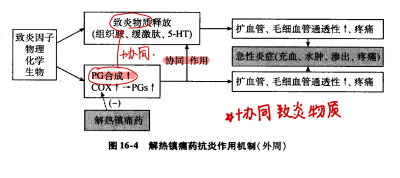
> 注：炎症急性期，红肿热痛；慢性期，瘢痕增生
	- 靶点只针对COX-II的整体效应
	- 炎症介质PG——使血管扩张，通透性增加，局部充血（红）、水肿、疼痛，还能 增强 缓激肽等的致炎作用
	- 机制：抑制PG的合成，减轻炎症反应的红、肿、热、痛，产生抗炎抗风湿作用， 控制 症状（ 不能根治、也不能防治病情的发展 ）
- 二．非选择性COX抑制药  non COX-selective NSAIDs
- 1. 水杨酸类  Salicylic acid  <u>：</u>  <u>阿司匹林（Aspirin</u>  <u>）</u>
  - <u>体内过程（注意几个特点）</u>
	- -  吸收 ： 口服 迅速吸收，边吸收边代谢，迅速被 水解 为水杨酸（因此 血药浓度低 ，t1/2为15min）；
> 吸收的过程中就在快速被代谢
	- -  分布 ：血浆蛋白结合率高达80~90%；可与其他药物竞争蛋白结合位点（ △  药物相互作用的药理学基础 ）
	- -  代谢 ：主要肝脏； 非线性动力学 
	  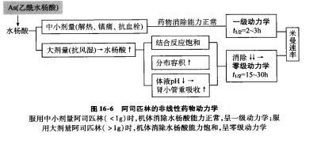
> 混合动力学模式
	  -  中小剂量解热镇痛抗炎 ：口服Aspirin≤1g 时，按一级动力学消除（恒比消除），t1/2= 2-3 h
	  -  大剂量抗风湿 ：口服Aspirin≥1g 时，按零级动力学消除(恒量消除)，t1/2=15-30 h （容易中毒）
	  - 大剂量治疗风湿、类风湿时，应根据患者的反应及血药浓度监测确定给药的剂量及间隔时间
	-  - 排泄：尿液的pH 对水杨酸盐的排泄影响很大
	  - 药物过量中毒时，①可利用 NaHCO3碱化尿液 ，使排泄加速，降低血药浓度； *②可改变分布* 
  - 药理作用与临床应用： <u>解热、镇痛、抗风湿、抑制血小板聚集作用</u>
	-  解热、镇痛 ：有较强的解热、镇痛作用
	  - 常与其他解热镇痛药配成复方，用于 头痛、牙痛、肌肉痛、痛经、感冒发热、神经痛 ；
	- 抗炎、抗风湿 ：作用较强
	  - 用于急性风湿热，有鉴别诊断、治疗作用；
	  - 也是<mark style="background-color:#fef3c7;"> 治疗类风湿性关节炎的首选 </mark><mark style="background-color:#fef3c7;">药</mark>物；
	  - 用于抗风湿时，最好用至 最大耐受剂量 ，一般成人每日3～5g，分4次于饭后服用
	- 影响血小板的功能～不可逆、小剂量、治疗 <mark style="background-color:#fef3c7;"> 妊娠高血压（减少TXA2生成） </mark>
> 注意对血小板影响不可逆；剂量平衡
	  -  不可逆地 抑制COX，血小板 <u>无细胞核，不能再合成新的</u> COX，因此 血小板中COX 对阿司匹林的 敏感性 要远比血管内皮中的COX高
	  - 注意PGI2与TXA2的相互拮抗本来是构成了一个平衡
	  - 低浓度，不可逆地抑制血小板中的COX→血小板中TXA2生成↓→抑制血小板聚集和血栓生成；
	  - 高浓度，也抑制血管内皮细胞中的COX→PGI2生成↓→促进血栓生成。
	  - 因此，小剂量的阿司匹林可用于防止血栓生成
		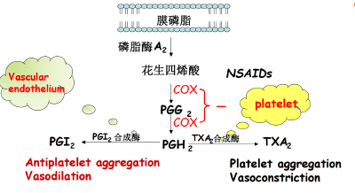
		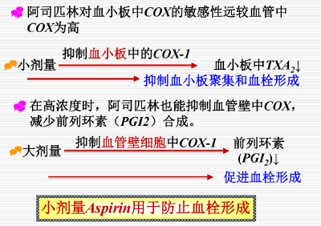
  - <u>不良反应和应用注意</u>
> 记：COX-1的几个作用——肾、胃、血管凝血；再加上三个特殊反应：水杨酸反应、瑞夷综合征、阿斯匹林哮喘、过敏。
	- 用于解热镇痛时剂量较小，短期应用不良反应较轻；用于抗风湿时剂量较大，长期应用不良反应多且重
	- 胃肠道反应
> 直接刺激、减少PGE2保护
	  - 发生率 高 ，表现为恶心、呕吐、上腹不适；较大剂量/长期服用易诱发胃炎、胃溃疡、胃出血
	  - 机制
		-  口服 直接刺激胃黏膜；（弱酸性）
		-  浓度高 时，刺激延髓催吐化学感受区（CTZ），引起呕吐；
		-  抑制了PG（PGE2）对胃黏膜的保护作用。 
	- 凝血障碍
	  - ※ 严重肝病、低凝血酶原血症、维生素K缺乏、血友病患者禁用，产前/手术前禁用 
	  - 一般剂量引起 TXA2/PGI2比值 下降，抑制血小板聚集，延长出血时间；
	  - 较大剂量/长期应用还可引起凝血障碍，加重出血倾向。
	  - 机制
		- 不可逆地抑制COX，对血小板合成TXA2有强大、持久的抑制作用，合成TXA2能力恢复需到新生血小板补充；血管内皮有合成COX的能力，因此阿司匹林对PGI2的合成抑制弱而短暂，使PGI2的作用占优势。
	- 对肾脏的影响
	  - 对正常人群影响小，对特殊人群（老年人及心、肝、肾功能受害者）易导致水肿、多尿等肾小管功能受损的表现
	  - 机制：病人原本体内存在隐性肾脏损害和肾小球灌注不足，抑制PGs合成，取消了前列腺素的代偿扩肾血管机制，而出现水肿等症状
		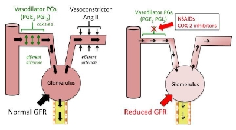
	- 水杨酸反应（中枢症状）
> 碳酸氢钠解救
	  -  用量过大 时，可引起 头痛、恶心、呕吐、视听减退 等症状，总称为水杨酸反应；
	  - 严重时可出现 过度换气、酸碱失衡、精神错乱 。
	  - 治疗： 立即停药，静滴  碳酸氢钠溶液  以碱化尿液，加速排泄；对症支持治疗 
	- 某些哮喘患者服用后可诱发 “阿司匹林哮喘 ”（ 并非抗原-抗体反应为基础的过敏反应 ，而与PG合成受抑制有关）
> 抗组胺、糖皮质激素解救
	  -  机制： 因 PG合成受阻 ，由AA生成的白三烯及其他 脂氧酶 代谢产物增多，内源性支气管收缩物质占优势（使用抗组胺药和糖皮质激素治疗）
		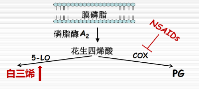
	- 过敏反应
	  - 少数患者可出现荨麻疹、血管神经性水肿、过敏性休克等症状
	  -  ※哮喘、鼻息肉、慢性荨麻疹患者禁用 
	- <mark style="background-color:#fef3c7;"> 瑞夷综合征 </mark><mark style="background-color:#fef3c7;"> *Reye’s syndrome* </mark>
> 病毒发热儿童肝性脑病？换用对乙酰氨基酚。
	  - 病毒感染伴发热的儿童服用该药后，偶可发生严重的 肝衰合并脑病 的表现（惊厥、谵妄、昏迷，死亡率较高，少见但预后恶劣）
	  -  ※病毒感染患儿（流感、水痘、麻疹、流行性腮腺炎等）不宜使用，换用  对乙酰氨基酚 
- 三． 苯胺类——对乙酰氨基酚（acetaminophen）/扑热息痛（paracetamol）
- 体内过程
  -  口服易吸收 ，肝代谢、多无活性
  - 极少部分代谢为对肝有毒的羟化物，可由谷胱甘肽解毒。过量中毒/长期用药时，体内谷胱甘肽被耗竭，该毒性中间体可对肝、肾造成损害，引起肝细胞、肾小管细胞的坏死。
> NSAIDS和感冒药在用于退烧时注意不要联合使用；用中药的时候也要特别注意
- 药理作用与临床应用
  -  解热镇痛 缓和持久，抗炎弱
  - <mark style="background-color:#fef3c7;"> 无抗风湿、抗血栓作用 </mark><mark style="background-color:#fef3c7;">；</mark>
  - 感冒发烧、头痛、神经痛、肌肉痛等；
  -  无明显胃肠刺激作用，也不会引起凝血障碍 ，故对<mark style="background-color:#fef3c7;">无法使用阿司匹林的头痛发热患者</mark>，适用本药。
- 不良反应
  - 短期使用不良反应较轻，常见恶心呕吐，偶见粒细胞缺乏、皮疹、贫血等过敏症状；
  - 过量用药引起肝损害；
  - 长期大量用药（尤其是肾功能低下者）可出现肾绞痛、急性肾衰、慢性肾衰。
- 四．其它抗炎药物类：作用特点，临床应用和不良反应
- 吲哚类——吲哚美辛（  indometacin,  消炎痛）
  - 体内过程
	- 口服吸收快而完全；
	- 血浆蛋白结合率高（为90%）；
	- 经肝脏代谢；代谢物经尿、胆汁、粪便排泄；
  - 药理作用与临床应用
	-  显著的抗炎抗风湿、解热镇痛作用 （<mark style="background-color:#fef3c7;"> 最强 </mark>的PG合成酶抑制药之一）；
	-  不良反应多 ，限制了其应用，仅用于其他药物不能耐受或疗效不显著的病例。
	- 应用：强直性脊柱炎，骨关节炎，急性痛风（不影响尿酸代谢）
  - 不良反应
	- 胃肠道反应；
	- 中枢神经系统：前额头痛、眩晕、精神失常；
	- 造血系统：粒细胞减少、血小板减少、再生性贫血；
	- 过敏反应： “阿司匹林哮喘者”禁用。
- 芳基丙酸类——布洛芬（  ibuprofen  ）  /  芬必得
  - 药理作用与临床应用： 明显的抗炎、解热、镇痛、抗风湿作用 （ 抗炎作用突出 ）
  - <mark style="background-color:#fef3c7;"> 可进入滑膜腔，主要用于治疗风湿和类风湿性关节炎 </mark>，也可用于镇痛。
  - 不良反应
	- - 胃肠道反应较轻，病人较易耐受，但长期应用仍可引起胃出血、溃疡；
	- - 偶见视力障碍。
- 吡唑酮类——保泰松（phenylbutazone）
  - - 抗炎抗风湿作用强、解热镇痛作用较弱；（类比“反面的扑热息痛”）
  - 治疗风湿和类风湿性关节炎、强直。
  - - 毒性较大，现已少用。
- 烯醇酸类——吡罗昔康
  - - 治疗风湿性和类风湿性关节炎；
  - - 抑制软骨中黏多糖酶、胶原酶活性，减轻炎症反应对软骨的破坏
  - 对症不对因：只能缓解疼痛、炎症，不能改变关节炎病程的进展
  - - 偶见头晕、水肿、胃部不适等；不宜长期服用，可引起胃溃疡及大出血
- 烷酮类：Nabumetone
  - 前体药， prodrug，肝功损伤时不可用 
- 选择性COX-2抑制药：  尼美舒利、塞来昔布（Celecoxib） 
  - 关键记忆：选择性COX-2抑制药；解热、镇痛、抗炎；常用于类风湿关节炎和骨关节炎；一般不良反应较少，但塞来昔布可引起 严重的心血管不良反应。因为COX-2也不仅是诱导酶，它也可以作为结构酶。 
  - 传统的药物大多为非选择性的COX抑制药， 抑制COX-1后常涉及临床常见的不良反应 ，如胃肠道反应、凝血障碍、肾功能损害等， 选择性COX-2抑制药没有或只有一点这些不良反应。 
  - 尼美舒利
	- 解热、镇痛、抗炎；常用于类风湿关节炎和骨关节炎
	- 对COX-2的选择性抑制作用较强，因此相比布洛芬、对乙酰氨基酚，其抗炎作用强，副作用小；胃肠道不良反应少而轻微。儿童发热慎用。
  - 塞来昔布
	- 选择性地抑制COX-2，具有解热、镇痛、抗炎的药理作用；
	- 用于治疗风湿性、类风湿性关节炎和骨关节炎。
	- 不良反应
	  - - 胃肠道不良反应较轻，不影响血小板功能；
	  - - 腹泻、消化不良、肝、肾不良反应；
	  - - 可引起 严重的心血管不良反应 （有心脏病史、高血压、糖尿病的患者慎用）
- 考纲还提到了：双氯芬酸、舒林酸、萘普生、美洛昔康
- <u>*五．解热镇痛药的复方配伍及抗痛风药。*</u>
- # 抗癫痫药和抗惊厥药（2 学时 自学 翻转课堂）
- ### 一．  <u>*癫痫的症状和分型*</u>  、机制
- 癫痫： 一种反复发作的神经系统疾病，是由脑局部病灶的神经元兴奋性过高而产生阵发性的 异常高频放电 ，并向周围组织扩散，导致大脑功能短暂失调的综合征。
- 临床表现 ：①突然发作；②反复发作；③短暂的运动感觉功能或精神异常；④伴异常脑电图
- 分类： 局限性发作 vs 全身性发作
  -  🔺教材P142表格 
- <mark style="background-color:#fef3c7;"> 机制： </mark>中枢神经系统 兴奋性和抑制性神经元平衡被打破 
  - 正常：兴奋性N—→Glu—→突触后膜Na+内流—→去极化；抑制性N—→GABA—→突触后膜Cl-内流、K+外流—→复极化。
  -  —→  局部兴奋性神经元释放Glu增多 / 抑制性神经元释放GABA减少，神经元过度兴奋。
  - —→过度兴奋神经元形成神经网络异常同步化，向周围扩布—→全身性发作
  -  —→由疾病机制推理得药物作用机制：  改变细胞膜对离子通透性（Na、K、Ca） 、调整神经递质作用强度， 增强抑制 性神经元， 抑制兴奋 性神经元。
- ### 二．抗癫痫药
- ### （一）概述
  - 1.作用机制   —→由疾病机制推理得药物作用机制：  改变细胞膜对离子通透性（Na、K、Ca） 、调整神经递质作用强度， 增强抑制 性神经元， 抑制兴奋 性神经元。
	- 目标：抑制 病灶神经元 异常过度放电；阻止 病灶的 异常放电现象朝周围 的正常神经组织 扩散
	- <mark style="background-color:#fef3c7;"> 基本机制 </mark>
	  - ①  增加  γ-氨基丁酸  的作用 ， 拮抗兴奋性  氨基酸/神经递质的作用
> “调整 神经递质 作用强度”——多作用于突触后膜上的 GABA-A受体，增加 GABA 介导的 Cl-内流，导致膜超极化，降低兴奋性
	  - ②干扰Na，Ca，K等 离子通道 ， 发挥相应的  膜稳定作用 
> “改变细胞膜对 离子 通透性”——阻滞Na+ Ca2+通透性，降低神经元兴奋性
  -  <u>2.分3大类</u> 
> 按照“离子” & “神经递质”来分
	- <mark style="background-color:#fef3c7;"> （1）Na+通道阻滞药 </mark> ——苯妥英钠、卡马西平、丙戊酸钠；托吡酯、氟桂利嗪&拉莫三嗪
	- <mark style="background-color:#fef3c7;"> （2）T型Ca2+通道阻滞药 </mark> ——乙琥胺；氟桂利嗪&拉莫三嗪
> 针对丘脑神经元。注意苯妥英钠作用于L、N而不是T型钙通道阻断药。
	- <mark style="background-color:#fef3c7;"> （3）GABA神经元作用增强药 </mark> ——卡马西平、苯巴比妥、扑米酮、苯二氮䓬类、丙戊酸钠、托吡酯
  - 3.用药原则
	- *对症选药*
> 慢性疾病，需长期用药
	- *剂量递增：* 由小剂量开始，逐渐增加剂量；剂量个体化；
	- *先加后撤：* 不可突然停药；不可随意更换药物；
	-  *久用慢停* 
- ### （二）常用药
  - <u>1. 苯妥英钠(phenytoin sodium)/大仑丁——</u>  [ 乙酰脲类： 苯妥英钠、美芬妥英 mephenytoin ] 
	- （1）体内过程
	  - ①吸收：呈 强碱性，刺激性大 。<mark style="background-color:#fef3c7;"> 不宜肌内/皮下注射（局部产生沉淀）； </mark> 口服 吸收 缓慢而不规则 ，个体差异大。
> 起效慢 ，常先用苯巴比妥控制癫痫、再换用苯妥英钠，但不宜与苯巴比妥合用。
>  刺激性强， 联系不良反应
	  - ②分布：血浆蛋白结合率高， 主要分布于血浆， Vd大；
		-  结合甲状腺球蛋白：故癫痫患者更可靠的甲状腺指标是TSH 
	  - ③代谢：60％～70％在肝代谢，<mark style="background-color:#fef3c7;"> 诱导肝药酶 </mark>
		- 肝药酶代谢为羟基苯妥英钠，经过葡萄糖醛酸结合后通过肾脏排出
	  - ④ 排泄：消除速度与血药浓度有关
		-  ＜10 μg/ml ，按 一级动力学 消除。t1/2为6~24h
		-  ＞10 μg/ml ，按 零级动力学 消除。t1/2为20～60h
	  - 🔺注意：血药浓度个体差异大，需要剂量个体化；最好血浓监测
	- （2）  <u>药理作用</u>
	  -  ①抑制   强直后增强 Posttetanic Potentiation (PTP) ，阻止异常脑电活动向周边组织 转移扩散
> 给予突触前神经元一 短串高频刺激 后(也称强直刺激),突触 传递易化、扩散易化、突触后反应增强 。由于强直刺激使突触前末梢轴浆内Ca2+浓度增加,导致递质释放量增加所致。
	  -  ②膜稳定作用， 降低细胞膜对于Na+和Ca2+的通透性，抑制两离子内流，抑制兴奋性
		- i. 钠 通道 <mark style="background-color:#fef3c7;"> “利用依赖性”阻滞 </mark>
		  - 倾向于结合 失活 状态下的Na通道
> 延长钠通道失活时间，增加动作电位的阈值，使得钠离子内流依赖的动作电位不能产生
		  - 选择性 阻断SRF （神经元持久高频反复放电，由于Na+依赖性动作电位不断产生而产生）， 抗电休克惊厥
> 注：根据机制，它可以对抗电休克产生的惊厥，但是 不能对抗戊四氮产生的阵发性惊厥
		- ii. 阻断 钙 通道 （L 型和 N 型）
		  - 对T型Ca2+通道无效 + T型存在于丘脑神经元—→故苯妥英钠 对失神发作（小发作）无效甚至有害 
		- iii. 对 钙调素激酶系统 的影响：抑制钙调素及其激酶
		  - —→抑制突触前膜磷酸化—→谷氨酸等钙离子依赖性兴奋性递质释放减少；
		  - —→抑制突触后膜磷酸化—→减弱递质-受体结合后引起的去极化反应。
	  - 备注
		-  治疗量  无镇静催眠效用
	- <u>（3）临床应用</u>
	  - ①抗癫痫  ——治疗 大发作和局限性发作的 <mark style="background-color:#fef3c7;"> 首选药物 </mark>，对小发作（失神发作）无效；
	  - ②三叉、坐骨、舌咽神经痛 ；（膜稳定作用）
	  -  ③ <mark style="background-color:#fef3c7;"> 抗心律失常 </mark> ——解救强心苷中毒 
	- <u>（4）不良反应</u>
	  - ①局部刺激
		- ①吸收：呈 强碱性，刺激性大 。<mark style="background-color:#fef3c7;"> 不宜肌内/皮下注射（局部产生沉淀）； </mark> 口服 吸收 缓慢而不规则 ，个体差异大。
		- 口服引起厌食、恶心、呕吐、腹痛等（饭后服用）
		- 静注——<mark style="background-color:#fef3c7;"> 静脉炎（刺激性大） </mark>
		- <mark style="background-color:#fef3c7;"> 牙龈增生 </mark>：药物自唾液排出，刺激胶原组织增生
	  - ②神经系统反应： 药量过大—— 小脑-前庭系统功能失调  ＞20μg/ml 共济失调 ＞40μg/ml 精神错乱 ＞50mg/ml 昏迷
	  - ③血液系统 ：长期应用——抑制叶酸的吸收，加速其代谢 —— <mark style="background-color:#fef3c7;"> 巨幼红细胞贫血 </mark> 。  治疗：甲基四氢叶酸 
	  - ④骨骼系统
		- <mark style="background-color:#fef3c7;"> 诱导肝药酶 </mark>
		-  加速VitD代谢 
		- <mark style="background-color:#fef3c7;"> 低钙血症；儿童佝偻病；成人骨软化症 </mark>
	  - ⑤过敏反应： <mark style="background-color:#fef3c7;"> 再生障碍性贫血 </mark>，肝坏死
	  - ⑦其他 ：男性增乳，女性多毛，胎儿致畸，心律失常，久服骤停诱导癫痫
	- *药物互作*
	  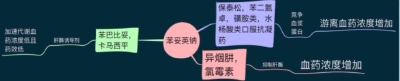
	  - ①血浆蛋白结合角度
		- 保泰松、苯二氮䓬类、磺胺类、水杨酸类、口服抗凝药：与苯妥英钠竞争血浆蛋白的结合部位，使本品游离型血药浓度增加。
	  - ②肝药酶代谢角度
		- 异烟肼、氯霉素：抑制肝药酶，提高本品的血药浓度；
		- 苯巴比妥、卡马西平：肝药酶诱导作用，降低本品血药浓度和药效。
  - <u>2. 卡马西平(carbamazepine)</u>
	- <u>（1）作用特点</u>
	  - 抑制癫痫病灶内高频放电向外周神经元的 扩散
	  - 口服吸收缓慢不规则，分布缓慢，血浆蛋白结合位点无竞争者，代谢物仍有抗癫痫功能。
	  -  肝药酶诱导剂，加速自身代谢，连续用药后半衰期缩短。 
	- （2）作用机制
	  - 1.降低Na+、Ca2+的通透性
	  - 2.增强GABA的功能
	- <u>（3）临床应用</u>
	  - ①抗癫痫、惊厥
	  - ②治疗 单纯性局限性发作、复合局限性发作（精神运动性）、大发作的 <mark style="background-color:#fef3c7;"> 首选 </mark> 药物 之一。对小发作效果差
	  - ③抗神经性疼痛（三叉、舌咽）
	  - ④<mark style="background-color:#fef3c7;"> 抗抑郁、抗躁狂（优于锂盐） </mark>
	  - ⑤<mark style="background-color:#fef3c7;"> 抗中枢性尿崩症 </mark>—促进ADH的分泌 / 提高效应器对ADH的敏感性
	- （4）不良反应
	  - ①常见的中枢神经系统反应：视力模糊 ， <mark style="background-color:#fef3c7;"> 复视、共济失调（卡马西平最常见的剂量相关不良反应） </mark> ， 眼球震颤；高剂量引起嗜睡。
	  - ②胃肠道不适
	  - ③偶见：水潴留、低钠血症，且依赖剂量
	  - ④少见的变态反应：中毒性表皮坏死溶解症、皮疹、麻疹等；
	  - ⑤特异质反应：骨髓抑制（再生障碍性贫血、粒细胞缺乏）；常见红斑皮疹；偶发肝损害。
  - 3.其它抗癫痫药
	- （1）苯巴比妥 phenobarbital
	  - 主要用于治疗 癫痫  大发作 及 癫痫持续状态 ；对精神运动性发作有一定疗效
	  - 但在 控制癫痫持续状态 时 不是首选 ，临床更倾向于用 地西泮 静脉注射。
	  - 不宜长期用药， 先用 <mark style="background-color:#fef3c7;"> 苯巴比妥控制，再用苯妥英钠维持 </mark>
	  - 注意： 肝药酶诱导剂；耐受性 
	  - *既能抑制病灶的异常放电，又能抑制异常放电的扩散。*
		- ①与突触后膜上的 GABA-A受体结合，增加 GABA 介导的 Cl-内流，导致膜超极化，降低兴奋性；
		- ②阻断突触前膜 Ca2+ 的摄取，减少 Ca2+ 依赖性的神经递质（NE，ACh 和谷氨酸等）的释放
		- ③较高浓度时也可阻滞 Na+ 和 Ca2+（L 型和 N 型）通道。
	- 扑米酮  primidone （记作用特点）
	  - 化学结构类似苯巴比妥，活性代谢产物为苯巴比妥和苯乙基丙二酰胺，三者均有抗癫痫活性。
	  - 作用机制：与苯巴比妥相似，即
		- ①增强 GABA-A 受体活性
		- ②抑制谷氨酸的兴奋性
		- ③作用于钠、钙通道
	  - 与苯妥英钠和卡马西平合用有协同作用，与苯巴比妥合用无意义（因为自身结构类似苯巴比妥）。
	- 乙琥胺 ethosuximide
	  - 作用机制：
		- ①阻断 T型Ca2+通道 （丘脑神经元起搏电流）
		- ②抑制Na+-K+ATP酶；
		- ③抑制大脑代谢率和GABA转氨酶
	  - <mark style="background-color:#fef3c7;"> 癫痫小发作/失神性发作首选 </mark>； 戊四氮引起的阵挛性惊厥 。 其他类型无效
> 与氯硝西泮相比：疗效小（→“小发作”）、副作用和耐受性也小。
		- 失神伴有大发作时，使用时参考苯妥英钠，建议先用苯巴比妥控制，再上乙琥胺。
	  - 副作用：可致 粒细胞缺乏和再生障碍性贫血 。 *胃肠道反应，中枢神经系统症状*
	- 丙戊酸钠 sodium valproate
	  -  广谱 ，<mark style="background-color:#fef3c7;"> 大、小混合 </mark> 发作（ <mark style="background-color:#fef3c7;"> 首选 </mark> ）. 不抑制病灶放电，但阻止异常电扩散。
	  - 应用注意： 肝毒性 
> 单纯小发作时，本药不首选。
	- 苯二氮䓬类
	  - 作用机制
		- ①特异性结合GABA受体上BZ位点、增强GABA的抑制效应；
		- ②提高Ca2+依赖性K+电导，降低神经元兴奋性。
	  -  地西泮（diazepam，安定）——治疗癫痫 <mark style="background-color:#fef3c7;"> 持续 </mark> 状态的 <mark style="background-color:#fef3c7;"> 首选 </mark> 药物 
	  - 硝西泮（nitrazepam）——肌阵挛性癫痫、婴儿痉挛
	  -  氯硝西泮（clonazepam） ——广谱抗癫痫， 小发作&持续发作& <mark style="background-color:#fef3c7;"> 肌阵挛性发作 </mark>
	- <u>*其它*</u>
	  - <u>*加巴喷丁gabapentin*</u>
> 记名字就好
	  - <u>*氟桂利嗪 flunarizine、拉莫三嗪*</u>  *lamotrigine* ：广谱，局限性、大发作
		- 成人局限性发作的<mark style="background-color:#fef3c7;"> 辅助治疗 </mark>药；<mark style="background-color:#fef3c7;">单用可治疗全身性发作</mark>，疗效类似卡马西平
		- 作用机制及特点类似苯妥英钠和卡马西平
		  - 电压依赖性 Na+ 通道阻滞药，通过减少 Na+ 内流而增加神经元稳定性。
		  - 作用于电压门控 Ca2+ 通道，减少谷氨酸的释放而抑制神经元过度兴奋
	  - <u>*托吡酯 topiramate：*</u> 与其他抗癫痫药物<mark style="background-color:#fef3c7;"> 合用于难治性癫痫 </mark> ； 对癫痫部分性发作有效。
- ### 三．抗惊厥药:  <u>硫酸镁</u>
- 注意先区别判断惊厥和癫痫。惊厥：各种原因引起的中枢神经系统过度兴奋，表现为全身骨骼肌不自主地强烈收缩、抽搐，常见于高热、子痫、破伤风、癫痫大发作、药物中毒。
-  口服  硫酸镁  泻下、利胆，不抗惊厥  ；  注射  才可！ 
- <u>1. 作用机制</u>
  - 特异性竞争Ca2+结合位点，拮抗Ca2+的作用
  - 如运动神经末梢ACh的释放需要Ca2+的作用，Mg2+竞争性拮抗Ca2+的作用，干扰ACh释放，使神经肌接头处ACh↓，骨骼肌松弛
- <u>2. 临床应用</u>
  - 血管扩张，血压下降；中枢机制；骨骼肌松弛
  - 缓解子痫、破伤风等惊厥
  - 常用于高血压危象
- 3.不良
  - 过量，呼吸抑制、血压剧降。
  - 过量中毒时用CaCl2+葡萄糖酸钙+人工呼吸解救
- 其它：地西泮、三唑仑、巴比妥类、水合氯醛 （1）Anticonvulsant 抗癫痫、惊厥作用
- # 抗帕金森病药和抗老年痴呆药（2 学时 自学翻转课堂）
- 一． <u>*帕金森病发病的病理机制*</u> 及抗帕金森病药的分类。
- *介绍*
  - 帕金森病（Parkinson's disease,PD）,又称为震颤麻痹，是一种主要表现为进行性 锥体外系功能障碍 的中枢神经系统退行性疾病。 ~~发病年龄多在50岁以上，随着社会老龄化，呈上升趋势。~~
  - ~~*根据病因可分为：原发性和继发性（动脉硬化、脑炎后遗症、药物化学中毒引起的帕金森综合征）*~~
  - 主要临床症状：
> link 氯丙嗪副作用判断
  - • 静止震颤 “搓丸样”动作
  - • 肌肉僵直 “面具脸”
  - • 运动障碍 “主动运动缓慢”
  - • 共济失调 “姿势与平衡异常”、“三屈征”、“慌张步态”
- 机制：  多巴胺学说 
> 这里有点反常识，多巴胺抑制肌效应、Ach兴奋肌效应
  - 帕金森病是因 纹状体内多巴胺减少 或缺乏、 胆碱能神经功能相对占优势 所致，表现为 肌张力增高 ，原发性因素是黑质内多巴胺能神经元退行性病变
> DA-胆碱能的失衡。link 氯丙嗪
  - 2条通路
	- 黑质-纹状体多巴胺能神经通路 ——抑制脊髓前角运动神经元
	- 胆碱能神经通路 ——兴奋脊髓前角运动神经元
	- 正常下，平衡；帕金森病患者因黑质病变，DA合成减少，纹状体内DA含量↓，黑质-纹状体通路多巴胺能神经元功能减弱，胆碱能神经功能相对占优势，出现肌张力增高的症状。
- 治疗思路
  - 总体目标：恢复多巴胺能和胆碱能神经系统功能的平衡状态
  -  药物：拟多巴胺类药、抗胆碱药。 
	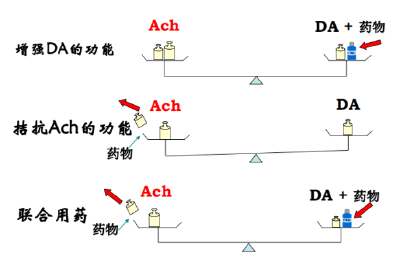
- 抗帕金森病药的分类
  - 多巴胺类药
	-  左旋多巴 (多巴胺前体药）
> levodopa，对于抗精神失常药引起的无效
	- 卡比多巴  (左旋多巴增效药)
	  - 托卡朋、恩他卡朋（COMT抑制药）
	- 金刚烷胺    (多巴胺促释放药)
	- 溴隐亭、培高利特    (多巴胺受体激动剂)
> bromocriptime
	- 司来吉兰     (MAO-B/单胺氧化酶B抑制剂)
> selegiline
  - <mark style="background-color:#fef3c7;"> 中枢抗胆碱药 </mark>
	- <mark style="background-color:#fef3c7;"> 苯海索（安坦）， </mark>可以治疗精神病药引起的帕金森
	- 苯扎托品、丙环定、苯海拉明
- 二．拟多巴胺类药：左旋多巴，搭配卡比多巴
- <u>左旋多巴(levodopa，L-dopa)——</u> 多巴胺 前体 药
  - <u>体内过程</u>
	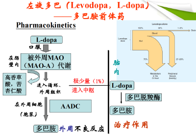
	- 吸收：口服，经小肠芳香族氨基酸转运体迅速吸收；（食物中其他氨基酸能与左旋多巴竞争同一转运体，从而减少药物的吸收）
	- - 分布
	  - 95%在外周 组织被 AADC（L-芳香族氨基酸脱羧酶） 脱羧成为DA—→恶心、呕吐等外周不良反应；
	  - 1%通过血脑屏障进入CNS转变为DA— →疗效不佳
	  -  ——同时使用AADC抑制剂   卡比多巴 ，可增效、减毒。
	- 代谢
	  - 突触前膜摄取（返回多巴胺能神经末梢）；
	  - 被MAO或儿茶酚胺-O-甲基转移酶（COMT）代谢
	- 排泄：肾
  - <u>抗震颤麻痹机制</u>
	-  增加纹状体中多巴胺含量 ，增强抑制性递质DA的作用，降低肌张力
	- *PD患者的多巴胺能神经元发生了退行性变，酪氨酸羟化酶↓，使脑内酪氨酸转变为L-DOPA↓↓↓，但将L-DOPA转变为多巴胺的能力仍存在，故使用本药，待其通过血脑屏障后，可以补充纹状体中多巴胺的不足而发挥治疗作用*
  - <u>临床应用：①各种类型的PD，</u> <mark style="background-color:#fef3c7;"> <u>除了抗精神失常药引起的（阻断了多巴胺受体）</u> </mark> <u>；</u> <mark style="background-color:#fef3c7;"> <u>②肝性脑病</u> </mark>
	- 特点：
	  - 显效慢，持续长；
	  - <mark style="background-color:#fef3c7;"> 对 </mark><mark style="background-color:#fef3c7;"> 抗精神失常药物 </mark><mark style="background-color:#fef3c7;"> （氯丙嗪） </mark><mark style="background-color:#fef3c7;"> 引起的帕金森无效 </mark> （  阻断  中枢多巴胺受体  ）
	  - 改善肌强直、运动困难较肌肉震颤效果明显
  - <u>不良反应</u>
	- ### 早期
	  -  胃肠道反应 ：L-DOPA在外周和中枢脱羧成DA，分别刺激胃肠道和延髓催吐化学感受区CTZ的 D2 受体，引发厌食、恶心、呕吐等症状
		- 可使用 多潘立酮 治疗（D 2 受体阻断药）
	  -  直立性低血压 
	  - 心脏毒性（DA→β受体） ：心律不齐
		- 合用卡比多巴减轻
	- ### 长期
	  - 运动 过多 症  Dyskinesias ：服用大量L-DOPA后，多巴胺受体过度兴奋，出现手足、躯体、舌的不自主运动；
	  - 症状波动： “ <mark style="background-color:#fef3c7;"> 开-关现象” </mark> （on-off phenomenon）:患者突然多动不安，而后又出现肌强直运动不能，交替出现。
	  - 精神症状：与脑内DA增多，兴奋中脑-边缘系统和下丘脑-垂体DA通路有关
		- <mark style="background-color:#fef3c7;">用</mark><mark style="background-color:#fef3c7;"> 氯氮平 </mark><mark style="background-color:#fef3c7;">治疗</mark>（link：抗精神失常药）：特异性阻断中脑边缘&中脑皮层的D4
	- ### 药物相互作用
	  - •  禁止  同时服用  Vit-B6（脱羧酶辅酶 加速外周代谢） 
		- Vit-B6 是L-DOPA脱羧酶辅酶，加速L-DOPA在外周脱羧，进入脑循环L-DOPA ↓， 疗效↓，不良反应↑
	  - •  不宜合用  吩噻嗪类（阻断受体 精神分裂）、利血平（耗竭DA 相互拮抗） 
		- 吩噻嗪类 （氯丙嗪，治疗精神分裂） 可阻断中枢DA受体， 利血平 （降血压、安定，耗竭5-HT、NE和DA）可耗竭黑质-纹状体中的多巴胺，引起药源性PD，拮抗L-DOPA的作用
	  - •  不宜与抗抑郁药合用 ——引起直立性低血压
  - 小结（图表）
  - 卡比多巴与左旋多巴的作用关系
	- 卡比多巴（Carbidopa） —— AADC抑制剂 
	- • <mark style="background-color:#fef3c7;">不能通过血脑屏障</mark>，仅抑制外周AADC；
	- • 单用无意义，与L-DOPA配伍使用可减少其外周脱羧，增加L-DOPA进入中枢的量，提高疗效、减少副作用。
- 司来吉兰、金刚烷胺、溴隐亭、培高利特（了解作用特点）
  - 司来吉兰（Selegilline） ——  MAO-B抑制药 
	- MAO-A：存在于肠道；MAO-B:存在于纹状体，参与DA的降解
	- 药理作用
	  -  选择性抑制中枢MAO-B ，降低脑内DA代谢，使中枢DA浓度增加、有效时间延长；
	  - 抗氧化
	  - 减轻“开-关”现象
	  - 类比：恩他卡彭——抑制 COMT
	- 临床应用
	  - 与L-DOPA合用；
	  - 与抗氧化剂Vit-E合用（保护神经）
	- 不良反应： 大剂量（＞10mg/d）可抑制外周MAO-A， <mark style="background-color:#fef3c7;"> 引发高血压危象 </mark> （外周NE、DA过多） 
  - 金刚烷胺（Amantadine） —— 促DA释放药 
	- 药理作用
	  - - 促进纹状体残存的完整DA能神经元释放DA；
	  - - 抑制神经末梢对DA的再摄取；
	  - - 对DA受体有一定兴奋作用；
	  - - 有部分抗胆碱作用。
	- 临床应用
	  - - 抗震颤麻痹作用，与其它药物合用产生协同作用
	  - - 当患者<mark style="background-color:#fef3c7;">不能耐受L-DOPA时</mark>可选用本药
	- 不良反应
	  - 长期应用，下肢皮肤可出现网状青斑（可能与儿茶酚胺释放引起外周血管收缩有关）
  - 溴隐亭（Bromocriptine）——多巴胺受体激动剂
	- 长期用L-dopa疗效减弱，D2-R 激动剂直接激动DA受体，仍可获得疗效
	- -对黑质-纹状体内DA受体有强激动作用
	- -对结节漏斗处DA-R有选择激动作用，减少催乳素释放
	- -对α-R有弱激动作用
	-  不良反应较多——精神系统症状 
- 三．胆碱受体阻断药：苯海索
- 苯海索（  Trihexyphenidyl  ）  /  安坦（  artane  ） ——中枢抗胆碱药
  - - <mark style="background-color:#fef3c7;"> 抗精神失常药引起的帕金森 </mark>综合征
  - 药理作用：中枢胆碱能受体阻断药，减弱纹状体中ACh的作用
  - 不良反应&注意
	- - 副作用较多，现已少用
- 苯扎托品 benzatropine
- 阿尔兹海默症： 胆碱能和谷氨酸能的失衡 。 AchE拮抗（他克林，石杉碱甲，加兰他敏）；NMDA受体拮抗（美金刚）
> 联系：帕金森病是多巴胺能和胆碱能的失衡；老年痴呆是胆碱能和谷氨酸能的失衡
- 老年痴呆
  - 组织学： 老年斑、神经原纤维缠结、脑血管淀粉样蛋白沉积。
  - 病理基础：  胆碱能神经兴奋传递障碍  ， 中枢神经系统内Ach-R变性及神经元数目减少；谷氨酸的兴奋毒性所致的NMDA受体过度激活
- 治疗策略
  - （ACh  E  拮抗药） 增强中枢胆碱能神经的功能
  - （NMDA受体拮抗药） 拮抗谷氨酸能神经的功能
-  胆碱酯酶抑制  药 ： 他克林，加兰他敏 
> 知道是什么类型，名字
  - 他克林 Tacrine：严重不良反应（尤其是肝毒性），现已撤市；可以抑制AchE，还可以直接激动M、N受体
	- ①抑制脑内AChE，增加脑内ACh含量。
	- ②促进脑内ACh的释放。
	- ③直接激动M-R和N-R。
	- ④促进脑组织对葡萄糖的利用,改善
	- 学习、记忆能力的降低。
  - 加兰他敏 Galanthamine：<mark style="background-color:#fef3c7;"> 轻、中度阿尔兹海默症的首选药。疗效与tacrine相当，无肝毒性。 </mark>
  - 石杉碱甲 Huperzine A
  -  多奈哌齐 donepezil 
  -  利斯的明 rivastigmine 
- NMDA受体拮抗药：美金刚  Memantine
  - 中重度AD
  -  拮抗NMDA受体，影响谷氨酸的功能 
  - 适度拮抗，可以保留学习认知功能。区别于金刚烷胺（促进多巴胺释放、抗病毒）。
- # 局部麻醉药（2 学时 自学翻转课堂）
> 最重要的是从教材摘出来的那张绿色表格。
- ## 一．局部麻醉药的概念
-  局部地作用 于神经 末梢或神经干 ，能 可逆 地阻断神经AP的产生和传导，在 意识清醒  的条件下 引起有关神经支配的部位出现暂时性、可逆性的感觉丧失的药物。
- 常用局部麻醉药的 <u>*化学结构*</u> ：亲脂-中间链-亲水
  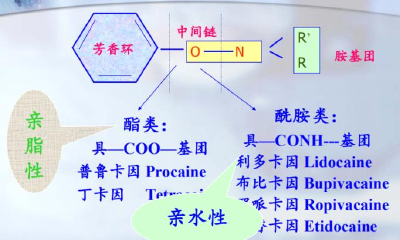
  - 酯类：毒性相对大、治疗指数低、易过敏，由胆碱酯酶降解。代表药： 普、丁（pudding） 
  - 酰胺类：毒性相对小、治疗指数较大、不易过敏，由肝药酶降解。代表药见上
  - 变态反应：荨麻疹、支气管痉挛、喉头水肿等，酯类比酰胺类发生率高。（~普鲁卡因）
  - ② 治疗指数（Therapeutic Index, TI）：在 动物试验 中，<mark style="background-color:#fef3c7;"> TI = LD50 / ED50（致死比有效） </mark> ;在 临床上， <mark style="background-color:#fef3c7;"> TI=TD50/ ED50（中毒比有效） </mark>。TD50越大，ED50越小，治疗指数越高，表明安全性越高。
- ## <mark style="background-color:#fef3c7;"> 影响因素 ※ </mark>
  -  血管收缩药 可延长局麻药作用时间，降低毒性。但侧支循环差部位（手脚趾、阴茎）禁用，缺血坏死
  - 药物剂量：✔药效、毒性；但 ×消除时间（一级动力学，半衰期恒ln2/Ke)
  - 体液pH：碱性胺类药。炎症、脓肿部位酸性，必须浸润麻醉才好吸收。
  - 长短效局麻药混用
- ## 二．局部麻醉药的作用
- ### <u>局麻作用</u>
  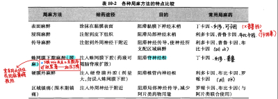
  - 选择性作用于局部神经组织电压门控Na+通道，抑制Na+内流， 阻止动作电位的产生和传导 
  - - 对膜RP电位无明显影响，主要抑制动作电位；
  - 具有 使用依赖性/频率依赖性  ，即  神经组织受到的刺激频率越高、开放的通道数目越多，受阻滞越明显，局麻作用越强。 （“枪打出头鸟”）
  - - 对任何神经都有阻断作用，高浓度时最后抑制运动神经、平滑肌和骨骼肌。敏感性不同：先麻冷的、痛的、兴奋的
- ## 不良反应
  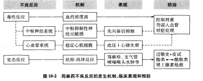
- ### <u>中枢作用（不良）</u> ：先兴奋后抑制
> 中枢抑制性神经元对procaine更敏感；先焦躁后意识丧失；可被 <u>苯二氮卓</u> 、巴比妥干预
- ### <u>心血管作用（不良）</u> ：心脏抑制、小动脉扩张
- ### 变态反应：荨麻疹、支气管痉挛、喉头水肿等，酯类比酰胺类发生率高
- ## 三． <u>普鲁卡因(procaine)</u> /奴佛卡因（novocaine）； <u>丁卡因(tetracaine)、利多卡因(lidocaine)</u> ； *布比卡因、罗哌卡因等；新型麻醉药。*
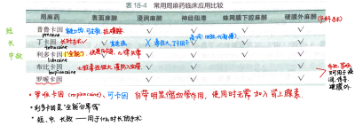
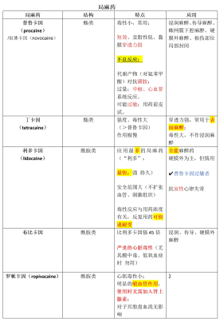
> 普鲁卡因中枢毒性可被苯二氮卓类解救
> ​优先看第一个表，背住表1就够了！
> 普定利布多——酯类+利布特奥特曼
- 选择题
- 镇静催眠
- 入睡困难：唑吡坦、佐匹克隆
- 早醒：地西泮
- 刺激胃：水合氯醛
- 精神失常
- 抗抑郁症药会问“属于XX类抑郁药的是”。回去看绿色大表和口诀。NARI就记一个地昔帕明。
- 神经阻滞镇痛药：氟哌利多
- 氯丙嗪对晕动症无效
- 中枢抗胆碱药不可解救氯丙嗪引起的迟发型运动障碍
- 见D4受体、免除锥体外系反应，选氯氮平
- 解救氯丙嗪低血压：去甲肾上腺素
- II型精神分裂症可用：氯氮平、舒必利
- 氯培酮是非经典抗精神分裂药（5-HT受体抑制）
- 镇痛药
- 喷他佐辛激动k、d，抑制u；杜冷丁抑制M受体
- 冬眠合剂
- <mark style="background-color:#fef3c7;">喷他佐辛：非麻醉性镇痛药；</mark>哌替啶：心源性哮喘；不可用于支气管哮喘
- 哌替啶vs 吗啡：呼吸抑制相似，胃肠道作用减弱
- 芬太尼：时间最短
- 纳洛酮鉴别吗啡成瘾；美沙酮戒毒
- 急性心肌梗死大胆选吗啡（镇痛、心肌保护）
- 胆结石：不可选吗啡，要选【哌替啶+阿托品】
- NSAIDS
- 几乎无抗炎作用、仅解热镇痛、儿童感冒首选、Reye替代：对乙酰氨基酚
- 最强、不易控制的发热：吲哚美辛
- 类风湿性关节炎首选：阿斯匹林
- 小剂量明显抑制血栓：仅Aspirin
- 十二指肠溃疡史：布洛芬
- 无水杨酸反应：布洛芬
- 长期大量Aspirin，凝血障碍，可用Vit K预防
- 解热镇痛药对内脏平滑肌绞痛无效，不仅在外周，部分进入中枢发挥作用。
- 塞来昔布：治疗剂量影响PG但不影响TXA2
- 阿斯匹林可通过胎盘屏障
- 与NSAIDS抑制PG合成酶无关的不良反应是
  - A 阿斯匹林哮喘——脂氧酶 LT⬆️
  - <mark style="background-color:#fef3c7;">B 水杨酸反应（过量中毒）</mark>
  - C 抑制血小板聚集（COX-2于血小板 TXA2⬇️）或致血栓（血管内皮PGI2⬇️）
  - D 胃溃疡、胃出血（PGE2保护作用⬇️、直接刺激。布洛芬弱）
  - E 损伤肾功能 （PGE2扩肾血管）
- 局麻药
- 也有心肌膜稳定作用
- 普鲁卡因易过敏
- 丁卡因不浸润（毒大），普鲁卡因不表面（穿透力弱）
- 罗哌卡因  产科手术 
> 联想：罗姐姐刚生了宝宝。
- 中毒：中枢先兴奋后抑制。惊厥抢救：苯二氮卓（地西泮）、速效巴比妥
- 布比卡因：严重心肌毒性，但可用于产科
- 蛛网膜下腔、硬膜外麻醉合用 麻黄碱 ：防止局麻药过度降低血压
- 癫痫惊厥
- 名词解释
  - 癫痫：脑组织局部病灶神经元异常高频放电，并向周围扩散，大脑功能短暂失调综合征。
  - 惊厥：中枢神经系统过度兴奋，表现为全身骨骼肌不自主强烈收缩抽搐。
- 临床应用考的多
  - “小老虎 大苯蛋 卡掉部分才好看 丙戊酸钠全能干 氯硝西泮肌阵挛 持续状态地西泮”
  -  大局苯 ：大发作、局限性发作，首选苯妥英钠。 小发作无效甚至病情恶化
  - 乙琥胺：小发作（单纯失神发作）首选。“小老虎”
  - 部分性发作首选卡马西平（“卡掉部分”）
  - 丙戊酸钠：广谱抗癫痫，大发作合并小发作首选
  - 氯硝西泮：肌阵挛型发作
  - 苯二氮卓——地西泮：癫痫持续状态（静脉推注，易呼吸抑制）
  - 局限性发作辅助治疗、单用全身发作治疗：氟桂利嗪、拉莫三嗪
  - 癫痫+抗心律失常（解救强心苷中毒）+三叉神经痛：苯妥英钠
  - 癫痫+尿崩症+抗抑郁（比锂好用）+周围神经痛：卡马西平
  - 苯妥英钠不良反应有哪些：①强碱性、局部刺激（牙龈增生、静脉炎；肌皮注射局部沉淀）；②抑制叶酸合成促进代谢，巨幼红细胞贫血；③小脑前庭功能障碍；④抑制维生素D代谢，缺乏维生素D；⑤男性增乳，女性多毛，胎儿致畸
  - 苯妥英钠长期使用应补充甲酰四氢叶酸。
  - 扑米酮代谢产物就是苯巴比妥。
  - 苯巴比妥先行，苯妥英钠维持
- 苯妥英钠药物互作——考 苯妥英钠 高血浆蛋白结合率、肝药酶诱导剂。 
  - ①血浆蛋白结合角度
	-  保泰松、苯二氮䓬类、磺胺类、水杨酸类、口服抗凝药 ：与苯妥英钠竞争血浆蛋白的结合部位，使本品游离型血药浓度增加。
  - ②肝药酶代谢角度
	-  异烟肼、氯霉素 ：抑制肝药酶，提高本品的血药浓度；
	-  苯巴比妥、卡马西平 ：肝药酶诱导作用，降低本品血药浓度和药效。
- 退行性
- 名词解释：开关现象
  - 长期服用左旋多巴产生的不良反应，表现为症状波动： “ <mark style="background-color:#fef3c7;"> 开-关现象” </mark> （on-off phenomenon）:患者突然多动不安，而后又出现肌强直运动不能，交替出现。 （或：“开”时患者活动正常，“关”时出现严重的PD）。
- L-dopa对吩噻嗪类药源性PD无效；抗胆碱药（苯海索/安坦）对氯丙嗪PD有效！
- 大题
- 镇静催眠
- 苯二氮卓类（ key：地西泮 ） 作用机制、药理作用
- 精神失常
- （名词解释） 人工冬眠 ：氯丙嗪、异丙嗪、哌替啶合用，使患者深睡、体温&基础代谢&耗氧量降低，增强患者对缺氧、酸中毒的耐受性，中枢反应降低。有利于机体度过危险的缺氧缺能阶段，例如严重创伤、感染性休克、高热惊厥、甲状腺危象。
- 抗抑郁药可能的作用靶点有？
  - 病理：5-HT，NE⬇️
  - 从已有药物的机制来看：TCA（非选择性单胺再摄取抑制），MAOI，NARI，SSRI，SNRI，NaSSA
- 论述抗抑郁药分类、机制、代表药
  - 抗抑郁药 主要就是考哪一类 有哪些 什么名 什么机制。重点药记一个丙米嗪。
	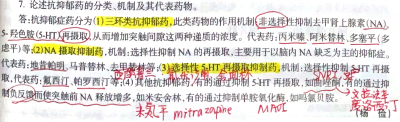
	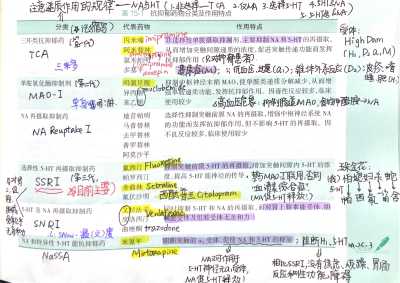
- 氯丙嗪
  - 氯丙嗪阻断哪些受体，产生哪些作用、不良反应？ D2aM
	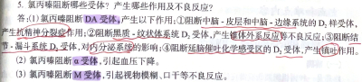
  - 如何理解氯丙嗪药理作用与脑内DA神经环路的关系？（结合多巴胺四条通路和氯丙嗪药理作用）
  - 氯丙嗪镇吐作用特点、机制？高低剂量作用区域不同，但都是D2受体
	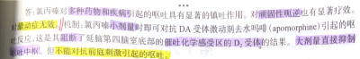
- 丙咪嗪药理作用、用药注意？
  - 非选择性TCA，H1D2aM
	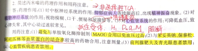
- 氯氮平几乎没有锥体外系反应的机制？
  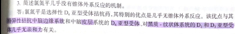
- 非经典精神分裂症药的特点（与经典相比）
  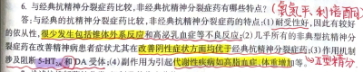
- 镇痛药
- 镇痛药名词解释（中枢、不影响意识、缓解情绪）
- 1. 阿片受体有几种类型？分别介导阿片镇痛药的哪些作用？
  -  μ、  δ、κ三种，中枢& 外周
	- ①  μ  ：  介导吗啡典型作用：  <u>镇痛</u>  <u>，</u>  <u>镇静、镇咳、呼吸抑制、催吐、缩瞳、欣快感、依赖性</u>
	- ②κ：弱版的 μ， 主要介导脊髓镇痛效应，也能引起镇静作用；
> link：杜冷丁/哌替啶脊髓麻醉，搭配纳洛酮解救呼吸抑制，分娩4h之前
	- ③δ：吗啡的 心肌保护作用 ；依赖性小；镇痛效应不明显， 主要调节激素 ；抗焦虑、抗抑郁
> link：吗啡对心脏不直接作用；扩张外周血管；治疗心绞痛心肌梗死、心源性哮喘
- 2. 吗啡治疗胆绞痛和肾绞痛需与解痉药阿托品合用。为什么？
  - 作用于外周平滑肌阿片受体使其收缩
  - 胆绞痛：作用于胆道Oddi括约肌阿片受体，引起平滑肌收缩绞痛
  - 肾绞痛：泌尿系统平滑肌收缩；膀胱括约肌张力升高；作用于中枢阿片受体（d？）使ADH释放增加。肾血流量减少、肾功能抑制。
- 3.临床各种疼痛如何选药？
  - 特殊：（<mark style="background-color:#fef3c7;">喷他佐辛：非麻醉性镇痛药</mark>）（哌替啶：心源性哮喘）（芬太尼：时间最短）
  - 轻度疼痛：解热镇痛抗炎药（阿司匹林、布洛芬、消炎痛栓剂等）
  - 中度疼痛：弱阿片类， 如部分μ激动剂、完全κ激动剂 。（可待因；纳布啡、喷他佐辛）
  - 重度疼痛（  <u>胆结石必+阿托品</u>  ）：强阿片类（吗啡、美沙酮、哌替啶/杜冷丁、芬太尼）
- 4.论述（中枢）镇痛药的分类和代表药
  - 阿片受体激动药
	- （一）吗啡 （Morphine） 
  - 阿片受体部分激动药
	- 哌替啶（Pethidine)  / 度冷丁（dolantin）
	- 美沙酮  methadone：主要用来戒毒，仍为较强效μ受体完全激动剂，作用时间较吗啡长、副作用小。
	-  芬太尼 fentanyl：短且强，吗啡镇痛的100倍。 不良弱。各种镇痛、麻醉辅助、透皮贴剂
	- 可待因 codeine：甲基吗啡，作用、不良弱。中枢镇咳，剧烈干咳；与NSAIDS合用于中等疼痛。
	-  喷他佐辛 pentazocine： 镇痛新，μ部分激动剂、κ完全激动剂，镇痛作用、成瘾性弱，是非麻醉管理药品
	  - 能提高血浆NA浓度，因此心血管作用与吗啡相反，加快心率、升高血压，冠心病不可用；对Oddi作用弱
	  - 可用纳洛酮对抗精神副反应、呼吸抑制
	- <u>曲马多 tramadol：</u> 中枢镇痛，作用中等（弱于吗啡，强于NSAIDS），成瘾性低
	- <u>布桂嗪 bucinnazine：</u> 同上；对皮肤黏膜运动器官有用，对内脏镇痛反而较差。用于偏头痛、三叉神经痛、炎症/外伤痛、痛经（都沾个“布”字）
	- 阿法罗定、二氢埃托啡（知道名字）
  - 其它镇痛药
	- 延胡索乙素 tetrahydropalmatine： 非阿片受体激动剂类，中枢镇痛 ，阻断D1受体，无成瘾，作用弱。慢性疼痛、胃肠肝胆疼痛、分娩痛。
> “妙不可言”
	- 罗通定 rotundine
> 由延胡索提取制成
- 5.吗啡治疗心源性哮喘的三大机制？
  -  呼吸抑制、镇静；外周：扩血管 
  - 考察心源性哮喘发病机制
	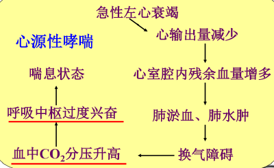
  - 原理：①降低呼吸中枢对CO2的敏感性；②镇静，减轻焦虑 Sedation；③扩张血管 Vasodilation —→缓解淤血水肿
- 6.论述吗啡的药理作用？（小绿本p118-119）
  - 中枢作用（三镇两抑一催缩）、外周（平滑肌—心血管、胃肠道、胆、泌尿生殖）、免疫抑制
  - 1. 对CNS       “三镇两抑一催缩” 
  - 各自的机制、后果
- NSAIDS
- 名词解释：水杨酸反应
> 剂量过大、中毒、症状、停药+碳酸氢钠
  -  水杨酸类药物用量过大 时，可引起 头痛、恶心、呕吐、视听减退 等症状，总称为水杨酸反应；
  - 严重时可出现 过度换气、酸碱失衡、精神错乱 。
  - 治疗： 立即停药，静滴  碳酸氢钠溶液  以碱化尿液，加速排泄；对症支持治疗 
- 名词解释：瑞夷综合征
> 儿童 病毒 发热；肝衰竭合并脑病；少见 预后恶劣；对乙酰氨基酚替代
  - <mark style="background-color:#fef3c7;"> 瑞夷综合征 </mark><mark style="background-color:#fef3c7;"> *Reye’s syndrome* </mark>
> 病毒发热儿童肝性脑病？
	- 病毒感染伴发热的儿童服用阿斯匹林后，偶可发生严重的 肝衰合并脑病 的表现（惊厥、谵妄、昏迷，死亡率较高，少见但预后恶劣）
	-  ※病毒感染患儿（流感、水痘、麻疹、流行性腮腺炎等）不宜使用，换用  对乙酰氨基酚 
- 简述“ 阿斯匹林哮喘 ”发病机制、急救用药
  - 某些哮喘患者服用水杨酸后可诱发 “阿司匹林哮喘 ”（并非抗原-抗体反应为基础的过敏反应，而与PG合成受抑制有关）
	-  机制： 因 PG合成受阻 ，由AA生成的白三烯及其他 脂氧酶 代谢产物增多，内源性支气管收缩物质占优势（使用抗组胺药，CysLT，糖皮质激素治疗）
	  
- 1.无心血管疾病的人可以服用阿斯匹林作为预防药吗？
  - 不建议。长期使用阿司匹林不旦没有益处，反而有药物的副作用，比如长期应用阿司匹林可以导致胃黏膜水肿、糜烂，形成消化性溃疡，甚至出现消化道出血。
- <mark style="background-color:#fef3c7;"> 2.对比：阿斯匹林的解热、镇痛作用，与氯丙嗪的解热、吗啡的镇痛有何不同；阿斯匹林的抗炎作用与糖皮质激素的不同。 </mark>
  - （1）解热：阿斯匹林 vs 氯丙嗪
	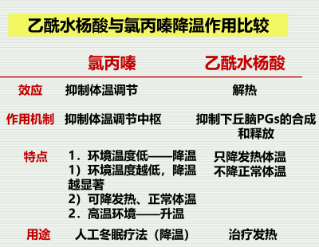
	- 1️⃣机制不同：氯丙嗪抑制下丘脑体温调节中枢,使其调节功能减弱,随外界温度变化而调节体温;阿司匹林抑制环氧酶,减少前列腺素合成,使散热增加而解热。
	- 2️⃣作用特点不同：氯丙嗪在物理降温的配合下，不但降低发热机体的体温，也可降低正常体温，在炎热天气，可使体温升高。阿司匹林只能使发热的体温恢复至正常水平，对正常的体温没有影响。
	- 3️⃣临床应用:氯丙嗪用于低温麻醉、人工冬眠；阿司匹林用于感冒发热。
  - （2）镇痛：阿斯匹林 vs 吗啡
	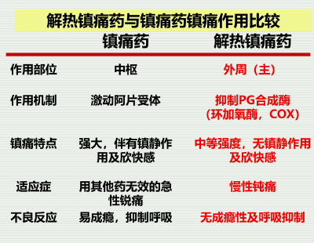
	- 1️⃣机理不同：吗啡镇痛作用部位是 *脊髓胶质区、丘脑内侧核团、脑室与导水管周围灰质* 的 阿片受体(κ、μ与δ受体)，激动受体后阻止P物质、谷氨酸等递质释放 。阿司匹林镇痛作用部位主要在外周,抑制环氧化酶,可以抑制pGs 的合成从而使 局部痛觉感受器对缓激肽等致痛物质的敏感性降低 ；部分地通过中枢发挥作用（阻碍中枢神经系统pGs的合成，或干扰伤害感受系统的介质和调质的产生释放）；其 本身也有一定的致痛作用 
	- 2️⃣特点/镇痛强度与性质不同：吗啡 强大，三镇两抑一催缩， 对各种疼痛均有效,对持续性慢性钝痛的效力大于间断性锐痛，可 消除疼痛引起的焦虑、紧张、恐惧情 绪,还显著提高对疼痛的耐受力。具有欣快感，成瘾性强。阿司匹林仅有中等程度镇痛作用,对严重创伤性剧痛、尖锐的一过性疼痛（直接刺激神经末梢）、内脏、平滑肌绞痛无效；对慢性钝痛有良好镇痛作用，对于 炎症和组织损伤引起的疼痛尤其有效 。
	- 3️⃣临床应用：吗啡主要用于急性锐痛与癌性疼痛, 因有成瘾性不用于慢性疼痛 。阿司匹林主要用于慢性钝痛,因不产生欣快感与成瘾性,应用广。 阿司匹林与阿片样物质联用可抑制术后疼痛,且可以减少阿片样物质的用量。 
  - （3）抗炎：阿斯匹林 vs GCs
	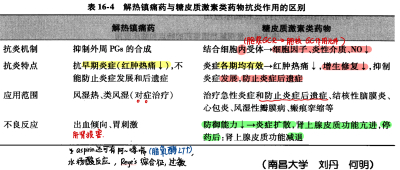
	- 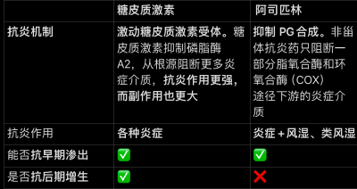
- 简述解热镇痛抗炎药的药理作用
  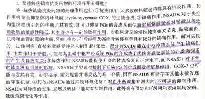
- 简述阿斯匹林药理作用、临床应用
