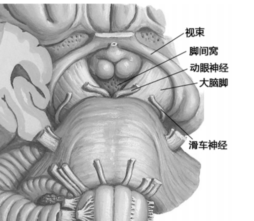
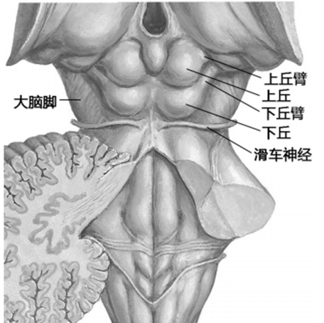

#### 解剖
###### 正面
- 大脑脚
- 脚间窝
- 动眼神经、滑车神经
[Open: Pasted image 20260908162654.png](attachments/52303e1429eeedbf155c089f1443f395_MD5.jpg)

###### 背面
- 上丘→上丘臂
- 下丘→下丘臂
- 滑车神经
[Open: Pasted image 20260908162633.png](attachments/fd50e677981163504e678a34358c07fe_MD5.jpg)
