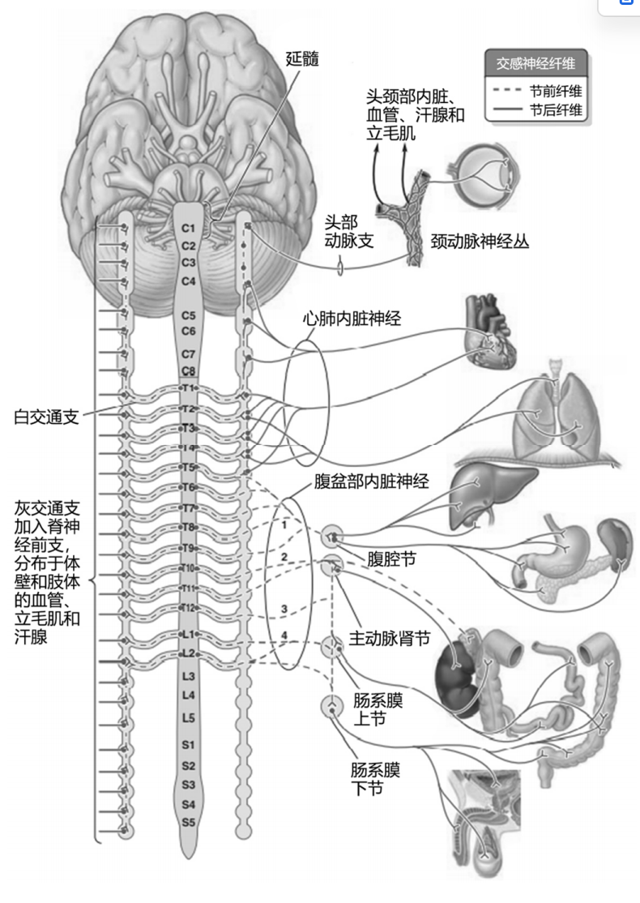
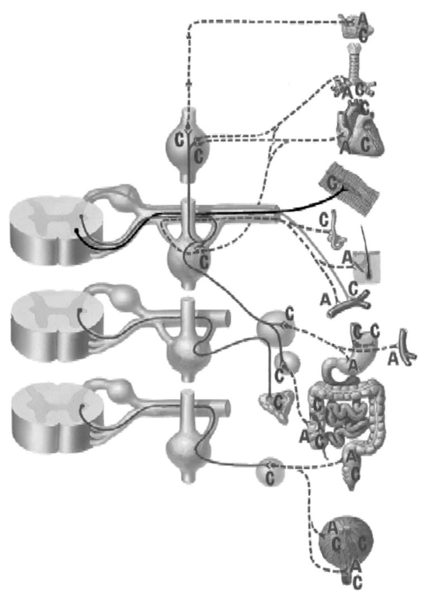
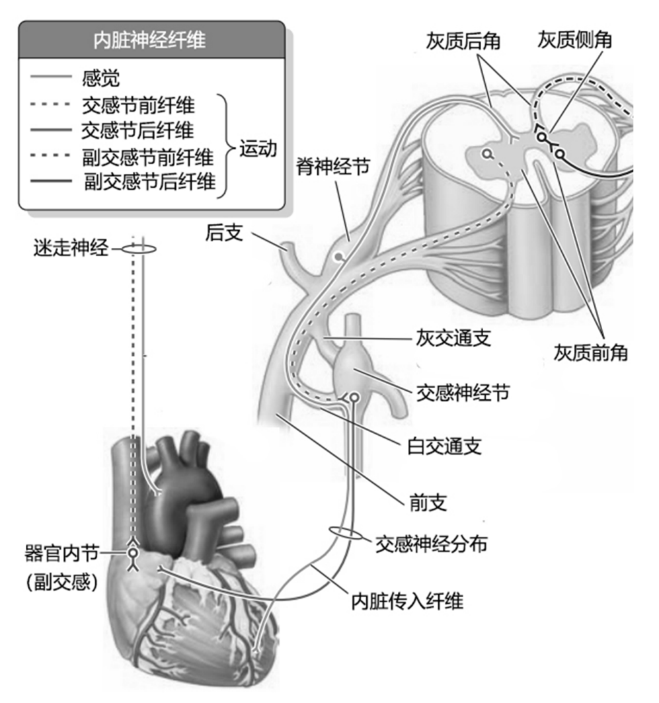

---
tags:
  - Neurology
---
### 神经解剖学
#### 1）低级中枢和神经节位置：
低级中枢位于脊髓T1～L3节段灰质侧柱的中间外侧核。交感神经节因其所在位置不同可分为[[椎旁节]]和[[椎前节]]。

[Open: Pasted image 20260904090016.png](attachments/125a6c6b3f123314d9ed81ed308a1cc6_MD5.jpg)

[Open: Pasted image 20260904090956.png](attachments/899df7c006c81578328b8e46b4dde588_MD5.jpg)

#### 2 ）交通支：
每个交感干神经节借交通支与相应的脊神经相连。
- 白交通支由来自脊髓T1～L3节段灰质侧柱中间外侧核的节前纤维组成，因有髓鞘而呈白色。
- 灰交通支由交感干神经节发出的节后纤维组成，连于交感干与31对脊神经之间，节后纤维多无髓鞘，故色灰暗而称灰交通支。
[Open: Pasted image 20260904091035.png](attachments/34226659b391dc2cc60062fa35e57e12_MD5.jpg)

#### 3）节前纤维去向：
终止于相应的椎旁节，在交感干内上升或下降，穿经椎旁节
#### 4）节后纤维去向：
- 经灰交通支返回31对脊神经，分布至头颈、躯干及四肢的血管、汗腺和竖毛肌等；
- 攀附于动脉的表面形成神经丛，随动脉到达所支配的器官；
- 直接分支分布到所支配的脏器。

