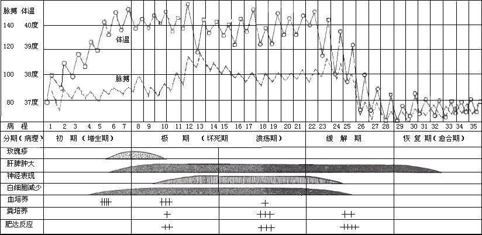

---
tags:
  - pathology
  - infection
---
[[伤寒杆菌]]引起的全身性急性传染病，以全身单核巨噬细胞系统增生和回肠末端淋巴组织病变为特征 
表现为持续高热 缓脉 脾大 [皮肤](皮肤.md)[[玫瑰疹]] 外周血[白细胞](白细胞.md)降低
#### 流行病学
传染源：患者和带菌者
- 患者从潜伏期即可由粪便排菌: 2～4 周排菌量最多，传染性最大
- 排菌 3 个月以上为慢性带菌者: 慢性带菌者是本病不断传播和流行的主要传染源，有重要的流行病学意义。
只感染人类，自然条件下不感染动物
传播途径：<mark style="background-color: #1A4F10; color: white">粪口传播</mark>（通过消化道传播）
易感人群：普遍易感，病后免疫力持久，伤寒与副伤寒无交叉免疫。儿童及青壮年发病较多，老年人少见。

#### 发病机制
伤寒沙门菌（旧称伤寒杆菌）经口摄入后，未被胃酸杀灭者进入小肠，穿过肠黏膜，主要经<mark style="background-color: #1A4F10; color: white">回肠末端集合淋巴结</mark>及其上覆盖的 M 细胞侵入<mark style="background-color: #1A4F10; color: white">肠壁淋巴组织</mark>，并在肠系膜淋巴结内<mark style="background-color: #3F4B5E; color: white">被巨噬细胞吞噬</mark>，在胞内繁殖。随后细菌经胸导管进入血流，形成<mark style="background-color: #705A16; color: white">第一次菌血症</mark>（原发或一过性菌血症，多发生于潜伏期，常无明显症状），并随血流播散至肝、脾、骨髓、淋巴结等全身单核-巨噬细胞系统继续繁殖，也可到达胆囊。经过约 1～2 周潜伏期后，细菌及内毒素再次大量入血，引起<mark style="background-color: #705A16; color: white">第二次菌血症</mark>和内毒素血症，临床发病，出现持续高热、相对缓脉、玫瑰疹、肝脾肿大等全身表现（<mark style="background-color: #1A4F10; color: white">全身中毒症状</mark>）。与此同时，细菌在胆囊胆汁中大量繁殖，随胆汁排入小肠，再次穿过肠黏膜侵入肠壁淋巴组织，尤其回肠末端集合淋巴结，激发超敏反应，导致淋巴组织坏死、溃疡，病程第 2～3 周易发生肠出血、肠穿孔。细菌可随粪便、尿液排出，部分患者<mark style="background-color: #1A4F10; color: white">胆囊持续带菌而成为慢性带菌者</mark>。

#### 病理特点
镜下网状内皮细胞增生浸润，出现伤寒小结、伤寒细胞、伤寒肉芽肿。
<mark style="background-color: #705A16; color: white">伤寒细胞</mark>：增生的巨噬细胞吞噬活动活跃（吞噬有伤寒杆菌、红细胞和细胞碎片，而吞噬红细胞的作用尤为明显），吞噬红细胞的巨噬细胞！吞噬红细胞而胞浆红染。
伤寒[肉芽肿](肉芽肿.md)：伤寒细胞聚集成团形成小结节，<mark style="background-color: #705A16; color: white">伤寒小结</mark>

肠道病变：以<mark style="background-color: #1A4F10; color: white">回肠下段</mark>和孤立淋巴小结的病变最为常见明显
分期（每期各约一周）
	髓样肿胀期
		回肠下段淋巴组织增生肿胀，凸出黏膜表面，纽扣样突起。以集合淋巴小结病变最显著 呈现<mark style="background-color: #1A4F10; color: white">脑回样隆起</mark>
	坏死期
		肿胀淋巴组织中心部脱落并逐渐融合扩大，灰白黄绿，失去光泽，坏死组织脱落
	溃疡期
		坏死组织崩解脱落形成溃疡 溃疡边缘稍隆起 集合淋巴小结溃疡为<mark style="background-color: #1A4F10; color: white">椭圆形花坛样改变 长轴与肠长轴平行 </mark>严重时穿孔出血，可有并发症
	愈合期
		一般无瘢痕，儿童伤寒可出现少见的溃疡表现的后遗症
肠系膜淋巴结、肝、脾、骨髓肿大（[淋巴结检查](淋巴结检查.md)）
	巨噬细胞活跃增生 骨髓中病菌较多
	肝脏轻度肿胀伴肝细胞混浊变性和灶性坏死
心肌病变：中毒性[心肌炎](心肌炎) 相对缓慢
肾脏病变：免疫复合物性[肾炎](肾炎.md) 出现蛋白尿
[[支气管肺炎]]：抵抗力下降继发肺炎球菌感染
皮肤：伤寒[玫瑰疹](玫瑰疹.md)
肌肉：凝固性[坏死](坏死.md)（蜡样变性）
胆囊：长期带菌，重要传染源
结局
	绝大多数痊愈
	少数肠出血、肠穿孔、小叶性肺炎
#### 临床表现
典型伤寒：潜伏期通常 7-14 天，分为潜伏期（W0）初期（W1）极期（W2-3）缓解期（W3-4）恢复期（W5）
- <mark style="background-color: #705A16; color: white">初期</mark>：缓慢[发热](发热.md)起病：体温逐渐升高，<mark style="background-color: #1A4F10; color: white">5~7d 内达高热</mark>，伴乏力、食欲减退，多有便秘，偶有腹泻，少汗，少有畏寒
- <mark style="background-color: #705A16; color: white">极期</mark>：稽留热；中毒症状；相对缓脉；肝脾肿大；白细胞减少；神经系统（表情淡漠、重听、呆滞）；伤寒[面容](面容.md)（非充血醉酒貌）；玫瑰疹（d6-d13，胸腹部多发，常常分批出现）；消化系统表现（纳差、右下腹轻压痛、多便秘偶腹泻、易出现肠穿孔、肠出血等并发症）
- <mark style="background-color: #705A16; color: white">缓解期</mark>：体温逐渐下降，腹胀消失，易发生肠道并发症
- <mark style="background-color: #705A16; color: white">恢复期</mark>：体温正常，症状消失
[Open: Pasted image 20260928085736.png](attachments/2f02040fece73ca1eaf9774a18b32673_MD5.jpg)

轻型：中毒症状轻、病程短
逍遥型：起病时毒血症状较微，部分患者可突然性肠出血或肠穿孔
迁延性：持续时间较长、肝脾肿大明显
暴发型：起病急、往往发展为重症

小儿伤寒：症状不典型、起病较急，肠出血和穿孔少见
老年伤寒：症状不典型、发热不高、易虚脱、病程迁延，病死率高
复发：<mark style="background-color: #1A4F10; color: white">热退后 1~3 周</mark>，发热等临床症状再现，血培养阳性，但较初发为轻，病程较短，并发症少，因免疫功能低下，或抗菌治疗不彻底所致
<mark style="background-color: #705A16; color: white">再燃</mark>：进入缓解期后，体温波动下降，但尚未达到正常时，热度又再次升高，持续 5～7 天后热退，血培养可阳性，因菌血症未完全控制所致
##### 常见并发症
肠出血：多发于 W2-W4，轻重不一，饮食不当、腹泻等常为诱因，大出血的发生率约2%～8%
肠穿孔：多发于 W2-W3，好发于<mark style="background-color: #1A4F10; color: white">回肠末端</mark>，表现为突发腹痛、外周血白细胞增高伴核左移，体温上升，腹腔 X 线检查可见膈下游离气体，发生率为 3%-4%
中毒性肝炎、中毒性心肌炎、溶血性尿毒综合征
#### 诊断
###### 外周血象
白细胞减少，嗜酸细胞减少或消失（嗜酸细胞数量对诊断和病情评估有价值）；血小板多正常，突然减少应注意 DIC 或溶血性尿毒综合症
###### 尿液：
轻度蛋白尿
###### 粪便：
肠出血时可见隐血阳性或血便
###### 血培养：
<mark style="background-color: #1A4F10; color: white">W1-W2 </mark>阳性率最高，确诊常用，W3 约 50%，W4 不易检出 
复发时血培养可复阳
###### 骨髓液培养：
阳性率<mark style="background-color: #1A4F10; color: white">高于血培养</mark>，持续时间长，适用于已用抗菌药物治疗且血培养阴性的
###### 粪便培养：
<mark style="background-color: #1A4F10; color: white">W3-W4 </mark>阳性率较高，慢性带菌者可持续阳性 1 年
###### 尿培养：
早期阴性，W3-W4 可有阳性，须排除粪便污染
###### 胆汁培养：
慢性带菌者
###### 玫瑰疹吸取物培养
###### 肥达反应：⭐️
应用伤寒沙门菌的“O”与“H”抗原，通过凝集反应检测患者血清中相应抗体。W1 出现抗体；W3-W4 阳性率 90%；痊愈后可持续数月
<mark style="background-color: #705A16; color: white">阳性</mark>：“O”抗体≥ 1︰80，“H”或其他鞭毛抗体≥ 1︰160 或有 4 倍增高者更有意义。
##### 诊断要点：
1.不洁饮食史、既往病史、预防接种史，病后持久免疫。
2.临床诊断，具有典型表现：起病缓，持续发热 1 周以上；腹胀、便秘或腹泻；表情淡漠、呆滞，伤寒面容；相对缓脉，玫瑰疹、脾肿大；白细胞不升高，嗜酸细胞降低；并发肠出血或肠穿孔则有助诊断。
3.病原学诊断：肥达反应阳性，确诊依据是检出沙门菌：早期血培养、后期可考虑作骨髓培养、粪便培养可确定排菌状态。
##### 伤寒的鉴别诊断
病毒感染、[疟疾](疟疾.md)、钩端螺旋体病、急性病毒性肝炎、流行性斑疹伤寒、粟粒性结核病、革兰阴性杆菌败血症、恶性组织细胞病
#### 治疗
##### 常用药物
一般患者首先[[氟喹诺酮类]]抗生素，孕妇、哺乳期妇女、儿童可用[头孢菌素](头孢.md)
（常规不推荐氯霉素，必要时可用；复方新诺明、氨卞青霉素、羟氨苄青霉素可考虑）
退热后持续使用 10-14 d，总疗程 2-3 w
<mark style="background-color: #705A16; color: white">治愈标准</mark>：体温正常 15 d 或每隔 5 d 大便培养，连续 2 次阴性
##### 伤寒的一般治疗及对症治疗方法
一般治疗：消化道隔离；卧床休息；注意卫生；观察生命体征及腹部、大便、保持大便通畅；
> 高热者不宜药物降温；
> 便秘者禁用泻药；
> 腹泻者忌用鸦片制剂；
> 腹胀者忌用[[新斯的明]]；
> 慎用激素
##### 并发症及慢性带菌者的治疗
慢性带菌者治疗：氨苄西林与[丙磺舒](丙磺舒)联合；复方磺胺甲基异噁唑（SMZ+TMP）；氧氟沙星或左氧氟沙星；
<mark style="background-color: #1A4F10; color: white">持续 4-6 周，可考虑手术</mark>胆囊切除
并发症治疗：
- 肠出血：禁食、休息、止血、手术 ；
- 肠穿孔：禁食、手术、抗生素；
- 中毒性心肌炎：卧床，激素，支持；
- 溶血性尿毒综合症：按急性溶血和急性肾衰处理
##### 伤寒的预防措施
###### 管理传染源：
现症患者：隔离治疗至体温正常后 15 天或粪便培养 2 次阴性（每 5 天一次）。
带菌者检出：饮食行业血清 Vi 抗体超过 1︰20 即可拟诊，大小便培养阳性可确诊。
带菌者治疗：疗程为 4-6 周，慢性胆囊炎、胆石症应作胆囊切除术。
###### 切断传播途径：
粪便、水源和饮食卫生管理
###### 保护易感人群：
主动免疫：预防接种
