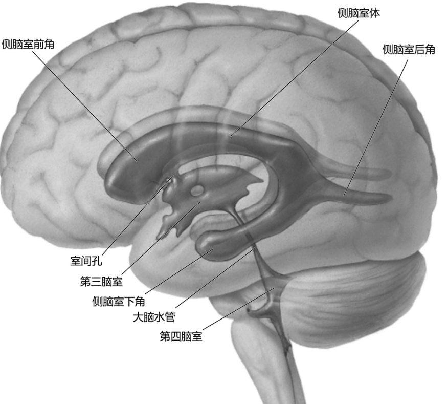

---
tags:
  - anatomy
---
左右各一，位于大脑半球内，并延伸到半球的各个叶，因而分为4部：
中央部位于顶叶内；
前角是中央部伸向额叶的部分；
后角是中央部伸向枕叶的部分；
下角是中央部伸向颞叶的部分。
两侧前角各借室间孔与第三脑室相通。
[Open: Pasted image 20260916105844.png](attachments/4ed6b7788d0312abcd8e40d1892e1d68_MD5.jpg)

