---
tags:
  - pathology
  - digestive
aliases:
  - CD
  - 局限性肠炎
---
[Open: Pasted image 20260924103821.png](attachments/8833482b85b5beccb3466e4aa11cf298_MD5.jpg)

#### 诊断
- 缺乏金标准
- 排除其他原因结肠炎
- 结合临床表现、结肠镜检查、影像学及病理综合诊断并随访观察
- 强调小肠检查在CD诊断重要性
##### 临床表现
- 表现为反复发作的右下腹或脐周腹痛、腹泻、发热、反复口腔溃疡等
- 营养不良
- 瘘管、脓肿、肛周病变
- 肠外表现
- 累及全消化道，好发于末段回肠及临近结肠
> 具备上述临床表现者，临床疑诊，安排进一步检查；同时具备内镜及影像学特征者临床拟诊。<mark style="background-color: #1A4F10; color: white">如加上典型组织学改变且排除其他肠结核者，可确诊</mark>。
> 初发病例难以确诊时应随访观察6-12月
> 如与肠结核诊断混淆者应诊断性抗结核治疗8-12周。
##### 内镜及影像学检查
###### 结肠镜（应进入末段回肠）及活检
- 节段性、纵行溃疡，铺路石样改变
[Open: Pasted image 20260922093624.png](attachments/65658482ad0b47d7accb2c25d3668ba2_MD5.jpg)
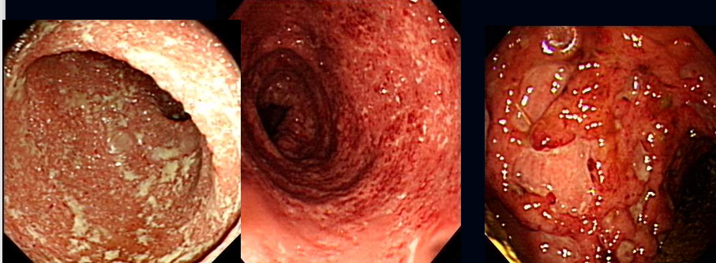
- 好发于右半结肠及末端回肠
- 肛周病变
[Open: Pasted image 20260922090911.png](attachments/26b31eab5d4362107e684cffdaa8cbbc_MD5.jpg)
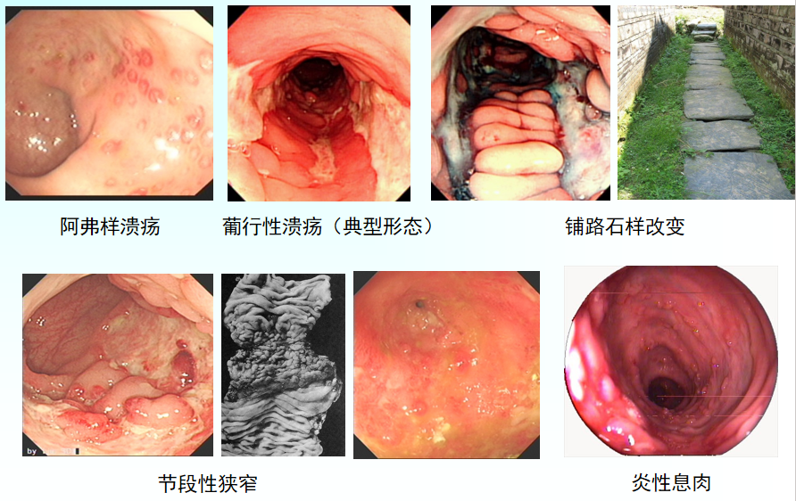
###### CTE/MRE
CTE：全称 CT Enterography，中文常叫 CT小肠成像 / CT小肠造影。
MRE：全称 MR Enterography，中文常叫 磁共振小肠成像 / 磁共振小肠造影。
属于CD常规检查——判断病变范围、并发症
典型改变： <mark style="background-color: #1A4F10; color: white">肠壁增厚</mark>、<mark style="background-color: #1A4F10; color: white">靶症</mark>、<mark style="background-color: #1A4F10; color: white">木梳征</mark>
[Open: Pasted image 20260922091420.png](attachments/9a5622bd0f0bc813b982e4659e475c3e_MD5.jpg)
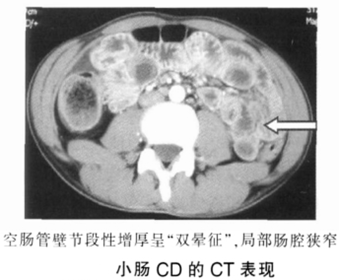
[Open: Pasted image 20260922091440.png](attachments/805afa0747039b8fd3aa95e463d546f8_MD5.jpg)
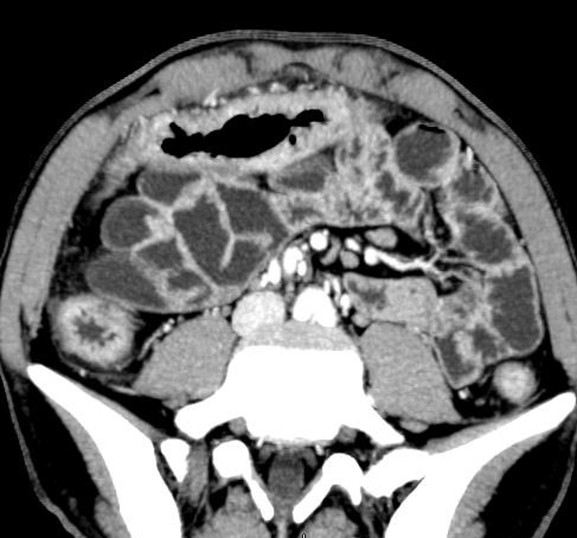
###### 胶囊内镜与小肠镜
###### 肛周瘘管行盆腔MRI
###### 腹部超声
##### 组织学
- 透壁炎症
- 粘膜(M)和粘膜下炎症(SM) 溃疡
[Open: Pasted image 20260922091242.png](attachments/08c05675e2c24b92832f457b1aaa4f61_MD5.jpg)
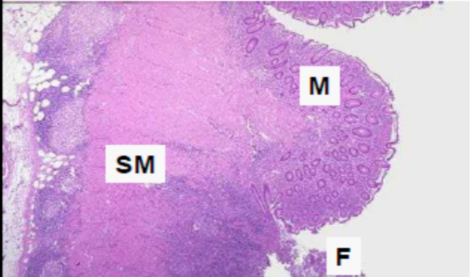
- 裂隙样改变(F)
[Open: Pasted image 20260922091302.png](attachments/7caa9972c8c771b564dc97f00303825f_MD5.jpg)
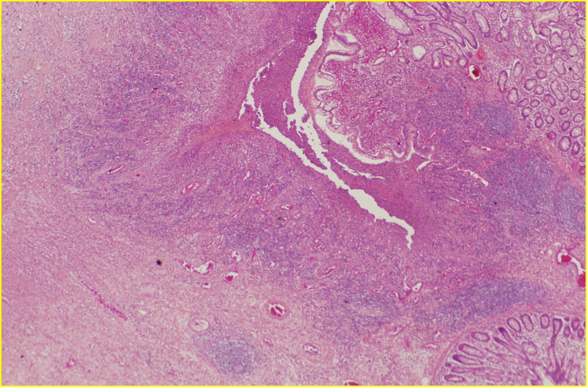
- 上皮细胞样肉芽肿相对特异性，但仅见于40%的患者。
[Open: Pasted image 20260922091233.png](attachments/86361042e3bef734810bf65e77c80665_MD5.jpg)
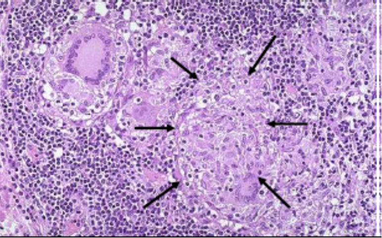
##### 鉴别诊断
- [肠结核](肠结核.md)：好发于回盲部，跳跃分布；环形溃疡；伴狭窄、炎性息肉或结节状增生；干酪性肉芽肿；抗酸染色阳性
[Open: Pasted image 20260922092402.png](attachments/144637fbaa4aa8a2a7d50a56ad08a41b_MD5.jpg)
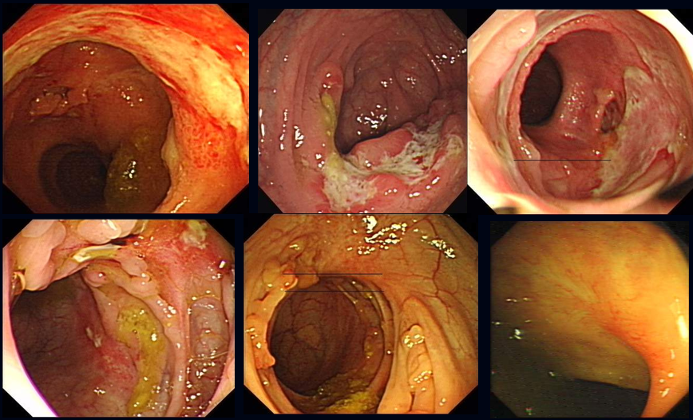
[Open: Pasted image 20260922091707.png](attachments/22dcbac92af27f15f667bdc5b152a767_MD5.jpg)
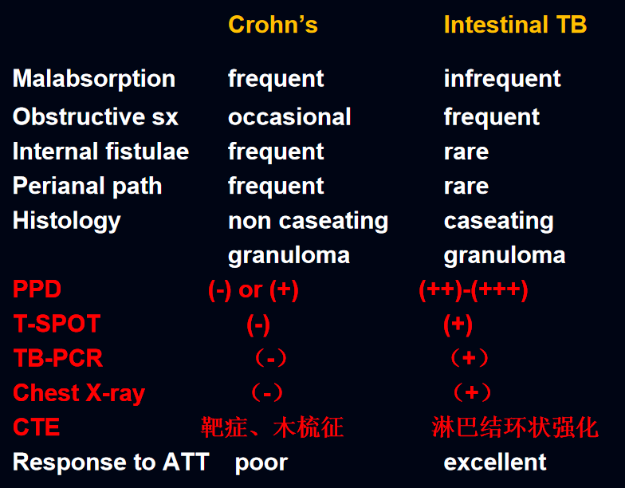
- [阿米巴](阿米巴.md)痢疾：好发于盲肠和升结肠；弥漫性充血水肿；散在分布针尖样大小溃疡口；分布絮状坏死物质；溃疡之间粘膜炎症反应较轻。
[Open: Pasted image 20260922093051.png](attachments/74e66e5fbfd280922a8be08284ab62c6_MD5.jpg)
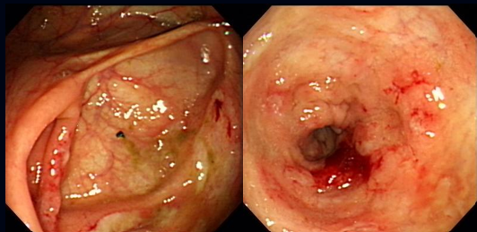
- 耶尔森菌肠炎
- [NSAIDs](NSAIDs.md)肠病：有NSAIDs服用史；腹痛、腹泻或血便；粘膜水肿、红斑、糜烂、阿弗他样溃疡；病变分布多为局灶性；可分布于各个肠段，也可为弥漫性。
[Open: Pasted image 20260922092827.png](attachments/b3ebb7a7eb53f26fae29f65aa9a138a8_MD5.jpg)
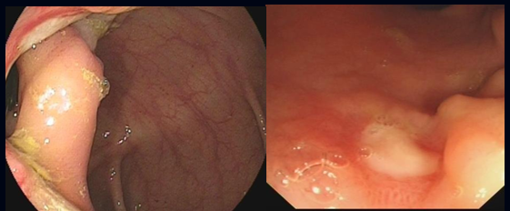
- 肠道[淋巴瘤](淋巴瘤.md)：好发于回肠末端和盲肠，其次为右侧结肠；单发或多发；多发病灶时也可呈跳跃性分布；可呈恶性溃疡特点也可表现为良性溃疡改变；活检诊断率16％（3/18）
[Open: Pasted image 20260922092659.png](attachments/2c227c42e6cac372f71c2aac677147e5_MD5.jpg)
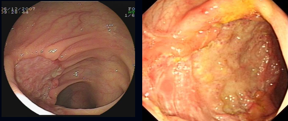
- 白塞病（白塞氏病）：好发于末回及回盲部；溃疡单发或多发，界限清楚；主溃疡和副溃疡，呈圆形、椭圆形或不规则形；底深，周边呈环堤或结节状隆起；血管炎改变。
[Open: Pasted image 20260922092747.png](attachments/f45c4a97c8eeea1b8beb68c352fab0bb_MD5.jpg)
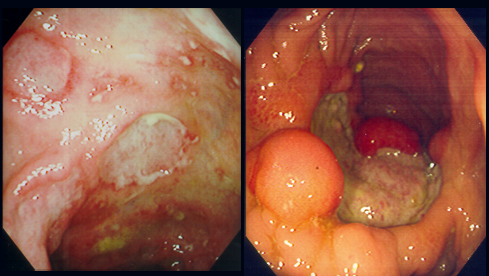
- 缺血性结肠炎：多见于老年人<mark style="background-color: #1A4F10; color: white">动脉粥样硬化、房颤、口服避孕药</mark>者；突发腹部绞痛及便血；好发于脾曲、降乙结肠；分布局限，病变界限清楚；溃疡不规则或纵行，炎症反应重；可伴肠管狭窄。
[Open: Pasted image 20260922093544.png](attachments/cc067ed9148f5315959185d7f53543d9_MD5.jpg)
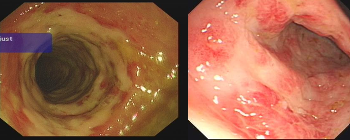
- 放射性结肠炎
##### 诊断要点
###### 疾病行为：⭐️
B1炎症型，B2狭窄型，B3瘘管型
###### 病变范围：
L1:回肠末段型，L2结肠型，L3回结肠型，L4 上消化道型
###### 分期：
活动期和缓解期
###### 严重度：
轻度、中度、重度
CDAI：

| 变量                    | 权重  |
| --------------------- | --- |
| 稀便次数（1周）              | 2   |
| 腹痛天数（1周总评，0~3分）       | 5   |
| 一般情况（1周总评，0~4分）       | 7   |
| 肠外表现与并发症（1项1分）        | 20  |
| 阿片类止泻药（0、1分）          | 30  |
| 腹部包块（可疑2分;肯定5分）       | 10  |
| 红细胞压积降低值（正常*:男40,女37） | 6   |
| 100×（1-体重/标准体重）       | 1   |
###### 肠外表现和并发症
肠道并发症：[出血](出血.md)、肠穿孔、腹腔内脓肿、狭窄和[肠梗阻](肠梗阻.md)、肛瘘和肛周疾病、中毒性巨结肠、恶性肿瘤
肠外并发症：[强直性脊柱炎](强直性脊柱炎.md)，坏疽性脓皮病，结节性红斑，[虹膜炎](虹膜炎)，葡萄膜炎 ，巩膜外层炎，原发硬化性胆管炎 ，肾结石病和胆结石等
#### 治疗
##### 升阶梯疗法
费用低
病程长
导致不可逆的组织损伤（肠壁纤维化等）
##### 降阶梯疗法
改变疾病自然病程
价格昂贵、部分无效
继发感染和肿瘤的风险增高
[Open: Pasted image 20260924103232.png](attachments/91d86b904b48733de738c75055fdf2fb_MD5.jpg)
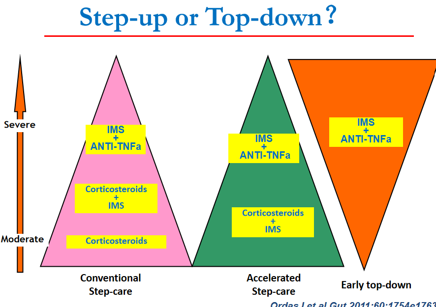
##### 生物制剂
[Open: Pasted image 20260922084443.png](attachments/5b6183d890efa71a964e96e4b9b32945_MD5.jpg)
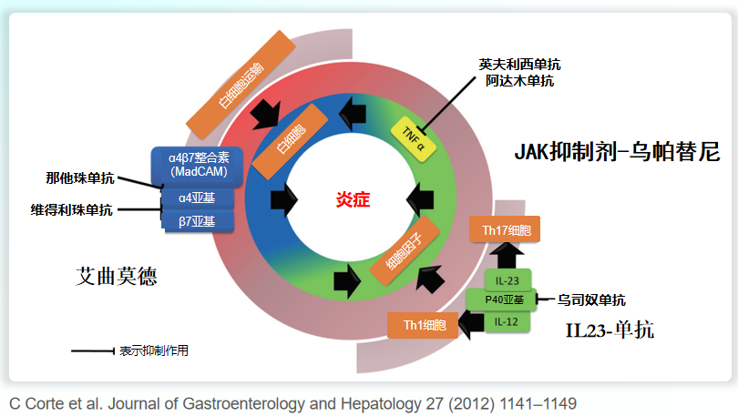
##### 病程
[Open: Pasted image 20260924103421.png](attachments/50fd1e9af3b8c6d367c0b3e6262e72e6_MD5.jpg)
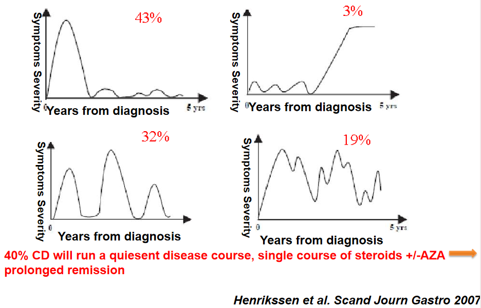
##### 高危因素
- 合并肛周病变
- 广泛性病变（累计病变累及肠段＞100cm）
- 回结肠型
- 食管胃十二指肠病变
- 发病年龄轻
- 首次发病即需要激素治疗等

---
又称局限性肠炎，为主要侵犯消化道的<mark style="background-color: #705A16; color: white">全身性疾病</mark>
主要累及<mark style="background-color: #1A4F10; color: white">回肠末端</mark> 其次是结肠 近端回肠 空肠等处
大体观：
	病变呈<mark style="background-color: #1A4F10; color: white">节段性</mark> 病变之间的黏膜正常；病变处肠壁增厚变硬 肠黏膜高度水肿 皱襞块状增厚（<mark style="background-color: #1A4F10; color: white">铺路石样</mark>）；肠管因纤维化而<mark style="background-color: #1A4F10; color: white">狭窄</mark>并与邻近肠管或腹壁<mark style="background-color: #1A4F10; color: white">相连</mark>
	
镜下观：
	裂隙状溃疡表面覆盖坏死组织，下方肠壁各层组织中可见大量淋巴细胞、单核细胞和浆细胞浸润（<mark style="background-color: #1A4F10; color: white">透壁性炎症</mark>→ 裂隙/瘘管/狭窄）；肠黏膜下层增厚水肿 淋巴管扩张；部分肠壁上可见非干酪样肉芽肿
	
临床表现：[腹痛](腹痛.md) [腹泻](腹泻.md) 腹部肿块 肠溃疡穿孔 肠梗阻
Crohn 病易发生消化系统恶性肿瘤，但比溃疡型结肠炎低