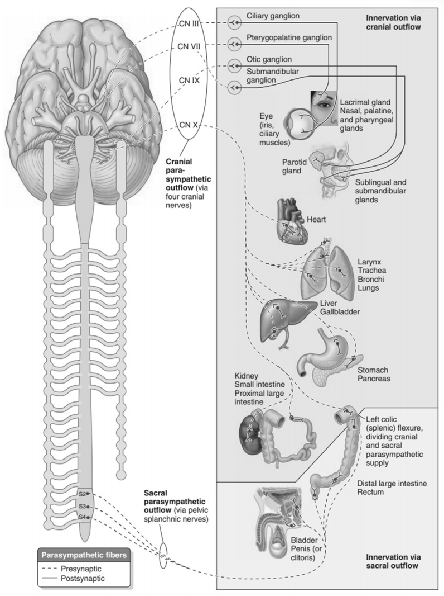

---
tags:
  - Neurology
---
脑干的4对副交感神经核和脊髓骶部第2 ～ 4节段灰质的骶副交感核，节前纤维即起自这些核。副交感神经节也称终节，多位于器官附近或器官的壁内，因此又分为器官旁节和器官内节，这些神经节一般很小，需借助显微镜才能看到，但位于颅部的器官旁节较大，肉眼可见。
[Open: Pasted image 20260904091321.png](attachments/b610a8bf9c797b799ccf5c7d54809178_MD5.jpg)

