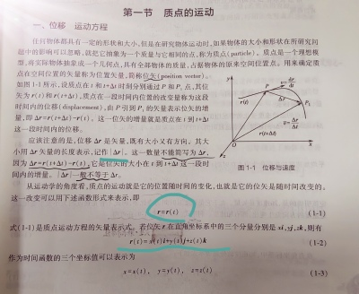
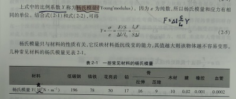
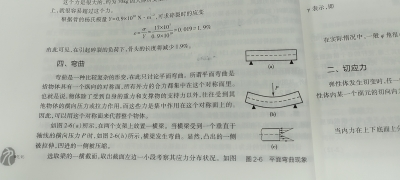
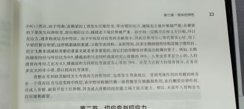
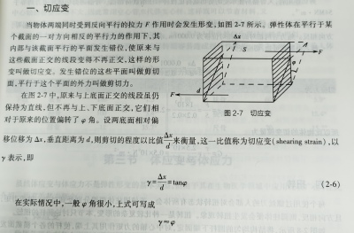
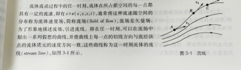
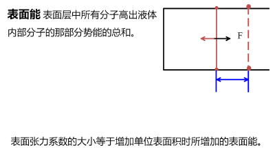

- <mark style="background-color:#fef3c7;"> **力** </mark>
  - 万有引力
  - 弹性力
    > 胡克定律，联系正应力一章
    - 正压力
    - 张力
    - 弹簧弹力
      - 胡克定律
        > $F=-kx$
  - 摩擦力
- <mark style="background-color:#fef3c7;"> **力学基本定律** </mark>
  - 质点的运动
    - 质点，位矢，位移
      
    - 速度，加速度
      > $a=d^2r/dt^2 $
  - 牛顿运动定律
    - 牛顿第一定律
      - 惯性系
      - 非惯性系
        - 惯性力/虚拟力
          > 只是参照系非惯性运动的表现，不是物体间相互作用，也没有反作用力
          - 离心力即惯性离心力
            > 制成离心机，密度大的颗粒收到的离心力大，位于管底
            > 转速越快，离心所需时间越短
    - 牛顿第二定律：作用在物体上的合外力F等于物体动量的时间变化率。
      > $F=d(mv)/dt=dp/dt$
    - 牛顿第三定律
  - 能量守恒定律
    > 一个系统只有保守力做功，其他非保守力和外力不做功或做功为0，系统机械能保持不变。
    > ​从初态变化到末态时，系统机械能的增量等于非保守力（外力和非保守内力）做功的总和，这就是系统的功能定理，它在惯性系中成立。
    - 功
      > $dA=F dr cosθ$
    - 能
      - 动能
      - 势能
        - 保守力
          > 保守力力对物体所做的功与物体运动的路径无关，仅由运动物体的始末位置所决定。
          > 也可以表述为一个物体沿闭合回路移动一周后，保守力所做的功为零。
          - 摩擦力不属于保守力
        - 由相对位置决定的函数称为系统的势能
    - 动能定理
      > 所有外力和所有内力对物体系所做的功之和等于物体总动能的增量
  - 动量守恒定律
    > 物理学最普遍最基本的定律之一
  - 刚体的定轴转动
    - 力矩M
      > 力与力臂的乘积
      - $M=FL$
      - 表示力的转动效果
    - 角动量L，角动量守恒定律
      > $L=r×p=r×mv$​
      - ​矢量 右手螺旋法则
      - 有心力作用下角动量守恒
      - 应用：开普勒第二定律
- <mark style="background-color:#fef3c7;"> **物体的弹性** </mark>
  - 线变：正应变与正应力
    - Δl绝对伸长（正负），$Δl/l0$相对伸长(正为张应变，负为压应变，统称为 **正应变** /线应变，用ε表示)
      > 如果各部分的伸长不均匀，取出微元，在这种情况下，正应变不再是常数。
    - 正应力
      - 任一横截面两边材料之间存在一种相互拉伸的内力。
        - 垂直于任一截面的拉伸内力为张力
        - 垂直于任一截面的相互挤压的内力为压力
      - 如果材料结构均匀，所受的张力应该均匀分布在横截面上，这个张力与横截面面积S之比，称为该横截面上的正压力
        > $σ=F/S$     单位为Pa，分为张应力和压应力
      - 如果物体受力不均匀或内部材料不均匀，可以取一个微元，面积为ΔS，设这个面元上张力为dF，则该面元上的正应力表示为
        > $σ=dF/dS$
    - 杨氏模量
      - 胡克定律$σ=Yε$
      - 杨氏模量Y
        
    - **弯曲**
      
      
  - 切变：切应变与切应力
    - 切应变
      
    - 切应力
      > $τ=dF/dS$​
    - 切变胡克定律$τ=Gγ$
      - G为切变模量，也称刚性模量
        > $G=Fd/SΔx$​
      - 常见切变模量
    - **扭转**
  - 体应变$θ=ΔV/V$
    - $P=-Kθ$
    - 体变模量K
      > $K=-P/θ$​
- <mark style="background-color:#fef3c7;"> **流体的运动** </mark>
  - 理想流体
    - 实际流体的性质
      > 某些液体和流动性的气体，粘滞性和可压缩性都很小，对某些问题的研究而言可忽略，只考虑流动性。
      - 粘滞性
        > 流动过程中，液体本身相邻两层间存在内摩擦
      - 可压缩性
        > 密度随压强不同而改变
    - 理想流体
      > 绝对不可压缩，且完全没有内摩擦。
  - 稳定流动
    - 流体运动的描述
      - 流场，流线
        
      - 稳定流动
        - 流线的形状不变，与质点运动轨迹重合
        - 流管：一簇流线围成的管状体。
          > Ps:真实的管子靠近管壁处流速慢
      - 连续性方程
        - 质量守恒$ρ1S1v1Δt=ρ2S2v2Δt$
        - 则$Sv$为常量，即体积流量守恒定律
  - 伯努利方程
    > $p+ρv^2/2+ρgh=常量$
    - 动压，静压
    - 应用
      - v小，p变大，e.g.飞机上升，香蕉球
      - 空吸作用e.g.喷雾器，水流抽气机，射流真空泵
        > 截面积小处，速度大，压强小，形成负压
      - 流量计
      - 流速计b管形成流速为零的滞止区
      - 分析体位对血压的影响
        > $p2-p1=ρg\Delta h$
        - *$ρ水银=13.59g/cm3$
        - 1mmHg=133.2Pa
  - 黏性流体的流动
    - 牛顿粘滞定律
      - 速度梯度$\Delta v/\Delta x$
        > 注意$\Delta x$定义
      - $f=\eta S \Delta v/\Delta x$
        > $\eta$ 为黏度（黏滞系数），一般随温度升高而减小  $1P=0.1Pa/s$
        - $\tau=\eta\gamma$
          > 内摩擦 切变率
    - 层流和湍流
      - 层流
        > 气管、血流都是层流，只有心脏内、主动脉的一些部位可能出现湍流；患有肺疾病或深呼吸时可能出现湍流。
      - 湍流
        > 有声音，河流、水管
    - 雷诺数
      > 根据实验总结出
      - $Re=\cfrac{\rho vr}{\eta}$
        > <1000 层流 >1500 湍流
    - 伯努利方程
      - $p1=p2+\Delta E$
      - $\Delta E=\rho g(h1-h2)$
        > 横截面积相同的敞口管道，必须有高度差
    - 泊肃叶定律
      - $Q=\cfrac{\pi R^{4}\Delta p}{8\eta L}$
        > 单位时间流过的体积
      - 流阻$R_{f}=\cfrac{8\eta L}{\pi R^{4}}$ 所以半径的微小变化就会造成很大影响
        > 串并联后与电阻变化相似
      - $Q=\cfrac{\Delta p}{R_{f}}$
  - 液体的表面现象
    - 分子之间的相互作用力
      > $r_{0}=10^{-10}m$ 两分子间距离在$10^{-10}-10^{-9}$ 时，作用力表现为引力
    - 表面张力
      > 趋向于表面积变小
      - 表面层(厚度等于分子作用半径)
        > 都受到一个指向液体内部的力的作用
      - 表面能
        
        > 表面层中所有分子高于液体内部分子的那部分势能的总和
        - $F=\alpha 2L$
- <mark style="background-color:#fef3c7;"> **振动** </mark>
  - 简谐振动
    > 在平衡位置附近做来回往复的运动
    - $d^2x/dt^2=-\omega^2x$ 简谐运动动力学方程
    - 解得$x=Acos(\omega t+\varphi)$ 即简谐运动方程
      > $T=\cfrac{2\pi}{\omega}$
  - 旋转矢量
    > 逆时针、匀角速、模等于振幅A，在Ox轴上的投影
    - 求初相位
    - 求相位差$\to$ 求时间
      > $\Delta t=\cfrac{\Delta \phi}{\omega}$
  - 能量
    - 动能
    - 势能
    - 机械能
      > 守恒
  - 简谐运动的合成
