- 化学反应速率
  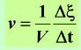
  > 单位体积反应进度随时间的变化率
  - 元反应及反应分类
    - 元反应
      > 计量式代表真实历程
      - 质量作用定律$Guldberg Waage$
    - 简单反应
      > 由一步元反应构成
    - 复合反应
      - 反应机制或反应历程
  - 反应速率方程
    - $v=kc^{\alpha}(A)c^{\beta}(B)$
    - 各浓度项指数$\alpha\beta$由实验测定
      > 初始速率法
    - 速率常数（比速率）
      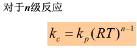
      > 物理意义
    - 反应级数
      > 浓度项的指数，其代数和为反应总级数
    - 反应分子数
      > 复合反应不存在这一概念
  - 简单反应级数的反应速率及其特征
    - 一级反应
      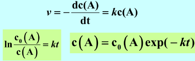
      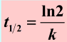
      > 反应速率只与反应浓度一次方成正比
      > 如大多数热分解反应、放射元素的衰变、分子内部重排或异构化
      - 准一级反应
        > 不是一级反应，但实际上符合一级反应
      - 规律
        > 一级反应c(A)随时间呈指数衰减，$lnc(A)～t$ 为一直线关系，由直线的斜率可求出速率常数k，k的量纲为时间-1且与浓度量纲无关
        > 达一定转化率所需的时间与反应物初始浓度无关
    - 二级反应
      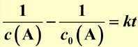
      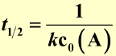
      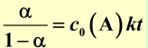
      > 反应速率和物质浓度的二次方成正比，如溶液中进行的许多有机化学反应
      - $\cfrac{1}{c(A)} $ ~$ t$ 直线关系，由直线的斜率可求出速率常数k
      - 反应的半衰期或达任意转化率所需的时间与初浓度成反比
    - 零级反应
      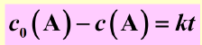
      > 反应速率与反应物浓度无关保持常数的反应为零级反应
      - 半衰期与反应物初浓度成正比
- 化学反应速率理论
  - 简单碰撞理论
    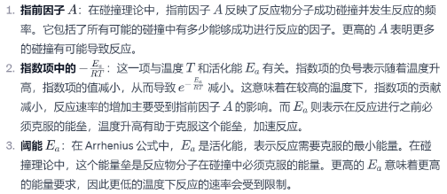
    > 对Arrhenius公式中的指数项、指前因子和阈能都提出了较明确的物理意义
    - 活化能（能垒）
      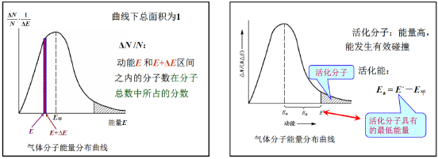
      > 活化能大小取决于反应物本性和反应途径
    - 有效碰撞的条件
      - 碰撞的两分子具有足够的能量
        > 只有A，B分子在其联心线上的相对平动能$ε_r$大于某一临界能量(阈能$ε_c$ )的那些碰撞才能有效地引起化学反应。
      - 碰撞的两分子具有正确的碰撞方向
  - 过渡态理论
    > 活化络合物理论 ——过渡态就称为活化络合物
    > ​绝对反应速率理论——只要知道分子的振动频率、质量、核间距等基本物性，就能计算反应的速率常数
    - 活化络合物
      - 可以分解为产物，也可分解为反应物
      - 活化能越大，能垒越高，反应速率越慢
    - 讨论
      - 反应物互相靠近时，分子的性质和结构发生变化——分子的动能转化为分子内势能
      - 等压反应热： $ΔH＝ Ea －Ea$
      - 缺点
        > 引进的平衡假设和速控步骤假设并不能符合所有的实验事实
        > ​对复杂的多原子反应，绘制势能面有困难，使理论的应用受到一定的限制
- 改变反应速率因素
  - 温度
    - $Van’t$  $Hoff$ 近似规则
      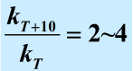
      > 温度每升高$10K$ ，反应速率大约增加约2~4倍
    - $Arrhenius$ 公式
      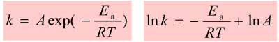
      > 对给定反应在温度变化不大时，Ea 和 A （频率因子）均可视为不变
      > 升温对活化能较大的反应更有利(由上式分析得)
    - 活化分子数增加
    - 4种情况
      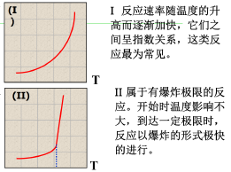
      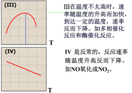
  - 催化剂
    - 原理
      > 催化剂能够加快反应速率的根本原因——改变了反应途径，降低了反应的活化能
    - 同时催化正逆反应
    - 催化剂参与整个反应过程
    - 酶
      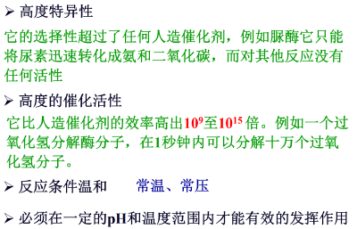
