- 概论
  - 经典热力学
    > 只能讨论孤立或封闭系统，并处于平衡状态下的系统的行为
    - 热力学第一定律——能量转化和守恒定律
      > 计算变化中的热效应
    - 热力学第二定律——熵增加原理
      > 变化的方向和限度；相平衡
    - 热力学第三定律——规定熵
      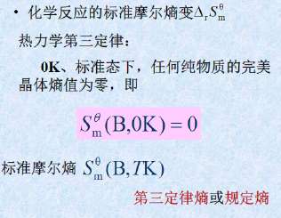
      > 熵变的计算，反应方向
  - 生命过程（开放系统）
    > 达尔文和克劳修斯的矛盾
    - 非平衡态热力学
      - 倒易关系
      - 耗散结构理论
  - 21世纪化学热力学的热点研究领域：生物热力学和热化学研究
    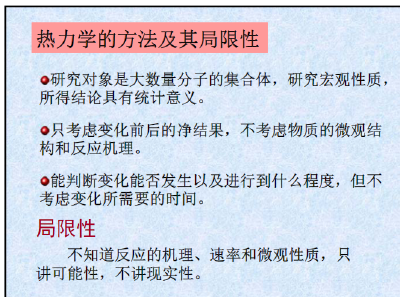
    - 细胞生长过程的热化学研究
    - 蛋白质的定点切割反应热力学研究
    - 生物膜分子的热力学研究
- 基本概念
  - 系统与环境
    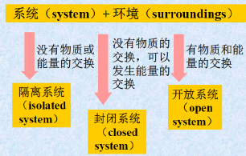
    - 隔离系统
    - 封闭系统
      > 很多物质交换极少的开放系统被看作封闭系统
    - 开放系统
  - 系统的性质
    - 广度/容量性质
      > 具有加和性，一次齐函数
    - 强度性质
      > 与系统数量无关，零次齐函数
  - 状态函数
    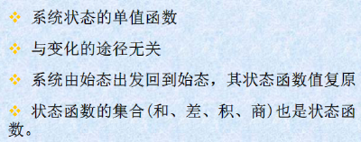
    - 状态方程
      > 系统状态函数之间的定量关系式
  - 平衡和过程
    - 理想气体的等温变化
    - 实际气体的循环过程
  - 热和功
    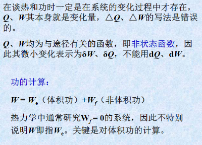
    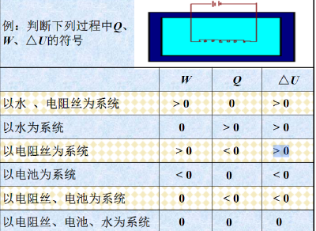
    - Q和W一定和途径有关（可逆和不可逆不同）
  - 可逆过程
- 能量守恒和化学反应热
  - 焓的定义
    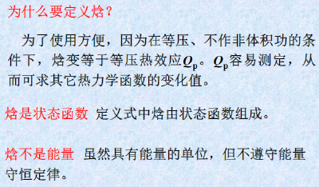
    > 当反应在恒压下进行，在反应过程中只做体积功时，反应系统的烙变等于系统热力学能的变化扣除系统的体积功。
    - $H=U+PV$
    - $Q_{p}=\Delta H$
      > 恒压反应的热效应等于系统的焓变，$Q_{p}$表示 <u>等压热效应</u>
    - 标准摩尔反应焓
    - 标准摩尔生成焓
  - 反应进度
    - 对任意反应的标准缩写式
    - 反应进度$\zeta$ 单位为$mol$
- 熵函数
  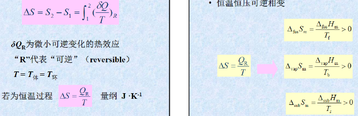
  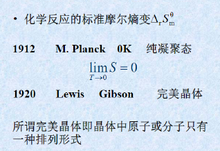
  - (空)
  - 注意一些只适用于 <u>隔离系统</u> ，题干没说隔离系统就无法判断
  - 状态函数性质（“循环”则为零）
  - **定义** ：混乱度
- 熵和吉布斯自由能
  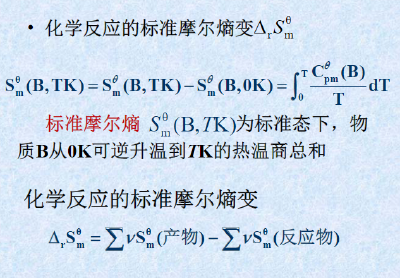
  - 在隔离体系内不能作判据
  - Gibbs自由能变化和非体积功
  - 非标准状态下的计算
  - 恒温恒压下$\Delta G \leqslant 0$ 的推导
    > 从U推导，没有非体积功
  - 化学反应等温式
    > $\Delta_rG_m=\Delta_rG_m^{\theta}+RTlnQ$
- 典例
  - 恒温恒压不做非体积功
  - 常压下苯在沸点温度蒸发
    > $\Delta G=0$ (用原始公式)
  - 理想气体自由膨胀
    > 体积功
    - 计算熵变
      - $\Delta G=\cfrac{-W_{R}}{T}=nRln\cfrac{p_1}{p_2}$  (过程可不可逆不管，设计一个可逆的以计算体系熵变，但是计算环境的Q必须是实际过程)
      - $\Delta S_{隔离}=\Delta S_{体系}+\Delta S_{环境}$
  - 绝热过程
  - 非理想气体(不)可逆循环
- 疑问
  - “可逆”定义
    > 可逆反应在平衡状态时$\Delta G=0$ 从而计算出K（就是非标准态）
  - 标准状态$Q_{eq}$=1  ?
- 化学平衡
  - 实验/经验平衡常数
  - 标准平衡常数
    > $K_p$ 是无量纲量，代表一定温度下，化学反应可能进行的最大限度的量度
    - $\Delta_rG_m=\Delta_rG_m^{\theta}+RTlnQ$
    - 平衡时$\Delta_rG_m^{\theta}=-RTlnK^{\theta}$ 也称化学反应等温方程式
    - 用K和Q判断自发反应方向
    - 两个反应相加减为耦合反应
  - 影响移动
    - 浓度
    - 压力
      - 恒温恒压通入惰性气体效果与减压相同
    - 温度
      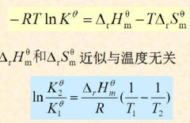
