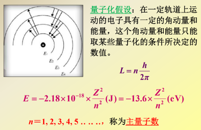
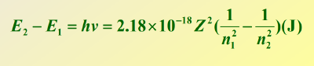
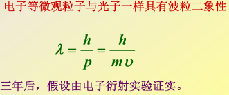
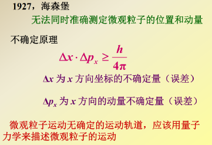

- 量子力学基础及核外电子运动特性
  - 氢光谱和氢原子的Bohr模型
    - $Rutherford$有核模型
      > 光谱和原子塌陷
    - 普朗克、爱因斯坦
    - $Balmer J$氢原子可见光区四条谱线规律
    - $Bohr N$三项基本假定
      > 无法解释多电子系统和原子光谱的精细结构
      - 定态，基态，激发态
        
      - 角动量，量子数
        
      - 跃迁
        
  - 电子的波粒二象性
    - $de Broglie L$
      
    - $Born$概率波
  - 不确定性原理
    
