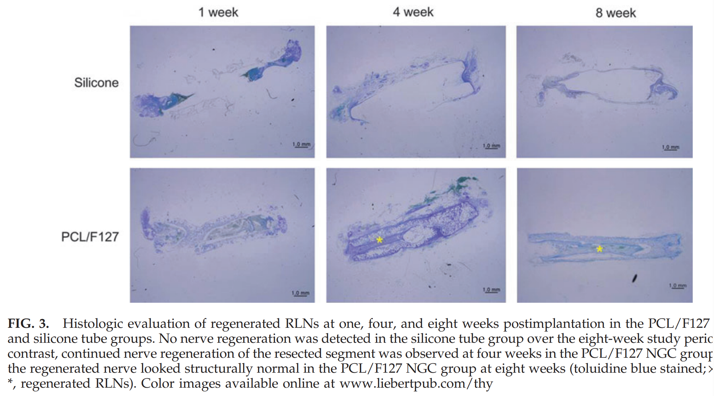
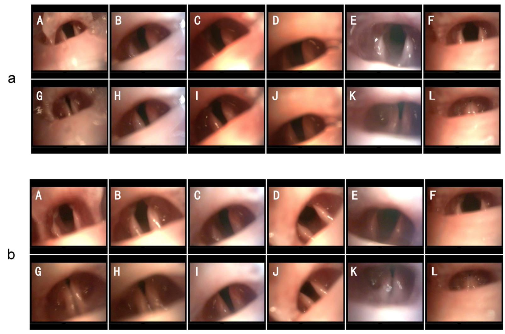

#### 试剂
4%PFA，2.5% 戊二醛
！！！要做树脂包埋的透射电镜（TEM）测髓鞘，必须用**戊二醛**（可以加少量PFA，但不能只有PFA）
环氧树脂包埋剂、甲苯胺蓝（购于美国 Sigma 公司）；
BDNF 抗体（购于美国 Abcam 公司）
The posterior cricoarytenoid (PCA) and thyroarytenoid (TA) were rapidly micro-dissected from each animal. [The Laryngoscope - 2009 - Shiotani - Modulation of Myosin Heavy Chains in Rat Laryngeal Muscle](The%20Laryngoscope%20-%202009%20-%20Shiotani%20-%20Modulation%20of%20Myosin%20Heavy%20Chains%20in%20Rat%20Laryngeal%20Muscle.pdf)

E600 光学显微镜（购于日本 Nikon 公司）；
#### RLN
> [!PDF|yellow] [thy.2013.0338, p.3](thy.2013.0338.pdf#page=3&selection=20,26,27,54&color=yellow)
> > placed in 4% paraformaldehyde at room temperature, processed, embedded in paraffin, and sectioned at 4 lm (RLNs were sectioned longitudinally, and larynxes were sectioned axially). For evaluation, the RLNs were stained with toluidine blue and hematoxylin and eosin,
> 
> 普通石蜡切片，纵切
> [Open: Pasted image 20260930082746.png](attachments/628ed5563ed27e6767fef45b25989fee_MD5.jpg)

#### TEM
- 将喉返神经标本放置于 2.5% 戊二醛溶液中，之后用 1% 四氧化锇固定 24 h， 经梯度丙酮（30%、60%、90%、100%、100% 及 100%） 
- 脱水 20 min 后用环氧树脂包埋剂包埋喉返神经标本， 待硬化后使用超薄切片机切取横断面厚度为 1 μm 的切片，用 1% 甲苯胺蓝染色。
- 在光学显微镜下（100 倍）观察形态并拍照，用 Photoshop CC 软件计数轴突数目（1 个视野）

##### 喉镜
可参考[Co-transplantation of Schwann cells and neural stem cells in the laminin-chitosan-PLGA nerve conduit to repair the injured recurrent laryngeal nerve in SD rats](Co-transplantation%20of%20Schwann%20cells%20and%20neural%20stem%20cells%20in%20the%20laminin-chitosan-PLGA%20nerve%20conduit%20to%20repair%20the%20injured%20recurrent%20laryngeal%20nerve%20in%20SD%20rats.pdf)
[Open: Pasted image 20260928212036.png](attachments/c7b1cc63b553a05590e626a5108aacf1_MD5.jpg)
