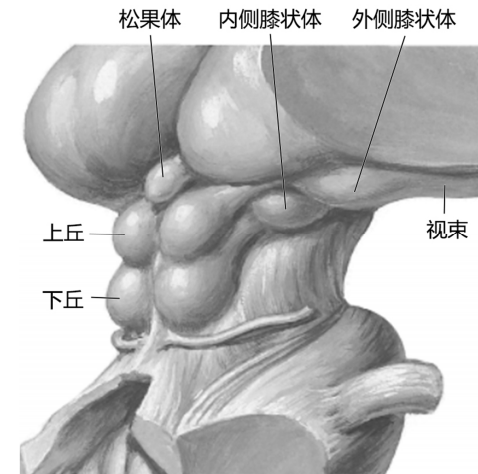

---
tags:
  - anatomy
  - Neurology
---
包括内侧膝状体和外侧膝状体，分别借下、上丘臂连接下丘和上丘。
（1）内侧膝状体：接受下丘来的听觉纤维，发出纤维形成听辐射，投射至颞叶的听觉皮质。
（2）外侧膝状体：接受视束纤维，发出纤维形成视辐射，投射至枕叶的视觉皮质。
[Open: Pasted image 20260916101331.png](attachments/5ca36f4cc4c850789c17d43693a1a8d3_MD5.jpg)

