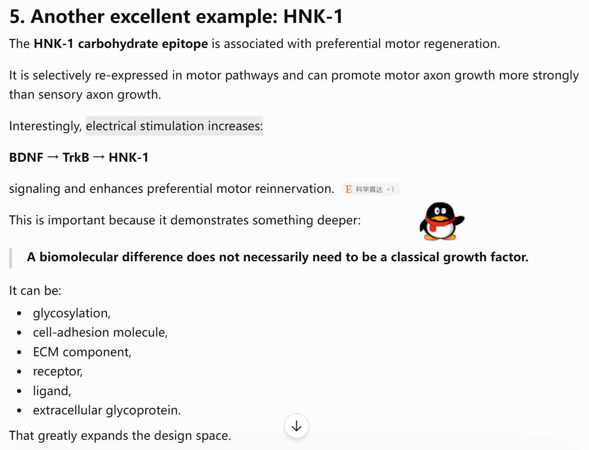
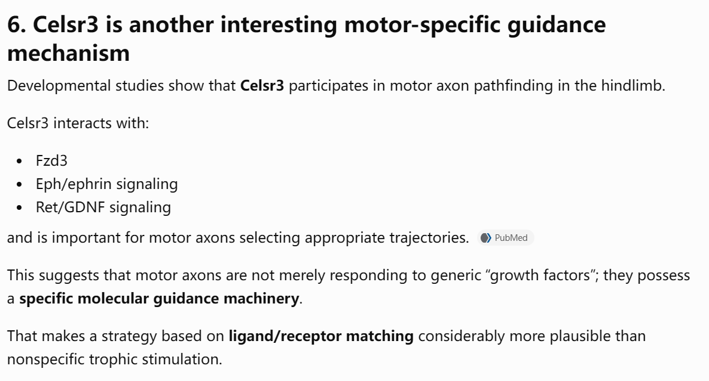

---
tags:
  - Neurology
---
> [!PDF|rouge] [Specificity of peripheral nerve regeneration Interactions at the axon level, p.16](Specificity%20of%20peripheral%20nerve%20regeneration%20Interactions%20at%20the%20axon%20level.pdf#page=1&selection=1935,0,1997,3&color=rouge)
> > The molecular mechanisms implicated in axonal regeneration and pathfinding after injury are complex, and take into account the cross-talk between axons and glial cells, neurotrophic factors, extracellular matrix molecules and their receptors. 

- [ ] https://pubmed.ncbi.nlm.nih.gov/39002719/
- [ ] https://pmc.ncbi.nlm.nih.gov/articles/PMC5102746/ Dose-Dependent Differential Effect of Neurotrophic Factors on In Vitro and In Vivo Regeneration of Motor and Sensory Neurons
- [ ] https://pmc.ncbi.nlm.nih.gov/articles/PMC5662603/ Asymmetric Sensory-Motor Regeneration of Transected Peripheral Nerves Using Molecular Guidance Cues

[Open: Pasted image 20260909113017.png](attachments/629a816c0bb3a62487e3111fe52783ee_MD5.jpg)

 - [ ] BDNF/TrkB signaling regulates HNK-1 carbohydrate expression in regenerating motor nerves and promotes functional recovery after peripheral nerve repair

[Open: Pasted image 20260909113158.png](attachments/cdf70bb584525ebf078cc70f12d8a0e2_MD5.jpg)

https://pubmed.ncbi.nlm.nih.gov/25108913/
