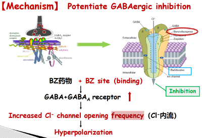
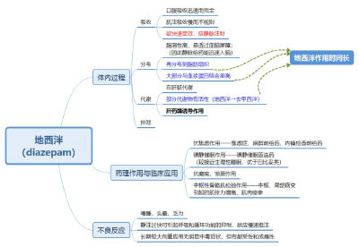
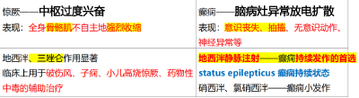

---
tags:
  - pharmacology
aliases:
  - Diazepam
---
#### （1）机制
- ①增强中枢抑制性递质γ-氨基丁酸（[GABA](GABA.md)）的作用
- ②BZ类药物与GABA-A复合物上的  BZ位点  结合—→受体构象发生变化，促进GABA与GABA-A受体结合—→  CI-通道  开放 <mark style="background-color:#fef3c7;"> 频率 </mark> 增加（CI-内流增加）—→  超极化  ，中枢抑制
  
###### ※苯二氮䓬药物作用于Cl-离子通道的重要特性 
反复体会PPT第20页“ 促进GABA的抑制效应 ”
- 1.增加氯离子通道开放频率，而不是延长时间（巴比妥）；
- 2.不改变神经递质（GABA）量
- 3.零递质的状态下激动剂也会有效应—→激动剂模拟递质，不依赖于递质的含量—→ 苯二氮䓬 <mark style="background-color:#fef3c7;"> 不属于激动剂，只属于变构调节剂 </mark>。 “魔方” 
###### ※苯二氮䓬为什么有<mark style="background-color:#fef3c7;"> 明显的量-效关系 </mark><mark style="background-color:#fef3c7;">（eg很小的剂量不会引起骨骼肌效应）</mark> ?
与GABA受体分布密度 和 对药物的敏感度相关 。
  - 分布密度：大脑皮质＞边缘系统&中脑＞脑干&脊髓
  - 作用于大脑皮层、丘脑、边缘系统，抑制癫痫灶异常放电扩散——抗惊厥、抗癫痫（ Anticonvulsant & Antiepileptic ） 
  - 作用于边缘系统（海马、杏仁核，管情绪、记忆）——抗焦虑（ Anxiolytic effects）、  麻醉前（逆行性遗忘） 
  - 作用于延脑、下丘脑等网状结构——镇静、催眠（ Sedation-Hypnosis ） 
  - 作用于网状结构、脊髓——中枢性肌松弛（ Muscle relaxation） 
  - 不良：[[呼吸抑制]]。注意：<mark style="background-color: #1A4F10; color: white">无麻醉作用</mark>。
###### 体内过程特点
  
- 脂溶性高，静脉注射，快速入脑
- 作用<mark style="background-color:#fef3c7;">时间长效</mark>：血浆蛋白结合率高、再分布到脂肪、肝脏代谢物（奥沙西泮）还有活性
- 肝药酶代谢
#### （2）药理作用 & 临床应用（上节课）
> 从大脑皮层——边缘系统——边缘&中脑网状结构——脊髓 这样依次往下记。 
###### （1）Anticonvulsant 抗癫痫、惊厥作用
  
###### （2）抗焦虑作用 ；麻醉前给药/逆行性遗忘
- 快速
-  选择性高：小剂量作用于 边缘系统 的BZ受体
> 管情绪、管记忆
- ☺抗[焦虑](焦虑.md)的<mark style="background-color: #705A16; color: white">首选药</mark>
- ☺<mark style="background-color:#fef3c7;">麻醉前给药、内镜检查前给药</mark>（缓解恐惧；暂时性记忆缺失/link 逆行性遗忘）
> 一般目的：缓解情绪；镇痛；遗忘
###### （3）镇静催眠作用
- ☺镇静催眠的<mark style="background-color: #705A16; color: white">首选药</mark>（引起的较接近于生理性睡眠，优于巴比妥类）
- <mark style="background-color: #1A4F10; color: white">优于巴比妥</mark>：①作用于NREMS，不易反跳、不易耐受；②接近生理性睡眠
- 延长NREMS的2期，缩短3、4期深睡（降低睡眠质量）。
- 停药后出现反跳性失眠（ rebound insomnia，REMS延长） 较轻，停药困难少
- 产生耐受性、依赖性慢；安全范围大
###### （4）中枢性骨骼肌松弛
- ☺治疗中枢或局部病变引起的<mark style="background-color:#fef3c7;">肌张力增高、肌肉痉挛</mark>：有较强的肌松作用和降低肌张力作用，但 不影响正常活动 
- 小剂量抑制脑干网状系统下行系统对γ神经元的易化作用；
> 位于脊髓前角；调节肌梭对牵拉刺激的敏感性；支配梭内肌
- 大剂量增强脊髓神经元的突触前抑制，抑制多突触反射；
###### 临床应用
- 抗<mark style="background-color:#fef3c7;"> 癫痫持续状态（首选） </mark>；抗惊厥（ 三唑仑）；
- 抗<mark style="background-color:#fef3c7;"> 焦虑（首选） </mark>；麻醉前给药、内镜检查前给药；
- <mark style="background-color:#fef3c7;">镇静催眠（首选）；</mark>
- 肌张力增高、肌肉痉挛
#### （3）不良反应
 剂量相关的中枢抑制 。急性过量相对不那么危险。
- ①显著剂量相关的<mark style="background-color: #1A4F10; color: white">逆行性遗忘</mark>
> Significant dose-related retrograde amnesia
- ②嗜睡、头晕、乏力； ——地西泮半衰期长，药物的残留效应。
- ③长期较大剂量服用（300~600mg/日），无明显中毒症状，但有 耐受性和成瘾 ；
- ④静注 过快 可引起呼吸、循环功能抑制，故应 慢速推注 ；
- ⑤与其他中枢抑制药、乙醇（⚠）合用，可加重嗜睡、昏睡、呼吸抑制、昏迷，严重可致死。