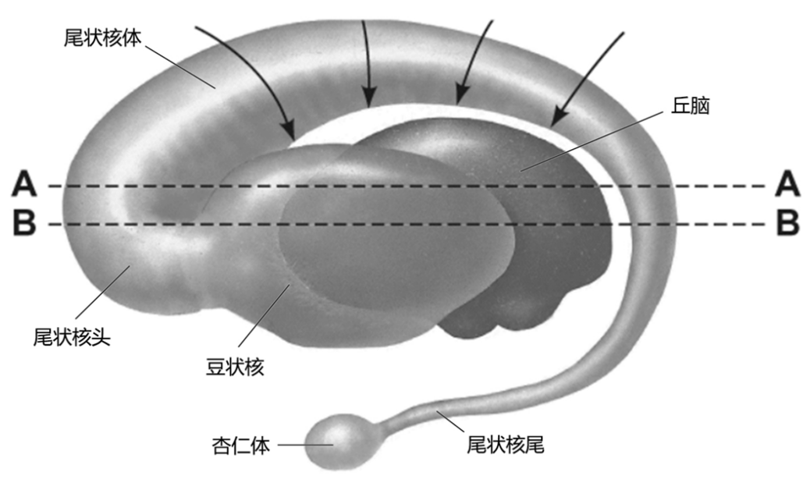
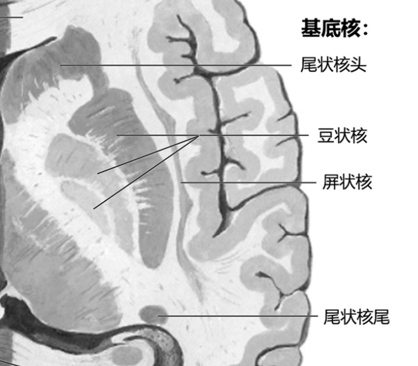

---
tags:
  - anatomy
  - Neurology
---
包括尾状核、豆状核、屏状核和杏仁体
#### 尾状核
尾状核与侧脑室相邻，分头、体、尾三部。尾状核头膨大，突向侧脑室前角；向后逐渐变细称体，沿背侧丘脑的背外侧缘向后延伸；尾在侧脑室下角的顶上，向前行到下角前端处连接杏仁体。
[Open: Pasted image 20260916103118.png](attachments/891791287c3558d31756740b5adf7fa0_MD5.jpg)

[Open: Pasted image 20260916103152.png](attachments/1e43c28faa061bc340404348e3f804e2_MD5.jpg)

#### 豆状核
位于背侧丘脑的外侧。豆状核被髓板分为外侧的壳和内侧的苍白球两部分。
尾状核和豆状核的前端相连，此二核合称为纹状体。
其中尾状核和壳为新纹状体；苍白球为旧纹状体。
纹状体的功能被认为是<mark style="background-color: #1A4F10; color: white">躯体运动的主要调节中枢</mark>。
[震颤麻痹](Parkinson%20病.md)和舞蹈病与纹状体的病变有关。
#### 屏状核
位于岛叶皮质和豆状核之间，功能不明。
#### 杏仁体
位于海马旁回钩的深面，与尾状核尾相连，属边缘系统。其功能与内脏活动、行为和内分泌有关。
