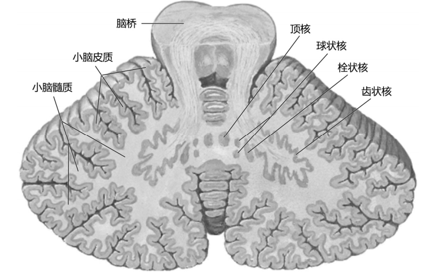
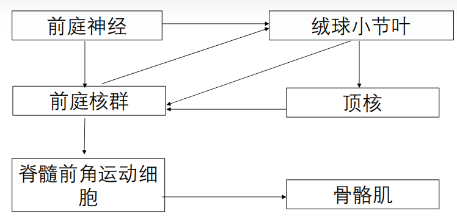
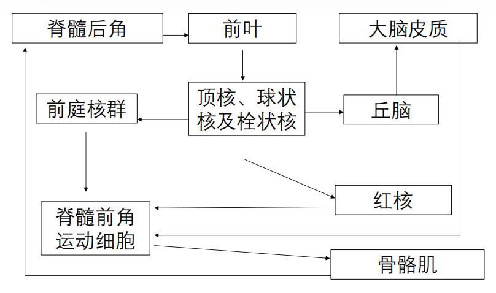
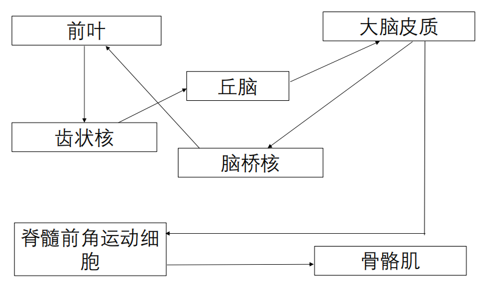

### 1. 外形
• 小脑蚓
• 小脑半球
• 小脑扁桃体
• 原裂
• 后外侧裂
• 绒球小结叶
• 前叶
• 后叶
### 2. 分叶

|进化|联系|范围|
|---|---|---|
|古小脑 archicerebellum|前庭小脑 vestibulocerebellum|绒球小结叶|
|旧小脑 paleocerebellum|脊髓小脑 spinocerebellum|前叶和后叶的蚓垂和蚓锥体|
|新小脑 neocerebellum|桥小脑/大脑小脑 pontocerebellum/cerebrocerebellum|蚓垂和蚓锥体的后叶|
构造：小脑灰质复盖在表面，称小脑皮质。白质位于深部称髓质。髓质中含有4对灰质核团，称小脑核。
[373Open: Pasted image 20260912154704.png](attachments/77865cc9a74e3cfe1f03fb826a20f37c_MD5.jpg)

### 3. 小脑的纤维联系
#### （1）古小脑
[Open: Pasted image 20260912154845.png](attachments/e4a3bd7aa4bcc7b843b9f21954e728fa_MD5.jpg)

#### （2）旧小脑
[Open: Pasted image 20260912154925.png](attachments/938fb009f796dd113b926f870779e073_MD5.jpg)

#### （3）新小脑
[323Open: Pasted image 20260912155002.png](attachments/4b96bf753775ac1b22ff7eee27ff67a8_MD5.jpg)

小脑是一个重要的躯体运动调节中枢
（1）古小脑：维持身体姿势平衡和协调眼球运动。
（2）旧小脑：控制运动中的肢体远端肌的肌张力和协调运动。
（3）新小脑：协调上、下肢肌肉的随意运动，保证运动的力量、方向和精确性。
