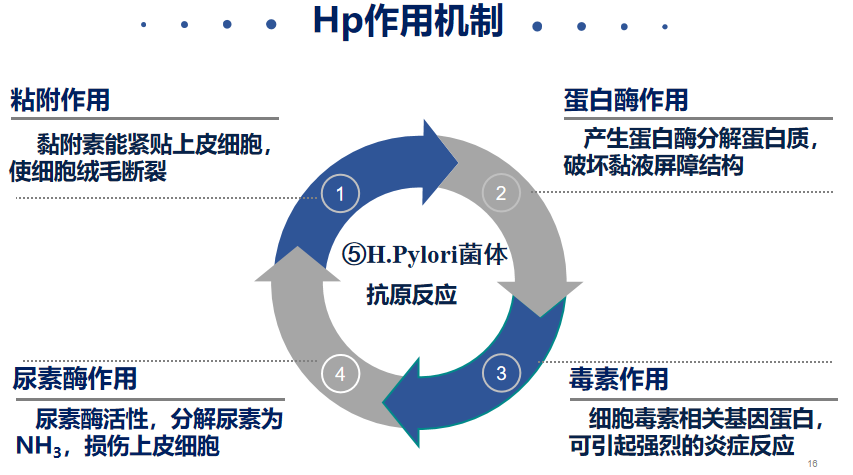
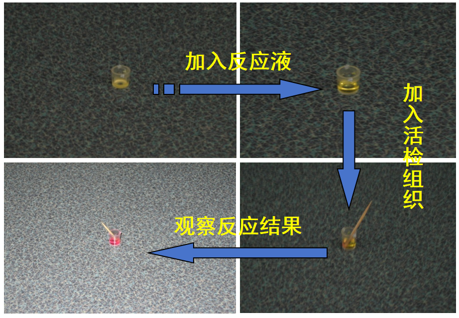
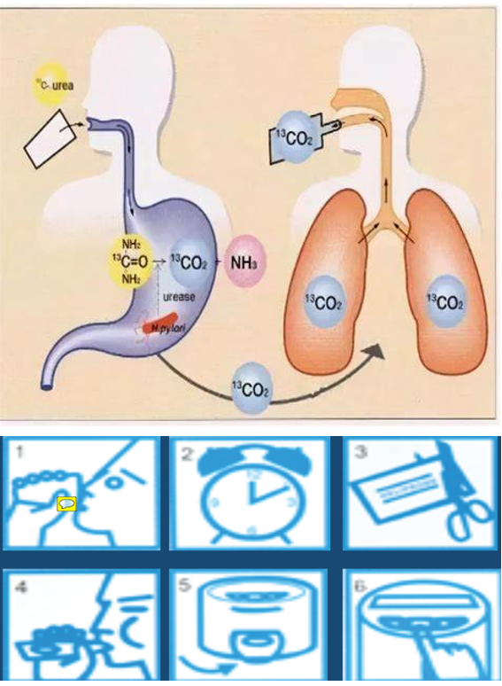

---
aliases:
  - Helicobacter pylori
  - Hp
  - H. P.
---
微需氧菌
37℃、pH7.0～7.2为最适生长条件
可产生目前已知活性最强的细菌尿素酶
Hp在[消化性溃疡](消化道溃疡.md)中的感染率高
- 十二指肠溃疡：＞90%
- 胃溃疡：约80%
#### 生理学特征
Hp 产生尿素酶，分解尿素氮，产生铵根（NH4+），像一坨氨云，笼罩在Hp周围.
因胃酸中的氢离子也带正电荷，同性相斥，氨云犹如一台天然的潜水艇，护送Hp层层深入，定植粘膜。
#### 作用机制
[Open: Pasted image 20260924110800.png](attachments/5bcf7aa7ae2aa8fbb56b7bf5d4475fc9_MD5.jpg)

不同部位Hp感染引起溃疡的机制有所不同——
##### 胃窦Hp感染为主
Hp抑制D细胞活性→血促胃液素↑ →<mark style="background-color: #1A4F10; color: white">胃酸分泌↑</mark>
Hp作用于肠嗜铬样细胞→释放组胺→壁细胞泌酸↑
以上所用致胃窦高酸环境→诱发十二指肠溃疡
##### 胃体Hp感染为主
泌酸腺/壁细胞损伤、萎缩 → <mark style="background-color: #1A4F10; color: white">胃酸分泌↓</mark>
Hp感染 → 破坏黏液-碳酸氢盐屏障、损伤上皮、炎症/免疫损伤 → 胃黏膜防御能力↓
#### 检测
##### 侵入性试验：
###### 快速尿素酶试验
[Open: Pasted image 20260924112744.png](attachments/b0d875e6a2467b872dfb5fcf9366d66c_MD5.jpg)

###### 黏膜涂片染色、组织学检查、微需氧培养、PCR
##### 非侵入性试验： 
根除治疗后复查的首选方法：<mark style="background-color: #1A4F10; color: white">尿素呼气试验</mark>
###### 13C尿素呼气试验=13C-UBT
[Open: Pasted image 20260924112830.png](attachments/17fb5e9eec04bd87e073befdf51aac27_MD5.jpg)

###### 14C尿素呼气试验=14C-UBT
###### 血清学试验