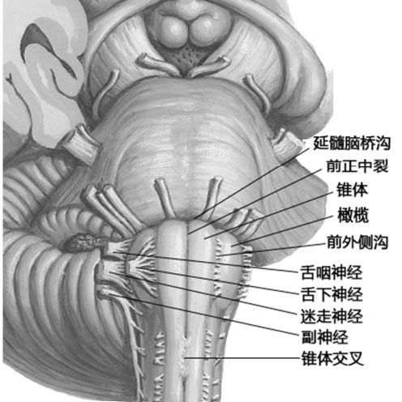
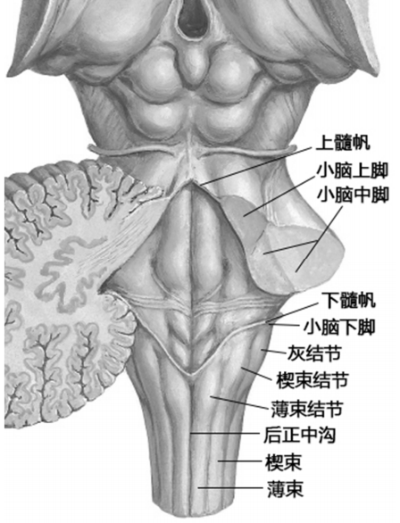

---
tags:
  - Neurology
---
#### 解剖
###### 正面
- 延髓脑桥沟
- 前正中裂
- 锥体
- 锥体交叉
- 橄榄
- 舌下神经
- 舌咽神经、迷走神经和副神经
[Open: Pasted image 20260908162737.png](attachments/ddba2c91694a2e18af4195ce16d8b919_MD5.jpg)

###### 背面
- [薄束](薄束.md)结节和[楔束](楔束.md)结节
- 小脑下脚
- 第四脑室底的下半部
[174Open: Pasted image 20260908162603.png](attachments/f5d3847eb022824c372410124d396067_MD5.jpg)
