---
tags:
  - pharmacology
---
- # 钙拮抗药（1）
  - ### 一、钙离子的生理意义、 <u>钙通道的类型</u> 与分子结构，钙拮抗药的分类。
    - 1. 钙离子的生理意义（看图）
      
      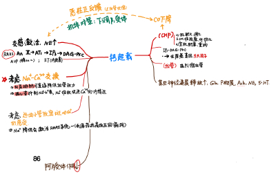
      - Ca2+内流引起心肌兴奋-收缩偶联 和 血管收缩；外钙诱导内钙释放；维持心室肌2相平台期
      - 钙超载引起细胞损伤
      - Na+-Ca2+交换作用
    - <u>2. 钙通道分类：</u> 主要考虑L、T型
      - *钙通道特性*
        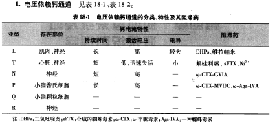
        - （1）电压依赖性（不同亚型激活电阈不同）；（2）激活速度比钠慢；（3）对离子选择性低
    - 3. 钙拮抗药的分类
      - I类： 选择L型
        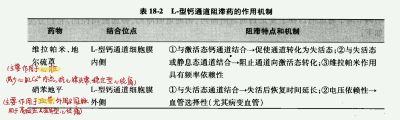
        > Ia扩血管，Ib Ic稳心脏
        - Ia --二氢吡啶类 （dihydropyridines， DHPs ）：硝苯 地平 （nifedipine）、尼卡 地平 （nicardipine）、氨氯地平（amlodipine）
        - Ib--地尔硫䓬类 （benzothiazepines， BTZs ）：地尔 硫䓬 （dil tiazem ）、克仑硫䓬（clentiazem）、二氯呋利（diclofurime）等。
        - Ic--苯烷胺类 （phenylalkylamines， PAAs ）：维拉 帕米 （verapamil）
      - II类： 选择其它—— T型：米贝地尔 （mibefradil）
      - III类： 非选择性
  - ## 二、钙拮抗剂的作用 & 应用 & 不良： <u>对血管的作用</u> ；对其他平滑肌的作用；改善组织血流的作用；其他作用。
    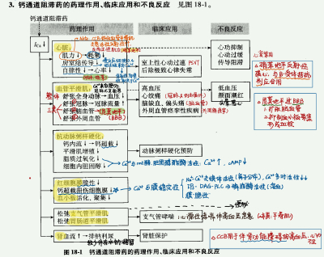
    > 其实看我这个图就够了
    - <u>1. 对心肌的作用——①负性肌力、负性频率、负性传导；②心肌缺血时保护作用</u>
      - i.负性肌力 作用：通过对于钙离子通道的阻滞使得心肌细胞的 兴奋-收缩脱耦联 ，用此降低心肌耗氧量。但是钙通道阻滞剂可以舒缓血管平滑肌 降低血压，从而反射性地引起交感神经的活性增强 ，抵消部分负性肌力作用，而 硝苯地平因为此作用较强甚至可以表现出轻微的正性肌力 
      - ii.  负性频率 与 负性传导 作用：阻断钙离子通道，使得窦房结细胞0期和4期钙离子的内流速度减慢，因而减缓心率，减慢传导。
    - 2.对 血管 的作用
      - i.血管平滑肌：血管收缩时所需要的钙离子主要来自于细胞外，所以血管平滑肌对于钙通道阻滞药的作用很敏感，该药物作用于血管平滑肌的特点是使得血管明显舒张，同时 主要舒张动脉 ，对于静脉的相对影响较小。尤其是 冠状动脉较为敏感 ， 脑血管 也较为敏感，而钙通道阻滞药同时还可以 舒张  外周血管，解除痉挛 。
      - ii. 其他平滑肌的作用：对于支气管平滑肌的松弛作用较为明显，较大剂量也能松弛胃肠道，输尿管以及子宫平滑肌
    - 3.  抗动脉粥样硬化 的作用
      - i. 减少钙离子内流，降低钙超载导致的动脉壁损害
      - ii. 抑制平滑肌增殖和动脉基质蛋白的合成，增加血管壁的顺应性
      - iii. 抑制脂质的过氧化，保护内皮细胞
      - iv. 硝苯地平 可以增加细胞内cAMP的含量，提高溶酶体和胆固醇的水解活性，有助于动脉壁脂蛋白的代谢，从而降低细胞内的胆固醇水平。
    - 4.对 红细胞以及血小板 结构和功能的影响
      > 减轻红细胞损伤、抑制血小板聚集
      - i. 对于红细胞的影响：抑制钙离子内流，减轻钙离子超负荷时对于红细胞的损伤
      - ii. 对于血小板活化的抑制作用：能够抑制血小板聚集
    - 5.对于 肾脏 功能的影响：舒张血管和降低血压的作用 不伴有水钠潴留、反而增加肾血流量 ，因而对 肾功能有保护 作用。
  - ## 三、常用钙拮抗药：硝苯地平、氨氯地平、尼莫地平（L-Ia）、地尔硫卓（L-Ib）、维拉帕米（L-Ic）等的作用特点。
    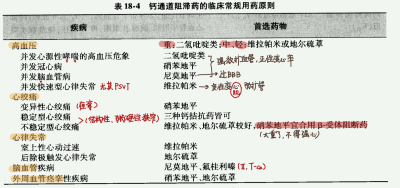
    > 稳定型心绞痛又称为劳累型心绞痛；不稳定型心绞痛是因冠状动脉粥样硬化斑块形成、破裂、张力增高引起，千万不得强心。
    - 高血压兼有 冠心病、肾病/需要保护肾 （硝苯地平），伴 脑血管病 （尼莫地平、氟桂利嗪），伴 快速性心律失常 （维拉帕米）
      > link：※维拉帕米、地尔硫卓见“抗心律失常药-IV类”；硝苯地平见“抗高血压药”。
    - Ia扩血管、正变心，Ib、Ic负变心
    -  硝苯地平交感反射性强心，应与β受体拮抗剂合用 
    - 地平比较：注意硝苯地平短效，氨氯长效；仅硝苯地平降压太强，反射性心动过速
      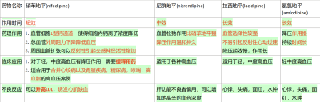
  - ## *四、药物相互作用*
    - 药代动力学： 血浆蛋白结合率高； 口服均能够吸收，首过效应较强，生物利用度很低， 氨氯地平 是其中生物利用度最高、 最长效 的种类
    - 地高辛   ↑  ： CCB提高地高辛血药浓度；维拉帕米减少地高辛经肾小管消除，二者合用可能过度抑制心脏（ PPT：维拉帕米与地高辛合用应减少地高辛的剂量 ）
    - 克拉霉素  x  ： 不得与CCB合用，肾损伤、低血压
    - 西咪替丁  ↑：  C CB使其半衰期延长
    - 奎尼丁   ↓  ： 硝苯地平降低奎尼丁血药浓度
- # 抗心律失常药（3 ） antiarrhythmic drugs
  > 对应心肌电生理。
  - Keypoints
    - 心律失常：定义，分类，机制
    - 抗心律失常药物的分类，离子通道基础（作用机制）
    - 每一种类的代表药（奎尼丁、普鲁卡因胺、利多卡因、苯妥英钠、普奈洛尔、胺碘酮、维拉帕米)
  - # 一、正常心肌电生理。
    - ​[4.⭐循环](https://mubu.com/doc1FkZV3kVUw0)​
      - 对心脏节律的影响
        - 传导性：快反应细胞与慢反应细胞区别于0期离子通道不同，快反应快Na+通道，慢反应ICa-L通道/
  - # 二、心律失常的电生理学机制。
    - 心律失常（Arrhythmia）：心动节律和频率的异常
    - 分类
      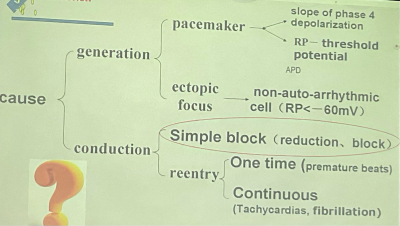
    - 1. 冲动形成异常  Aberrations in impulse generation
      - 自律性过强 
        - 起搏点： 交感过度兴奋；K+过少（针对药：II类/beta阻，K+-Ach开放药） 
          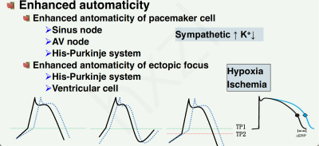
          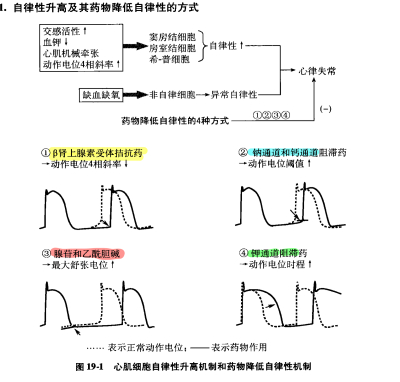
        - 异位起搏： 缺血缺氧 
      -  触发活动：EAD、DAD 
        - 定义：异位激动的产生是由一个动作电位的触发所形成，而不能由心肌自发的独立产生。异位激动点总是在一次正常的除极后发生，也就是以后除极为基础的心电活动，因此也称之为后除极。根据它在动作电位时相中出现的早晚，可分为 早期后除极和延迟后除极两种。 
          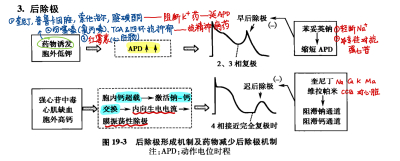
        - EAD：<mark style="background-color:#fef3c7;"> APD过长 </mark>，发生于AP 2、3期，Ca2+相对内流增多而K+相对外流不足。缺氧、 药物诱发（延长APD、阻断k外流药物尤其）  、  儿茶酚胺（交感过度兴奋）
          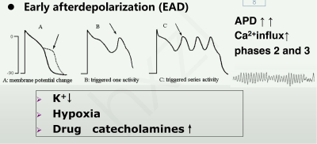
        - DAD：复极完成后。<mark style="background-color:#fef3c7;"> 钠/钙过多、钙超载。 </mark>心肌缺血、酸中毒、 地高辛、儿茶酚胺 引起。
          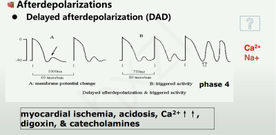
    - 2. 冲动传导异常  Defect in impulse conduction
      - 快速心律失常
        - 房性：房颤、房扑、PVST
        - 室性：室性早搏、室性心动过速、室颤
        - 折返-Reentry：<mark style="background-color:#fef3c7;"> 单向 </mark> 传导阻滞  +  逆向折返（来自另一侧） 
          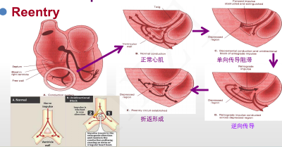
          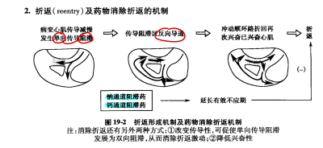
        - Wolff-Parkinson-White，WPW，预激综合征：解剖学畸形，存在房室旁路（肯氏束），运动时心脏形成折返旁路，心律失常易猝死。
      - ※缓慢性心律失常  Slow arrhythmias——  异丙肾上腺素、阿托品 
        - 窦性心动过缓、房室传导阻滞：阿托品、肾上腺素受体激动剂（eg 异丙肾上腺素）治疗
    - 3.基因缺陷、离子靶点学说
      - 长Q-T间期综合征（Long Q-T syndrome, LQTS）是由于7个基因突变(Na内流↑, IKr↓, IKs ↓…)造成心肌复极化减慢，易诱发早后除极而产生心律失常
        > link：红霉素有 <u>心脏毒性，可能引起LQTS</u>
      - 离子靶点学说：当心肌细胞膜上某种离子通道的功能或表达异常时，通道间平衡被打破，将出现心律失常。
  - # <u>三、抗心律失常药的基本电生理作用及药物分类。</u>
    > 降、减、改、延
    - 降低自律性
      -  增加静息膜电位的绝对值 ——腺苷、ACh，激活ACh敏感的钾通道，促进钾离子外流，静息电位绝对值↑；
        > 这里促进K+外流对MDP影响更大，对APD影响没有那么大
      -  降低4相斜率 ——β受体阻断药，降低细胞内cAMP水平，减小If，4相斜率↓；
      -  延长动作电位时程— —钾通道阻滞药（阻止K+外流）
        > 这里促进K+外流对APD影响更大，对MDP影响没有那么大
      -  提高动作电位发生阈值 ——钠通道阻滞药（快反应细胞）、钙通道阻滞药（快反应细胞）；
    - 减少后除极
      -  减少早后除极 ——缩短APD药；
      -  减少迟后除极 ——钙通道阻滞药、钠通道阻滞药。
    - 改变传导，  消除折返
      -  ※ 延长有效不应期 ——钠、钾通道阻滞药（快反应细胞）；钙、钾通道阻滞药（慢反应细胞）
        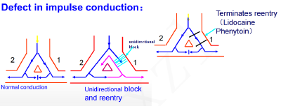
        - 减弱膜反应性---减慢传导---使单向传导阻滞变为双向传导阻滞;  ICa β↓等
          - 如奎尼丁：抑制Na+内流---Vmax↓-----传导↓
          - ERP↑﹥APD↑ --（绝对延长ERP）-- Na+ Ca2+ K+ ↓
        - 增强膜反应性—改善传导—取消单向传导阻滞
          - 如利多卡因\苯妥英钠: 促K+ 外流---最大舒张电位↑--与阈电位距离↑--传导↑
          - ERP↓﹤APD↓ --（相对延长ERP）
      - 抑制传导——β受体拮抗药、钙通道阻滞药
    - 延长不应期
  - # 四、常用的抗心律失常药
    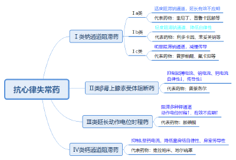
    - ※需注意，抗心律失常药治疗心律失常的同时，也可能引发心律失常
    - 药物分类：先记住有【抑制离子通道】和【阻断交感beta受体】两方向，再来排序
      - 钠是I，beta是II，胺碘酮三个字——K+是III，维拉帕米四个字——CCB是IV
      - I类又分为适度、轻度、明显，a b c
      - 再各自想代表药
    - 易考～“首选”
      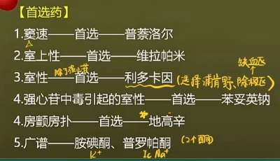
      - <mark style="background-color:#fef3c7;"> 奎尼丁：广谱，不良反应爱考（又大又毒：啃树皮/胃肠道最常见；“亏心”/心血管最严重；特殊：金鸡纳反应、奎尼丁晕厥） </mark>
      - 普鲁卡因胺： 红斑狼疮样反应 
      - 利多卡因中毒：眼球震颤
      - 普罗帕酮：广谱。强。不与其它抗心律失常合用。
      -  预防 心律失常：美托洛尔
      - 翻转使用依赖性：心率越慢延长APD越长，心率越快延长APD越差，易引起尖端扭转型心动过速。奎尼丁、普鲁卡因胺。记住<mark style="background-color:#fef3c7;"> 胺碘酮没有翻转使用依赖性 </mark>！！
      - 胺碘酮：含碘，特殊的甲状腺毒性。
      -  迅速 终止折返性、阵发性室上心律失常：腺苷
      - 合用β受体阻断药？
        - 硝苯地平推荐与β受体阻断药合用，防止反射性心率加快
        - 奎尼丁推荐与β受体阻断药、CCB、地高辛合用，应对抗胆碱作用和反射性心率加快
        - 维拉帕米抑制心脏， 不 与β受体阻断药合用
      - 维拉帕米又名“异搏定”
      - PPT
        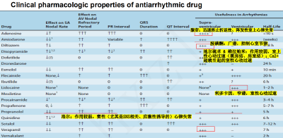
        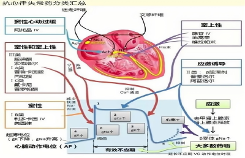
        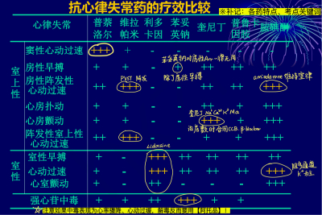
    - ## I 类药——钠通道阻滞药
      - ### IA 类：  适度  阻滞钠通道，延长  有效不应期 
        
        > <u>奎尼丁（Quinidine）</u> ；普鲁卡因胺（Procainnamide） 。广谱，室性＞室上性，注意合用。
        - ### <u>奎尼丁（Quinidine）。</u> 全心抑制剂，<mark style="background-color:#fef3c7;">Na+ K+  Ca2+ M  α</mark>
          - ### 1. 体内过程
            - 吸收好
            - 心肌中浓度尤其高
            - 肝代谢
          - ### 2. 药物合用
            - ① 地高辛  ↑  ：使地高辛肾清除率降低
            - ② 双香豆素、华法林   ↑ ：竞争血浆蛋白，抗凝血作用加强
            - ③肝药酶诱导剂可加速自身代谢（eg 苯巴比妥）
          - ### 3. 药理作用
            - （1）阻滞离子通道：阻Na内流＞阻K外流＞阻Ca2+。
              - 低浓度即可阻滞INa、IKr，较高浓度尚可阻滞 IKs IK1、Ito、ICa（L）
            - （2）Na+： 适度  <u>阻滞</u>  <u>激活状态</u>  <u>的钠</u>  <u>通道</u> ， <u>使其复活减慢</u> ——抑制异位起搏自律性，抑制 除极化组织 的兴奋性、传导性
              > 治病原理
            - （3）K+：阻滞多种 钾 通道， 延长  APD、ERP （在 心率减慢、细胞外低钾时，易诱发早后除极 ）、ERP/ADP（阻Na内流＞阻K外流）
              > 不良反应、心肌毒性、主要用于室性而不是室上性原理
            - （4）Ca2+：减少Ca2+内流，负性肌力
            -  （5）阻M阻α： 具有明显的抗胆碱作用和阻断外周血管α受体作用
              > 治病时，需注意合用地高辛 β 钙阻滞、主要用于室性而不是室上性的原理
            - <mark style="background-color:#fef3c7;"> ※注意这些药理作用侧重于不同的甚至相反的方面，要结合情景。 </mark>
              - 抑制钠 ，抑制起搏、传导，但只对于 <u>除极化组织</u> 有用； 抗胆碱 ，又可以加快心率、加速传导，作用于窦房结和房室结； 抑制钾 ，并不是主要作用，在本来就有心率减慢、细胞外低钾时会被放大作用，易诱发早后除极。
              - 抑制钠，主要从 临床应用角度 考虑，解释为什么它可以治疗房颤、房扑、室上性&室性心动过速。
              - 抑制钾，主要从 不良反应角度 考虑，见于“低钾血症”“腹泻”“房室传导阻滞”“心率过慢”。原理是超常期过分延长， 早后除极 。
              - 抗胆碱，主要从 用药注意事项角度 考虑，相当于发挥“抑制钠”作用（治疗房颤房扑）时，需要同时压住这边的抗胆碱作用，防止心率过快—— 提示我们合用 地高辛、β、Ca2+阻滞剂。
              - 为了防抗胆碱合用地高辛，与“合用后地高辛血药浓度会增加”，又是两个不同的知识点。
          - ### 4. 临床应用
            - <mark style="background-color:#fef3c7;"> 广谱 </mark> 抗心律失常药   ；  室性＞室上性  ；注意治疗房颤时合用 
              - ①房颤、房扑、室上性、室性心动过速的转复和预防
              - ②房颤、房扑电转律后防止复发（合用地高辛、钙通道阻滞剂、β 肾上腺素受体拮抗剂， 防止心律加快 ）
          - ### 5. 不良反应
            - <mark style="background-color:#fef3c7;"> 安全范围很小 </mark>
            - （1） 胃肠道反应最常见（啃到了金鸡纳树皮） 腹泻 （最常见）—→  引起  低血钾—→  加重 奎尼丁所致的 尖端扭转性心动过速 ；
              > 选择题：奎尼丁、奎宁最常见的不良反应是消化道反应，最严重的不良反应是心血管反应
            -  （2）金鸡纳反应：  <u>头痛、头晕、耳鸣、视物模糊、恶心、腹泻</u> 等症状；
              > *奎尼丁来自金鸡纳树皮。与血浆奎尼丁血药浓度过高有关，可通过减少剂量防止
            - 奎尼丁晕厥和猝死
            -  （3）心脏毒性：传导阻滞、尖端扭转型心动过速，QT间期延长。最 严重，全心抑制剂
              > 奎尼丁“亏心”
              - 奎尼丁治疗房颤可能引起心房血栓脱落，肺、脑栓塞
            -  （4）α受体阻断 ：血管扩张 心脏收缩力减弱 血压下降
            -  （5）M阻断（抗胆碱）：  增加窦性心率，因此 治疗房扑前应 先给予 钙通道阻滞药、β肾上腺素受体拮抗药、地高辛。
        - ### 普鲁卡因胺（Procainnamide）——弱于奎尼丁，不阻M  α
          - 药理作用： 与奎尼丁相似，但 无明显抗M、阻 α 作用 
            > 对房性、室性心动过速均有效
          - 临床应用： 房扑 房颤（不如奎尼丁） 室性心动过速（优于奎尼丁） 急性治疗。 对于 急性心梗后的 室性心律失常 ，不做首选  。
          - 不良反应
            - <mark style="background-color:#fef3c7;"> 红斑狼疮样反应 </mark>
              - 肝脏中的代谢成分N-乙酰普鲁卡因胺（NAPA）仍有活性，过多NAPA易引起Tdp。久用引起“ 红斑狼疮样反应”，故用药以不超过1月为宜
            - 口服可引起胃肠道反应；
            - 静脉给药可引起低血压和传导减慢；
            - 血药浓度>30 μg/ml时可发生尖端扭转型心动过速；
            - 过敏反应较常见。
      - ### IB 类：  <u>轻度</u> 抑制钠通道（＜1s）， 降低  自律性 
        
        > 利多卡因（Lidocaine），苯妥英钠（phenytoin sodium），美西律 （Mexiletine），妥卡尼。除极化型、室性心律失常 good； 对房性心律失常疗效差。
        > 共性: 抑钠、促钾；膜稳定：局麻/抗癫痫
        - ### <u>利多卡因（Lidocaine）</u>
          > <u>轻度抑制 Na+内流，促进钾外流，相对延长ERP；
          > ​选择作用于浦肯野纤维，因此只对室性心律失常有效，对心房无影响；
          > ​特别适用于缺血性心律失常（冠心病、急性心梗）。
          > 关注“眼球震颤”</u>
          - 首过消除明显，不能口服，只能静脉给药、局部作用为 局麻 
          - ### 1. 药理作用： <u>轻度抑制 Na+内流，</u> <mark style="background-color:#fef3c7;"> <u>促进</u> </mark> <u>钾外流，相对延长ERP；选择作用于浦肯野纤维，因此</u> <mark style="background-color:#fef3c7;"> <u>只对室性心律失常有效，</u> </mark> <u>对心房无影响；特别适用于</u> <mark style="background-color:#fef3c7;"> <u>缺血性</u> </mark> <u>心律失常（冠心病、急性心梗）</u> 
            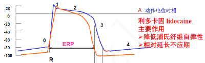
            > 抑制复极2相少量Na+内流，缩短或不影响浦肯野和心室肌的APD；减小动作电位4期去极化斜率，降低自律性
            - （1）阻滞钠：  激活和失活状态，  有 阻滞； 静息状态 ， 无 阻滞
              > *心房肌细胞AP时程短，钠通道处于失活态的时间短，因此对房性心律失常疗效差*
            - （2）减小动作电位 4 相除极斜率，提高兴奋阈值
            - （3） 对  除极化组织（心肌缺血区）作用更强  —→缺血或强心苷中毒 所致的 除极化型心律失常
              > <u>注释：缺血/强心苷如何引起除极化型心律失常？
              >
              > 除极化型心律失常：钠超载（NK泵）；钙超载（钠钙交换、缺血、强心苷）；除极化振荡，DAD。
              >
              > 缺血</u> 引起 延迟后除极化（DAD）、触发活动 ，从而引起室性早搏、室性心动过速：①钾离子外流和钠离子内流的紊乱，细胞外钾离子浓度升高，静息电位接近除极化状态。② 钙离子积累 ：缺氧会影响钙离子外流，使细胞内钙离子浓度升高，导致触发性除极化，即动作电位的过早发生。
              >
              >  <u>强心苷（如地高辛</u> ）中毒：
              >  ①抑制钠钾泵， 细胞内钠离子积聚，通过 钠钙交换机制 间接导致细胞内钙离子浓度升高。
              >  ②触发性除极化 ： 细胞内钙超负荷 会诱发 延迟后除极化 ，即在动作电位结束后，细胞膜电位再次达到阈值，从而引起新的动作电位。这种除极化通常会导致早搏、快速性心律失常，甚至心室颤动等。
              - 作用谱窄 → 室性心律失常， 对心房肌、正常心肌组织作用弱
              - 主要作用于浦肯野纤维，对心房无影响
              - 对心肌 缺血性梗死区 或强心苷中毒组织（失活状态）具有强效阻滞作用
          - ### 2. 临床应用
            - <mark style="background-color:#fef3c7;"> 室性心律失常首选 </mark> 药物（ 室性心动过速 室性早搏 室颤 ）
            - 房性效果不好 （心房肌动作电位时程短，钠通道处于激活&失活态的时间短）
            - 缺血或强心苷中毒 所致的除极化型心律失常 作用强（不是首选）
          - ### 3. 不良反应
            -  （1）眼球震颤  ——  利多卡因中毒  的早期信号；
              > 利多卡因能穿过血脑屏障作用于中枢神经系统中的钠通道。见于剂量较高或快速静脉注射时，药物在中枢神经系统浓度升高
            - （2）心脏毒性低，但剂量过大：心率减慢、房室传导阻滞、低血压
              > Ⅱ、Ⅲ度房室传导阻滞的病人禁用
          - ### <u>苯妥英钠 phenytoin sodium 回顾（与利多卡因比较）</u>
            - （1）作用特点
              - ①心肌电生理作用：类似利多卡因
              - ② 可以  加速强心苷代谢的同时，对抗强心苷中毒  所致的迟后除极：① 肝药酶诱导剂，加速强心苷的代谢；②与强心苷<mark style="background-color:#fef3c7;"> 竞争Na+-K+-ATP酶 </mark>，恢复酶的活性， 对抗强心苷中毒所致的迟后除极、触发活动和Arr 
            - （2）应用： 解救强心苷中毒  ；麻醉、心脏病 术后 室性心律失常；癫痫大发作
            - （3）不良反应： 低血压 ；心动过缓；房室传导阻滞
              - 低血压时慎用， <u>窦性心动过缓及Ⅱ、Ⅲ度房室传导阻滞者禁用</u>
              - 有致畸作用，孕妇禁用。
            - （4）合用：苯妥英钠可加速奎尼丁、美西律、地高辛、VitD、雌激素、茶碱的肝脏代谢。
          - 注意利多卡因还是局麻药，苯妥英钠还是癫痫大发作、局限性发作药
        - ### 美西律 （Mexiletine）
          - <mark style="background-color:#fef3c7;"> 共性: 抑钠、促钾；膜稳定/局麻 </mark>
          -  口服有效 ，效果持久， 维持利多卡因的疗效 
          - 应用：心肌梗死后急性室性心律失常
          - 可出现神经症状，如震颤、共济失调、复视、精神失常等。禁用于严重心功不全、缓慢型心律失常和室内传导阻滞者。
      - ### IC 类：  <u>明显</u> 阻滞钠通道（＞10s），明显<mark style="background-color:#fef3c7;">减慢</mark><mark style="background-color:#fef3c7;"> 传导 </mark> & 0期去极化 &自律性
        
        > 只要求知道名字+荧光部分。“普罗帕酮”，罗汉都怕它，明显减慢
        - 适应症： 广谱 ，对室性更好。室性心动过速、室颤、 室上心动过速 （ eg 房颤 ）
        - ### 普罗帕酮 Propafenone（心律平）
          > 明显抑制Na，Ca；微弱阻滞β（“普罗”“普洛” 远房亲戚）
          - 1. 药理作用
            - ① 抑制INa ：长时明显，同时阻断 激活与失活 状态的 Na+通道，减慢传导
              > 目前只有奎尼丁是只阻滞激活态钠通道
            - ② 微弱阻断β受体 （化学结构似普萘洛尔）
            - *③抑制钾通道，延长APD，但弱于奎尼丁*
          - 2. 应用：广谱，室性更好
            > Nearly every form of arrhythmia
            - ☺ <mark style="background-color:#fef3c7;"> 长期口服 </mark>用于① 维持 室上性心动过速（房颤、房扑）的窦性心率，②也用于室性心律失常
          - 3. 不良反应
            - 一般<mark style="background-color:#fef3c7;"> 不宜与其他抗心律失常药合用 </mark>，以避免 心脏抑制 
              > 不能合用奎尼丁、普萘洛尔、胺碘酮、维拉帕米
            - 致心律失常：加重 折返性室性心动过速、加重充血性心衰
        - ### *氟卡尼（Flecainide）、恩卡尼、劳卡尼*
          - <mark style="background-color:#fef3c7;"> 共性：明显抑钠（传导性↓）；膜稳定 </mark>
          - 明显降低心房、心室、希-浦系统、房室旁路的Vmax，减慢传导；抑制4相钠内流，降低自律性。
          - 临床应用：室上性及室性心律失常。
          - 不良反应：恶心、呕吐、头痛、视力模糊等。该药 致心律失常发生率较高 ，可致室性心动过速，室颤，诱发折返性心律失常，长Q-T综合征。
    - ## II 类药——β受体阻滞药
      > xx洛尔：窦性，尤其是SNS相关的应激性诱导的心律失常
      - <u>*β肾上腺素受体作用：增*</u>  <u>*窦性*</u>  <u>*心律、增传导、强心力、加耗氧、糖脂代谢*</u>
        - 性质：G蛋白偶联受体，激活cAMP-PKA通路，引起Ca2+、Na+内流
        - 增强Ica-L——①正性肌力；②自律性↑（4期加快）
        - 增强If——自律性↑，正性频率（心率↑）
        - 激动β的病理情况：早后除极（平台期Ca2+多，振荡电位更易达到Threshold）、迟后除极（4期钙超载）；心率过快，自律性过高
        - *注意：β受体阻滞剂*  *索他洛尔*  *也可能通过*  *明显延长APD*  *诱发早后除极*  *（致）。* 
      - 所以xx洛尔：<mark style="background-color:#fef3c7;"> 窦性心动过速首选 </mark>，尤其是SNS相关的应激性（<mark style="background-color:#fef3c7;"> 甲亢、嗜铬细胞瘤 </mark>）诱导的心律失常
      - <mark style="background-color:#fef3c7;"> 共性——阻断β受体：↓Na+、Ca2+，尤其是  ↓Ica-L、If 起搏电流； </mark>
        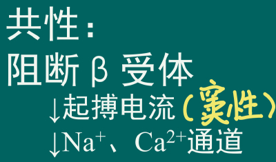
        - ① 阻断β受体 ：4期K+ ↑、If ↓ ，钠、钙内流（Ica-L)↓ ，阻滞起搏电流，对于室上性心动过速（窦房结、房室结）最敏感
        -  ② 降低自律性 ，在运动及情绪激动时作用明显；
          > 自律性
        - ③  减少  儿茶酚胺所致的  迟后除极  发生（除了  <u>索他洛尔</u>  可致DAD）
          > 兴奋性
        - ④减慢传导 ，延长AV结的有效不应期ERP
          > 传导性
      - ### <u>普萘洛尔</u>
        - ### 1. 药理作用
          - <u>特别注意：普萘洛尔抗心律失常作用与β受体阻滞及膜效应的关系</u>
        - ### <u>2. 临床应用</u>
          - （1）多用于 室上性 心律失常，尤其是 <u>交感神经兴奋性过高</u>  <u>*（eg焦虑性、运动、情绪性心律失常）*</u>  <u>、甲状腺功能亢进</u>  <u>*（增强交感神经效应）*</u>  <u>、嗜铬细胞瘤</u>  *（过量儿茶酚胺分泌）* 引起的 窦性心动过速 ；
            - 窦性心动过速效果好；室性心动过速效果没那么好
              > 首选 利多卡因（阻滞钠通道）
              > 室性心律失常通常与心肌缺血、钠离子通道功能紊乱（如心肌梗死急性期）有关，此时普萘洛尔对这些离子流的直接影响较弱，效果有限。此类情况下常用利多卡因治疗室性心律失常。
            - 室上Arr合并高血压或心绞痛患者
            - 运动或情绪变动引发的室性心律失常效果好
          - （2）与强心苷/地尔硫䓬合用，控制房扑、房颤、阵发性室上性心动过速时的室性频率过快
            - 普萘洛尔：降低窦房结频率、房室结传导性，减少过快的室性频率
            - 地尔硫䓬：钙通道阻滞，减少窦房结和房室结的兴奋性
            - 强心苷（如地高辛）：抑制钠钾泵，间接增强迷走神经
          - （3）减少心肌梗死、<mark style="background-color:#fef3c7;">肥厚型心肌病</mark>的心律失常，缩小心肌梗死范围，降低病死率
        - ### 3. 不良反应 & 禁忌症
          - （1）窦性心动过缓、房室传导阻滞，并可诱发心力衰竭和<mark style="background-color:#fef3c7;"> 哮喘 </mark>、低血压、精神压抑、记忆力减退等；
            > 哮喘病人换用 选择性 β受体阻断药，如美托洛尔。普萘洛尔阻断β2受体（气道平滑肌的主要受体）
          - （2）长期应用对脂质代谢和糖代谢有不良影响，高脂血症、糖尿病患者应慎用；
          - （3） 突然停药可产生反跳现象。
      - 美托洛尔、艾司洛尔 esmolol
        -  短效，选择性阻断β1 
        - 室上性心律失常
        - 抑制窦房结、房室结自律性、传导性，减慢房颤、房扑的心室率
      - *阿替洛尔 atenolol*
        -  长效，选择性阻断β1 
        - 适应症：室上性、室性心律失常
        - 排在腺苷/地高辛/地尔硫卓之后
        - 禁忌症：哮喘;  CCF. Poor EF ；高度心脏传导阻滞；Ca通道阻滞剂；使用可卡因。
    - ## III 类药——钾通道阻滞药（显著延长 APD ）
      - 共性： 钾通道 阻滞药， 延长APD和ERP ，对AP幅度和去极化速率影响小
      - ### <u>胺碘酮（amiodarone）</u>
        > 广谱、机制复杂（多种通道、多种受体，K+和非竞争性α、β受体为主）。
        > ​毒性大。心、肺毒性、低血压、碘（甲状腺）。
        > 维持正常窦性心律，不明显抑制心脏。
        - ### 1. 药理作用
          -  ① <mark style="background-color:#fef3c7;"> 抑制K+ </mark><mark style="background-color:#fef3c7;">为主</mark>的 多种 离子通道（INa,ICa,IK,IK1,Ito等↓），<mark style="background-color:#fef3c7;"> 明显延长APD、ERP。 </mark>降低自律性和传导性。
            > 控制心室节律方面，优于β受体阻滞剂；降低传导、兴奋性方面，作用不如其它抗Arr药。
          - ② 无翻转使用依赖性 （ No reverse use-dependence）： 延长动作电位时程的作用 不依赖于心率的快慢
            - 翻转使用依赖性： 心率快时，延长APD的作用不明显，而心率慢时，却使APD明显延长。该作用易诱发 尖端扭转型室性心动过速  。
          -  ③扩血管作用 ：<mark style="background-color:#fef3c7;"> 非竞争性α、β受体阻断剂 </mark>，还可以阻滞甲状腺激素（刺激β）的作用。—→舒张血管平滑肌（ADR：低血压）； 扩张冠脉 ，降低心肌耗氧量。
        - ### 2.  临床应用
          -  广谱。顽固性心律失常。维持正常窦性心律。 
          - *用于对其他药物有抗性的室性心动过速或室颤；抑制与WPW综合征相关的心动过速。*
        - ### 3.  不良反应—— 多，与剂量、用时长短有关 
          - （1）心脏毒性：常见：窦性心动过缓、房室传导阻滞、Q-T间期延长，偶见尖端扭转型心律失常。←——→房室传导阻滞，Q-T延长者禁用
          - （2）静脉给药常见低血压←——→多巴胺、去甲肾上腺素维持血压
          - （3）碘：长期应用可见角膜褐色微粒沉着，停药后自行消失
            - 甲状腺：少数有 甲状腺 功能亢进或减退，肝坏死： 胺碘酮有类似甲状腺素作用 ，可抑制外周T4向T3转化←——→ 甲状腺疾病、碘过敏禁用
          - （4）致死性肺毒性：个别：间质性肺炎、肺纤维化←——→ 长期使用应检测肺功能PFT、肺部X线；监测血清T3、T4
        - ### 4.药物合用（PPT有）
          -  CYP3A4代谢底物：  西咪替丁 可增加其血药浓度， 利福平 可降低其血药浓度。
            > 西咪替丁：H2受体拮抗剂，作用于胃壁细胞、抑制肝药酶CYP3A4，减少胺碘酮的代谢。
          - 自身抑制其它肝脏代谢酶，增加地高辛、华法林浓度
        - ### 5. 使用注意与禁忌症
          - 多巴胺、去甲肾上腺素维持血压
          - 房室传导阻滞，Q-T延长者禁用
          - 甲状腺疾病 、碘过敏禁用
          - 长期使用应检测肺功能PFT、肺部X线；监测血清T3、T4
      - ### 索他洛尔（Sotalol）：注意这是β阻滞剂，但属于III类药
        - 药理作用
          - 选择性 阻滞IKr ， 非选择性阻断β受体。 
            > 这里指3期复极化的rapid K+通道，阻滞IKr的药对房性心律失常效果更好
          - 明显 延长APD及ERP  ，减弱 窦房结及浦氏纤维 自律性、 房室 传导 ， 延长房室不应期而中止折返。
        - 体内过程： 口服吸收快，无首过消除。
        - 临床应用： 严重的室性、室上性心动过速、房颤。
        - 不良反应较少 ，少数Q-T间期延长者可出现Tdp（一种室颤）。
      - ### 多非利特（dofetilide）：选择性阻滞 IKr
        > 对房性心律失常效果更好，应用于 房颤 。
    - ## IV 类药——钙通道阻滞药 （Ica-L ↓）
      - 钙拮抗药综合作用对比：二氢吡啶类 vs 非二氢吡啶类
        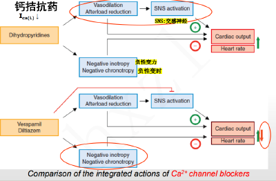
        - 二氢吡啶类：主要阻滞血管平滑肌的Ica-L，表现为 <u>舒血管作用</u>
        - 非二氢吡啶类（维拉帕米、地尔硫卓）：主要 <u>阻滞心脏</u> Ica-L，负性变力、负性变时
      - ## 维拉帕米（Verapamil，异搏定）
        - ### 1. 药理作用
          -  抑制L型钙通道、 轻度抑制Ikr
          - <u>对心脏自律性、传导速度和不应期的影响</u>
            - - 降低窦房结 自律性， 减少或消除后除极（以及触发活动）
            - - 减慢房室 传导
              > 可 终止房室结折返 ，减慢心房扑动引起的心室率加快
            - - 延长窦房结、房室结的 ERP 。
        - ### 2. 临床应用
          - 治疗 室上性心动过速、  房室结折返引起的心律失常。 是<mark style="background-color:#fef3c7;"> 阵发性室上性心动过速（PSVT）首选药 </mark>
            > Paroxysmal supraventricular tachycardia：容易被折返和后除极引起。 口服可预防房PSVT的发作及减慢房颤患者的心室率；静注可终止PSVT
          - 房颤、房扑：减慢心室内率（传不下去）。但首选地高辛，
          - 抑制钙超载相关的室性早搏
        - ### 3. 不良反应
          - CCB：扩血管、抑心脏、舒张平滑肌（胃肠、支气管）、保护肾（血流+）、抗动脉粥样硬化、抑制血小板聚集和红细胞脆性
          - 口服安全，静脉给药可致血压降低、暂时窦性停搏 （尤其 <mark style="background-color:#fef3c7;"> 不能合用β受体阻滞剂 </mark> ） ；
          - 房室传导阻滞、心功能不全、心源性休克， 禁用； 老年人、肾功能低下者 慎用 。
          - *〔药物相互作用〕*
            - 1.一般不与β受体阻断药合用：均抑制心肌收缩力、传导，合用有心脏停搏风险
            - 2.合用地高辛时，减少地高辛的剂量
    - ## Others：腺苷 Adenosine——快速起效， 迅速 终止折返性、阵发性室上心律失常
      - 药理作用
        - 作用于 A1腺苷受体 
        - 激活 KAch （ Ach 依赖性K+通道），  缩短动作电位时程
          > 心房、窦房结、房室结，对窦房结作用尤其明显
        - 抑制 Ca2+通道 ，延长Ca依赖性动作电位（eg房室结）的 有效不应期， 抑制迟后除极
      - 临床应用
        -  迅速 终止折返性、阵发性室上心律失常（腺苷静注起效非常快）
        - 不用于房颤和室性心动过速
      - *不良反应：注射过快引起短暂心脏停搏；低血压*
  - 抗心律失常药的致心律失常作用
    - 定义：应用治疗量抗心律失常药物、血药浓度低于中毒水平时，药物 <u>诱发既往未曾发生过</u> 的心律失常或者 <u>使原有的心律失常恶化</u> 。
    - 发生原因
      - 抗心律失常药物大部分可影响心肌的除极和复极，使电解质发生改变，对心脏特殊组织的自律性、兴奋性和传导性产生影响。这种作用具有个体差异、剂量差异。
      - 二、心律失常的电生理学机制。（形成异常，传导异常）
    - 举例
      - 奎尼丁：抑制心肌的传导，使有效不应期延长，故易诱发折返性心律失常
      - 利多卡因：治疗室性快速心律失常，但大剂量时引起房室传导阻滞和严重的缓慢性心律失常。
    - 预防措施
      - 原则：危及生命的心律失常（acute）→有效性；改善症状用药（outpatient/ take home）→安全性
      - 1.能使用一种药物治疗有效的，尽量避免联合用药；
      - 2.避免同时应用多种同一类药物；
      - 3.避免同时应用作用或副作用相似的药物
  -  课后题 
    - 1. 维持 正常窦性心律的抗心律失常药？—— 胺碘酮 。主要特点是广谱，不明显抑制心脏
    - 2.女性，44岁。八年来劳累后心慌气短。既往曾患过“风湿性关节炎”。近日因劳累病情加重，心慌，气短，咯血，不能平卧急诊入院。查体:半卧位慢性重病容。脉搏80次/分，血压13.3/9.33kPa(100/70mmg)。心向左侧扩大心律不齐，心率120次/分，心尖区舒张期雷鸣样杂音，主动脉瓣区收缩期和舒张期杂音。肝肋下3cm，下肢轻度浮肿。诊断:风湿性心脏病，二尖瓣狭窄主动脉瓣狭窄及关闭不全，心房纤颤，心功能不全1度。该病人在 用强心药治疗 的过程中， 心率突然减 为45-50次/分，此时应选用
      - A. 利多卡因
      - B.肾上腺素
      - C. 吗啡
      - <mark style="background-color:#fef3c7;">D.阿托品</mark>
        > 心动过缓性强心苷中毒
      - E.苯妥英钠
        > 普通强心苷中毒
    - 3.女性，74岁。自觉因擦背着凉后两肩和后背阵阵酸痛，每阵10分钟左右，不发烧，仍可下床走动。于今晨1时许，突然出现心前区剧痛并向双肩、后背和左臂放射，伴大汗，休息后不见缓解，早8点急诊住院。检查:年迈，半卧位，无明显青紫，颈静脉不怒张，肺(一)心略向左侧扩大，心律尚齐，未闻心脏杂音及摩擦音。心电图:病理性Q波，ST段抬高，T波倒置。诊断: 急性心肌梗塞 。为 防止 室性心律失常的发生，病人应先给予的下列药物较好的是
      - A.利多卡因
        > 急性缺血性心律失常（eg心梗）已发作时用
      - B. 奎尼丁
      - C. 胺碘酮
      - <mark style="background-color:#fef3c7;">D. 美托洛尔</mark>
        > 预防时用
      - E.苯妥英钠
    - 4.Which of the following is an antiarrhythmic agent that has relatively few electrophysiologic effects on normal myocardial tissue but suppresses the arrhythmogenic tendencies of ischemic myocardial tissues?
      - a. Propranolol
      - b. Procainamide
      - c. Quinidine
      - <mark style="background-color:#fef3c7;">d. Lidocaine</mark>
      - e. Disopyramide
    - 5. The first-line drug for treating an  acute  attack of  re-entrant supraventricular tachycardia(SVT) is
      - <mark style="background-color:#fef3c7;">a. Adenosine</mark>
        > 对折返性室上心动过速作用非常快
      - b. Digoxin
      - c. Propranolol
      - d. Phenylephrine
      - e. Edrophonium
    - 6.Suppression of arrhythmias resulting from a reentry focus is most likely to occur if the drug:
      - A. Has vagomimetic effects on the AV node.
      - B. ls a β-blocker.
      - <mark style="background-color:#fef3c7;">C. Converts a unidirectional block to a bidirectional block.</mark>
      - D. Slows conduction through the atria.
      - E. Has atropine-like effects on the AV node.
    - 7. A 57-year-old man is being treated for an atrial arrhythmia.He complains of headache, dizziness, and tinnitus. Whichone of the following antiarrhythmic drugs is the most likely cause?
      - A. Amiodarone.
      - B. Procainamide.
      - C. Propranolol.
      - <mark style="background-color:#fef3c7;">D. Quinidine.</mark>
        > 五官类副作用，金鸡纳反应
      - E. Verapamil.
    - 8. 58-year-old woman is being treated for chronic suppression of a ventricular arrhythmia. After 2 months of therapy, she complains about feeling tired all the time. Examination reveals a resting heart rate of 10 beats per minute lower than her previous rate. Her skin is cool and clammy.Laboratory test results indicate low thyroxin and elevated thyroid stimulating hormone levels. Which of the following antiarrhythmic drugs is the likely cause of these signs and symptoms?
      - <mark style="background-color:#fef3c7;">A. Amiodarone.</mark>
        > 关键词：甲状腺副作用
      - B. Procainamide.
      - C. Propranolol.
      - D. Quinidine.
      - E. Verapamil.
  - 抗心律失常药小结
    - 景晴
      
- # 利尿药及脱水药（2 ）
  - ## 概论
    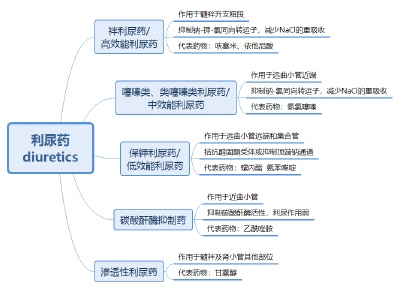
    - 写在前面：心中两条分类线索。一，【按作用部位分】，从肾脏结构（尿液途经顺序）来记忆，不同位点→不同特点（主要效应、作用副作用、高中低效）；二，【按高中低效+其它两种分】。
    - 定义：作用于肾脏，增加电解质和水的排泄，使尿量增多的药物。
      > 利尿药不是抑制对水的重吸收，更多是抑制对钠的重吸收。
  - ## 碳酸酐酶抑制药（ Carbonic Anhydrase Inhibitors） ——乙酰唑胺（acetazolamide）
    - ### 作用位点：近曲小管
    - ### 1. 药理作用
      > 排碱、高氯、肾外作用
      - CA：催化H2CO3分解为H+和HCO3-，之后经历钠氢交换、钠和HCO3-重吸收。
      - ①对肾：作用于 近曲小管 等部位，抑制碳酸酐酶的活性。 大量损失HCO3-，排碱 ；同时Cl-重吸收增加；引起代谢性酸中毒；利尿作用弱
        > 复习：近曲小管处Na+-H+交换体带动Na+和HCO3-重吸收。Na+进，H+出，带动CA酶催化的H2CO3分解反应不断平衡正移生成HCO3-。
      - ②肾外：减少房水（<mark style="background-color:#fef3c7;">青光眼</mark>）、脑脊液（<mark style="background-color:#fef3c7;">高山病</mark>）的生成量，降低pH *（引起代谢性酸中毒* ）。
    - ### 2. 临床应用：除利尿外的特殊用途
      > 由于利尿作用较弱，已很少作为利尿药使用，但仍有几种特殊用途
      - 青光眼（Glaucoma） 、碱化尿、代谢性碱中毒、急性高山病（ acute mountain sickness） 、癫痫。
        - ☺ 碱化尿液 ：促进尿酸、弱酸性物质（如阿司匹林）的排泄，只在初期有效
        - ☺ 纠正 代碱 ：当心力衰竭患者使用过多利尿药造成代碱时，补盐会增加心脏充盈压，因此可使用乙酰唑胺
        - ☺ 治疗 青光眼 Glaucoma ：减少房水生成，降低眼压，对多种类型青光眼有效
          - 复习：治疗青光眼相关药物
            - 1）使房水流出通路更通畅：毛果芸香碱、新斯的明、毒扁豆碱
            - 2）减少房水生成：β阻滞剂（Timolo），拟肾上腺素药物（α2受体激动剂），利尿药（乙酰唑胺）
        - ☺  急性高山病：减少脑脊液的生成 ，降低脑脊液、脑组织的pH，以减轻症状，防止脑水肿而危及生命
        - ☺  癫痫辅助治疗 、高磷酸盐血症
    - ### 3.  不良反应
      - 过敏： 磺胺衍生物，可能导致骨髓抑制、皮肤毒性、磺胺样肾损害等；
      - 代酸： 高氯性酸中毒
      - 尿结石： 乙酰唑胺可引起磷酸盐尿和高钙尿症，且钙盐在碱性尿液中易沉积，容易形成结石
      - 低钾血症
  - ## 脱水药（渗透性利尿药）
    - ### <u>甘露醇（mannitol）</u>  、山梨醇、  50% 葡萄糖 
      - ### 药理作用
        - -  脱水作用
          -  静脉 注射，提高血浆渗透压，使组织间液向血浆转移，产生 组织脱水作用，降低颅内压和眼压； 
            > 绝对不能皮下注射，会加剧水肿
            -  （△初期可出现一过性细胞外液量增加/淤积；后期可能出现大量脱水、低容量血症） 
          - 口服，口干，到不了肾脏，造成渗透性腹泻。可用于从胃肠道消除毒性物质。
        - -  利尿作用
          - ①不易吸收（不易通过毛细血管进入组织，所以留在血浆组织脱水）；
          - ②易被肾小球滤过，不易被肾小管重吸收；
          - ③不被代谢，基本完全滤过
          - ④排出的水略多于排钠，尿液低渗
      - ### 临床应用
        - ☺  脑水肿、青光眼
        - ☺ 预防急性肾衰、缓解 急性肾损伤 （快速把坏死组织冲刷走）
      - *不良反应*
        - 毒性：一过性细胞外液量增加/淤积， 心脏负荷增大 ；脱水、<mark style="background-color:#fef3c7;"> 高钠血症（甘露醇排低渗尿） </mark>；急性低容量血症
          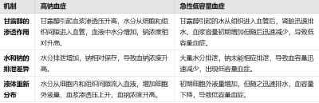
        - 静注过快会出现眩晕、头痛、视力模糊等症状；
        -  心功能不全、心源性水肿 （外周循环淤血，用甘露醇初期加重细胞外液量淤积）、 活动性颅内出血（ 增加血量、加剧出血 ）、严重肾衰引起的  <u>无尿</u>  者禁用 。（可以缓解AKI，但是已经无尿就不能用了）
  - ## 高效 利尿药：抑制髓袢升粗  NKCC2 ； 高血压危象伴肾功能不全（  扩肾血流  ）、急性肺水肿（  扩血管  ）
    > aka loop diuretics 袢利尿剂：呋塞米（Furosemide）、依他尼酸（ethycrinic acid，已因毒性停用） 、布美他尼 bumetanide (Bumex) ； 阿佐塞米（azosemide)；吡咯他尼(piretamide)
    - ### <u>作用位点：抑制</u>  <u>髓袢升支粗段</u>  <u>髓质和皮质部</u>  <u>NKCC2</u>  <u>——</u>  <u>Cl-的主动重吸收</u>  <u>，影响肾稀释及浓缩功能。</u>
      - 图示
        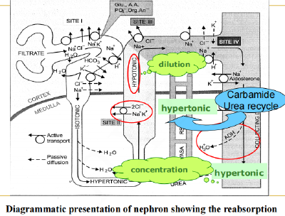
    - ### 特点： ① 作用强大、 迅速、短暂 ； ② 尿中排出大量的Na+、CI-、K+、Ca2+、Mg2+； ③ 等渗尿，略微排水多与排钠； ④ 注意及时补钾或加服保钾利尿药
    - ### <u>呋塞米（furosemide）/速尿</u>
      - 作用部位：髓袢升支粗段髓质部、远曲小管近端
      - ### 1. 体内过程
        - - 吸收：口服 吸收迅速、起效迅速 。
        - -分布：可通过胎盘。
        - - 排泄：肾滤过、分泌。与尿酸盐的分泌相竞争，久易 高尿酸血症 。
      - ### 2. 药理作用
        - （1）利尿作用
          - 特点： ① 作用强大、 迅速、短暂 ； ② 尿中排出大量的Na+、CI-、K+、Ca2+、Mg2+； ③ 等渗尿，略微排水多与排钠； ④ 注意及时补钾或加服保钾利尿药
            > 注意排钾排钙：K+正电位+溶剂拖拽
          - 机制：与Cl-竞争，抑制Na+-K+-2Cl-同向转运体，使原尿中Na、Cl、K的重吸收减少
        -  （2） 扩张血管 <mark style="background-color:#fef3c7;"> （易忘） </mark>
          - 机制：促进 前列腺素PG 的合成
            - 干扰非甾体类抗炎药（如吲哚美辛  Indomethacin ）， 避免与吲哚美辛合用（PPT） 
          - 迅速 增加全身静脉血容量（Redistribute & 分担） ，降低左心室充盈压，减轻肺淤血
          - 直接扩张肾血管， 增加肾血流量，治疗肾衰 
            > CA酶抑制剂也可以冲刷、增加肾血流量
      - ### 3. 临床应用
        - ☺ <mark style="background-color:#fef3c7;"> 急性肺水肿（首选） </mark>—— 扩张容量血管 （+利尿），降低左心室压，减轻肺淤血
        - ☺  严重  水肿： 用于其他利尿药无效的严重水肿病人
        - ☺  急肾功能衰竭：  冲刷防坏死；增加肾血流量 。 慢性肾衰慎用
        - ☺  <u>促进毒物的排出</u>  ： 某些经肾排出的 药物中毒的抢救 ，如巴比妥类、水杨酸中毒
        - <mark style="background-color:#fef3c7;"> 高血压危象、急性严重心衰 </mark> ：  与保钾利尿剂  合用，如螺内酯 
        - 高钾血症、急性高钙血症： Na+、K+经过NKCC2进入肾小管上皮细胞后，Na+经基底侧的Na+-K+-ATPase进入细胞间质，而在细胞内蓄积的K+则扩散返回管腔，使管腔内呈正电位，驱动Ca2+、Mg2+的重吸收，袢利尿药抑制这个过程，也因此增加了Ca2+、Mg2+的排出。
      - ### 4.  ※※（每次必考）不良反应 
        - 水、电解质紊乱： 过度利尿，低血容量、低血钠、低血镁、低血钾、低血氯性碱中毒（排Cl多于排Na）、低血钙、碱血症等；
        - 耳毒性（ototoxicity） ：大量静脉注射时易发生，内耳淋巴液也有NKCC2。 ※忌与氨基糖苷类抗生素、庆大霉素（耳毒性）合用 
          - 依他尼酸最易引起，布美他尼耳毒性最小
        - 高尿酸血症
          - 利尿→血容量↓→胞外液浓缩→尿酸经近曲小管的再吸收↑；与尿酸竞争有机酸分泌途径
          - ※痛风患者禁用
        - 其他：高血糖、过敏反应（呋塞米、布美他尼为磺胺衍生物，可引起交叉过敏反应）、低血压、胃肠道反应等
          - △ 高血糖：电解质紊乱 & 低血容量的继发效应
            - 低钾、低镁，胰岛素分泌受抑制、敏感性降低；
            - 低血容量→交感神经激活：引起肝糖异生和糖原分解
      - ### 5. 药物合用互作
        -  X  吲哚美辛 干扰非甾体类抗炎药（如吲哚美辛  Indomethacin ）， 避免与吲哚美辛合用（PPT） 
        -  X   氨基糖苷类抗生素、庆大霉素 耳毒性（ototoxicity）：大量静脉注射时易发生，内耳淋巴液也有NKCC2。 ※忌与氨基糖苷类抗生素、庆大霉素（耳毒性）合用 
        -  √  螺内酯 高血压危象、急性严重心衰 ：  与保钾利尿剂  合用，如螺内酯 
  - ## 中效 利尿药：最广泛应用，口服利尿药、基础 <u>降压药</u>
    > 噻嗪类：氢氯噻嗪(Hydrochlorothiazide)
    - ### <u>作用位点：抑制远曲小管近端</u>  <u>（髓袢升支粗段皮质部）Na-Cl同向转运体</u>  <u>的重吸收，间接抑制集合管钠钾交换，引发</u>  <u>失钾</u>  <u>；</u>  <u>增加Ca2+重吸收</u> 
      > 注意区别于furosemide：引发失钙
      - 远曲小管：Na-Cl同向转运体，对水不通透；由甲状旁腺激素调节Ca2+通过钙通道的重吸收
        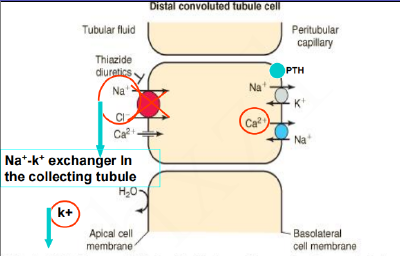
    - ### <u>氢氯噻嗪（hydrochlorothiazide）</u>
      - 作用部位：髓袢升支粗段皮质部
      - ### 1. 体内过程——脂溶性高
        - - 吸收：快、完全（1~2起效，4~6h达峰）
        - - 分布：血浆蛋白结合率高、分布在肾居多
        - - 消除：以有机酸形式从肾小管分泌（竞争，高尿酸血症）
      - ### 2.  药理作用
        - （1）利尿、  保钙  作用
          - 特点：温和、持久；排钠排水排钾 保钙 
          - 机制
            - 抑制远曲小管近端的Na+-Cl-同向转运， 减少NaCl的重吸收
            -  促进Ca2+重吸收 （远曲小管，由甲状旁腺激素调节），减少尿Ca2+含量
              > link：氢氯噻嗪 <u>治疗高钙型肾结石</u> ；乙酰唑胺碱化尿液诱发肾结石
        - （2）  降压作用 
          - 早期：利尿，减少血容量
          - 长期：扩张外周血管
        - （3）抗利尿作用 ——仅 对于尿崩症患者， 减少尿量、缓解口渴。机制： 排Na+略多于排水，  引发轻度低钠血症 
          > 排钠略多于排水
          - 尿崩症有两种类型：抗利尿激素分泌不足（中枢尿崩症）、肾脏对抗利尿激素反应不足（肾源性尿崩症)
          - 抗利尿有两种类型，①中枢性，②肾源性。 氢氯噻嗪是肾源性抗利尿。 
          - 机制：①<mark style="background-color:#fef3c7;"> 排Na+略多于排水 </mark> ，  引发轻度低钠血症  →渴感↓→饮水、尿量↓；②长期应用，血容量↓激活RAAS，抗利尿
            > 区别：furosemide 排水略多于排钠
      - ### 3. 临床应用
        -  注意补钾！ 
        - ☺  水肿： 对轻、中度心源性水肿效果好，是慢性心功能不全的主要治疗药物之一；
          > link：甘露醇早期引起一过性ECM淤积，不用于心源性水肿
        - ☺  高血压 ：利尿； 温和 的扩血管作用
        - ☺ 心衰  Congestive heart failure：减少水钠潴留
        - ☺ （肾源性） <mark style="background-color:#fef3c7;"> 尿崩症 </mark>：对肾性尿崩症及VP无效的中枢性尿崩症有效；
          > 轻度低钠血症、减少血容量
        - ☺ <mark style="background-color:#fef3c7;"> 高尿钙型肾结石 </mark> （Nephrolithiasis） ：使Ca2+重吸收增加（ 远曲小管PTH ），抑制高尿钙引起的肾结石的形成。
      - ### 4. 不良反应（除了耳毒性之外，基本同高效利尿药）
        -  低血钾； 电解质紊乱：低血钠、代谢性碱血症、低血镁等
        -  高尿酸血症  ： 原因同高效利尿药  ※痛风者慎用                 - 排泄：肾滤过、分泌。 与尿酸盐的分泌相竞争，久易 高尿酸血症 。
        -  代谢障碍 
          - 高血糖：（低钾）抑制胰岛素的分泌，减少组织利用葡萄糖，  ※  糖尿病人慎用 
          - 高血脂：低密度脂蛋白↑,胆固醇↑，  ※  高脂血症患者禁用 
        - 其他：与磺胺类有交叉过敏反应，可引起光敏性皮炎等
  - ## 低效 利尿药：常与高效利尿药合用； <u>保钾排钠。</u>
    > 螺内酯（spironolactone），依普利酮（eplerenone) ；氨苯蝶啶/三氨蝶啶(Triamterene)，阿米洛利（amiloride） 。“低效”：2%~5% NaCl吸收部位；aka Potassium-Sparing diuretic agents
    - ### <u>作用位点：远曲小管、集合管。分为两类：①</u>  <u>醛固酮受体拮抗药（螺内酯），通过竞争醛固酮保钾（失去肾上腺皮质后不管用）</u>  <u>，②肾小管上皮细胞顶端</u>  <u>ENaC抑制药，直接抑制钠钾交换（如氨苯喋啶</u>  <u>、阿米洛利）</u>
      - 集合管：①盐皮质激素受体；②钠钾交换（ENaC & ROMK，盐皮质激素效应靶点）
        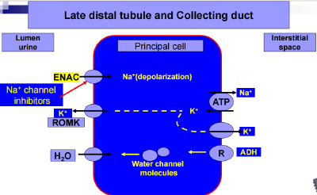
        - ①抑制盐皮质激素受体：螺内酯
        - ②抑制钠转运：t riameterenum氨苯蝶啶，amiloride 阿米洛利
    - ### 特点：弱、慢、长期；保钾排钠（竞争醛固酮 / 直接抑制钠钾交换）；一般合用高、中效
    - ### 螺内酯（spironolactone）/安体舒通（antisterone）
      > 竞争性拮抗盐皮质激素受体
      - ### 1. 药理作用➢ 利尿、抗雄
        - 竞争 醛固酮受体 & 雄激素受体
      - ### 2. 临床应用
        - ☺  用于  醛固酮升高的  顽固性水肿  ：肝硬化、肾病综合征
        - ☺  充血性心力衰竭（伴水肿）： 通过排钠、利尿、抑制心肌纤维化等多方面改善患者的状况
          > 这一章除了甘露醇慎用，其余都可以治疗心衰伴水肿；注意高效利尿药还需要合用保钾。
        - ☺  高盐皮质激素状态  Hyperaldosteronic state
        - ☺ 与排钾利尿剂合用 Adjunct to K+ -wasting diuretics
        - ☺  抗雄激素  作用（女性多毛症） Antiandrogenic uses (female hirsutism)
      - ### 3. 不良反应
        - 高血钾 & 肾性酸中毒
        -  雌性激素样作用：  男子乳房女性化、性功能障碍、妇女多毛等
          -  依普利酮（eplerenone) 没有这个副作用 
        - 中枢神经系统反应： 头痛、困倦、精神紊乱等
    - ### 氨苯喋啶（triamterene）
      > aka  三氨蝶呤（理解其叶酸缺乏、肾毒性）
      - ### 1. 药理作用➢ 利尿
        - 阻滞远曲小管远端和集合管顶端膜钠通道，减少钠的重吸收。由于钠重吸收减少，管腔负电位降低，从而减少钾的分泌
        - 并非竞争性拮抗醛固酮，因而对肾上腺切除者仍有效
      - ### 2. 不良反应
        - 少，长期服用可致高钾血症，严重肝、肾功能不全，有高钾血症倾向者禁用
        - 嗜睡、恶心、呕吐、腹泻
        -  叶酸缺乏  ： 可抑制叶酸还原酶。贫血、口腔溃疡、皮肤和黏膜改变
        -  肝硬化患者发生巨幼红细胞贫血 
        - 肾结石： 水溶性差，形成尿液结晶
        - 急性肾衰竭：  禁止与吲哚美辛合用 
        - 高血压、充血性心力衰竭、糖尿病、严重肝肾损害、低钠血症慎用
    - 习题
      - 痛风不能用噻嗪
      - BUN提示肌酐尿素氮，和肾功能有关。肾功能不全+少尿：选用甘露醇，尽快排尿
      - 低钾+痛风+高血压+美洲非裔：保钾利尿药；注意RAS普利类药对美洲人无效
      - 严重心衰水肿：把氢氯噻嗪换成呋塞米（强效）
      - *氯噻酮不能与氢氯噻嗪、阿替洛尔、美托洛尔、硝苯地平、维拉帕米等药物混合使用。*
  - ## <u>利尿药的临床应用</u>
    - 水肿
      - 心源性：①中度：噻嗪+钾盐；②严重 ：  高效利尿剂 +保钾利尿剂
      - 肾性：一般不用利尿药。①白蛋白+限水钠（RAAS）；②严重：氢氯噻嗪+保钾利尿剂
        > 肾性水肿：蛋白尿→低蛋白血症→水肿；循环血量减少→继发性醛固酮增多→加剧水肿
      - 肝性：一般合并继发性醛固酮增多，极易严重低钾血症。 先保钾（螺内酯），再利尿 
      -  急性肺水肿、脑水肿 ：高效利尿药（静脉注射呋塞米）
      - 利尿药用量不能过大：排尿速度大于水肿液入血速度时，继发性醛固酮增多
    - 肝硬化腹腔积液
      - 伴水肿：高效利尿药
      - 不伴水肿：螺内酯（警惕电解质紊乱）
    - 高血压、慢性心功能不全
      - 抗高血压药（  噻嗪类） 
      - 抗CHF药：必须与 ACEI 合用抑制RAAS通路，且只能用于CHF伴水肿的患者
        - 高血压危象+急性严重心衰：高效+保钾
        - 充血性心力衰竭+伴水肿：噻嗪+ACEI or 螺内酯+ACEI
    - 肾功能不全、预防急性肾衰竭 ：高效利尿药 呋塞米（ 大量冲刷）
    - 尿崩症：①肾性尿崩症—氢氯噻嗪；②中枢性尿崩症—VP + 氢氯噻嗪
    - 高尿钙、结石：噻嗪类
    - 高血钙：高效利尿剂 呋塞米
    - 低钠血症：托伐普坦
    - 青光眼：乙酰唑胺
    - 加速排毒：高效利尿剂
    - 小结表格
      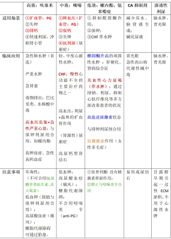
- # 抗高血压药（3.5）
  - <u>*抗高血压药对高血压病治疗的意义。*</u> 按其作用原理和作用部位进行分类。（图1的心脏功能指 心率、心肌收缩力）
    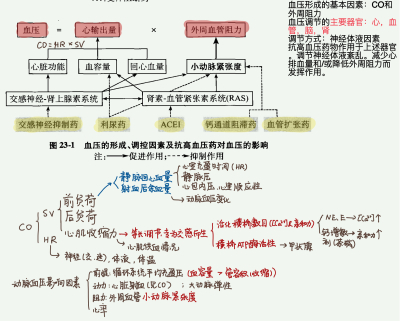
    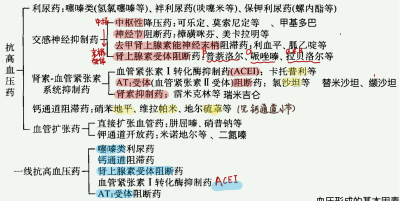
    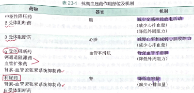
    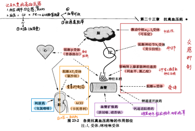
    - *PPT的部分高血压知识*
      - 1.原发性高血压（也称为原发性或特发性高血压）占90%以上。
      - 2.继发性高血压：肾动脉狭窄；内分泌疾病：库欣综合征（肾上腺皮质亢进）、甲状腺疾病、肾上腺髓质嗜铬细胞瘤；主动脉缩窄；自身免疫性疾病；酒精滥用；动脉粥样硬化；可卡因；糖尿病
      - 高血压增加终端器官损害
  - # 一、利尿药
    > 氢氯噻嗪（Hydrochlorothiazide）、吲达帕胺（indapamide）
    - ## <u>氢氯噻嗪</u>
      - ### 降压作用： 可降低10%
        - ①降低 血容量 ；
        - ②类似PG， 扩血管：[Na+]↓ 
          - Na+降低的继发影响：保钙   活 RAS→钾、糖
          - 钠钙交换——Ca2+↓，促进钙重吸收
          - 漏洞：远曲小管致密斑Na＋↓，排钾， 激活RAAS ——低血钾、低血糖、肾素活性继发↑
          - 但另一面，<mark style="background-color:#fef3c7;">适用于</mark><mark style="background-color:#fef3c7;"> 肾功能衰竭引起的肾素活性降低的高血压 </mark>
        - ③肾性 尿崩症
          > *氢氯噻嗪治疗肾性尿崩症的机制主要与其能减少肾脏对钠的重吸收有关* 。通过减少钠的重吸收,可增加肾小管内的渗透压,从而在一定程度上改善尿液浓缩功能,减少尿量。？
        - 不产生耐受性
      - ### 用途：①水肿（心源性；CHF） ②<mark style="background-color:#fef3c7;">各型高压，尤其肾素活性↓</mark> ③尿崩 ④高钙结石
        - ### 轻、中度心源性水肿； CHF； 高血压：利尿+温和的扩血管作用；（肾源性）尿崩症； 高尿  钙型尿结石 
      - ### 不良反应：低血钾；高尿酸血症（痛风）；糖脂代谢障碍；不合用吲哚美辛（anti-PG）
    - ## 吲达帕胺
      - 结构：非噻嗪类
      - 机制：利尿、利钠、扩血管（Ca2+↓）
      - 临床应用：轻、中度高血压<mark style="background-color:#fef3c7;"> （伴高脂血症） </mark>
      - 不良反应轻微，不引起 血脂改变 
      - 禁忌症：  磺胺过敏 、 肝肾（ 严重肾衰竭、肝性脑病、严重肝衰竭）、 低钾血症、 妊娠或哺乳期。
    - 其它利尿剂
      - 保钾利尿药 适用于 低钾血症， 高尿酸血症   ，原发性醛固酮增多症；不可用于肾功能不全、少尿。一般与噻嗪合用。
        > 保钾，可能拮抗醛固酮，不像高效利尿药会引起高尿酸血
      - 氨苯喋呤 triamterene ：与其它利尿药合用增加疗效并对抗不良反应
      - 高效利尿药 仅用于 高血压危象  、 慢性肾功能不全  的高血压 、 肺水肿  合并高血压。注意高尿酸血症。
        > 高效，冲刷肾，肺水肿（尤其急性
  - # 二、血管紧张素 I 转化酶抑制药及血管紧张素 II 受体（AT1）阻断药
    > ~普利，~沙坦。PPT重点：作用、应用、不良（禁忌症）
    - 关于RAAS
      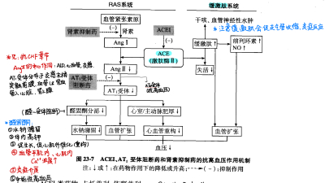
      - 三、RAAS抑制药：CHF基础，伴缺血、伴肾高
    - ACEI 卡 <u>托普利（Captopril）</u>
      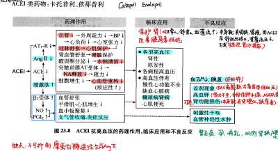
      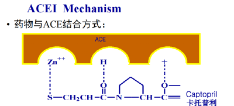
      - ACEI也有首剂效应（first-dose phenomenon）：哌唑嗪首次给药时发生严重的直立性低血压（ orthostatic hypotension） 、晕厥、心悸
    - <u>氯沙坦（Losartan），</u>  <u>*缬沙坦（Valsartan），厄贝沙坦*</u> （Irbesartan）；ARNI
      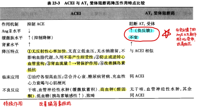
  - # 三、交感抑制药
    > 中枢：• Clonidine； Methyldopa；Guanabenz；Guanfacine
    > 神经节：Guanadrel ；Guanethidine ； Reserpine
    > 受体阻滞药： propranolol (β） ；Labetalol (α&β）  Prazosin,  Terazosin (α）
    - ## 中枢抗高血压药： 可乐定Clonidine、α-甲基多巴（methyldopa） ，莫索尼定 moxonidine、利美尼定 rilmenidine
      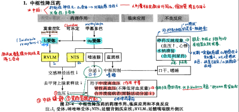
      - 可乐定（  Clonidine  ）
        - ➢ 药理作用——  中等偏强 
          > ppt重点
          - - 抑制交感神经活性→血压和心一起落，心收缩力↓，CO↓，外周血管舒张→BP↓；
          - - 抑制胃酸分泌和胃肠蠕动；
          - -抑制肾素分泌
          - -中枢镇静
        - ➢ 作用机制
          - - 选择性激动延髓孤束核（NTS）突触后膜的 α2受体 、延髓头端腹外侧核（RVLM）的咪唑啉 I1受体 →外周交感活性↓→BP↓；
            > 延髓孤束核突触后膜的α2受体、延髓头端腹外侧核的咪唑啉I1受体
          - -  首次给药一过性血压升高 /大剂量激活外周血管平滑肌上的α2受体，血管收缩，减弱降压效果。
        - ➢ 临床应用
          - 中度高血压，尤其是<mark style="background-color:#fef3c7;"> 肾性高血压 </mark>或<mark style="background-color:#fef3c7;"> 高血压兼胃溃疡 </mark>者。
          - <mark style="background-color:#fef3c7;"> 戒毒：阿片类 </mark>
        - ➢ 不良反应
          - 口干、便秘；
          - 嗜睡、恶心、眩晕、腮腺痛；
          -  停药反跳现象：交感亢进，血压↑↑  。  长期服药引起突触前膜 α2受体敏感性下降。突然停药会有交感功能亢进的症状停药前应逐渐减量 出现停药反应可用 可乐定 酚妥拉明 治疗
      - α-  甲基多巴（  methyldopa  ）
        - 与可乐定相似， 激动延脑突触后膜α2受体， 扩血管而降低外周阻力（包括肾血管）
        - 药热、溶血、血小板及粒细胞减少、肝损害及狼疮样综合征，应立即停药。
      - 莫索尼定 moxonidine、利美尼定rilmenidine
        - 作用与可乐定相似，但 对咪唑啉I1受体选择性更高 ， 无镇静、停药反跳现象。 
    - ## 肾上腺素受体阻滞药
      - ## α 受体阻断：  <u>哌唑嗪（Prazosin）</u>
        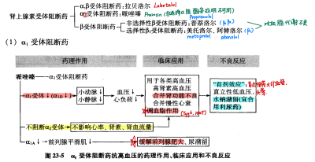
        - 阻断α1→  血管收缩↓ 
        - 非选择性α肾上腺素受体阻断剂  vs 选择性α1 肾上腺素受体阻断剂
          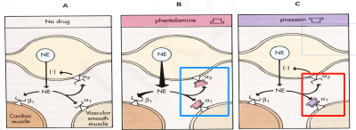
          - 酚妥拉明（ Phentolamine ），  非选择性  α 肾上腺素受体阻断剂，可以 反射性激活交感神经与 RAAS 系统，不良反应多，兴奋心脏、减少肾血流， 长期降压效果差， 不作为常规抗高血压药使用， 仅用于 控制  嗜铬细胞瘤患者  的高血压危象。
          - <u>哌唑嗪（</u>  <u>Prazosin</u>  <u>）</u> 、 特拉唑嗪（Terazosin)、多沙唑嗪（Doxazosin) ，选择性 α1 受体阻断剂，长期用药可引起 水钠潴留（  长期不免激活RAAS  ）  ， 需加服利尿剂； 对血脂无不良影响 
        - 哌唑嗪
          - 机制：选择性阻断交感神经突触后膜、小动脉&静脉的 α1 受体
          - 作用特点
            - ①降低心脏前、后负荷
            - ②不减少肾血流量、GFR；不改变CO、心率及肾素分泌，
            - ③长期使用有利血脂： 可  升高 HDL  ， 降低血浆甘油三酯、总胆固醇 LDL
          - 临床应用
            - 用于<mark style="background-color:#fef3c7;"> 各型高血压 </mark>。重度高血压时合用利尿药、β受体阻断药
            - 可阻断膀胱 <mark style="background-color:#fef3c7;"> 前列腺 </mark> 尿道处 α1 受体，因此 适宜用于 <mark style="background-color:#fef3c7;"> 高血压合并前列腺肥大者 </mark>
            - CHF
          -  ※ 不良反应： “首剂效应” 
            > PPT重点
            - 首剂效应（first-dose phenomenon） ：哌唑嗪首次给药时发生严重的直立性低血压（ orthostatic hypotension） 、晕厥、心悸
              - （哌唑嗪首次给药时阻断交感神经的缩血管效应，扩张容量血管，减少回心血量）
              -  如何避免：  首剂减量为0.5mg、睡前服用 
            - 长期用药可引起 水钠潴留， 需加服利尿剂
              > 哌唑嗪：长期联合利尿剂，重度联合利尿剂
      - ## β受体阻断药：  <u>普萘洛尔、美托洛尔</u> 、阿替洛尔、卡维洛尔
        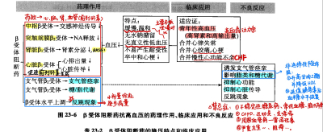
        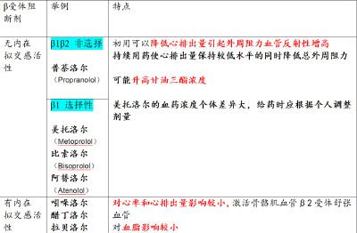
        > 其中阿替洛尔疗效不佳，不能降低死亡率和MACE；
        > 普萘洛尔不会造成直立性低血压
        -  <u>※ 药理机制</u> 
          > ppt重点
          - 1.阻断心脏β1 受体，降低心脏排出量（不是主要作用）
          - 2.阻断肾球旁器β1 受体，减少肾素分泌，抑制 RAS 系统
          - 3.通过血脑屏障， 阻断  中枢β受体  ，降低外周交感神经活性
          - 4. 阻断去甲肾上腺素能神经末梢 外周突触前膜β2  受体， 减少NE的正反馈释放
            > 注 <u>：α2负反馈NE释放，β2正反馈NE释放！</u>
          - 5. 促进 前列环素  PG生成  （注意β2的骨骼肌扩血管作用！） 
        -  <u>※临床应用</u> 
          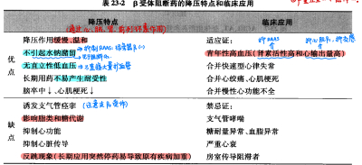
          > ppt重点////特别注意合并心绞痛etc
          - 轻、中、重度高血压，特别是：
            - ❖高血压伴<mark style="background-color:#fef3c7;"> 冠状动脉粥样硬化 </mark>性心脏病、脑血管病变
              > <u>*“洛尔落心脏”；但注意对冠心病的双重性，既可以落心脏，好，又可以促血脂，坏。*</u>
            - ❖年轻患者
            - ❖伴<mark style="background-color:#fef3c7;"> 心绞痛，心肌梗死 </mark>
            - ❖伴<mark style="background-color:#fef3c7;"> 心律失常，心动过速 </mark>，房颤
            - 注意区别： ~~伴稳定性心绞痛首选 CCB~~ 
          - β受体阻断药+利尿药+扩血管药——合用可有效治疗中度/顽固性高血压。
        - 不良反应、禁忌症
          - 急性心衰、房室传导阻滞、心动过缓
            > “落心脏”药物通警
          - 哮喘（可引起支气管收缩)
          - 周围血管疾病，雷诺氏综合征
          - 坏血脂： ↑ TGs and VLDLs, ↓HDL
        - 注意事项：  反跳现象（Withdrawl Syndrome）： 长期使用该类药物后突然停药，原有疾病加重
          - 在停药前应提前两周逐步减量
          - 起效较慢，使用时应从小剂量给药
      - ## α  1  β阻断剂 ： 拉贝洛尔（Labetalol）、卡维地洛（Carvedilol）
        - 拉贝洛尔（Labetalol）
          - β1=β2 ＞α1 
          - 药理作用：降压作用温和，  对心 排出量和心率 无明显影响 
            > 区别与βblocker
          - 临床应用： 各种高血压；高血压急症；静脉注射可治疗高血压危象
          - 不良反应： 无严重不良反应
    - ## 神经节阻断药： 樟磺咪芬（Trimetaphan）美卡拉明（Mecamylamine）潘必定（Pempidine）潘托安 pentolonium
      - 同时阻断交感神经与副交感神经，作用很强 副作用较多 临床少用
      - 药理作用
        - 选择性与神经节细胞  N1 胆碱受体 结合， 阻断神经冲动在神经节传递
        - 阻断交感神经节：动静脉舒张 外周阻力下降 血压降低
        - 阻断副交感神经节：心率下降 视力模糊 口干
      - 临床应用
        - 仅用于<mark style="background-color:#fef3c7;"> 高血压危象、主动脉夹层动脉瘤、外科手术控制血压 </mark>
    - ## 影响去甲肾上腺素能  神经递质  的药物 ：利血平（Reserpine）胍乙啶（Guanethidine）
      - 降血压作用弱 不良反应较多
      - 利血平
        - 降压作用特点：缓慢、温和、持久；
        - 原理：抑制NE合成、再摄取，促使其排出囊泡
        - 不良反应多，现已少用。
      - 胍乙啶
        - 降压作用特点：迅速、强大、持久；
        - 抑制NE释放，耗竭囊泡内递质；
        - 易引起肾、脑血流减少及水钠潴留；
        - 主要用于重症高血压。
  - # 四、钙拮抗药
    > 二氢吡啶类 （Dihydropyridines）：氨氯地平（amlodipine）硝苯地平（nifedipine） nitrendipine 尼群地平、 Lacidipine 拉西地平
    > Felodipine 非洛地平、Nimodipine 尼莫地平Isradipine伊拉地平Nicardipine尼卡地平
    >
    >  非二氢吡啶类 ：地尔硫卓（Diltiazem）维拉帕米（verapamil）
    - 硝苯地平（nifedipine）
      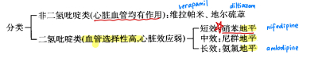
      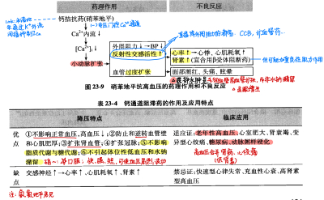
      - 对伴有缺血性心脏病者慎用
    - <u>*氨氯地平（amlodipine）*</u>
      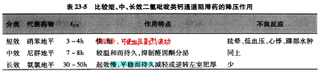
      - ➢ 降压特点
        - 对血管平滑肌选择性更强；
        - 口服吸收率及生物利用度更高；
        - 起效缓和，渐进降压，疗效更持久；
        - 不增加交感活性
      - ➢ 应用：轻中度高血压
  - # 五、扩张血管药
    -  考：硝酸酯类和β受体阻滞药合用 
      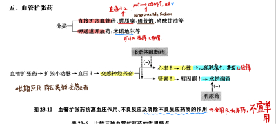
      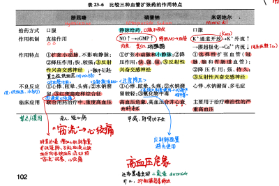
      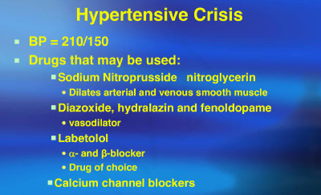
    - <u>*酮色林（Ketanserin）*</u>
      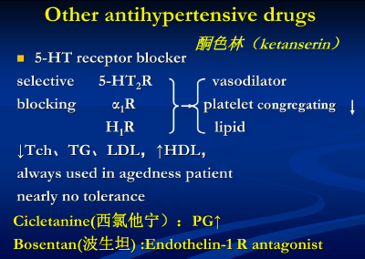
  - # 六、抗高血压药物的应用原则
    
    
    - <mark style="background-color:#fef3c7;">老年高血压</mark>的5个特点是:收缩压升高、脉压差增大、易受体位变动影响、易受药物影响、易发并发症。<mark style="background-color:#fef3c7;"> 适合：CCB </mark>
    - 青年高血压：高肾素活性（水钠潴留）、高心输出量（可用β-R blocker）
- # 治疗充血性心力衰竭的药物（3 ）
  - # 一、 <u>基本病理生理学</u> 及治疗药物分类
    
    
    - ## 慢性心力衰竭（chronic heart failure）： 各种严重心脏病的终末阶段，以 组织 血液 灌流不足 及 体/肺循环  淤血 为主要特征。①是一种 超负荷 心肌病：心肌收缩/舒张功能下降，CO不能满足机体需要；②是心功能异常状态下的病理生理反应。
    - ## <mark style="background-color:#fef3c7;"> 临床表现： 动脉缺血，静脉淤血，心脏充血 </mark>
      > 本质：心肌功能下降 CO不能满足机体需要
    - ## <u>（一）心肌</u>  <u>功能</u>  <u>和</u>  <u>结构</u>  <u>变化</u>
      - ### 心肌功能变化  （起点） 
        - 收缩功能障碍 / HFrEF：心肌收缩力减弱， 射血异常 （LVEF下降）。对 正性肌力药物反应  良好 
          > Heart failure with reduced ejection fraction
        - 舒张功能障碍 / HFpEF：心室 充盈异常 ，舒张受限&不协调，心室顺应性降低，输出量减少、但 射血分数可能正常 ，对于 正性肌力药物反应  较差  。
          > Heart failure with preserved ejection fraction
      - ### 心肌结构变化
        > ——在压力负荷、缺氧下，细胞由内到外，由个体到集体
        - 长期心衰→心肌细胞钙超载→心肌细胞肥大、凋亡、细胞外基质堆积（胶原量增加）→胶原网破坏、心肌组织纤维化→心室重构、肥厚
        - ①心肌细胞——凋亡/坏死；
        - ②细胞外基质ECM——纤维化；
        - ③心肌肥厚与心室重构（对压力负荷、缺氧的适应性反应）
      -  *注：复习可以照着PPT p8来画画图* 
        - here
          
    - ## <u>（二）CHF 时的神经内分泌变化：</u>  <u>早期—长期—物质机制</u> 
      - ### <u>交感神经系统的激活</u>
        - 1. 心输出量下降，反馈性激活交感神经系统，早期代偿
        - 2. 长期激活，心肌后负荷、耗氧量增加，促进心肌肥厚、心律失常
        - 3. 血NE浓度↑ 诱发钙超载→心肌坏死；血管收缩→加重负荷、CHF
          > link:交感的多方面心血管效应
      - ### <u>RAAS激活</u>
        - 1.肾血流量急剧减少，反馈性激活RAAS，早期代偿
        - 2. 长期加重：<mark style="background-color:#fef3c7;"> 围绕 Ang II </mark>
          > 反面物质：缓激肽（被抑制）
          - 血管： 直接收缩血管，增加心脏负荷 ，引发心血管重构；  氧自由基↑，  血管内皮损伤  ↑
          -  促交感  ，多NE： 结合交感神末梢突触前膜AT1受体，促进NE释放，正反馈恶性循环
          - 醛固酮 （水钠容量）：促肾上腺皮质释放 醛固酮，水钠潴留，排钾 
          - 促生长，致肥厚 ：促 生长因子 、ECM合成，引起心肌肥厚
            > 根本上通过AT1受体作用， 更根本上通过Ca2+作用。 Ang II→AT1→IP3-DAG→Ca2+→PKC激活→原癌基因激活
      - ### <u>精氨酸加压素（AVP）、内皮素（ET）、利尿钠肽（NP）增多；NO、</u>  <u>CGRP减少</u> 
        - AVP & ET：经PLC-IP3-DAG通路→增加细胞内Ca2+→强烈缩血管、正性肌力
        - NP：好人，拮抗上述所有，排钠利尿，包括ANP、BNP、CNP。
          -  BNP（脑利尿钠肽）作用最强，是心衰的血浆标记物。 
            - 心肌细胞分泌产生
          - BNP的升高程度与心室扩张和w压力超负荷成正比 ， 以100pg/ml作为分界线判断心衰
    - ## <u>（三）CHF 时心肌肾上腺素 β 受体信号转导的变化</u>
      - 主要目的： 下调β1受体 ，或者不让β1受体引起兴奋。β1受体是GPCR，磷酸化后与G蛋白脱耦联。
      - β1受体下调、与兴奋性Gs脱耦联、GPCR激酶（GRK）活性增加
    - ## <u>（四）治疗药物分类；金三角、新四联——从疾病本质（神经-内分泌）调节入手</u>
      -  记：CHF药——“强心、利尿、扩血管（其它）”  + “  神经内分泌抑制（RAAS、β受体阻断）  药”
      - 金三角：RAAS 抑制药 （ARNI/ARB+醛固酮抑制剂）+ β 受体阻断剂
        > β受体阻断药、醛固酮受体阻断药、ARNI（血管紧张素受体-脑啡肽酶抑制药）或ACEI或ARB（血管紧张素受体阻断药）
        > “金三角”必须与神经内分泌抑制药有关，方可“治本”。
      - 新四联： 金三角+ SGLT-2抑制药 （钠-葡萄糖协同转运蛋白2抑制剂）/ sGC刺激剂 （维立西呱）
  - # 二、强心苷类 （Cardiac Glycosides）
    > 洋地黄毒苷（Digitoxin），长效。  <u>地高辛（Digoxin），中效。</u> 、去乙酰毛花苷（Deslanoside） 、毒毛花苷 K（Strophanthin K）
    - 强心苷防治——高血钙，缺氧，低血镁，低血钾       “搞gay，少养美甲”(高钙，少氧镁钾) 
    - 强心苷均来源于 植物 ；包括： 洋地黄毒苷（Digitoxin）、  <u>地高辛（Digoxin）</u> 、去乙酰毛花苷（Deslanoside）、毒毛花苷G（哇巴因） 、毒毛花苷 K（Strophanthin K）。
    - ## <u>地高辛（Digoxin）</u>
      - ## 机制：  部分  抑制 Na+ -K+ -ATP 酶  （20%-40%）
        - 核心药理机制：细胞内 K+减少而 Na+增多，并通过 Na+-Ca2+交换机制使Ca2+增多
          - ①对 心肌：  升高细胞内 Ca2+  ，增加 Ca2+内流， CICR又使肌浆网释放 Ca2+
          - ②对 颈动脉窦感受器 ： 减少细胞内K+，  解除超极化，增加窦弓反射敏感性
        - 不良反应：抑制能力过强（60-80%）时，引起心肌细胞内  钙超载 ； 低 K+引起心律失常 
        - 继发效应机制
          - 降低耗氧量——CHF背景下，收缩力增加、室壁张力&心室容积降低、负性频率
          - 负性频率——①CO增加反馈引起 迷走神经（+）、交感神经（-） ，②对 颈动脉窦感受器 ： 减少细胞内K+，  解除超极化，增加窦弓反射敏感性 ，③增加心肌对迷走神经调节的敏感性
      - ## <u>药理作用</u>
        -  对心脏高度选择性 
        - ### （1）心肌——正性肌力，负性频率，降低耗氧（Positive Inotropic, Negative chronotropic, reduce oxygen demands）
          > <u>作用机制）；对神经-激素（交感、迷走神经系统）的作用；对心脏电生理特性（自律性、传导速度及有效不应期）的影响，心电图改变特点</u> ，对肾脏的作用。
          - 强心苷对心脏有高度选择性，“有力而敏捷”
          - ①加快心肌纤维缩短速度，但 减少耗氧量  （舒张期相对延长） 
          - ②加强 衰竭 心肌收缩力、 在CHF 患者  增加心排血量 、不变外周阻力；而 在正常人 ， 增加外周阻力 ，不变心排出量。
            - 正常人：交感正常的背景下——强心苷对CO无明显作用，反而明显继发激活交感、收缩血管
            - CHF：交感已在代偿的背景下——负反馈抑制交感、兴奋迷走，从而外周阻力不增加
          - ### 正性肌力
            - 机制： 部分  抑制 Na+ -K+ -ATP 酶  （20%-40%）
            - 核心药理机制：细胞内 K+减少而 Na+增多，并通过 Na+-Ca2+交换机制使Ca2+增多
          - ### 负性频率
            
            - 负性频率——①CO增加反馈引起 迷走神经（+）、交感神经（-） ，②对 颈动脉窦感受器 ： 减少细胞内K+，  解除超极化，增加窦弓反射敏感性 ，③增加心肌对迷走神经调节的敏感性
            - 意义
              - ①心动周期↑，舒张期↑，心室充盈好，增加CO、SV；
              - ②冠脉供血↑（coronary perfusion)；
              - ③心肌获得充分休息，降低CHF心脏耗氧量（但增加正常心脏耗氧量）
          - 降低心肌耗氧
            
            - 多重因素影响心肌耗氧
              
            - 正常人与CHF患者因收缩力（心排血量）的背景差异，导致强心苷增加心收缩力后室壁张力变化不同， 再加上负性频率作用 ，最终心肌耗氧量变化朝向2个不同方向。
        - ### （2）心电：主要考虑 <mark style="background-color:#fef3c7;"> 自律 </mark> 组织 & <mark style="background-color:#fef3c7;"> 传导 </mark> 组织
          
          - <mark style="background-color:#fef3c7;"> 洋地黄化： </mark> T波低平、倒置，ST段鱼钩状 
          - 各部位具体变化
            
            
            
            - 机制
              
              
        - ###  （3）神经内分泌（※重要作用） 
          - 抑制交感，抑制 RAAS
          - 促进迷走，促进ANP
          -  *注意中毒量反而兴奋交感* 
        - ### （4）肾脏：利尿 利钠
          - 利尿：正性肌力后肾血流量增加
          - 利钠：减少对 Na+重吸收，抑制肾小管 Na+-K+-ATP 酶
        - ### （5）血管作用
          - 直接缩血管，但直接间接抑制交感
          - 对CHF患者，直接间接抑制交感＞直接缩血管效应，降低外周阻力
          - 对正常人，增加加外周阻力、升高血压
      - ## 临床应用
        - ###  （1）各种 收缩功能障碍型 CHF  ，尤适用于 房颤或心室率快  的 CHF
          > 联想：正性肌力，负性频率
          > 联想2: 舒张功能障碍的CHF对正性肌力药物作用不敏感
          - 不是高血压、冠心、先心 CHF首选：先用ACEI beta 利尿剂
          -  欠佳：能量代谢功能障碍的CHF。贫血 甲亢 VB 缺乏 
          - 无效：扩张型心肌病（用 Carvedilol），心肌肥厚等舒张型功能障碍
          - 对心肌外机械因素 的CHF不好：二尖瓣狭窄 缩窄性心包炎
        - ### （2）房颤： 兴奋迷走神经、 抑制房室结传导，让多余冲动隐匿于房室结中，不下传至心室 
          > 但并不能终止房颤
        - ### （3）房扑：  不均一地缩短心房不应期，让房扑转为房颤，再抑制房颤 
        - ### （4）阵发性室上性心动过速： 增强迷走神经活性（但因为心肌毒性，现不常用）
      - ## <u>不良反应</u>
        - ###  ※安全范围小。推导毒性： 
          - 过度抑制心肌钠钾泵—钠钙交换—钙超载—心脏毒性
          - 过度反射性激活迷走神经—心动过缓
          - 浓度过高，超越其对心脏的选择性，对不同部位钠钾ATP酶的广泛抑制：胃肠道、中枢
        - ### （1)心脏毒性 （最严重、最危险，各种心律失常）
          - 机制：中毒量过度抑制钠钾泵，为了排出过多的胞内Na+，钠钙交换反向激活，心肌细胞内聚集了平台期入胞的Ca2+，和钠钙交换进入的Ca2+，钙超载——迟后除极——最常引起【室性期前收缩、二联律】。
          -  - 快速型心律失常 
            - 室性早搏、二联律（1/3），室性心动过速甚至室颤
          - -  窦性心动过缓 （＜60次/分）、 房室传导阻滞 
            - 抑制窦房结，降低其自律性。与提高迷走神经兴奋性、高度抑制Na+-K+-ATP酶有关。窦缓是停药指征之一
        - ### （2）胃肠道反应： 厌食 呕吐
          > 恶性反馈，加重强心苷中毒的低钾血症
        - ### （3）中枢神经系统反应 ：眩晕、头痛、视觉障碍（黄视、绿视、复视等，停药指征之一）
        - ### 中毒先兆：  色视障碍、室性期前收缩、窦性过缓 
        - ### 中毒防治
          - 防
            - 严格掌握适应证，注意用量个体化
            - 注意诱发因素，防止 低血钾、低血镁 
          - 治
            - 出现 中毒先兆 
              - 停药
            - 快速型心律失常： 静脉滴注氯化钾、苯妥英钠
              -  补钾 ——快速型心律失常，与强心苷竞争Na+-K+-ATP酶，减少强心苷与酶的结合；
              - 苯妥英钠： 与强心苷竞争结合Na+-K+-ATP酶，恢复酶活性；
                > 苯妥英钠第三次出现：①抗癫痫；②抗心律失常；③解救强心苷中毒
              - 利多卡因 ：室性心动过速或室颤
            -  心动过缓、传导阻滞：  阿托品， (不宜补钾)
            - 极严重中毒： 地高辛抗体Fab片段
      - ### <u>药物相互作用</u>
        
      - ### 给药方法  <u>：维持量法</u> 
        > 联想：强心苷急性升高【浓度】会中毒
        - 经典给药方法：首剂加倍，但易导致强心苷中毒，仅用于急性发作
        - 维持给药方法： 每日给予小剂量维持量至稳定血药浓度
  - # 三、RAAS抑制药：CHF基础，伴缺血、伴肾高
    
    
    
    - ## （一）血管紧张素 I 转化酶抑制药   ACEI   <mark style="background-color:#fef3c7;"> “普利”</mark>
      > 卡托普利 captopril、依那普利 enalapril 、培哚普利、雷米普利、福辛普利
      - ### <u>1. 药理作用（治疗 CHF 的机制）：</u>
        -  ①抑制 ACE 活性（AngI→AngII），考虑  AngII  和  缓激肽  两个抗衡通路 
          - 减少醛固酮释放→减轻水钠潴留
          - 减少 缓激肽 降解→缓激肽产生NO，舒血管、抗平滑肌增生和细胞增殖
            > 这就是为什么ARB不是金三角成员，ARB无法获得缓激肽增加的优点。
        - ②降低 醛固酮 水平
        - ③血流动力学：后负荷降低
          - 降低外周阻力，降低心脏前后负荷，扩张冠脉、 扩张血管、保护心肌 ，缓解急性心梗；增加肾血流量和尿量
        -  ④抑制和逆转心肌肥厚与血管重构 
          - 减轻AngII、ALD的致肥厚作用（AT1→IP3-DAG-Ca2+→PKC→原癌基因）
          - 减少缓激肽降解→NO、PGI2↑—→逆转心肌肥厚
        - 5⃣️降低交感 神经系统活性：对应AngII的促交感作用；上调β受体
          > AngII结合交感前膜AT1受体，促进NE释放，加重心肌负荷和损伤
      - ### <u>2.临床应用：各阶段，尤其左室、收缩功能不全</u>
        
      - ### 3. ACEI的不足
        - ①不良反应： 对缓激肽的相对促进 →咳嗽、血管神经性水肿
        - ②对糜蛋白酶催化AngI生成AngII的途径无效
    - ## （二）血管紧张素 II 受体（AT1）拮抗药    ARB       <mark style="background-color:#fef3c7;">  “沙坦”</mark>
      > 氯沙坦（Losartan）、缬沙坦（Valsartan）及厄贝沙坦（Irbesartan）
      - ### 药理作用
        - 与 ACEI 类似
        - 不影响 缓激肽 途径，不产生血管神经性水肿/咳嗽等副作用
      - ### 临床应用
        - 高肾素活性/AngII 过多引起的心肌肥厚
      - ### 疗效特点
        - 作用于Ang II的受体，而不是AngII生成的途径，同理， *也就在缓激肽生成途径的下游层次* 
        - 弥补 3. ACEI的不足：不良反应↓，其它AngII途径↓，心率无影响、无耐受
        - 只能作为替代方案
    - ## （三）血管紧张素受体-脑啡肽酶抑制药     ARNI
      > 司库必曲、Valsartan
      - 🔺CHF神经内分泌变化：①交感 ②RAAS激活 ③利尿钠肽激活（好）
      - 脑啡肽：降解缓激肽和AngII——单独使用脑啡肽抑制药ARNI会导致AngII积累，必须与ARB合用；不得与ACEI合用，否则缓激肽过度积累。
    - ## （四）醛固酮拮抗剂
      > 螺内酯（spironolactone） 依普利酮（eplerenone）
      -  🔺醛固酮逃逸现象 ： ACEI/ARB 治疗CHF 患者时，患者血中醛固酮浓度升高
      - ### 1. 药理作用：拮抗醛固酮的一系列促CHF恶化效应
        > 醛固酮具有促CHF恶化效应！
        - ①醛固酮引起 心肌间质纤维化、  促生长重构 作用 刺激蛋白质合成
        - ②醛固酮增加 <u>血管平滑肌</u>  细胞Ca2+离子浓度 ，外周阻力↑； <u>心肌细胞</u> 内Ca2+浓度，室性心律失常
        - ③ 血管内皮功能障碍 —— 醛固酮致血栓 
          > PAI-1与醛固酮浓度相平行
        - ④ 水钠潴留 
        - ⑤炎症介质，产生氧自由基
        - ⑥内源性醛固酮激活脑组织受体，中枢性高血压
      - ### 2. 临床应用
        -  CHF  金三角：RAAS 抑制药（ARNI/ARB+醛固酮抑制剂）+ β 受体阻断剂 ；新四联：金三角+ SGLT-2抑制药 （钠-葡萄糖协同转运蛋白2抑制剂）/ sGC刺激剂 （维立西呱）
        - 依普利酮选择性更高，可以避免螺内酯的 性激素相关副作用 
  - # 四、利尿药：容量管理，CHF伴水肿、淤血；不能单用（ACEI）
    
    - ### 药理作用：排Na+
      > 联想thiazides：轻度扩血管+减少容量
      -  ① Na+-Ca2+交换， 降低血管壁 Ca2+含量，降低血管张力（外周阻力）
      - ②水钠排泄， 减少体液量、淤血水肿
    - ### 临床应用： <mark style="background-color:#fef3c7;"> 唯一最能充分控制 CHF 体液潴留的药物 </mark>
      - 仅适用于 有  容量超负荷迹象  （水肿）的 CHF 患者，无该征象时使用  反而激活RAAS加重CHF恶化  。
      -  必须与 ACEI 合用（抑制RAAS通路） ，单用利尿剂会反馈性刺激 RAAS 系统
      - 小剂量辅助给药，合用小剂量地高辛、ACEI和β受体阻断药
    - ### 不良反应
      - 电解质紊乱（低钾血症，利尿药是CHF诱发心律失常的常见原因）；糖代谢紊乱 脂代谢紊乱（噻嗪类利尿药）
  - # 五、其他治疗 CHF 药。
    - ## （一） <u>β 受体阻断药：</u>  <u>美托洛尔</u>  <u>和</u>  <u>卡维地洛</u>  <u>——CHF伴扩张型心肌病</u>
      
      
      > 选择性β1-R阻断剂：美托洛尔、比索洛尔 (bisoprolol)； 非选择性β兼α1-R阻断剂（扩血管）：卡维地洛（carvedilol）、拉贝洛尔(labetalol)
      -  只有3种  β 受体阻断剂能用于治疗  CHF  ： 美托洛尔 比索洛尔  卡维地洛（非选择性兼有血管扩张作用） 
      -  🔺β受体阻断剂治疗CHF机制：见上图，前置知识 
        
        > 书P277图24-2
      - ### 1. 药理作用
        - （1）对心脏“矛盾”影响：短期抑制，长期降心率、延长舒张期、减少心肌耗氧量。
          > 严重收缩障碍无法挺过短期抑制阶段，加重心衰，禁用
        - （2）抑制交感神经过度兴奋， 上调 β 受体 
          - ①防止高浓度NE导致大量Ca2+内流；
          - ② 上调心肌β受体数量： 美托洛尔与受体结合使其处于失活态，抑制受体磷酸化，恢复CHF患者β受体敏感性，使β受体密度上调。 卡维地洛不具有此作用 
        - （3） 抑制 RAAS 系统激活 
          > 概念植入：RAAS与交感相互激活
        - （4）长期效应： 干预心肌重构，抗心律失常  抗心肌缺血
      - ### 2. 临床应用： 适用于 扩张型心肌病为基础的 CHF
        - （1）注意事项：①  小剂量开始 用药；② 长期 用药，慢性效果显著；③联合用药：充分使用地高辛、利尿药、ACEI
        - （2）禁忌症：  支气管哮喘、 心动过缓、房性传导阻滞、低血压
      - ### *卡维地洛*
        - （1）选择性阻断β、α1作用
          - 阻断β：降低钙超载、心肌耗氧量
          -  阻断α1： 扩血管，增加冠脉供血，同时可能反射性兴奋交感神经，使其对静息心率影响小、不影响夜间褪黑素分泌
        - （2） 抗氧化作用  （其它β阻断剂不具有的特点） 
          - 极强的亲脂性，抑制脂质过氧化
        - （3）不具有上调 β 受体作用
    - ## （二）钙拮抗药：只能选长效CCB氨氯地平； 伴冠心病，高血压的心衰
      > 氨氯地平（amlodipine）
      > 警惕短期负性肌力作用过强，反射性激活神经内分泌系统
      - 机制： 扩张外周小动脉；扩张冠脉；缓解钙超载
      -  短效CCB 可使CHF 恶化， 如硝苯地平、维拉帕米、地尔硫䓬等（ 负性肌力、反射性激活神经内分泌系统 ），增加CHF患者的病死率， 不适于CHF治疗  ；
      - 长效CCB如 氨氯地平 ，作用出现缓慢、持久，负性肌力作用弱，治疗时不伴有反射性激活神经内分泌系统的作用，还可逆转心肌肥厚。氨氯地平还有抗动脉粥样硬化、抗TNF-α及IL等作用。
    - ## （三） <u>非强心苷类正性肌力药：PDEI（本质上促进IP3-PKC增加钙内流，因此</u>  <u>短期</u>  <u>使用）；缺血性心衰</u>
      > 米力农（Milrinone），维司力农
      - ### 磷酸二酯酶抑制剂（  Phosphodiesterase Inhibitor, PDEI  ）
        -  正性肌力+扩血管 药物 ，不增加心肌耗氧量 
        - <mark style="background-color:#fef3c7;"> 米力农（Milrinone） </mark> 、 维司力农
        -  抑制PDE  Ⅲ→ cAMP↑——促进 Ca2+通道磷酸化使 Ca2+内流→正性肌力、扩血管→外周阻力↓→心输出量↑
        - 用于心衰 短时间的支持疗法 ，尤其对强心苷、利尿药、扩血管药反应差者，提高运动耐力
        - <mark style="background-color:#fef3c7;"> 严重 CHF 短期静脉给药首选正性肌力药 </mark>
      - *β受体激动药（多巴酚丁胺（dobutamine））*
        - 不作为常规治疗药应用。只用于强心苷治疗效果不佳或禁忌者，适用于伴有心率减慢或有传导阻滞者。
        - 多巴酚丁胺（dobutamine）
        - 主要激动β1受体→心肌收缩力↑→心排出量↑
        - 激动β2受体→扩血管→心脏后负荷↓
        - <mark style="background-color:#fef3c7;"> 短期应用 </mark>有良好的血液动力学效应
    - ## （四）其他治疗 CHF 的血管舒张药：应用根据。常用药物（硝酸甘油、肼曲嗪、硝普钠、哌唑嗪）舒血管效应的特点及临床选用。
      - ## 钙增敏剂（  Calcium Sensitizers  ）
        > 匹莫苯（Pimobendan）硫马唑（Sulmazole）
        - 匹莫苯（  Pimobendan  ）硫马唑（  Sulmazole  ）
        - 增加肌钙蛋白对 Ca2+ 敏感性、 抑制 PDE-III、激活 K+通道
        - 增加收缩力但不增加能量消耗，但有舒张延缓和提高舒张期张力等副作用
      - ## 扩血管药（Vasodilators）——对正性肌力药物，利尿药无效的顽固性心衰
        - 主要用于 <mark style="background-color:#fef3c7;"> 对正性肌力药物，利尿药无效的顽固性心衰病人。 </mark>
        - 据病情选药。久用易耐受，多数不降低病死率。
          - 前负荷升高，肺淤血明显 ——扩张静脉的硝酸酯类
          - 后负荷升高，外周阻力升高 ——扩张动脉的肼苯达嗪
          - 前后负荷均升高 ——扩张a&v的硝普钠、哌唑嗪
  - ## 复习思考题
    > 感觉大题考点在于【强心苷】和【CHF病生、用药总览】。
    - 1．治疗慢性心功能不全的药物有几类？主要代表药是什么？
    - 2．试述强心苷中毒的原理、表现和防治。
    - 3．强心苷治疗充血性心力衰竭的药理学基础。
      - CHF定义、基本病理生理学
      - 强心苷基本机制
      - 强心苷药理作用
    - 4．试述强心苷治疗心房纤颤和心房扑动的药理依据。
      - 微观机制
      - 心肌作用：注意抑制交感和兴奋迷走
      - 心电作用：聚焦房室结区抑制；房扑先转房颤
    - 5. 简述强心苷正性肌力作用的机理。
      - （1）心肌——正性肌力，负性频率，降低耗氧（Positive Inotropic, Negative chronotropic, reduce oxygen demands）
      - 机制： 部分  抑制 Na+ -K+ -ATP 酶  （20%-40%） ——作用与不良就在程度差异 
    - 6. 试述强心苷的药理作用
      - 药理作用
    - 7.简述血管紧张素转化酶抑制药的药理作用。
      - 1. 药理作用（治疗 CHF 的机制）：
- # 抗心绞痛药（2 ）
  > 还没看PPT和教材，妈的学的稀碎
  - # 一、冠心病基本情况
    - ## 定义
      
    - ## 病理生理学
      
    - ## 临床分型
      
    - ## 解剖学
      
    - ## 补充：冠脉窃血
      - 冠脉狭窄引起损伤区组织释放舒血管物质，使局部血管代偿性扩张，以增加损伤区的血流灌注。但如果狭窄超过血管横截面的90%。其扩张的代偿机制将不足以弥补血流量的下降。如果同一冠脉有两条分支，一条为正常血管，另一条是严重狭窄血管，则内源性释放的舒血管介质将首先作用于正常血管，因为狭窄血管已经达到其扩张的极限。此现象称“冠脉窃血”，即正常组织的冠脉血流相对增加，而狭窄区域的血流反而减少。
      - 有冠脉窃血特点的药物
        - 肼苯哒嗪（hydralazine）
        - 硝普钠
        - 腺苷
        - PDE5抑制剂
    - ## 抗心绞痛药的作用机制
      
      -  针对疾病：增加供氧、减少心肌耗氧量 
      - 1. 舒张血管、降低前后负荷、降低心率—→耗氧↓（硝酸酯类、β-受体阻断剂、钙拮抗剂）
      - 2. 舒张冠脉，促进侧支循环/血流重分布—→冠脉供血↑，供氧↑ （硝酸酯类）
      - 3. 抑制血小板聚集和血栓形成—→对抗动脉粥样硬化
      - 4. 保护心肌细胞 （钙拮抗剂）
    - ## 抗心绞痛药概述
      
  - # 二、 <u>硝酸酯、亚硝酸类</u>  <u>（Nitrate Esters）</u>
    > 硝酸甘油（nitroglycerin） 戊四硝酯（pentaerithrityl tetranitrate） 硝酸异山梨酯（Isosorbide Dinitrate） 单硝酸异山梨酯（Isosorbide Mononitrate）
    - ## 体内过程
      - - 舌下含服：通过口腔黏膜吸收，生物利用度可达80%（口服8%），且可避免“首过效应”
      - - 不同类型心绞痛选用不同制剂
    - ## 药理机制
      
      
    - ## 药理作用、临床应用、不良反应
      
    - ## 禁忌症
      - 颅脑外伤、颅内出血、青光眼患者慎用
      - 严重贫血 低血压 低血容量
    - ## *药物互作*
      - 与抗高血压药物合用时应适当减量（注意可以搭配使用，比如和β blockers，这样还可以减少耐受）
      - 与肝素合用时会减弱肝素抗凝作用——应加大肝素用量
      - 与西地那非合用：易诱发心力衰竭、猝死
  - # 三、 <u>β–受体阻断剂（重在作用机制）</u> 普萘洛尔和硝酸甘油联合应用治疗心绞痛的药理基础
    > 普萘洛尔（propranolol）美托洛尔（metoprolol）阿替洛尔（atenolol）
    - ## 药理作用机制
      - 心绞痛发作时交感神经兴奋，心脏局部和血液中儿茶酚胺水平升高
        - 增强心肌收缩力、心率加快、血管收缩，冠状动脉血流下降， 加重心肌缺氧 
        -  游离脂肪酸增加  游离脂肪酸的代谢消耗大量的氧，加重心肌缺血缺氧的程度
      - β–受体阻断剂抗心绞痛
        
    - 禁忌症
      - 哮喘
      - 变异性心绞痛 （ 加重冠状动脉痉挛 加重缺血）
      - 心动过缓 低血压 严重心功能不全
      - 慎用：糖尿病/血糖不稳定
        - 抑制胰高血糖素升血糖作用并使胰岛素降血糖作用增强，可能会掩盖低血糖的症状
  - # 四． <u>钙拮抗药</u>
    - ## <u>抗心绞痛作用机制</u>  及临床应用
      
    - 钙通道阻滞剂对支气管有适度扩张作用；对血管解痉挛有明显作用
    - 对<mark style="background-color:#fef3c7;"> 冠脉痉挛所致的变异性心绞痛 </mark>最有效（强大的扩张冠状动脉作用），也用于稳定型及不稳定型心绞痛；
    - ☺ 对伴有哮喘和阻塞性肺病的患者更合适（松弛支气管平滑肌）；
    - ☺ （硝苯地平）较少诱发心力衰竭；
    - ☺ 对心肌缺血伴有外周血管痉挛性疾病的患者适用。
  - # 五、其他药物
    
    
    - 尼可地尔（  Nicorandil  ）
      - ATP 敏感性 K+通道激活药物 可以发挥硝酸酯样作用
      - 较强扩张冠状动脉的输送血管 持续时间较长 同时对阻力血管影响弱
      - 不易产生耐受 多用于变异性 慢性稳定性心绞痛
  - # 习题
    - 思考题
      - 硝酸甘油抗心绞痛机制是什么?它有哪些不良反应?如何避免其耐受性的产生?
      -  β受体阻断药抗  心绞痛  机制  是什么?
      -  硝酸甘油与普萘洛尔合用  于治疗心绞痛有何优点?为什么?（从其  作用原理  解释：合用  疗效↑  ，  不良影响互相抵销  ）
    - 变异性心绞痛不建议用β受体阻断药
    - β受体阻断药不建议与维拉帕米合用。合用的话应该用一个对心脏的一个对血管的，两个都对心脏会强烈抑心。
    - 硝酸甘油的禁忌症是(ABCD)(多选)
      - A. 严重青光眼
      - B.严重贫血
      - C.使用西地那非
      - D.严重低血压
    - The therapeutic action of β-adrenergic receptor blockers such as propranolol in angina pectoris is believed to be  primarily  the result of
      - a. Reduced production of catecholamines
      - b. Dilation of the coronary vasculature
      - <mark style="background-color:#fef3c7;">c.Decreased requirement for myocardial oxygen</mark>
      - d. Increased peripheral resistance
      - e. Increased sensitivity to catecholamines
    - 普萘洛尔(心得安)对下列何种类型的心绞痛相对较好
      > 考察变异型、稳定型和不稳定型心绞痛的区别
      - <mark style="background-color:#fef3c7;">A.活动时发生的心绞痛</mark>
      - B.活动、静息均可发生的心绞痛
      - C.静息时发生的心绞痛
      - D.支气管哮喘者并发心绞痛
      - E.以上均可
- # 抗动脉粥样硬化药（1.5）
  - # 一、动脉粥样硬化疾病，高脂血症，血脂的来龙去脉及推测降脂药物的可能作用靶点
    - ## 1. 病理生理学机制&药物作用
      
      
      
      - 动脉粥样硬化的致病机制中，最为关键的一个致病物质是 “LDL-C”，即“由低密度脂蛋白（LDL）所运载的胆固醇”——对应：【调血脂药】降低机体内的LDL及胆固醇水平
      - 【抗氧化剂】 阻止“LDL-C”转变为对AS致病作用更强的“氧化型LDL-C”，从而 减慢进展
      - 各种非特异性因素而导致的血管内皮损伤，其实是动脉粥样硬化的重要初始原因—— 【保护动脉内皮药】 中和各种血管活性物质，减少动脉内皮受到的损伤。有效减慢进展
    - ## 2. 对Apo（载脂蛋白）和脂代谢在AS的理解
      - LDL、HDL主要运载胆固醇；VLDL、CM主要运载甘油三酯
      - LDL和HDL的不同之处—— 从运载的方向上看
        - HDL “将外周血液中的胆固醇重新带回肝脏”， 好
        - LDL“将肝脏中的胆固醇向外运载到血液中”，坏
      - 胆固醇的分布：  肝脏和血液的平衡 &  LDL受体变化 
        - 当机体内胆固醇水平下降，肝脏会代偿性的把自己身上表达的“LDL受体”的水平以及活性增强，把外周血中循环的胆固醇向肝脏中集中，从而代偿由于HMG-CoA还原酶被抑制导致的肝脏中胆固醇水平的下降
      -  胆固醇 对粥样硬化促进作用显著大于甘油三酯—— 抗AS  药物应主要针对LDL和HDL
        - 不同类别的调脂药物对甘油三酯和胆固醇的降低（调控）作用具有明显的选择性
        - →他汀类药物（HMG-CoA还原酶抑制剂）、胆固醇吸收抑制剂： 对胆固醇的降低效果远强于对甘油三酯的降低效果
        - →贝特类药物、烟酸： 对甘油三酯的降低作用远强于对胆固醇的降低作用。
        - ——所以，从药物种类的角度上说，如果我们的目的是抗动脉粥样硬化，则我们应当多用他汀类药物，而不是贝特类药物。
        - 虽然“贝特”类药物对治疗动脉粥样硬化的药效比较有限，但是，它可以治疗“高甘油三酯的高脂血症”
      - ## 3. 药物选择
        
        
  - # <u>二、洛伐他汀、阿托伐他汀、普伐他汀、氟伐他汀</u>
    > 洛伐他汀 （Lovastatin）  辛伐他汀 （Simvastatin）  氟伐他汀 （Fluvastatin）  普伐他汀 （Pravastatin）
    - ## 药动学 & 分类
      
      - 体内过程： 洛伐他汀无活性，需口服后代谢为有活性物质；氟伐他汀有活性，口服后基本完全吸收
    - ## 药理机制
      -  HMG-CoA还原酶是胆固醇合成的限速酶 。他汀类药物和代谢物的结构与HMG-CoA类似， 竞争性抑制HMG-CoA还原酶 活性， 阻止肝脏内源性胆固醇合成 。
      - 代偿性 增加肝细胞膜上LDL受体 的合成， LDL摄取增加 。
      - 大剂量使用可降低血浆甘油三酯 的水平。
    - ## 临床应用
      - 动脉粥样硬化患者心肌梗死和脑卒中的预防
      - 高胆固醇血症
    - ## 不良反应
      - 较少，部分出现胃肠道反应、失眠、皮疹
      - 严重患者出现 横纹肌溶解症  血管神经性水肿 易发生于 甲减 患者
      - 肝脏疾病、  孕妇、哺乳期妇女慎用（阻碍胎儿脂质合成发育） 
  - # 三、其它
    
- Questions（搞求不懂
  - 1. PPT红框里的是啥意思？
    
  - 2. 利多卡因抑制Na通道，既可能缩短复极化过程，又有抑制延迟后除极化（DAD）作用，为何整体效应体现为可以抑制室性心律失常？
    > 延迟后除极化 （Delayed Afterdepolarization, DAD）是一种在心肌细胞动作电位结束后在复极化阶段形成的的自发性膜电位波动。当这种波动达到阈值时，会触发新的动作电位，从而导致心律失常。DAD 的发生往往和 钙离子超载 相关，因此常见于高钙状态或使用强心苷药物（如地高辛）时。
    >
    > 虽然缩短不应期可能会让心肌更易响应快速电刺激，但利多卡因通过 选择性阻滞异常心肌细胞的钠通道 和 减少触发性活动 ，可以有效抑制室性心动过速的发生。
    >  选择性作用于异常组织 ：利多卡因的钠通道阻滞作用对正常心肌细胞影响较小，但对 缺血性、损伤性或异常兴奋的心肌细胞 影响更大。这些异常组织通常有延迟后除极化现象，容易产生异位节律。利多卡因优先作用在这些部位，抑制其异常放电，防止异位电活动的产生和传导。
    > 尽管缩短不应期在理论上可能提高心肌细胞的反应频率，但在缺血性心肌细胞中，利多卡因的钠通道阻滞作用更有助于减少 触发后除极化 （如DAD）。
    >  仅缩短复极晚期 ：利多卡因主要缩短动作电位的 晚期复极化 ，即动作电位接近完成时的阶段，不显著影响整个心肌的有效不应期。这样，利多卡因能在抑制异常放电的同时，不显著增加心律失常的风险。
  - 3.为什么又说利多卡因可以减小4期去极化，又说利多卡因对心房肌作用差？利多卡因作用差的原因为什么不是 ~~心房肌去极化主要靠钙离子内流~~ ，而是“心房肌APD短，Na通道失活时间短”？
    - 答：不要把心房肌和窦房结记混了。
  - 4. 为什么氟卡尼 致心律失常发生率较高 ，可致室性心动过速，室颤，诱发折返性心律失常，长Q-T综合征？
  - 5. 为什么胺碘酮作为钾通道阻滞药还是非竞争性α、β受体阻断剂？它的扩血管作用和阻滞钾通道无关吧？
- # 思考题（ppt后头
  - 抗高血压药
    - 1. 抗高血压药物的分类可分为哪几类？各举一代表药。
    - 2. 简述  氢氯噻嗪  、  普萘洛尔  、  硝苯地平  、  ACEI  、  哌唑嗪  、  可乐定  的抗高血压作用机制及临床应用。
    - 3. 为什么肼屈嗪等血管扩张药很少单用于抗高血压病而需与利尿药及β-受体阻断药合用？
  - 抗CHF药
    - ## 复习思考题
      > 感觉大题考点在于【强心苷】和【CHF病生、用药总览】。
      - 1．治疗慢性心功能不全的药物有几类？主要代表药是什么？
      - 2．试述强心苷中毒的原理、表现和防治。
      - 3．强心苷治疗充血性心力衰竭的药理学基础。
        - CHF定义、基本病理生理学
        - 强心苷基本机制
        - 强心苷药理作用
      - 4．试述强心苷治疗心房纤颤和心房扑动的药理依据。
        - 微观机制
        - 心肌作用：注意抑制交感和兴奋迷走
        - 心电作用：聚焦房室结区抑制；房扑先转房颤
      - 5. 简述强心苷正性肌力作用的机理。
        - （1）心肌——正性肌力，负性频率，降低耗氧（Positive Inotropic, Negative chronotropic, reduce oxygen demands）
        - 机制： 部分  抑制 Na+ -K+ -ATP 酶  （20%-40%） ——作用与不良就在程度差异 
      - 6. 试述强心苷的药理作用
        - 药理作用
      - 7.简述血管紧张素转化酶抑制药的药理作用。
        - 1. 药理作用（治疗 CHF 的机制）：
