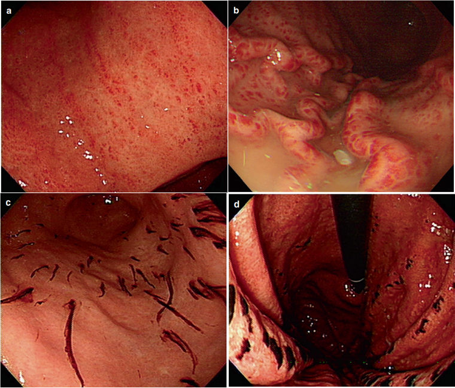

---
tags:
  - diagnosis
  - pathology
---
药物（NSAIDs/阿司匹林）+ 饮酒 + 应激
可完全修复
呕血可为<mark style="background-color: #1A4F10; color: white">棕褐色或咖啡样</mark>物质
[Open: Pasted image 20260914174154.png](attachments/38a570e190864197b8bda6d889918813_MD5.jpg)

