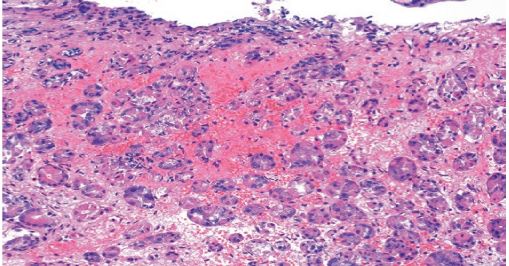
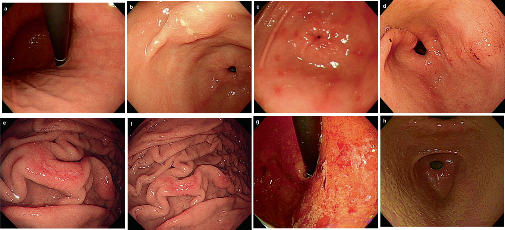

是指由多种病因引起的急性胃黏膜炎症
急性发病，常表现为上腹部症状
因这类炎症多由药物、急性应激造成，故亦称急性胃黏膜损害

若主要病损是糜烂和出血，则称之为急性糜烂出血性胃炎：
- 急性胃黏膜病变（AGML）/[[急性糜烂出血性胃炎]]
- [[Cushing溃疡]]
#### 病因
###### 一、理化因素
药物[NSAIDs](NSAIDs.md)最常见，其他如肾上腺糖皮质激素、某些抗生素及抗癌药物
乙醇破坏黏膜屏障，引起上皮细胞损害、黏膜内出血和水肿
胆汁反流胆盐、磷脂酶A、胰酶破坏胃黏膜，产生多发性糜烂
物理因素：辛辣及粗糙食物对胃黏膜造成机械性损伤
###### 二、应激
急性应激可由严重的脏器疾病、大手术、大面积[烧伤](烧伤.md)、[休克](休克.md)、颅脑外伤、颅内疾病、精神心身因素等引起
发病机制：
- 胃黏膜缺血
- H+反弥散
###### 三、急性感染及病原体毒素
某些细菌：常见有葡萄球菌、α-链球菌、大肠杆菌、嗜盐杆菌等。
[[幽门螺杆菌]]（Helicobacter pylori，Hp）是主要因素
病毒：如流感病毒和肠道病毒等
细菌毒素：以金葡菌毒素常见
###### 四、血管因素 
 血管闭塞所致，常见于：   
 老年的[动脉粥样硬化](动脉粥样硬化.md)患者、腹腔动脉栓塞治疗后

#### 病理
内镜下可见胃黏膜充血、水肿、糜烂、出血等改变。甚至一过性的浅表溃疡形成
糜烂：黏膜破损不超过黏膜肌层
出血：黏膜下或黏膜内出血外渗，而黏膜上皮无破坏
黏膜固有层<mark style="background-color: #1A4F10; color: white">中性粒细胞和单个核细胞</mark>浸润，以中性粒细胞为主，可有上皮细胞丧失，并见血液渗出，腺体歪曲
[Open: Pasted image 20260914173744.png](attachments/07254c5592f2f3165361fdad1e528457_MD5.jpg)

#### 临床表现
症状：
- 轻者多无症状，少数患者表现为上腹不适、[疼痛](疼痛.md)、厌食、恶心、[呕吐](呕吐.md)等，伴有肠炎者可腹泻，呈水样便
- 病程自限，数天内症状消失
- 如为急性胃黏膜病变，可表现为上消化道出血，出血常为间歇性（占上消化道出血病因的10％～25％）
体征：
- 上腹部或脐周压痛，肠鸣音亢进
#### 诊断
诊断：依靠病史及临床表现，内镜检查确诊
内镜下表现：弥漫分布的多发性糜烂、出血灶和浅表溃疡形成
[Open: Pasted image 20260914174126.png](attachments/d5315d12d348b98b26fc9efe87097d84_MD5.jpg)

#### 治疗
病因治疗：去除病因，停止一切对胃有刺激的饮食和药物，对严重原发病预防性使用抑酸药
暂时禁食或流质饮食，多饮水
对症处理：
- 解痉—[[Atropine]]、[[Probantin]]、[[654-2]]
- 止吐—[[胃复安]]10mg im或[[吗丁啉]]10mg tid
- 抑酸—H2受体阻滞剂或[[PPI]]
- 纠正水、电解质失衡，呕吐、腹泻严重者应输液
- 存在上消化道出血者同时予以止血等治疗
#### 预防： 
停用不必要的NSAIDs；严重创伤、烧伤、大手术、重要器官衰竭及需长期服用阿司匹林/氯吡格雷等病人，预防性使用PPI/H2RA; 尽量选用COX-2抑制剂，减少对COX-1的抑制；避免酗酒等。

