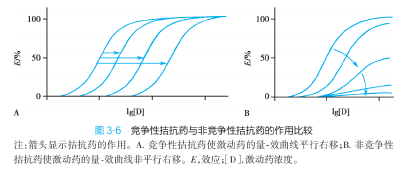

---
aliases:
  - antagonist
---
有较强亲和力（ 🔺配体位点or其它位点 ）、无内在活性。拮抗药本身不能产生负性作用，但因为可以占据受体，表现为拮抗激动药。

分类
- 竞争  & 非竞争
- i. 竞争性拮抗药 （competitive antagonist）可以与激动药竞争相同受体，并与受体 可逆性结合 ，但并 不降低内在活性也不改变最大效能 ；可以使量效 曲线 右移。
- ii.非竞争性拮抗药（ noncompetitive antagonist ） 与受体结合非常牢固、 不可逆 、非竞争性；可以 降低激动药的亲和力与内在活性 ，使得药物的 最大效能降低 ；不仅使曲线右移，也使 曲线 下移。

- 拮抗 & 少数拮抗
- i. 大部分拮抗药：α=0
- ii. 少数拮抗药α≠0， 但是具有 很小的内在活性， 因此 表现为主要的拮抗作用和少量的激动作用。 因此需要注意， 1＞α＞0的药物既有可能是部分激动药，也有可能是少数拮抗药。 其具体表现为，在 剂量较低时呈现出对受体的激动作用，但是当大剂量使用或者与完全激动药联合使用时，则会表现出明显的拮抗作用。
- eg    oxprenolol 

---
  竞争性 VS 非竞争性拮抗剂 

- 激动剂 + 竞争性拮抗剂 —— 影响亲和力（ 效价下降 ），不影响内在活性（ 效能不变 ），量 -效曲线 平行右移 ；激动剂增多，可以减轻抑制。
> 与激动剂竞争同一结合位点
- 激动剂 + 非竞争性拮抗剂 —— 影响亲和力（ 效价下降 ）、内在活性（ 效能变低 ），量 -效曲线 不平行 右移、下移。
> 与位点以外的基团结合受体变构影响