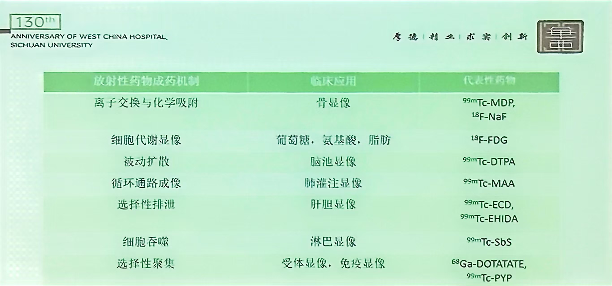

---
tags:
  - nuclear-medicine
---
#### 成药机制
[Open: a157816939f97973978df73bc8e3b61e.jpg](attachments/255e9aa806fd34c04c00f22625cf6d1f_MD5.jpg)

###### 离子交换与化学吸附

###### 细胞代谢显像
肿瘤糖酵解与Warbug Effect
大脑唯一可以利用的能源是葡萄糖，所以FDG显像时大脑会很亮
此外心脏会亮，因血流丰沛
###### 被动扩散显像
