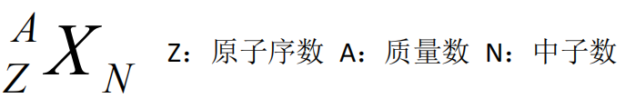
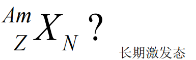

---
tags:
  - nuclear-medicine
aliases:
  - radiation decay
---
核素：质子数同、中子数同、核能态同的一类原子
同质异能素：质子数同、中子数同、核能态不同的一类核素
同位素：质子数同，中子数不同的核素
### 放射性核素
原子核处于不稳定状态，需通过核内结构或能级调整才能趋于稳定的核素称为放射性核素(radionuclide)。
[318Open: Pasted image 20260916091703.png](attachments/8627a731405c873180914bafda3a9896_MD5.jpg)
  
[Open: Pasted image 20260916091722.png](attachments/0900edbc108807442c932227b3445f18_MD5.jpg)

### 放射性衰变
放射性核素的原子发生核内结构或能级调整，自发地释放出一种或一种以上的射线并转化为另一种核素的原子核的过程称为放射性衰变(radiation decay)。
放射性衰变的定义主要要抓住两方面：
- ①自发地释放出一种或一种以上的射线；
- ②转化为另一种核素的原子核。
#### 类型 
以衰变时放出的射线来分类，要掌握各种射线的本质、是否带电荷、在物质中的穿透能力以及对生物组织的局部作用能力等。
#### ①α衰变：
放射性核衰变时释放出α射线的衰变称为α衰变(alpha decay)
α射线实质上是由氦核组成(He,即含2个质子和2个中子)
α粒子的质量大、带电荷，故射程短、穿透力弱、能量单一，对开展体内恶性组织的放射性<mark style="background-color: #1A4F10; color: white">治疗</mark>具有潜在的优势。
#### ②β衰变：
发生原因——母核中子或质子过多
β射线的本质是高速运动的电子流
原子核释放出β射线而发生的衰变称为β衰变 (beta decay)
β衰变放射出的β射线 (beta ray) 分为β和β+射线
- β粒子穿透力弱 ，射程仅为厘米水平 ，可用于治疗
> 如131I治疗甲状腺疾病。
- β+衰变为 PET 基础
#### ③ 电子俘获
原子核俘获核外的轨道电子，使核内一个质子转变成一个中子和放出一个中微子的过程。
#### ④ γ衰变：
发生原因——原子核能量态高，从高能态向低能态跃迁
γ衰变(gamma decay)是原子核从激发态回复到基态时，以发射γ光子形式释放过剩的能量。γ射线的本质是中性的光子流，不带电荷，运动速度快(等于光速),电离能力很小，穿透力强。
γ射线是高能量的电磁辐射—— γ光子