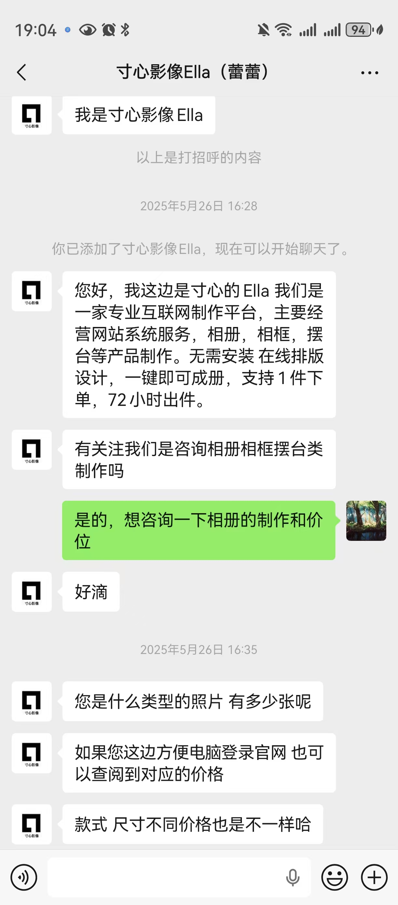

---
tags:
  - idea
---
[Open: Pasted image 20260816192354.png](attachments/da2d6964137cf555a8569411f124a915_MD5.jpg)

### 1. poster
有些麻烦
### 2. 精装布面年鉴相册：
把聚会、获奖瞬间、毕业等照片，按时间线排版，配上趣味旁白，印成硬壳画册。
可用“寸心影像”
需要：照片、排版人、文案
[Open: 57d7d26e850fb91ea4cf121ec4281e84.jpg](attachments/f8b883e1242e4f57144ec0e9c1848019_MD5.jpg)

### 3. 定制黑胶唱片执行方案
制作周期：<mark style="background-color: #1A4F10; color: white">1周</mark>（已确认）
音频内容
· 0-30秒：实验室环境音（仪器声/组会笑声）
· 每人10-20秒想说的话（手机录干声）
· 结尾：合声——教师节快乐

· 封面：学术高光合影
· 封底：趣味花絮照

· 老师若无唱机，配套买入门级手提箱唱机，一起包进礼盒
需要：每人录音、音频剪辑
时间安排
· 本周：收干声、设计封面
· 8.25前：交音频+封面图给商家
· 制作周：等快递，策划送礼当天播放仪式
[Open: b4c640167e3d7a91279aebc9928c9730.jpg](attachments/1510b6f606ad247f1cb7f08f11fc4deb_MD5.jpg)

[Open: a2c8fec2ae2d144dba6253d477d7743f.jpg](attachments/991bba7d8cd71a69af7ac15086c5d337_MD5.jpg)
