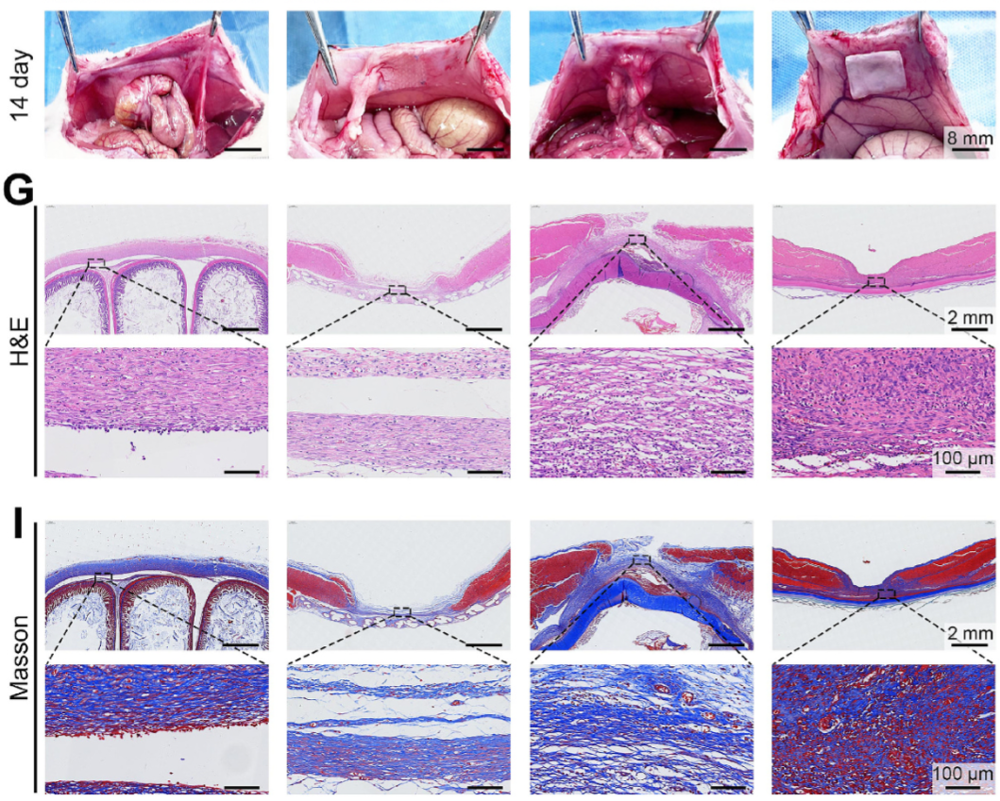

#### collagen增加
有胶原沉积增加的都是促愈合相关的文章
是因为<mark style="background-color: #705A16; color: white">腹壁缺损模型</mark>吗？但防粘连材料大都用的这个模型，不论是有没有促愈合功能的。

> [!PDF|yellow] [Janus网片, p.230](Janus网片.pdf#page=13&selection=0,11,0,60&color=yellow)
> > the PHAP side connecting compactly with the wound

> [!PDF|blueee] [Janus网片, p.232](Janus网片.pdf#page=15&selection=55,0,58,25&color=blueee)
> > The results showed that the Janus PHAP/S mesh group had the <mark style="background-color: #1A4F10; color: white">most obvious</mark> collagen deposition phenomenon, and the collagen was arranged in an orderly manner, demonstrating its superior pro-healing property than other group

> [!PDF|blueee] [EGCG_Nrf2, p.11](EGCG_Nrf2.pdf#page=11&selection=258,14,276,1&color=blueee)
> > the levels of collagen types I and III in the HP and EGCG groups were<mark style="background-color: #1A4F10; color: white"> lower than those in the HPE group but higher than those in the control group</mark> (Fig. 5D-E). This trend was consistent with the results observed in Masson's staining. 
> 
> 从这篇文章（https://doi.org/10.1016/j.cej.2026.174792） 可以看到，EGCG可以有促愈合的功能。我们的材料里也用的EGCG

> [!PDF|blueee] [EGCG_Nrf2, p.11](EGCG_Nrf2.pdf#page=11&selection=282,18,283,20&color=blueee)
> > collagen fibers in the HPE group were more orderly and densely arranged
> 
> 明确说了<mark style="background-color: #1A4F10; color: white">实验组</mark>（E代表EGCG）的胶原沉积<mark style="background-color: #1A4F10; color: white">更</mark>有序和<mark style="background-color: #1A4F10; color: white">密集</mark>

> [!PDF|green] [EGCG_Nrf2, p.17](EGCG_Nrf2.pdf#page=17&selection=0,48,8,53&color=green)
> > the hydrogel induces macrophage polarization toward the M2 phenotype, which reduces the secretion of inflammatory cytokines (IL-1β and TNF-α) and increases the release of anti-inflammatory factors (IL-4 and IL-10)
> 
> 但仍然抗炎

> [!PDF|blueee] [EGCG_Nrf2, p.15](EGCG_Nrf2.pdf#page=15&selection=213,10,220,31&color=blueee)
> >  including IL-1β, TNF-α, IL-4, TGF-β, CD68, iNOS, and CD206 were assessed at the wound site

> [!PDF|yellow] [EGCG_Nrf2, p.11](EGCG_Nrf2.pdf#page=11&selection=428,13,433,17&color=yellow)
> > sustained EGCG release from the HPE hydrogel significantly enhanced wound angiogenesis. To further assess pro-angiogenic activity, IHC/IF staining was conducted for vascular endothelial growth factor A (VEGFA),
> 
> 促愈合叙述

> [!PDF|blueee] [A Bioinspired Defect-Tolerant Hydrogel, p.11](A%20Bioinspired%20Defect-Tolerant%20Hydrogel.pdf#page=11&selection=177,46,196,50&color=blueee)
> > how that <mark style="background-color: #1A4F10; color: white">collagen expression levels in the BFT patch group were significantly higher</mark> than in the other groups, highlighting its distinctive role in promoting tissue regeneration.

> [!PDF|yellow] [Advanced postoperative tissue antiadhesive membranes enabled with electrospun nanofibers, p.1650](Advanced%20postoperative%20tissue%20antiadhesive%20membranes%20enabled%20with%20electrospun%20nanofibers.pdf#page=8&selection=3,28,6,36&color=yellow)
> > Moreover, the porous structure of the nanofibers allows signaling molecules and nutrients to be exchanged through the membrane, <mark style="background-color: #1A4F10; color: white">increasing collagen levels and stimulating tendon regeneration</mark>.

---

> [!PDF|green] [An anti-inflammatory chondroitin sulfate-poly, p.6578](An%20anti-inflammatory%20chondroitin%20sulfate-poly.pdf#page=6&selection=63,59,66,38&color=green)
> > In contrast, there were less adhesion in the PLGA/CS9010 and PLGA/CS8020 groups, and only a minimal amount of collagen tissues was observed (Fig. 5b and c). 
> 
> 另一篇文章，实验组胶原沉积是更少的，也是用的腹壁缺损模型

---
> [!PDF|green] [Robust adhesive Janus hydrogel reinforced by topological entanglement for -Fan Hongsong, p.10](Robust%20adhesive%20Janus%20hydrogel%20reinforced%20by%20topological%20entanglement%20for%20-Fan%20Hongsong.pdf#page=10&selection=216,0,216,56&color=green)
> > The pro-healing capacity of the Janus BGMA/BPEG hydrogel
> 
> 也是有促愈合

> [!PDF|green] [Robust adhesive Janus hydrogel reinforced by topological entanglement for -Fan Hongsong, p.10](Robust%20adhesive%20Janus%20hydrogel%20reinforced%20by%20topological%20entanglement%20for%20-Fan%20Hongsong.pdf#page=10&selection=244,14,247,61&color=green)
> > promoted the neotissue thickness and collagen deposition compared with that the control (3.1-fold higher and 1.6-fold higher, respectively) and PP mesh group (3.0-fold higher and 1.4-fold higher, respectively), demonstrating rapid and high-quality healing. 
> 
> [Open: Pasted image 20260929114221.png](attachments/9f52b9695e3f39dbd7bca9c73442838d_MD5.jpg)

---
#### collagen减少
> [!PDF|yellow] [Endogenous stimulation-driven Janus mesh with antibacterial, p.11](Endogenous%20stimulation-driven%20Janus%20mesh%20with%20antibacterial.pdf#page=11&selection=49,5,53,67&color=yellow)
> > In Masson staining images (Fig. 7e), abundant collagen fiber deposition formed by the proliferation of fibroblasts was present in the PP group, leading to the formation of adhesions [9].

---
#### 推导
要是有EGCG抗氧化，促愈合的逻辑——
与L929划痕实验抗迁移是否矛盾？
maybe:
- → 抑制L929成纤维细胞的自由迁移（划痕实验：抗迁移） → 抑制成纤维细胞向周围组织浸润（体内：抗粘连） 
- → 但在腹壁缺损部位，材料允许成纤维细胞在张力引导（是腹壁缺损常见理论）下进行定向修复 → 最终形成更多、更有序的平行胶原沉积（Masson：促修复性胶原沉积）