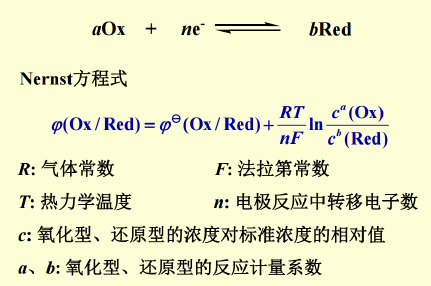

- 原电池与电子电位
  - 氧化值
  - 电极
    - 气体电极
    - 氧化还原电极
    - 金属-金属离子电极
    - 金属-金属难溶盐-阴离子电极
  - 电池电动势
    - 氧化还原电对的标准电极电位$\phi^{\theta}$
      - 为强度性质，与方程书写形式无关
      - 值和符号不会因方向改变
      - 在标准状态水溶液中测定，其他条件均不适用
    - 电池电动势与Gibbs自由能
      - $-\Delta _{r}G_{m}^{\theta}=nFE^{\theta}$
        > n在数值上等于该氧化还原反应化学计量式中转移的电子数
      - 考点——计算$K^{\theta}$
    - $Nernst$方程式
      
      - 我们通常不考虑温度变化
