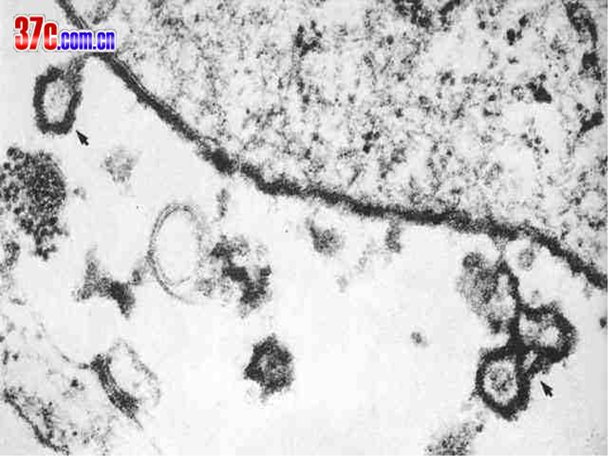
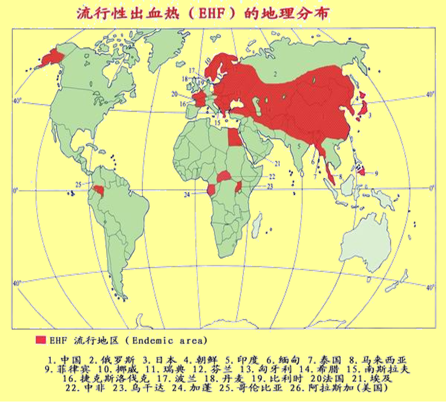
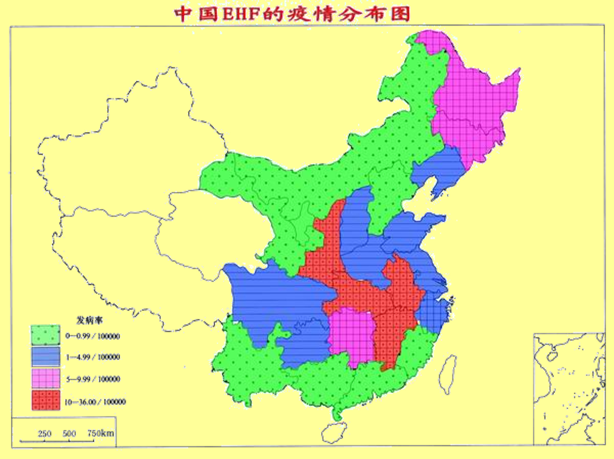

---
tags:
  - infection
---
#### 临床综合征
汉坦病毒导致的临床综合征也被称为[流行性出血热](流行性出血热)、出血性肾病肾炎、Songo热、朝鲜出血热(汉坦病毒感染)和流行性肾病(普马拉病毒感染)。
汉坦病毒心肺综合征(hantavirus cardiopulmonary syndrome, HCPS)：美国辛诺柏病毒、南美洲安第斯病毒及相关病毒。
#### 病原学
至少30多种汉坦病毒，导致人类致病的至少有12种
[Open: Pasted image 20260921103858.png](attachments/c5e6f3c7460f37fee6c3b95794041472_MD5.jpg)

<mark style="background-color: #1A4F10; color: white">单链反义RNA</mark>基因组，基因组分为3个片段。
- L片段(或大片段)编码复制酶，即RNA依赖性RNA聚合酶与核酸内切酶；
- M片段(中片段)编码包膜糖蛋白Gn和Gc；
- S片段编码核衣壳蛋白N。
#### 流行病学
###### 感染途径：
接触啮齿动物——重要因素；
接触受感染啮齿动物的尿液、分泌物（包括唾液）或粪便；
吸入气溶胶颗粒——室内暴露极为重要！
被啮齿动物咬伤——极少数
人与人之间的传播较为罕见，仅安第斯病毒。
###### 全球患病率
中国的汉坦病毒发病率年发病率最高。
中国每年报告的HFRS病例有16,000-100,000例或更多，俄罗斯每年可能出现数千例
[Open: Pasted image 20260921104209.png](attachments/16b71d9c8f8e4fc426818486ca1f5eb8_MD5.jpg)

[Open: Pasted image 20260921104229.png](attachments/fb69ee1df21adee0b4a179729e4b366c_MD5.jpg)

###### 流行特征
季节性
- 全年可发病，但有季节高峰
- 野鼠型11月—1月份为高峰，5—7月为小高峰
- 家鼠型3—5月为高峰
- 林区姬鼠型 夏季高峰
周期性
- 野鼠型一般相隔数年有一次较大流行，而家鼠型不明显
人群分布
- 男性青壮年农民和工人发病多见
感染模式：散发病例为主

| 型别  | 宿主  | 季节                   | 病情  | 病死率   | 分布  | 感染  |
| --- | --- | -------------------- | --- | ----- | --- | --- |
| 野鼠  | 姬鼠  | 5-7月小峰，   11~1月高峰 | 重   | 约1~5% | 农村镇 | 隐性少 |
| 家鼠  | 褐家鼠 | 3~5月                 | 轻   | 约0.5% | 城市  | 隐性多 |
| 混合  | 兼有  | 呈双峰                  |     |       | 兼有  |     |

