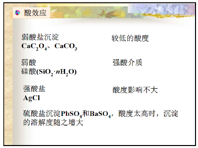
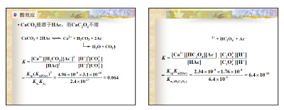

- 溶度积与溶度积原则
  - 溶度积
    > 事实上不变的是活度积，只是$\gamma$ 被当成1.但这可以解释盐效应。  <u>**饱和**</u> 溶液中离子浓度幂的乘积
  - 溶解度
    - g/100g
      - 难溶0.01 g
      - 微溶0.01-0.1 g
    - mol/100g
  - 换算
    - 适用于溶解度较小的难溶电解质。 对于溶解度较大的硫酸钙和铬酸钙，会产生较多误差
    - 适用于溶解后解离出的正负离子在水溶液中不发生其他副反应或副反应很小的物质。 对于硫化物，碳酸盐，磷酸盐不适用
    - 适用于已溶解的部分全部离解的，对于$Hg_{2}Cl_{2}$ 和$Hg_{2}I_{2}$ 等共价性强，还存在溶解的分子的不适用
  - @离子积$I_{p}$
    > 在难溶电解质的水溶液中，其加入沉淀瞬间沉淀物质离子浓度的乘积。
    -  **溶度积规则** 
- 沉淀溶解平衡的移动
  - 影响因素
    > 当加入沉淀剂适量时表现为同离子效应，过量时表现为盐效应。
    - 同离子效应
    - 盐效应
      > 加入不含相同离子的强电解质，增大沉淀溶解度。
  - 沉淀的生成
  - 沉淀的转化
    - 如果反应平衡常数太小，实际条件就很难满足了
      > 如用氯化钠溶液将碘化银转化为氯化银
  - 分级沉淀
    > 先后顺序沉淀，定义苛刻！一定是前一种物质沉淀完（通过计算说明）
  - 沉淀的溶解
    - 生成弱电解质
      
      
      > **酸效应**
      > 热力学上只能生成草酸氢根
    - 配位 效应
      > 以氯化银为例
    - 氧化还原
