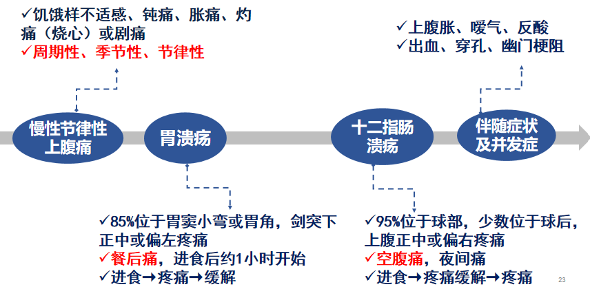
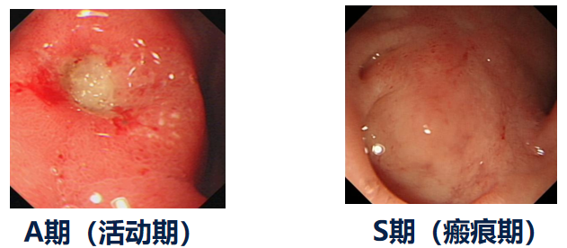
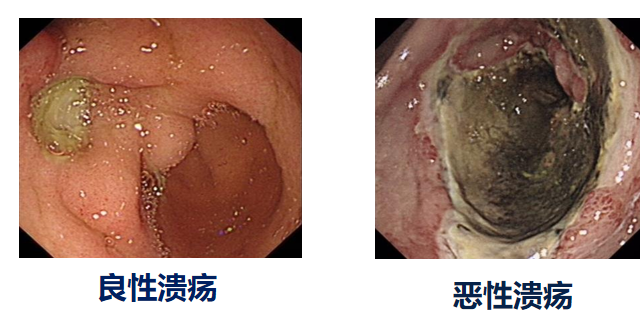
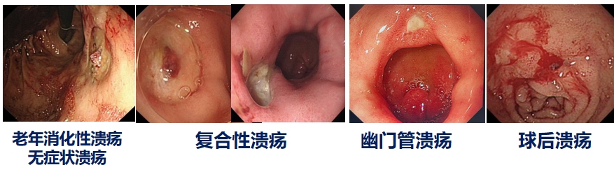
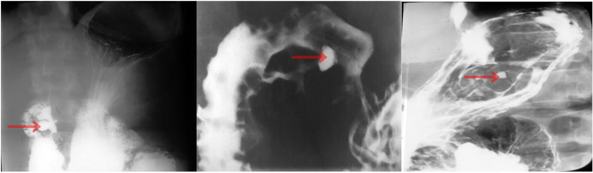
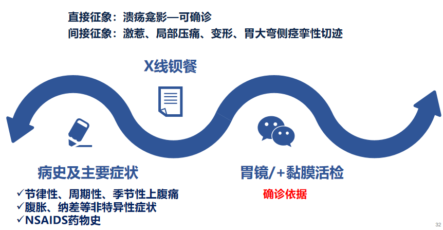

---
tags:
  - pathology
  - diagnosis
aliases:
  - 消化性溃疡
  - peptic ulcer
---
是指在各种致病因子的作用下，黏膜发生炎性反应与坏死、 脱落、 形成溃疡， 溃疡的黏膜坏死缺损<mark style="background-color: #1A4F10; color: white">穿透黏膜肌层</mark>， 严重者可达固有肌层或更深。
#### 发生部位
食管、胃、十二指肠、胃空肠吻合口、含胃粘膜的Meckel憩室
<mark style="background-color: #705A16; color: white">最常见：</mark>[胃溃疡](胃溃疡.md)（gastric ulcer）、[十二指肠溃疡](十二指肠溃疡.md)（duodenal ulcer）
流行病特点：常见病，患病率近1/10；
DU多见于青壮年，GU多见于中老年
##### 肠道溃疡

| 疾病                                    | 长轴方向         | 典型形态特征                                                                                                                                                                          | 好发部位                  | 伴随特征                                                                                  |
| :------------------------------------ | :----------- | :------------------------------------------------------------------------------------------------------------------------------------------------------------------------------ | :-------------------- | :------------------------------------------------------------------------------------ |
| [肠结核](肠结核.md) (Intestinal TB)         | 横行/环形（⊥ 肠长轴） | 边缘呈鼠咬状（潜行性），底部干酪样坏死                                                                                                                                                             | **回盲部**               | 易形成瘘管；愈合后瘢痕收缩致**肠腔环形狭窄**                                                              |
| **肠[伤寒](伤寒.md)** (Typhoid fever)      | 纵行/长形（∥ 肠长轴） | 边缘**整齐、隆起**，底部平坦，与集合淋巴滤泡形态一致                                                                                                                                                    | **回肠末段**              | 严重并发症为**肠出血**和**肠穿孔**                                                                 |
| **[克罗恩病](克罗恩病.md)** (Crohn's disease) | 纵行（∥ 肠长轴）    | **裂隙状纵行溃疡**，常与横行裂隙交叉形成<mark style="background-color: #1A4F10; color: white">“鹅卵石”征（铺路石样）</mark>                                                                                 | 回盲部及回肠末段              | 节段性分布（跳跃征），肠壁全层增厚，非干酪样肉芽肿        |
| [[溃疡性结肠炎]] (UC)                       | 无固定方向        | 溃疡**弥漫、浅表、连续性**，广泛糜烂，<mark style="background-color: #1A4F10; color: white">伴假性息肉形成</mark>；Crypt abscesses ( <mark style="background-color: #1A4F10; color: white">隐窝脓肿</mark> ) | **直肠、乙状结肠**（连续性向近端扩展） | 病变**局限于黏膜及黏膜下层**，少有深凿溃疡                                                               |
| **肠[阿米巴](阿米巴.md)病** (Amebiasis)       | 无固定方向        | **烧瓶状**（口小底大的深凿溃疡），溃疡间黏膜基本正常                                                                                                                                                    | **盲肠、升结肠**            | 溃疡较深，<mark style="background-color: #1A4F10; color: white">易引起肠穿孔</mark>；粪便中可检出阿米巴滋养体 |
[细菌性痢疾](细菌性痢疾.md)和[溃疡性结肠炎](溃疡性结肠炎.md)为浅溃疡
#### 诊断
##### 临床表现
[Open: Pasted image 20260924111830.png](attachments/207c9b5081bee08a7ccf8afad1336837_MD5.jpg)

##### 内镜检查
多呈圆形或椭圆形
底部平整，覆盖有白色或灰白色苔膜
边缘整齐，周围黏膜充血，水肿
[Open: Pasted image 20260924111918.png](attachments/95154bd2b2458168e72342804097b4d2_MD5.jpg)

###### 良、恶性溃疡的鉴别
[Open: Pasted image 20260924111954.png](attachments/af7ef0dcc3ece8140d3ecdc8fa12ea43_MD5.jpg)

###### 特殊类型溃疡
|类型|核心特点|疼痛/症状特点|好发部位/并发症|治疗反应|
|---|---|---|---|---|
|**老年消化性溃疡**|**不典型，无症状多见**|症状轻微或无痛|GU多位于胃体上部/胃底部，溃疡常较大|需警惕，易漏诊|
|**复合性溃疡**|胃溃疡 + 十二指肠溃疡|症状叠加，规律改变|**幽门梗阻发生率高**|疗程长，易复发|
|**幽门管溃疡**|症状不典型|**餐后痛多见**|**易出现幽门梗阻、出血、穿孔**|**对抗酸药反应差**|
|**球后溃疡**|位置特殊（十二指肠球部以降）|**夜间痛及背部放射痛多见**|**易并发出血**|**疗效差**|
[Open: Pasted image 20260924112434.png](attachments/c1991c716fd0dc7cba8346b6f4bb550b_MD5.jpg)

##### X线钡餐：
适应症：了解胃的运动情况；胃镜禁忌者；不愿接受胃镜检查者；
溃疡的直接X线征象：<mark style="background-color: #1A4F10; color: white">龛影</mark>⭐️
溃疡的间接X线征象：胃大弯侧痉挛性切迹、十二指肠球部激惹及球部畸形等
[Open: Pasted image 20260924112957.png](attachments/ea3d64d0c7d7f53bd25131282be8627a_MD5.jpg)

##### 胃液分析
GU：胃酸分泌正常或低于正常
DU：部分DU胃酸分泌↑
对PU的诊断与鉴别诊断价值不大，主要用于胃泌素瘤的辅助诊断。
##### 血清胃泌素测定
血清胃泌素一般与胃酸分泌成反比：胃酸低，胃泌素高；胃酸高，胃泌素低
[胃泌素瘤](胃泌素瘤.md)时，两者同时升高,胃泌素>200pg/ml
PU时血清胃泌素稍高，无诊断意义
##### 诊断与鉴别诊断
[384Open: Pasted image 20260924113316.png](attachments/adcfd40bc8d09f062b2bce39e6af2f8d_MD5.jpg)

#### 并发症
##### 1. 出血
- 消化性溃疡是上消化道出血中最常见的病因。
- 临床常用 <mark style="background-color: #705A16; color: white">Forrest分型</mark> 评估出血风险。

##### 2. 穿孔
- 穿孔破溃入腹腔引起弥漫性腹膜炎。
- 破溃穿孔并受阻于毗邻实质性器官（称为穿透性溃疡）。
- 穿入空腔器官形成瘘管。
###### 消化性溃疡穿孔
**病史：**
空腹痛/夜间痛 + 制酸剂有效 → 十二指肠溃疡。
餐后突发剧烈上腹痛 + 腹肌紧张 → 溃疡穿孔
**诊断：**
<mark style="background-color: #1A4F10; color: white">穿孔后气体进入腹腔</mark> → 肝脏上方的气体使肝浊音界缩小或消失。这是诊断穿孔的最具特异性体征（90%以上阳性）。
认为腹部炎症重，选了“腹式呼吸消失”，但并非最有诊断意义
肠鸣音消失也可见于[[腹膜炎]]，但不特异。
##### 3. 幽门梗阻
- 多由十二指肠球部溃疡及幽门管溃疡引起。
- 体检可见胃蠕动波和振水音。
##### 4. 癌变
- **<1%** 的胃溃疡有可能癌变。
- 十二指肠球部溃疡**一般不发生癌变**。
