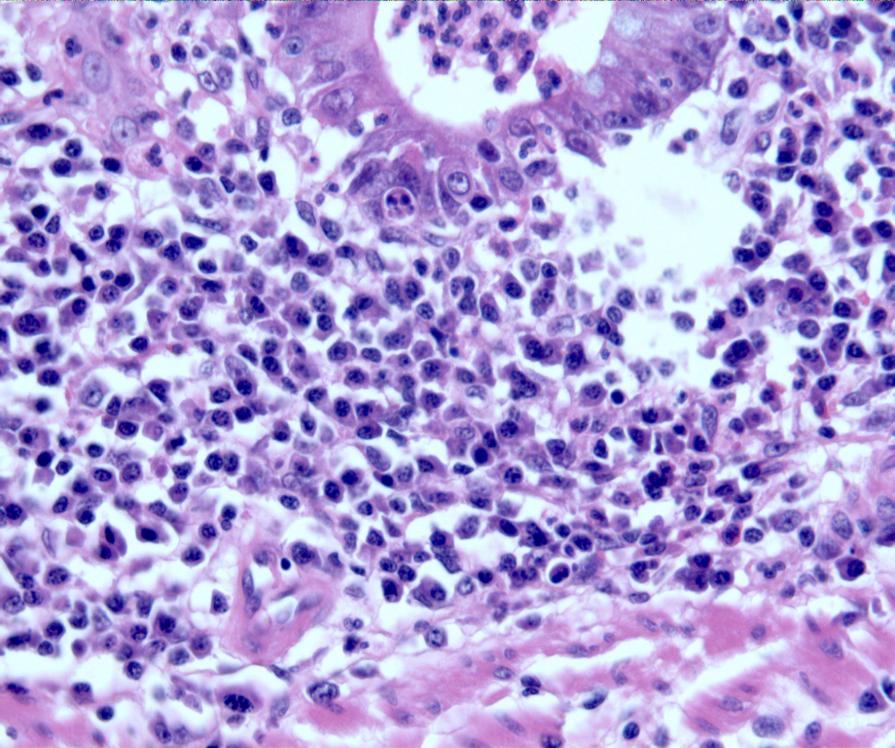
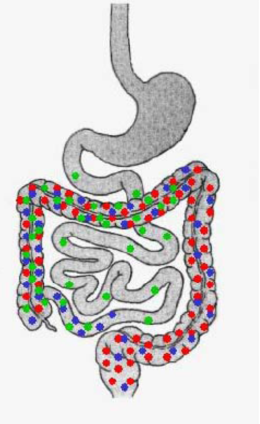

---
tags:
  - pathology
  - digestive
aliases:
  - UC
---
#### 诊断
缺乏诊断金标准
排除感染和非感染性结肠炎，e.g. 肠结核
具备典型临床表现和肠镜特征者，拟诊
如加上典型组织学改变者，可确诊
初发病例难以确诊时应随访观察3-6月

- 钡剂灌肠：结肠镜遇到肠腔狭窄不能通过时，需高度警惕癌变，可应用钡剂灌肠或CT、MRI协助诊断
- 黏膜染色技术结合放大技术提高病变的识别能力
##### 考虑小肠检查的情况
- 病变不累及直肠者（未经药物治疗）
- 倒灌性回肠炎：全结肠炎症延伸至回肠
- 其他难以与CD鉴别的情况
> 左半结肠炎伴阑尾开口炎症或盲肠红斑在UC很常见，无需进一步行小肠检查。
##### 临床表现
病程6w以上
腹泻、腹痛和粘液脓血便
粘液血便是最常见的表现
###### 肠外表现：
关节：多关节炎、单关节炎、骶髂关节炎
皮肤：结节性红斑、脓皮病
肝脏：原发性硬化性胆管炎(PSC)
眼：虹膜睫状体炎、眼葡萄膜炎
口腔：阿弗他样溃疡
肺：肺泡炎、肺纤维化
###### 内镜下表现
- 直肠及左半结肠优先累及
- 连续性、弥漫性病变
- 病变比较浅表
- 结肠袋囊变钝或消失
- 假息肉和桥形粘膜
##### 组织学改变
- 炎症仅限于粘膜层（M）
[302Open: Pasted image 20260909152253.png](attachments/f2ead3f8776ea53d9d6ca7b233357733_MD5.jpg)

- 隐窝炎、隐窝脓肿 Cryptitis, Crypt abscess
[Open: Pasted image 20260909152348.png](attachments/a773d8fb982091f00607743d5d3dce23_MD5.jpg)

- 基底浆细胞增多 Basal plasmocytosis
[Open: Pasted image 20260922080854.png](attachments/56fd8717c1766cdffd08ae2e6eecd10e_MD5.jpg)

##### 诊断要点
- <mark style="background-color: #1A4F10; color: white">排除</mark>肠结核等其他肠道疾病
- 具备典型临床表现和肠镜特征者，拟诊
- 如加上典型组织学改变者，可确诊
- 初发病例难以确诊时应随访观察3-6月
###### 临床类型
初发性和慢性复发性
###### 病变范围（Montreal分类）
E1 直肠型
E2 左半结肠型
E3 广泛型
[303Open: Pasted image 20260909152751.png](attachments/e11bdb81da25150733a93244c427f95a_MD5.jpg)

###### 分期
活动期和缓解期
###### 严重度
轻中重
<mark style="background-color: #705A16; color: white">Truelove-Witts分级标准</mark>
[Open: Pasted image 20260909153137.png](attachments/e33b3adea3814acfb71c4e47edd8fedb_MD5.jpg)

----
病理特征：
	早期结肠黏膜出血伴点状出血和黏膜隐窝小脓肿 
	脓肿扩大后形成表浅小溃疡 
	溃疡融合扩大形成窦道并进一步出现大片坏死和溃疡 
	残存肠黏膜充血水肿形成息肉状突起
		<mark style="background-color: #1A4F10; color: white">假性息肉</mark>：对于发展时间很长的溃疡性结肠炎患者，其受累的粘膜区域会逐渐坏死脱落，而残存的没有受累的岛状粘膜区域则会仍然存续，并且有轻微水肿病变。从而，残存岛状粘膜还是正常的高度，但是其周围广泛受累的粘膜区域已经坏死脱落了，从而这种“残存的岛状粘膜”就被衬托的在高度上“很突出”，也就是形成了我们所谓的“假息肉（Pseudopolyps）”。
镜下观：
	早期可见肠黏膜隐窝处小脓肿伴黏膜和黏膜下层炎细胞浸润
	<mark style="background-color: #1A4F10; color: white">隐窝脓肿</mark> ：其实隐窝就是“肠腺”的代称，指肠腺内出现了以中性粒细胞聚集为主的炎症。
	继而伴随广泛溃疡形成 晚期病变区肠壁大量纤维组织增生
临床合并症：暴发性病例中结肠丧失蠕动功能形成麻痹性扩张（<mark style="background-color: #705A16; color: white">中毒性巨结肠</mark>）；极易并发[结肠癌](结肠癌.md)，发病年龄轻，以<mark style="background-color: #1A4F10; color: white">低分化腺癌和黏液腺癌</mark>多见

----
#### 治疗
##### 分级分期分段治疗原则
分级治疗：轻中重
分期治疗：活动期、缓解期
分段治疗：根据病变范围选择不同药物
> 参考病程和过去治疗情况选择药物、确定疗程及治疗方法，以尽快控制发作，防止复发。
##### 药物选择

| 严重程度    | 远段溃疡性结肠炎                                                                                          | 广泛溃疡性结肠炎                                                                                          |
| ------- | ------------------------------------------------------------------------------------------------- | ------------------------------------------------------------------------------------------------- |
| **轻度**  | 口服或直肠用5-ASA 直肠用糖皮质激素                                                                           | 局部和口服5-ASA                                                                                        |
| **中度**  | 口服或直肠用5-ASA 直肠用糖皮质激素                                                                           | 局部和口服5-ASA                                                                                        |
| **重度**  | 口服或直肠用5-ASA 口服、静脉或直肠用糖皮质激素                                                                     | 静脉用糖皮质激素 静脉用环孢素 静脉用英夫利西单抗                                                                   |
| **顽固性** | 口服、静脉用糖皮质激素 + 硫唑嘌呤或6-巯基嘌呤或英夫利西单抗或环孢素、VDZ、UPA | 口服、静脉用糖皮质激素 + 硫唑嘌呤或6-巯基嘌呤或英夫利西单抗或环孢素、VDZ、UPA |
| **缓解期** | 口服或直肠用5-ASA 硫唑嘌呤或6-巯基嘌呤 IFX、VDZ、UPA    | 口服5-ASA 硫唑嘌呤或6-巯基嘌呤 IFX、VDZ、UPA        |
###### 局部治疗药物的选择
指征：
- 远段结肠炎(直肠、乙状结肠)以局部治疗为主
- 活动性左半结肠炎必须口服药物，常合用局部治疗。
<mark style="background-color: #705A16; color: white">药物选择</mark>：
1. 5-ASA 灌肠剂、5-ASA 栓剂  
[191Open: Pasted image 20260922081809.png](attachments/1922b8d8cdea8e977bb6246cc82bfa3b_MD5.jpg)

SASP（柳氮磺吡啶）(Azulfidine®)：一种前体药物，细菌降解，形成磺胺吡啶和5-氨基水杨酸🔴
美沙拉嗪(5-ASA)  🔵
- pH-依赖释放 (e.g. Salofalk® 片剂，艾迪莎Etiasa®)
- 时间依赖释放 (颇得斯安Pentasa®)🟢
2. 皮质类固醇激素灌肠
3. 中药灌肠
###### 糖皮质激素
<mark style="background-color: #1A4F10; color: white">对于5-ASA疗效不佳的中重度病人</mark>首选治疗。作用机制是非特异性抗炎和抑制免疫反应。
轻中度活动UC糖皮质激素按泼尼松0.75-1mg/kg/d计算给药。
<mark style="background-color: #1A4F10; color: white">重度UC治疗</mark>首选静脉糖皮质激素，甲基泼尼松龙40-60mg/d，或氢化可的松300-400mg/d，超剂量不会增加疗效，但剂量不足会降低疗效。
激素无效：泼尼松0.75mg/(kg.d)治疗超过4周，仍处活动期
顽固性溃疡性结肠炎
1. 激素依赖型 
> 指泼尼松龙减量至10 mg/d即无法控制发作或停药后3月复发者
2. 激素抵抗型 
> 指泼尼松龙足量应用4周不缓解
###### 免疫抑制剂
适用于反复发作而SASP及激素疗效不佳、激素依赖或慢性持续型患者。 
欧美推荐的硫唑嘌呤目标剂量为1.5-2.5 mg/kg/d，在中国治疗剂量尚未得到共识。
注意胃肠道反应、白细胞下降及骨髓抑制的不良反应。
###### 生物制剂：IBD治疗的革命
- VDZ单抗
- IFX单抗
- UPA
[Open: Pasted image 20260922084443.png](attachments/5b6183d890efa71a964e96e4b9b32945_MD5.jpg)

##### 重症UC需要转换治疗的判断
- 静脉足量激素治疗大约5天仍然无效
- 亦宜视病情之严重程度和恶化倾向，适当提早（如3天）或延迟（如7天）。
- 应牢记，不恰当的拖延势必大大增加手术风险。
###### 转换治疗方案（一）
环孢素（CsA）：
2～4mg/kg.d静脉滴注
起效快，短期有效率可达60%-80%
不可逆肾毒性
远期手术率仍相当高
定期监测血药浓度
英夫利西：
抗TNF-a 单克隆人鼠嵌合抗体
###### 转换治疗方案（二）：立即手术治疗
国外不少医院并不经〝拯救〞治疗阶段而直接手术治疗。
担心药物不良反应治疗失败增加手术风险
质疑〝拯救〞治疗的远期手术率。
##### 癌变检测
起病8～10年的<mark style="background-color: #1A4F10; color: white">所有UC患者均</mark>应行一次肠镜——
E3型：从此隔年肠镜复查，20年每年复查；
E2型：从起病15年开始隔年复查；
E1型：无需肠镜监测。
合并原发性硬化性胆管型者，从该诊断确立开始每年肠镜复查

