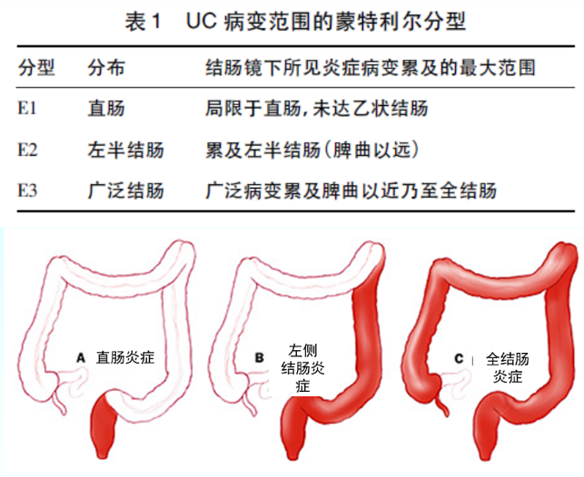
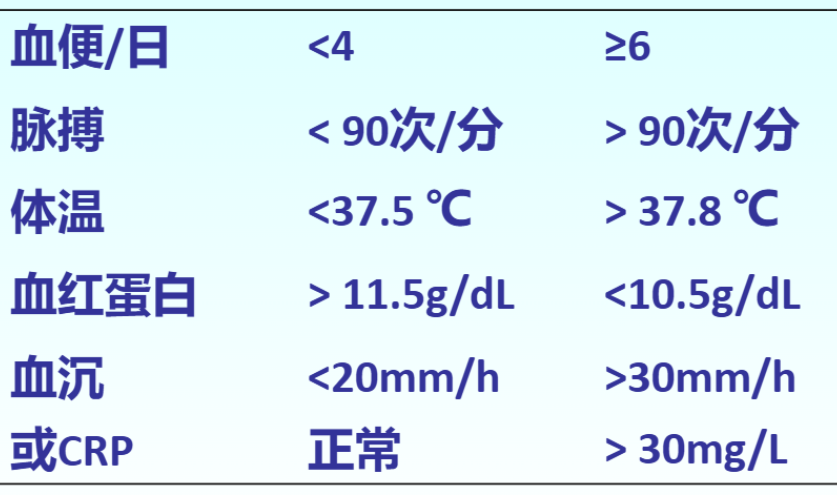
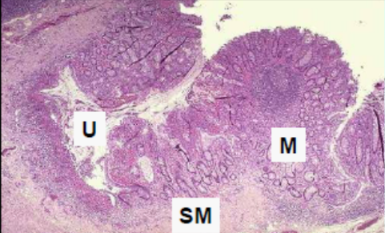
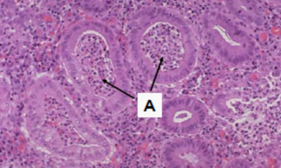

---
tags:
  - pathology
  - digestive
aliases:
  - UC
---
#### 诊断
缺乏诊断金标准
排除感染和非感染性结肠炎，e.g. 肠结核
具备典型临床表现和肠镜特征者，拟诊
如加上典型组织学改变者，可确诊
初发病例难以确诊时应随访观察3-6月

- 钡剂灌肠：结肠镜遇到肠腔狭窄不能通过时，需高度警惕癌变，可应用钡剂灌肠或CT、MRI协助诊断
- 黏膜染色技术结合放大技术提高病变的识别能力

##### 考虑小肠检查的情况
- 病变不累及直肠者（未经药物治疗）
- 倒灌性回肠炎：全结肠炎症延伸至回肠
- 其他难以与CD鉴别的情况
> 左半结肠炎伴阑尾开口炎症或盲肠红斑在UC很常见，无需进一步行小肠检查。

##### 诊断内容
###### 临床类型
初发性和慢性复发性
###### 病变范围（Montreal分类）
E1 直肠型
E2 左半结肠型
E3 广泛型
[303Open: Pasted image 20260909152751.png](attachments/e11bdb81da25150733a93244c427f95a_MD5.jpg)

###### 分期
活动期和缓解期
###### 严重度
轻中重
<mark style="background-color: #705A16; color: white">Truelove-Witts分级标准</mark>
[Open: Pasted image 20260909153137.png](attachments/e33b3adea3814acfb71c4e47edd8fedb_MD5.jpg)

##### 临床表现
病程6w以上
腹泻、腹痛和粘液脓血便
粘液血便是最常见的表现
###### 肠外表现：
关节：多关节炎、单关节炎、骶髂关节炎
皮肤：结节性红斑、脓皮病
肝脏：原发性硬化性胆管炎(PSC)
眼：虹膜睫状体炎、眼葡萄膜炎
口腔：阿弗他样溃疡
肺：肺泡炎、肺纤维化

###### 内镜下表现
- 直肠及左半结肠优先累及
- 连续性、弥漫性病变
- 病变比较浅表
- 结肠袋囊变钝或消失
- 假息肉和桥形粘膜

#### 组织学
- 炎症仅限于粘膜层（M）
[302Open: Pasted image 20260909152253.png](attachments/f2ead3f8776ea53d9d6ca7b233357733_MD5.jpg)

- 隐窝炎、隐窝脓肿、基底浆细胞增多
[Open: Pasted image 20260909152348.png](attachments/a773d8fb982091f00607743d5d3dce23_MD5.jpg)

----
病理特征：
	早期结肠黏膜出血伴点状出血和黏膜隐窝小脓肿 
	脓肿扩大后形成表浅小溃疡 
	溃疡融合扩大形成窦道并进一步出现大片坏死和溃疡 
	残存肠黏膜充血水肿形成息肉状突起
		<mark style="background-color: #1A4F10; color: white">假性息肉</mark>：对于发展时间很长的溃疡性结肠炎患者，其受累的粘膜区域会逐渐坏死脱落，而残存的没有受累的岛状粘膜区域则会仍然存续，并且有轻微水肿病变。从而，残存岛状粘膜还是正常的高度，但是其周围广泛受累的粘膜区域已经坏死脱落了，从而这种“残存的岛状粘膜”就被衬托的在高度上“很突出”，也就是形成了我们所谓的“假息肉（Pseudopolyps）”。
镜下观：
	早期可见肠黏膜隐窝处小脓肿伴黏膜和黏膜下层炎细胞浸润
	<mark style="background-color: #1A4F10; color: white">隐窝脓肿</mark> ：其实隐窝就是“肠腺”的代称，指肠腺内出现了以中性粒细胞聚集为主的炎症。
	继而伴随广泛溃疡形成 晚期病变区肠壁大量纤维组织增生
临床合并症：暴发性病例中结肠丧失蠕动功能形成麻痹性扩张（<mark style="background-color: #705A16; color: white">中毒性巨结肠</mark>）；极易并发[结肠癌](结肠癌.md)，发病年龄轻，以<mark style="background-color: #1A4F10; color: white">低分化腺癌和黏液腺癌</mark>多见

----
#### 治疗
##### 分级分期分段治疗原则
分级治疗：轻中重
分期治疗：活动期、缓解期
分段治疗：根据病变范围选择不同药物
###### 参考病程和过去治疗情况选择药物、确定疗程及治疗方法，以尽快控制发作，防止复发
