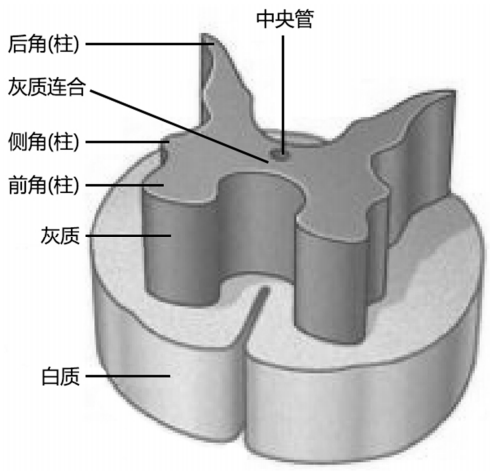

---
tags:
  - Neurology
---
##### [[皮质]]（Cortex）

##### 神经核（Nucleus）
在横切面上“H”形，中间横行部分为灰质连合。每侧的灰质前部扩大为前角，后部狭细为后角。在T1～L3脊髓节段，前、后角之间还有侧角。
中央管周围的灰质称为<mark style="background-color: #705A16; color: white">中间带（灰质连合）</mark>，将两侧的灰质连接起来。整体上前、后、侧角纵贯成柱。
[Open: Pasted image 20260904093347.png](attachments/84c8ac1d9d208d95636b174d1c72f123_MD5.jpg)

###### （ 1）前角：
<mark style="background-color: #1A4F10; color: white">运动神经元</mark>，内侧群支配颈肌和躯干肌，见于脊髓全长；
外侧群在颈膨大和腰骶膨大节段发达，支配四肢肌。
###### （2）后角：
<mark style="background-color: #1A4F10; color: white">联络神经元</mark>组成，主要接受后根纤维。
###### （3）侧角：
T1～L3为[交感神经](交感神经.md)节前神经元。
在S2～ 4节中，相当侧角位置是骶部[副交感神经](副交感神经.md)的节前神经元。

