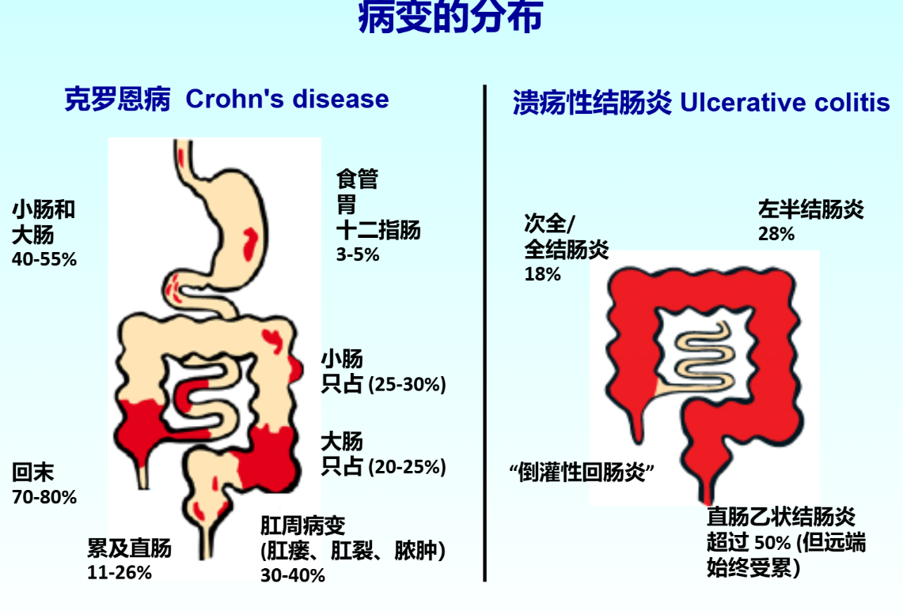

---
tags:
  - digestive
aliases:
  - inflammatory bowel diseases
  - IBD
---
[感染](感染.md)、[NSAIDs](NSAIDs.md)、应激、吸烟、饮食、抗生素均能刺激引起IBD

---
[溃疡性结肠炎](溃疡性结肠炎.md)
[克罗恩病](克罗恩病.md)
[Open: Pasted image 20260909150528.png](attachments/e42c420efc74f3981aefb201d37c5f8d_MD5.jpg)

