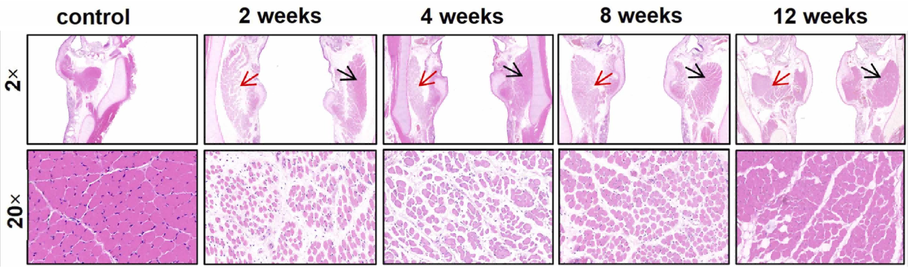

---
tags:
  - Proj
---
> [!PDF|green] [The Laryngoscope - 2026 - Bhatt - Novel Injectable Supports Long‐Term Recurrent Laryngeal Nerve and Partial Peripheral, p.3](The%20Laryngoscope%20-%202026%20-%20Bhatt%20-%20Novel%20Injectable%20Supports%20Long‐Term%20Recurrent%20Laryngeal%20Nerve%20and%20Partial%20Peripheral.pdf#page=3&selection=191,43,194,14&color=green)
> > Because the TA runs anteroposteriorly and slightly laterally, coronal sections of the trachea contain a mix of transverse, longitudinal, and oblique fibers

[Open: d25e2cde1d5075295f4f39f0e5c29334.png](attachments/cd510f10596c913a603010d6444c27a1_MD5.jpg)

