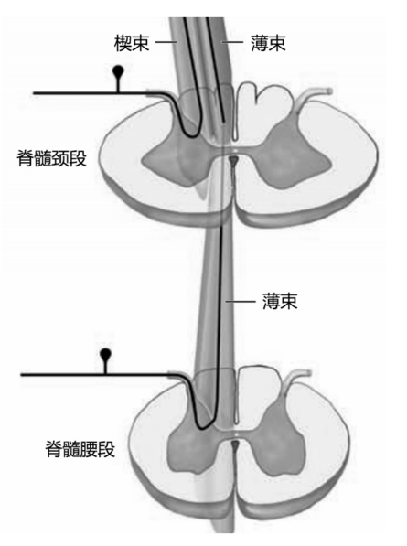
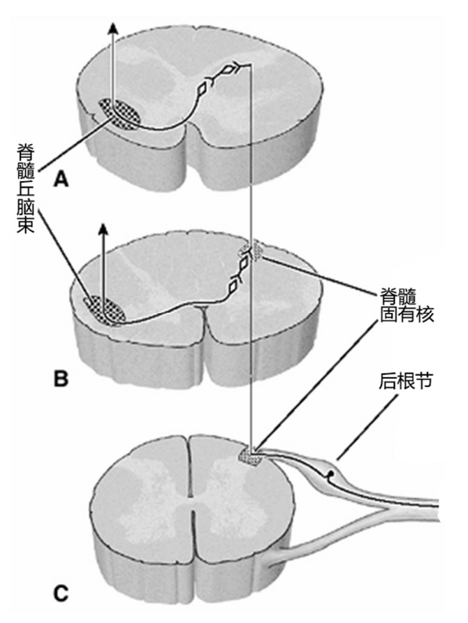
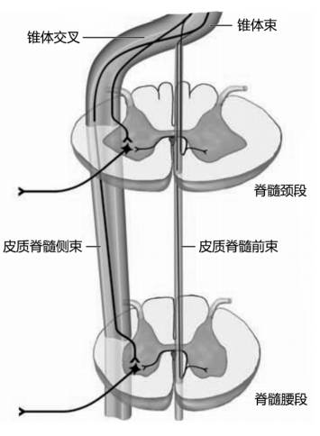

---
tags:
  - Neurology
---
##### [[髓质]]（Medulla）

##### [[神经束]]（Fasciculus）
每侧借脊髓表面的纵沟分为前、外侧和后三个索。
- 前索位于前正中裂与前外侧沟之间；
- 外侧索位于前、后外侧沟之间；
- 后索位于后外侧沟与后正中沟之间。
> 灰质连合与前正中裂之间的白质为白质前连合。
###### （ 1）薄束和楔束：
位于<mark style="background-color: #1A4F10; color: white">后索</mark>内，这两个束是后根纤维进入脊髓后在同侧后索内直接上行构成的。
[薄束](薄束)起自同侧T5以下，[楔束](楔束)起自T4以上的脊神经节细胞，
其周围突分布至肌、腱、关节和皮肤的感受器；
中枢突经后根进入脊髓后索上行，止于延髓的薄束核和楔束核。
薄、楔束传导<mark style="background-color: #1A4F10; color: white">身体本体感觉和精细触觉</mark>。
[330Open: Pasted image 20260904093843.png](attachments/bce65547bab22b271519bbad1e7e8668_MD5.jpg)

###### （ 2）脊髓丘脑束：
位于<mark style="background-color: #1A4F10; color: white">外侧索的前半和前索</mark>中。
脊神经节内传导痛、温和粗触觉的神经元的中枢突，经后根入脊髓后，在脊髓的背外侧束中上行1 ～ 2节止于后角内。
脊髓丘脑束的起始细胞主要在后角中，轴突经白质前连合交叉对侧，形成脊髓丘脑束，上行止于背侧丘脑。
[Open: Pasted image 20260904094015.png](attachments/f1e8014607e09897e3512a81feebf390_MD5.jpg)

###### （3）皮质脊髓束：
起于大脑皮质，大部分纤维在延髓交叉越边，至对侧脊髓的外侧索后半下行，称为<mark style="background-color: #705A16; color: white">皮质脊髓侧束</mark>，纵贯脊髓全长，沿途止于其同侧前角运动细胞；小部分纤维不交叉处越边，在同侧前索前中正裂近旁下行，一般不超过胸节，称为<mark style="background-color: #705A16; color: white">皮质脊髓前束</mark>，止于双侧前角运动细胞。
皮质脊髓束的功能是<mark style="background-color: #1A4F10; color: white">传导来自大脑皮质的随意运动冲动，控制骨骼肌的随意运动</mark>。
[Open: Pasted image 20260904094433.png](attachments/771dd1c958b4867da1c83b0b32041990_MD5.jpg)

