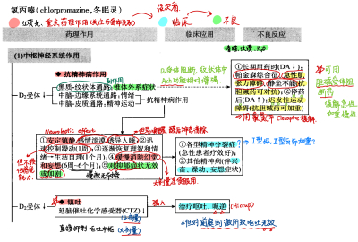
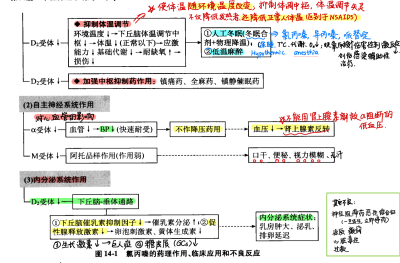
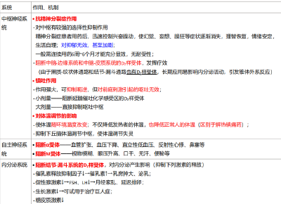
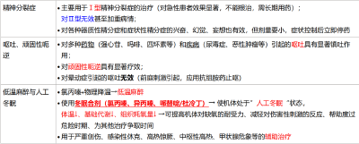
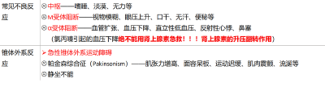
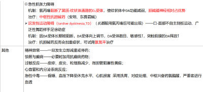
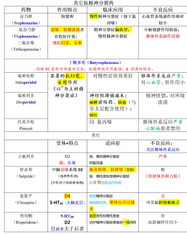
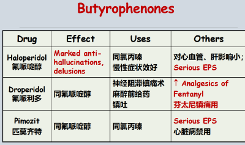
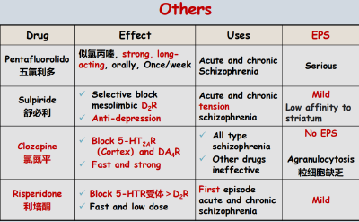

---
aliases:
  - neuroleptic drugs
  - 治疗精神分裂症的药物
  - antischizophrenia drugs
---
#### 发病机制
- [DA](多巴胺.md) 系统功能亢进假说： 边缘系统多巴胺过量分泌发挥重要作用
- [5-HT](5-HT.md)调节痛觉、 <u>精神情绪</u> 、睡眠、体温、性行为、垂体内分泌等过程；
> 这里的D4非常关键。氯氮平的优点：只选择D4，无锥体外系、内分泌不良反应。
#### 分类
吩噻嗪类（Phenothiazines）  
丁酰苯类（Butyrophenones） 
硫杂蒽类（Thioxanthenes） 
其他药物
#### 药理机制
- 1. 阻断 <mark style="background-color: #1A4F10; color: white">中脑-边缘 通路</mark>和 <mark style="background-color: #1A4F10; color: white">中脑-皮层 通路</mark> DA 受体 （D2 受体）：
  吩噻嗪类（[氯丙嗪](氯丙嗪.md)、[[冬眠灵]]）
- 2.阻断  5-HT 受体（改善阴性症状）  ： [[氯氮平]]（Clozapine）、 [[利培酮]]（Risperidone）
> 可换米氮平
- **阻断**<mark style="background-color: #1A4F10; color: white">D2样受体、肾上腺素α受体、M型胆碱受体</mark> <u>（关注阻受体与其药理作用的关系）</u> 
> 记：“DAM，裂开了”。
> 中枢&内分泌作用、自主神经系统作用。抗精神病、镇吐、体温调节（冬眠）
###### 体内过程
- 高度脂溶性
- 吸收：口服吸收慢而不规则， 通常采用 静脉注射
- 分布： 广泛分布。 脑内血药浓度高 、  易蓄积于脂肪组织 
> link：[地西泮](地西泮.md)也会向脂肪组织再分布；地西泮作用时效长的三大原因
- 肝脏代谢——  肝药酶诱导剂（如[苯妥英钠](苯妥英钠.md)、[[卡马西平]]等）可加速其代谢，合用时注意适当调整剂量；
- 肾脏排泄
#### 药理作用、临床应用、不良反应

- 药理作用
  
- 临床应用
  
- 不良反应
  
  
<mark style="background-color: #3F4B5E; color: white">禁忌症</mark>
- 有癫痫、惊厥史者禁用；（副作用之一）
- 青光眼患者禁用；（阻断M）
- 乳腺增生症、乳腺癌患者禁用；（阻断下丘脑-垂体通路D2）
- 冠心病患者慎用（心脏毒性；阻断α，血压↓）
- *药物互作*
- 与其他中枢抑制药合用时，注意调整剂量；
-  氯丙嗪 会抑制DA受体激动药、左旋多巴的作用；
- 肝药酶诱导剂（如苯妥英钠、卡马西平等）可加速其代谢，合用时注意适当调整剂量；
#### 其它药：特点、用途、不良反应。

