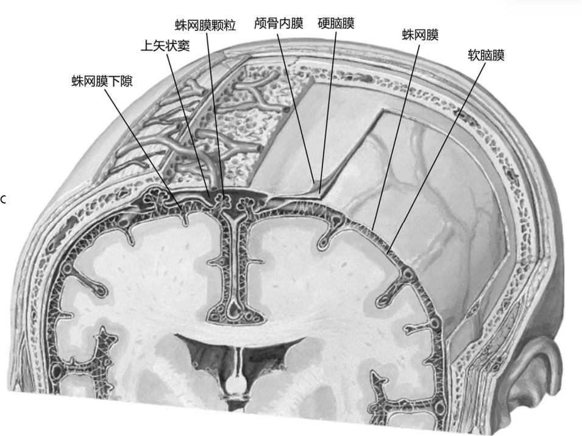
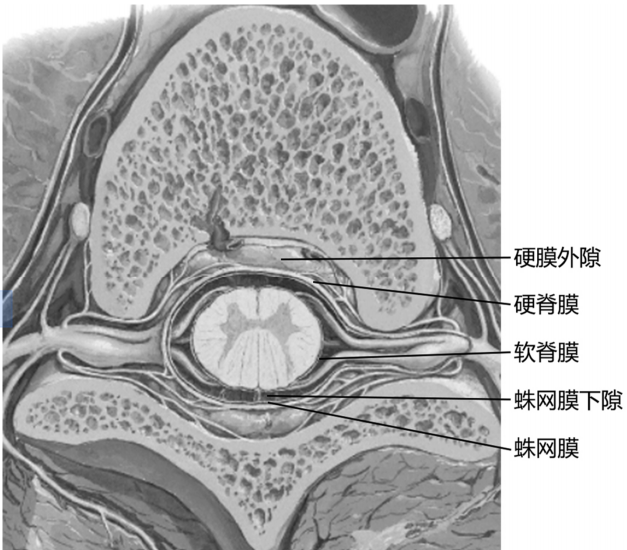
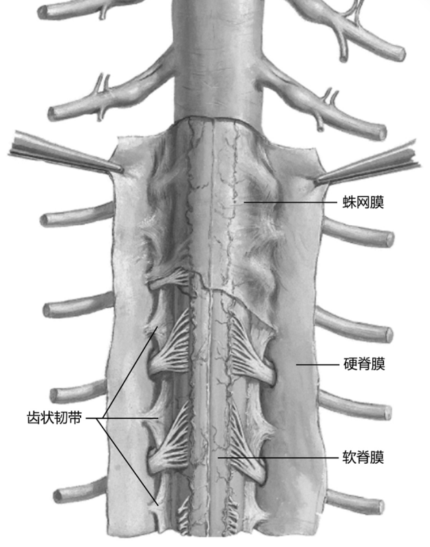

---
tags:
  - Neurology
---
#### 一、概述
[神经元](神经元.md)
#### 二、周围神经系统
[脊神经](脊神经.md)
[颅神经](颅神经.md)
[内脏神经](内脏神经.md)
#### 三、[[中枢神经系统]]
#### 四、神经传导通路
##### 感觉传导通路
<mark style="background-color: #705A16; color: white">躯干四肢</mark>传导通路
1. 浅感觉传导通路
1）第l级神经元胞体
2）第2级神经元胞体
3）第3级神经元胞体
2. 深感觉传导通路
1）第l级神经元胞体
2）第2级神经元胞体
3）第3级神经元胞体
<mark style="background-color: #705A16; color: white">头面部</mark>感觉传导通路
本体感觉传导通路目前尚不十分清楚，因而不作讨论。
1）第l级神经元胞体
2）第2级神经元胞体
3）第3级神经元胞体
##### [[运动传导通路]]

##### [[视觉传导通路]]

#### 五、脑和脊髓的被膜、血管及脑脊液循环
##### 1. 脑和脊髓的被膜
脑和脊髓的表面都有三层被膜包裹，从外向内依次为硬膜、蛛网膜和软膜。
这些被膜对脑和脊髓具有保护和支持作用，并通过被膜的血管使脑和脊髓得到营养。
[Open: Pasted image 20260917081710.png](attachments/beb99af529d245aeb47f4ce7ecd3f9ae_MD5.jpg)

###### （一）硬膜
1．硬脊膜 
呈管状包裹脊髓，上端附着于枕骨大孔周缘，与硬脑膜相续；下端在第2骶椎水平变细，包裹终丝，末端附于尾骨。
硬脊膜与椎管内面的骨膜之间的腔隙称硬膜外隙，腔内呈负压，内有脊神经根、静脉丛、淋巴管和脂肪组织，是临床硬膜外麻醉的部位。
由于硬脊膜在枕骨大孔边缘与骨膜紧密愈着，故硬膜外隙不与颅内相通。
[Open: Pasted image 20260917081815.png](attachments/46380b406eef8d2e505597bde578489d_MD5.jpg)

2．硬脑膜：
在枕骨大孔处与硬脊膜相续。硬脑膜有以下特点：
（1）硬脑膜由两层合成，其外层相当于颅骨内面的骨膜，故无硬膜外隙。
（2）硬脑膜与颅盖骨结合疏松，外伤时易造成硬膜外血肿；硬脑膜与颅底骨结合紧密，<mark style="background-color: #3F4B5E; color: white">颅底骨折时，往往使硬脑膜和蛛网膜同时撕裂，致使脑脊液外漏</mark>。
（3）硬脑膜的内层在某些部位褶叠成双层板状结构，伸入各脑部之间形成隔幕。
（4）硬脑膜在一些部位两层分开，内衬内皮细胞形成硬脑膜窦，汇集脑的静脉血。<mark style="background-color: #3F4B5E; color: white">窦壁不含平滑肌，不能收缩，故损伤后不易止血</mark>。在蝶骨体两侧有海绵窦，与面部静脉借眼静脉相交通，故面部感染常可经此途径波及颅内。
###### （二）蛛网膜
蛛网膜为半透明、无血管的薄膜，与脑蛛网膜相延续，衬于硬膜的内面。蛛网膜与硬膜之间有潜在的硬膜下隙；与软膜之间有较宽阔蛛网膜下隙，两层间有许多纤细的结缔组织小梁相连，隙内充满脑脊液。
[Open: Pasted image 20260917082215.png](attachments/a500fea99bfea6b1de05f14f66b9289d_MD5.jpg)

