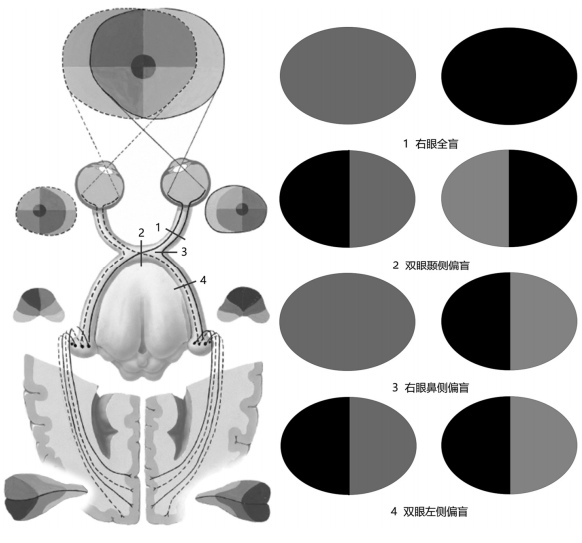

---
tags:
  - Neurology
---
#### 一、概述
[神经元](神经元.md)
#### 二、周围神经系统
[脊神经](脊神经.md)
[颅神经](颅神经.md)
[内脏神经](内脏神经.md)
#### 三、[[中枢神经系统]]
#### 四、神经传导通路
##### 感觉传导通路
<mark style="background-color: #705A16; color: white">躯干四肢</mark>传导通路
1. 浅感觉传导通路
1）第l级神经元胞体
2）第2级神经元胞体
3）第3级神经元胞体
2. 深感觉传导通路
1）第l级神经元胞体
2）第2级神经元胞体
3）第3级神经元胞体
<mark style="background-color: #705A16; color: white">头面部</mark>感觉传导通路
本体感觉传导通路目前尚不十分清楚，因而不作讨论。
1）第l级神经元胞体
2）第2级神经元胞体
3）第3级神经元胞体
##### 运动传导通路
• 由大脑皮质发出传出纤维，经脑干和脊髓的运动神经元支配周围躯体和内脏效应器的神经元链称运动传导通路。
• 管理骨骼肌运动的运动传导通路，按形态和功能分为锥体系和锥体外系两部分。
• 锥体外系是结构十分复杂，涉及脑内诸多结构的功能系统。主要功能是调节肌张力、协调肌群活动、维持和调整体态姿势、进行习惯性和节律性动作等。
• 锥体系管理骨骼肌的随意运动。<mark style="background-color: #1A4F10; color: white">由两级神经元组成，即上运动神经元和下运动神经元</mark>。上运动神经元是位于中央前回和中央旁小叶前部等皮质的神经元，其轴突组成下行的锥体束，其中终止于脑神经运动核的纤维称[皮质核束](皮质核束.md)；终止于脊髓前角运动细胞的纤维称[皮质脊髓束](皮质脊髓束.md)。
下运动神经元为脑神经运动核和脊髓前角运动神经元，其轴突组成脑神经和脊神经的运动纤维。

##### 视觉传导通路
基本概念：
• 视野为一侧眼所看到的范围
• 鼻侧眼球的内侧与鼻相邻故名
• 颞侧眼球的外侧与颞窝相邻而得名
• 屈光系统由角膜、房水、晶体和玻璃体构成，起双凸透镜的作用，将物体影象准确地投影到视网膜上时会发生翻转
1）第l级神经元为视网膜的双极细胞。其周围突至视觉感受器。中枢突与节细胞形成突触。
2）第2级神经元为视网膜的节细胞。其轴突合成视神经。形成视交叉后延为视束，终止于外侧膝状体。
- 视网膜鼻侧半的纤维交叉
- 视网膜颞侧半的纤维不交叉
 [Open: Pasted image 20260916112158.png](attachments/f875d369ab9983a1bb62c5e03ba56cf7_MD5.jpg)

3）第3级神经元胞体位于外侧膝状体。其轴突组成视辐射，经内囊后肢投射至大脑皮质视区。
双眼左侧半视野的影象投射到右侧视皮质，反之亦然；
上半视野投射到距状沟下，下半视野投射到距状沟上、下的皮质

