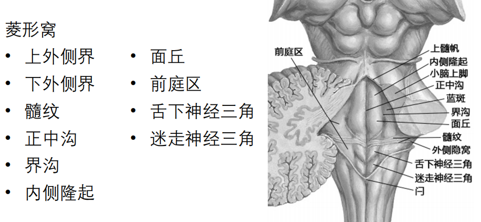
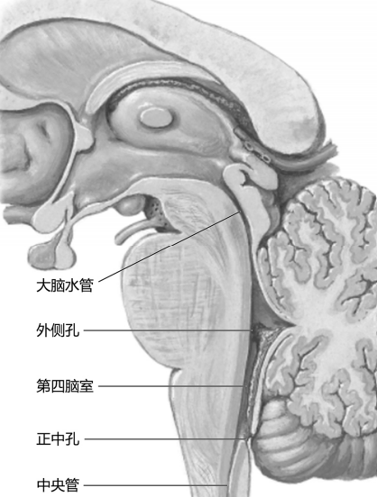

---
tags:
  - Neurology
---
第四脑室是位于延髓、脑桥和小脑之间的室腔。第四脑室的顶尖朝向小脑，室底为菱形窝。室内有脑脊液，向上与中脑的大脑水管、向下经延髓中央管与脊髓中央管相交通。
[Open: Pasted image 20260908163314.png](attachments/4d5748507ebb3b37b94605d7a97c1763_MD5.jpg)

第四脑室有三孔与蛛网膜下隙相通，即不成对的第四脑室正中孔和成对的第四脑室外侧孔。
[Open: Pasted image 20260908162935.png](attachments/332f8a5449385d10d9dc8b193860f314_MD5.jpg)
