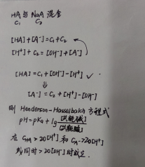
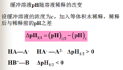
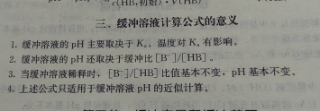
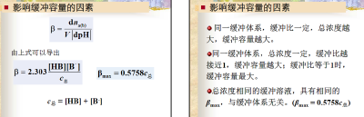
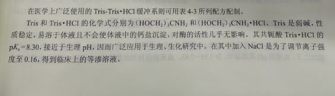

- 缓冲溶液及缓冲机制
  > 能抵抗少量强酸强碱或适当稀释保持pH基本不变
  - 通过共轭酸碱对的质子转移平衡移动实现
- pH计算
  - 基本公式
    
    - 校正
      > 活度因子 校正因数
  - 稀释值
    
  - 缓冲比
    
- 缓冲容量
  
  - 影响因素
    - 总浓度
    - 缓冲比
    - 特殊情况
      > 强酸（ HCI + KCI ）溶液和强碱（ NaOH + KCI ）溶液的缓冲容量与 pH 的关系曲线，虽然这两种溶液不属于本章所讨论的由共轭酸碱对组成的缓冲溶液，但它们的缓冲能力很强。这是由于在其溶液中，[H3O*］或［ OH ］本来就很高，外加的少量强酸或强碱不会使溶液中H3O＊或 OH 的浓度发生明显变化，且溶液由于增加了强电解质 KCI 而具有较大离子强度，亦可抑制H3O＊或 OH "的活动能力。由于这类溶液的酸性或碱性太强，实际使用中应注意视具体情况而定
  - 缓冲范围
    - 缓冲溶液有效缓冲范围
      > pH±1  曲线倒钟形两翼降低
- 缓冲溶液配制
  - 步骤
    - 缓冲系选择
      - 缓冲范围内
      - 对主反应无干扰
      - 医用无毒（排除硼酸）稳定（排除碳酸）等渗通过半透膜，
      - 医学常用 **PBS** （还加入了氯化钠氯化钾调节压力），$Tris-TrisHCl$ ，有机酸/ 盐/ 氨基酸缓冲溶液
        
    - 确定总浓度、缓冲比
      > $0.05-0.2mol/L $
    - 计算所需量
    - 校正
      > pH计监测下加强酸强碱
  - 标准缓冲溶液
    > 用于校准pH计
  - 由单一化合物配置的缓冲溶液
    - 解离出大量两性离子且两个$Ka$ 接近，两个缓冲范围重叠
    - **溶液中** 化合物组分相当于一个缓冲对
- 血液缓冲系、酸碱中毒
