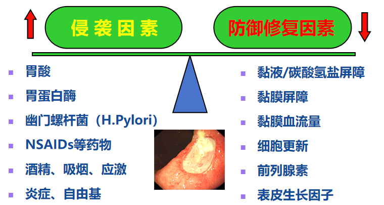
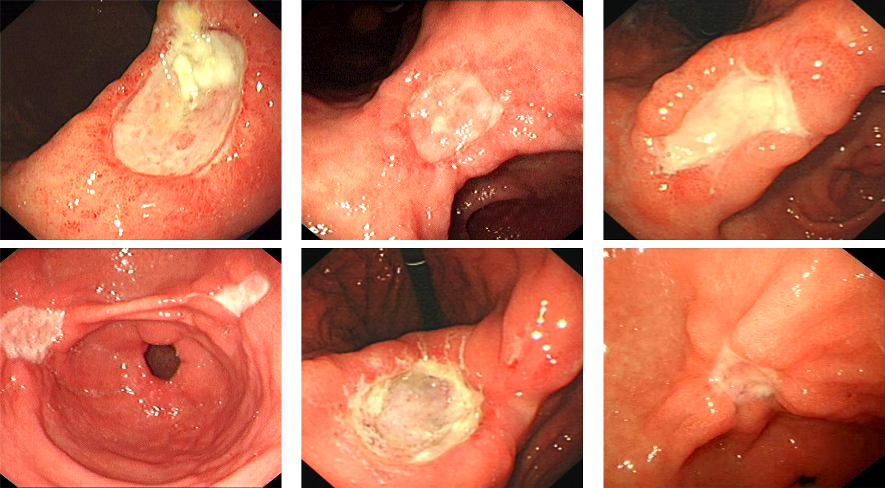

---
tags:
  - pathology
aliases:
  - GU
---
#### 病因及发病机制
[Open: Pasted image 20260924111528.png](attachments/c84a00d236dd9cb0c398d7a971d6faac_MD5.jpg)

##### 防御修复因素——消化道黏膜屏障
胃液pH 0.9-1.5，但正常人的胃却不受胃酸的腐蚀，原因：
（1）<mark style="background-color: #705A16; color: white">粘液-碳酸氢盐层</mark>：犹如涂抹在胃粘膜表面的一层保护膜，维持pH从2-7的阶梯差，天然的缓冲带；
（2）<mark style="background-color: #705A16; color: white">上皮细胞层</mark>：细胞之间通过紧密连接相连，每2-4天完全更新一次，形成第二道屏障；
（3）<mark style="background-color: #705A16; color: white">胃粘膜血流、免疫细胞和生长因子</mark>：前列腺素可扩展微血管，增加胃粘膜血流，表皮生长因子可促进上皮修复。
##### 侵袭因素——胃酸/胃蛋白酶
壁细胞（parietal cell）分泌胃酸；
壁细胞膜上有组胺（histamine）、乙酰胆碱（acetylcholine）、促胃泌素（gastrin）、生长抑素（somatostatin）受体；
<mark style="background-color: #1A4F10; color: white">H+-K+-ATPase：质子泵（proton pump）</mark>[^1]
胃蛋白酶的激活和作用依赖于胃酸。
##### [H. P.](幽门螺杆菌.md)
##### [NSAIDs](NSAIDs.md)
15%-30%服用NSAIDs者患消化性溃疡。
溃疡的出血及穿孔等并发症发生几率增加4-6倍。
老年人中溃疡并发症发生率、病死率25%与服用NSAIDs有关。
###### 局部作用：直接损伤胃黏膜
√通过胃肠粘膜上皮细胞进入胞体→电离氢离子→线粒体损伤
√破坏黏膜完整性→上皮细胞通透性增加→激活中性粒细胞介导炎症反应
###### 系统作用
抑制COX-1导致前列腺素的合成减少，黏膜供血减少，削弱黏膜的保护作用
#### 诊断
多位于<mark style="background-color: #1A4F10; color: white">胃小弯侧</mark>，好发于<mark style="background-color: #1A4F10; color: white">胃窦</mark>部
溃疡常一个，直径多<2cm
##### 内镜表现
[Open: Pasted image 20260924105822.png](attachments/b6bfc88af8be48636bb10bcc7ff11737_MD5.jpg)

##### 病理特征
###### 大体观
圆形或椭圆形，<mark style="background-color: #1A4F10; color: white">边缘整齐，底部平坦、洁净</mark>
贲门侧边缘耸直
通常穿越黏膜下层，深达肌层甚至浆膜层，断面呈斜置漏斗状
周围的胃黏膜皱襞呈放射状向溃疡集中（因受溃疡底部瘢痕组织的牵拉）
###### 镜下观
溃疡底部由内向外分4层：

①炎症层：为最表层，由少量炎性渗出物（白细胞、纤维素等）覆盖。
②坏死组织层
③肉芽组织层：为较新鲜的肉芽组织。
④瘢痕组织层：为最下层，由肉芽组织移行为陈旧瘢痕组织。
瘢痕底部小动脉因炎症刺激常有<mark style="background-color: #1A4F10; color: white">增殖性动脉内膜炎</mark>致内膜粗糙，使小动脉管壁**增厚**、管腔**狭窄**、血栓形成，造成局部供血不足，影响组织再生，使溃疡不易愈合，却也可防止溃疡血管破裂、出血。
溃疡底部的<mark style="background-color: #1A4F10; color: white">神经节细胞</mark>及神经纤维可发生<mark style="background-color: #1A4F10; color: white">变性、断裂及小球状增生</mark>，可能是患者产生疼痛症状的原因之一。
#### 并发症
最常见的并发症是上消化道出血→[呕血](呕血.md)，以及穿孔、幽门狭窄、癌变（少）

[^1]: 质子泵抑制剂（proton pump inhibitor， PPI）；
	钾离子竞争性酸阻断剂（P-CAB）：伏诺拉生
