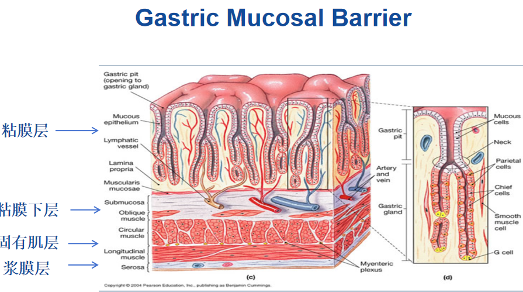

---
tags:
  - diagnosis
aliases:
  - gastritis
---
指各种致病因子引起的胃黏膜炎性病变，常伴有上皮损伤和细胞再生。
胃病（gastropathy)：仅有很轻甚至无炎症细胞浸润，以上皮和微血管的异常改变为主。
[Open: Pasted image 20260914172503.png](attachments/07b86f7eea15995df581300e56cfc26f_MD5.jpg)

纯净的胃液pH达0.9-1.5，但正常人的胃却不受胃酸的腐蚀，原因：
（1）粘液-碳酸氢盐层：犹如涂抹在胃粘膜表面的一层保护膜，维持pH从2-7的阶梯差，天然的缓冲带；
（2）上皮细胞层：细胞之间通过紧密连接相连，每2-4天完全更新一次，形成第二道屏障；
（3）胃粘膜血流、免疫细胞和生长因子：[前列腺素](PG.md)可扩展微血管，增加胃粘膜血流，表皮生长因子可促进上皮修复。

---
#### 急性
![[急性胃炎]]
#### 慢性
![[慢性胃炎]]