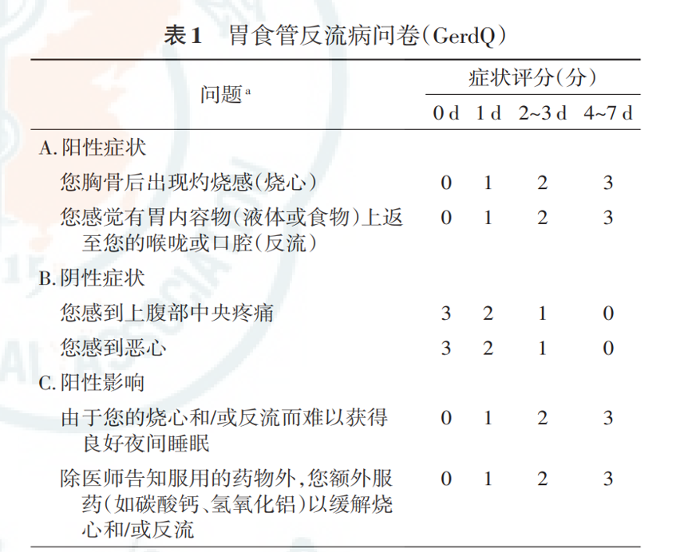

---
aliases:
  - GERD
---
## 诊断
主观诊断
- 典型症状拟诊
- 反流问卷辅助：胃食管反流病问卷（GerdQ）是诊断及评估 GERD 最简单有效的工具。问卷设计基于患者就诊前1周内的症状，诊断精确性高。
[Open: Pasted image 20260901195516.png](attachments/8e154dcc613567e05b0eb7e61d0c5423_MD5.jpg)

- ![[PPI试验性治疗]]
客观诊断
- 内镜检查
- 食管反流监测
- 食管高分辨率测压

---
- GEJ 是 GERD 发生的初始部位，也是导致反流的最主要的解剖部位
LES：下食管括约肌； 
TLESR：下食管括约肌一过性松弛；  
GEJ:胃食管交界区

- 汪忠镐院士自2007年提出了“胃食管喉 气管综合征”的概念，之后提出胃食管气道反流性疾病（gastroesophageal airway reflux disease，GARD）。

---
## 症状
<mark style="background-color: #1A4F10; color: white">烧心和反流</mark>是GERD最常见的典型症状。

不典型症状中，胸痛患者需先排除心脏因素后才能进行GERD评估
#### 食管症状
###### 症状综合征
典型反流综合征
反流胸痛综合征

###### 伴食管损伤的综合征
反流性食管炎
反流性狭窄
[Barrett 食管](Barrett%20食管.md)
食管腺癌

#### 食管外症状
###### 已证实相关
反流性咳嗽综合征
反流性喉炎综合征
反流性哮喘综合征
反流性蛀牙综合征
###### 可能相关
咽炎
鼻窦炎
特发性肺纤维化
复发性中耳炎

## 分类
#### 内镜下分类
两种类型相对独立，相互之间不转化或很少转化
###### 非糜烂性反流病NERD
60~70%中国人
###### 糜烂性食管炎EE erosive esophagitis
[Barrett 食管](Barrett%20食管.md)
合并食管狭窄、溃疡和消化道出血

## Risk factors
年龄：老年人EE检出率高于青年人；
性别：男性 GERD 患者比例明显高于女性；
肥胖及生活方式：肥胖、高脂辛辣饮食、吸烟、饮酒、喝浓茶、咖啡、可乐等碳酸饮料、长期便秘等因素与GERD的发生呈正相关，而体育锻炼和高纤维饮食可能为GERD的保护因素。

## LA分级 
为RE在内镜下表现和严重程度分级
洛杉矶分级法（Los Angeles， 1994年）
- 正常：食管黏膜没有破损；
- A级：一个或一个以上食管黏膜破损，长度小于5mm；
- B级：一个或一个以上食管黏膜破损，长度大于5mm，但没有融合性病变；
- C级：黏膜破损有融合，但小于75%的食管周径；
- D级：黏膜破损融合，至少达到75%的食管周径；

